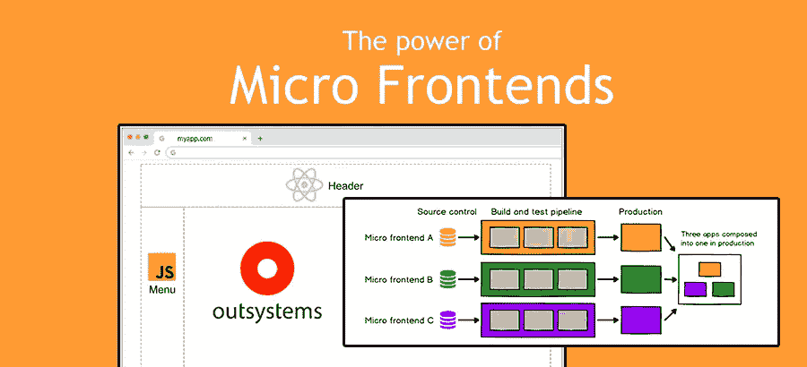
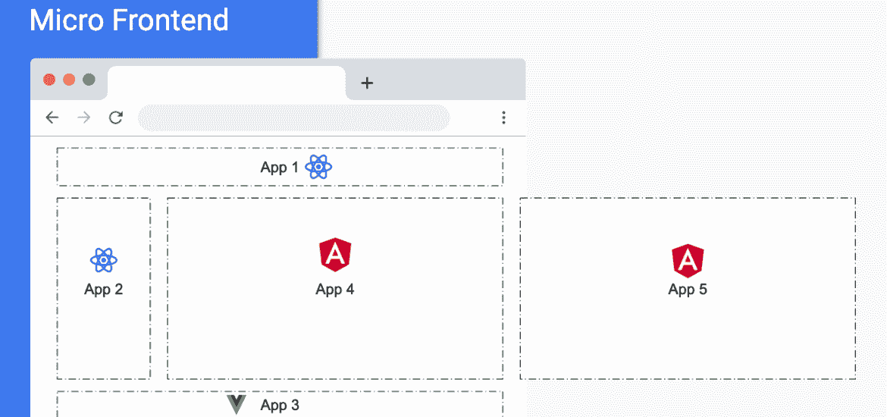
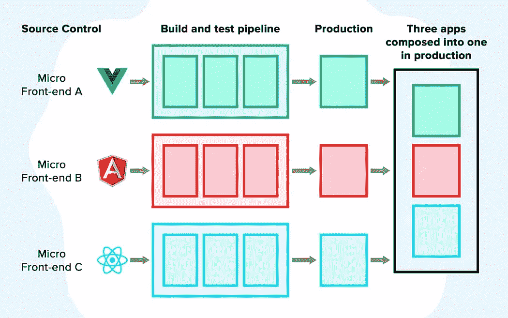

# 外部系统中的微前端

> 原文：<https://itnext.io/micro-frontends-in-outsystems-a6aafd0d0e65?source=collection_archive---------1----------------------->

## 对于我们在外部系统中常用的传统整体方法，有一些替代方法。

让我们从定义什么是微前端开始。该术语于 2016 年首次被提及，例如，与微服务相比，它仍然是最近才出现的。

从 https://micro-frontends.org/的网站上我们可以读到:

> …作为**的网站或网络应用，由**独立团队**拥有的功能**组成。每个团队都有自己关心和擅长的**不同的业务领域**或**任务**。一个团队是**跨职能**的，从数据库到用户界面，端到端地开发其功能**。**

从文章[https://martinfowler.com/articles/micro-frontends.html](https://martinfowler.com/articles/micro-frontends.html)中，我可以强调以下几点:

> 正如微服务一样，微前端的独立可部署性是关键。这缩小了任何给定部署的范围，从而降低了相关的风险。不管您的前端代码是如何托管的，也不管在哪里托管，每个微前端都应该有自己的持续交付管道，在生产过程中构建、测试和部署它。

# 这是什么意思？

这些概念使应用程序可以像下图这样进行组装:

*   **React 开发的 App1** 可以从**域**服务，由**团队 A** 开发，有自己的**部署周期**、**测试**等…
*   用 Angular 开发的 **App 4** 可以从**域 B** 服务，由**团队 B** 开发**、有自己的**部署周期**、**测试**等…**

**搜索**模块可以用**技术 A** 完成，**认证**模块可以用**技术 B** 完成，以此类推。

图片来自[https://frontend-architecture . com/2020/02/13/micro-frontends/](https://frontend-architecture.com/2020/02/13/micro-frontends/)

就架构而言，这种关注点的分离定义了清晰的范围和责任，允许不同的团队更快地交付**和更频繁地交付**。😎****

********

****图片来自[https://www . cygnismedia . com/blog/micro-frontends-development/](https://www.cygnismedia.com/blog/micro-frontends-development/)****

****良好的 E2E 测试策略可以保证质量，每个人都乐于一起工作，不需要插手其他团队的事情。🧀****

****(每当另一个团队告诉我“不要发布这个！只有下周。”，我一直记得这本[书](https://en.wikipedia.org/wiki/Who_Moved_My_Cheese%3F)。)****

****好的，听起来不错。****

# ****外部系统呢****

****有时候我会听到这些问题:
——我可以在 OS 中使用 Tailwind 吗？
-我可以在操作系统中使用 Firebase 推送通知吗？
-可以在 OS 中实现 WebGL 和 Three.js 这样的 JavaScript 库吗？
你明白了…****

****答案很简单:如果它运行在全能的浏览器上，无论如何，我们都可以使用我们心爱的平台来实现它。🥰
考虑到这一点，我们可以在外部系统中拥有类似微前端的东西。但是有一些警告。****

# ****这是一个单页应用程序(SPA)****

****我在当前平台中错过的一件事是生成一个**组件**与一个**应用程序的可能性。**我指的是在浏览器上运行的 [web 组件](https://developer.mozilla.org/en-US/docs/Web/Web_Components)。****

****当我们创建一个外部系统反应式 Web 应用程序时，实际上，我们生成了一个单页面应用程序(SPA ),完全封装了它自己的路由。
我们无法创建一个可用于另一种技术的组件。一个 web 块(甚至在一个库中)，只能被另一个外部系统工件使用。****

****我所看到的混合不同技术并且看起来像微前端的例子都依赖于 iframes😢。****

******🥳解决方案:** 我们总是可以选择使用高级代码和纯 JavaScript(或 TypeScript)来生成组件😍).你可以用像[document . createelement()](https://developer.mozilla.org/en-US/docs/Web/API/Document/createElement)这样的方法做很多事情。****

****该脚本可以托管在 CDN 的其他地方，然后使用 **require** 或 **appendChild“注入”到我们的反应式 Web 应用程序中。******

# ****沟通****

****常规的外部系统反应式 Web 应用被封装，并且其上下文/状态是封闭的，并且不允许外部源改变它。即使是另一个同类的反应式网络应用也不行。****

****一件事是在一个窗口中注入 HTML、JavaScript 和 CSS，但我们如何让它们交互以实现由多个独立部分组成的一个统一应用程序的目标。****

****页面的不同部分需要通过用户操作或其他事件进行交互。****

******🥳解决方案:** 幸运的是，在过去的几年里，网络有了很大的发展，有如此多的网络应用编程接口和设计模式可供我们使用。我们有自定义事件、观察对象、web workers……都使用了成熟的 PubSub 设计模式。****

****我最喜欢的处理同一个全局窗口中不同对象之间通信的选项是 [**postMessage**](https://developer.mozilla.org/en-US/docs/Web/API/Window/postMessage) 。****

****当我们需要跨不同来源进行通信时，这尤其有用，例如使用 **iframes** 。是啊！您可以在页面和 iframe 之间进行通信😉。****

****在开发这样的应用程序时，状态处理总是很棘手，假设反应式 Web 应用程序将拥有所有的核心特性和数据，对我来说，将所有的状态管理集中在那里是有意义的。****

****这些都是高层次的概念，但如果你想深入研究并更上一层楼，请查看 [Redux](https://redux.js.org/) 。****

# ****半铸钢ˌ钢性铸铁(Cast Semi-Steel)****

****对于一个“感觉”统一的应用程序，所有部分必须共享视觉元素，如颜色、字体、控件等…****

****对于用户来说，下拉菜单是来自外部系统的反应式 Web 应用程序还是本地 JavaScript 并不重要。只要它的行为和外观相同，它总是相同的应用程序。****

****理解 CSS 加载顺序和特殊性以避免意外冲突是很重要的。****

******🥳解决方案:******

****如果想要完全分离封装，可以使用 [shadow DOM](https://developer.mozilla.org/en-US/docs/Web/Web_Components/Using_shadow_DOM) 。这样，每个部分都有自己的 DOM 树，并且完全独立，不会与其范围之外的任何内容发生冲突。如果你对这个概念不熟悉，看看这篇文章。****

****另一种选择是在 CSS 类命名中使用 [BEM 方法](https://devopedia.org/bem-methodology)。假设你有一个名为“搜索”的组件和另一个名为“侧边菜单”的组件，如果每个组件都将所有 CSS 类封装在类中，比如。**搜索-** 标题-线索-高亮“，”。**搜索-** 字幕-推广-叠加”等……
。**旁白-菜单**-选项-项目“，”。**旁白-菜单**-叠加-促销-标题”等…****

****结果将意味着更长的类名，但是非常特定于目标，并且继承问题更少。所有范围都被控制并包含在给定的组件中。****

****通过这种方式，我们将所有的 CSS 集中在一个文件中，颜色或排版等通用设置可以在所有组件之间共享，保持一致性。****

# ****结论****

****我们能在外部系统中实现微前端吗？是的，我们可以。****

****在这个过程中会有一些挑战，但是通过正确的工具集，我们可以利用平台所提供的优势(主要是在服务器端),并交付一个由不同部分组成、由不同团队开发并具有独立生命周期的应用程序。****

****离真正的持续集成和交付又近了一步。****

****你对此有什么想法？****

****你想让我在某个特定的话题上更进一步吗？
查看[其他文章](https://antonio-carvalho.medium.com/)并在评论中联系我！****