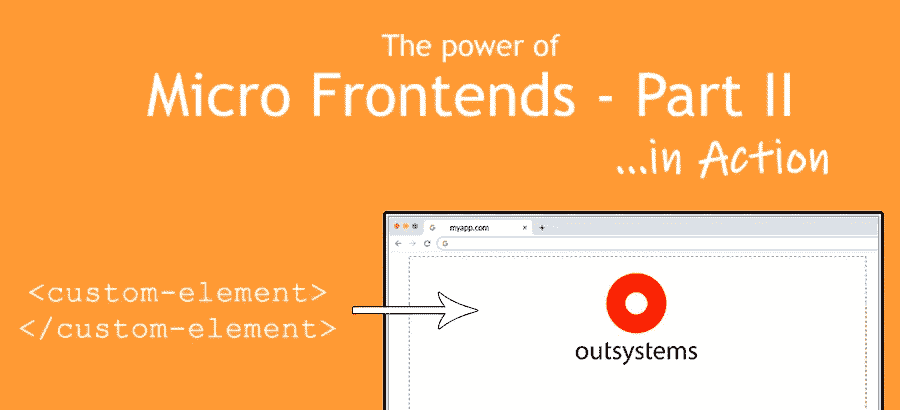
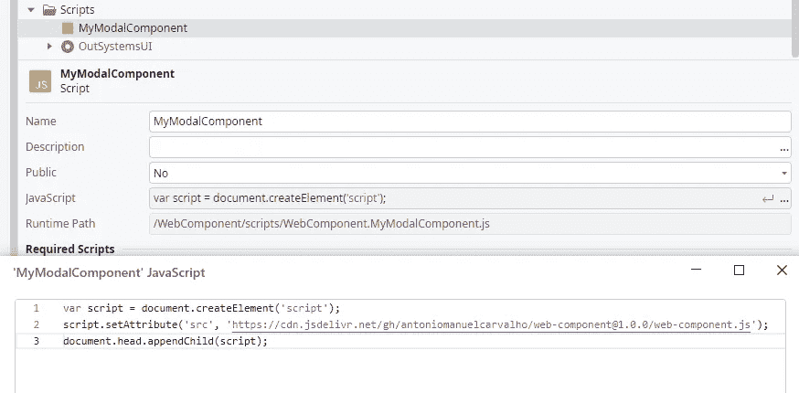
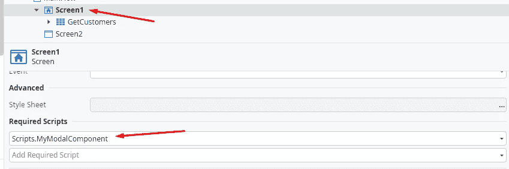
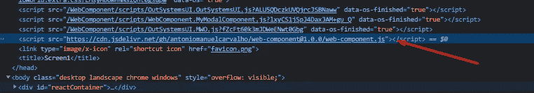
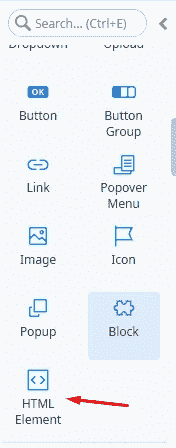
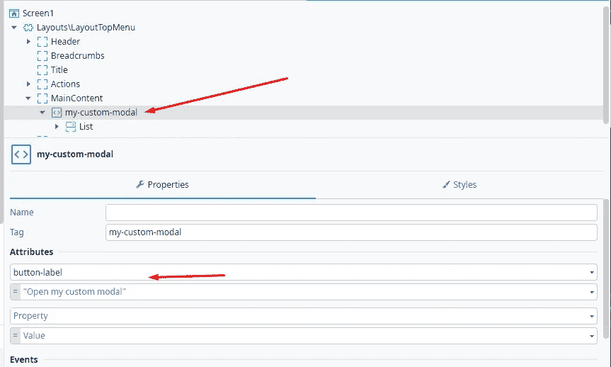
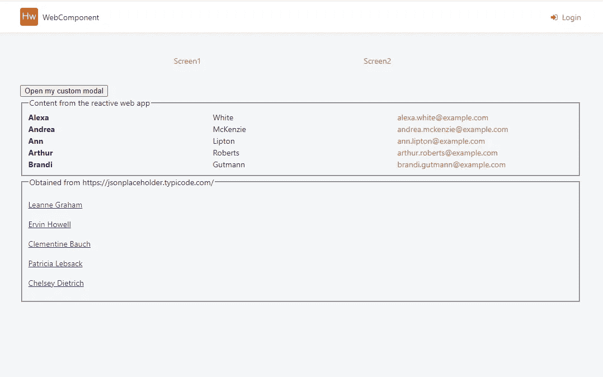

# 外部系统中的微前端……运行中——第二部分

> 原文：<https://itnext.io/micro-frontends-in-outsystems-in-action-part-2-10d3191ae277?source=collection_archive---------1----------------------->



我之前的文章引起了一些兴趣和一些问题。这太棒了！显然，我触及了一个最佳点，我决定创建一个实际的工作示例来演示一些概念。

如果你错过了我之前的文章，看看这个:[外部系统中的微前端](https://medium.com/itnext/micro-frontends-in-outsystems-a6aafd0d0e65)👈

# 那么，在这个例子中我们有什么？

*   在 CDN 上交付的 web 组件，用纯 JavaScript 创建
*   一个外部系统反应式 Web 应用程序将包括这个组件

# 欢迎使用 Web 组件

如果你是新手，看看这里:【https://developer.mozilla.org/en-US/docs/Web/Web_Components】T2

> Web Components 是一套不同的技术，允许您创建可重用的自定义元素(将它们的功能封装在代码的其余部分之外)，并在您的 Web 应用程序中使用它们。

Web 组件包含 3 种主要技术:

*   自定义元素
*   阴影 DOM
*   HTML 模板

在我的例子中，你可以看到所有这三个的用法，JavaScript 代码以清晰明了的文本显示在这里:
[https://cdn . jsdelivr . net/GH/antoniomanuelcarvalho/we B- component @ 1 . 0 . 0/we B- component . js](https://cdn.jsdelivr.net/gh/antoniomanuelcarvalho/web-component@1.0.0/web-component.js)

这段代码将有一个自定义元素: **my-custom-modal** 。
自定义元素将有一个属性:**按钮标签**。

得到的输出会是这样的:
< **我的-自定义-模态** **按钮-标签** = "打开我的模态">
……
</**我的-自定义-模态** >

# 让我们去找酷的东西吧，🥰

为了查看这个自定义 JavaScript 的使用情况，我在个人环境中创建了一个全新的 Reactive Web 应用程序。

如果你是一个外部系统开发人员，你应该已经很熟悉这个了，如果不是，你可以在 https://www.outsystems.com/的[免费创建一个个人环境](https://www.outsystems.com/)

我的工作实例在这里:
[https://a-carvalho.outsystemscloud.com/WebComponent/Screen1](https://a-carvalho.outsystemscloud.com/WebComponent/Screen1)

# 1.加载外部代码

1.1 使用以下代码创建一个名为 **MyModalComponent** 的脚本:✍️



创建自定义 JavaScript

1.2 将新的 JavaScript 添加到您的屏幕:



当您在浏览器上打开您的页面时，您现在将有一个新的脚本标签被注入和执行。



# 2.在页面上添加自定义元素

使用 ServiceStudio 中的 HTML 元素小部件，我们可以用我们需要的任何名称创建一个自定义元素。



将小部件拖到您的屏幕上，将标记名设置为 **my-custom-modal** (检查 CDN JavaScript 代码的最后一行……)

这个定制元素有一个属性**按钮标签**，将被组件使用。



添加自定义元素

# 3.(可选)添加一些外部系统内容

我添加了一个带有聚合的列表，只是为了演示如何在 web 组件的自定义元素中使用应用程序中的动态内容。


# 4.嘣！完成了。

发布一切…一切都完成了！现在，您应该有了一个使用基于外部技术开发的 web 组件的响应式 Web 应用程序。这个 Web 组件可以在不同的应用程序和技术中使用……本质上这是一个微前端。🤙



做了很多…

*   使用来自云端的 RESTful 调用来生成内容；
*   使用<slot>整合外部系统应用程序的数据；</slot>
*   用属性控制组件的某些属性；
*   使用影子 DOM 将组件范围从页面范围中分离出来；

# 5.奖励:组件公共 API

出于演示的目的，我设置了一个接口来控制组件。打开**浏览器控制台**，您可以直接控制模态行为。

尝试:

```
document.querySelector("my-custom-modal").isOpen = true/false
```

明白我的意思了吗？😎

# 结论

我希望这个小的定制元素能够展示使用 Web 组件的优势，并为您的腰带添加一套全新的工具。

OutSystems 不都是低代码的吗？🤔是的……从头开始编写 JavaScript 是高代码的，可能会显得过于复杂，甚至无法考虑。这没关系。
这些用例并不适合所有人，我只是想证明扩展系统以实现更复杂的实现是可能的。

如果你在一个企业生态系统上工作，很可能你有一个更大的系统。Net、Java…或任何其他技术，想象一下你可以在每种技术上拥有相同的组件！

有自己的开发生命周期，CI/CD 管道，测试…等等。

使用**微前端**是可能的，而 **Web 组件**是实现它的好方法。🤝

你对此有什么想法？

你想让我在某个特定的话题上更进一步吗？
查看[其他文章](https://antonio-carvalho.medium.com/)并在评论中联系我！