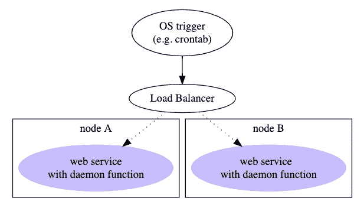
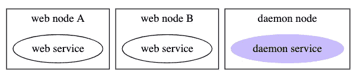
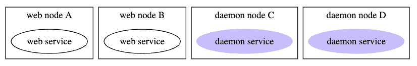
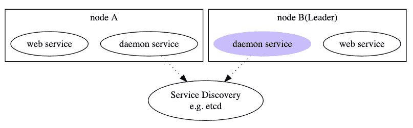

# 微操作，Coda:分布式 Cron 作业

> 原文：<https://itnext.io/micro-in-action-coda-distributed-cron-job-a2b577885b24?source=collection_archive---------2----------------------->


微在行动

**2020 . 04 . 29 更新:** Micro 在 v2.5.0 中已经移除了 cron 作业功能，代码示例将不再工作。但是基本原理仍然有效，您可以在 etcd 的帮助下实现自己的 cron 作业。

这是“微在行动”系列的最后一部分。

在浏览了前几篇文章中关于如何用 Micro 构建和使用微服务的主题后，现在我们来看最后一个主题:Cron Job。

# 分布式 Cron 作业很难

几乎每个系统都需要 cron 作业。他们的作用是做一些后台工作，可能在特定时间做一次，也可能每隔一段时间重复做一次。

当一个系统中只有一个节点时，这非常简单。我们将 web 服务和守护进程服务放在同一个节点中。只要唯一的节点启动，守护程序服务就会正常工作。


但是这在现代系统中很少见，因为我们必须考虑健壮性和可伸缩性。当节点数量超过一个时，你要面对两个问题:**重复执行**和**单点故障**。


如果我们简单地添加更多相同的节点而不做任何修改，这将导致重复执行。我们必须手动处理两个守护进程服务之间的冲突，这很容易出错。

一些“聪明”的家伙可能会改变他们的架构师，将工作功能从守护进程服务转移到 web 服务中，并将它们公开为 web APIs 或 gRPC APIs。然后通过操作系统的 crontab 触发执行:



这种架构的优点是消除了重复执行。当作业被 OS crontab 触发时，负载平衡器会将作业请求转发到一个节点。但是它仍然遭受单点故障。

大多数其他替代方案也不能同时解决这两个问题。例如:

分离一个守护进程节点。问题:单点故障。



分离多个守护进程节点。问题:重复执行。



那么，对于这种困境，正确的解决方案是什么呢？简而言之，我们在分布式系统中遇到了一个经典问题:[](https://en.wikipedia.org/wiki/Leader_election)**。**

**我们希望保持我们的服务节点是无状态的和相同的(大部分时间),这使得系统易于扩展。但是在某些情况下，必须在这些节点中选出一个领导节点来完成关键工作。**

**我们不需要自己实现它，因为许多服务发现系统具有内置的领导者选举功能，例如 etcd、zookeeper。**

**通过 Leader Election，我们可以确保我们的 cron 作业在单个 Leader 节点上运行(没有重复执行)。并且当 leader 节点宕机时，另一个节点将接管领导权并运行后续作业(无单点故障)。**

****

**这正是 Micro 处理 cron 作业的方式。**

# **微型计算机中的 Cron 作业**

**Micro 在包`github.com/micro/go-micro/v2/sync`中提供了这个特性。**

**和 Micro 的许多其他特性一样，这是一个“**隐藏的**之一。没有文档，没有测试用例，没有例子。通过源代码学习它，使用时风险自担😂。**

**可能这篇文章是目前为止网上唯一的教程。**

## **关键组件**

**这个特性由几个接口和结构组成。**

**最重要的组件是接口`sync.Cron`:**

```
// Cron is a distributed scheduler using leader election
// and distributed task runners. It uses the leader and
// task interfaces.
type **Cron** interface {
   **Schedule**(task.Schedule, task.Command) error
}
```

**此接口的唯一方法接受两个参数。**

**第一个参数`task.Schedule`代表一个任务的调度信息。**

```
// Schedule represents a time or interval at which a task should run
type Schedule struct {
   // When to start the schedule. **Zero time means immediately**
   **Time** time.Time
   // Non zero interval dictates an ongoing schedule
   **Interval** time.Duration
}
```

**这个结构中有两个字段，一个是作业的起始点，另一个是执行的间隔。**

**第二个参数`task.Command`定义了作业命令。它有一个名字和一个函数指针。**

```
// Command to be executed
type Command struct {
   Name string
   Func func() error
}
```

## **安排工作**

**有了上面提到的组件，我们可以轻松地安排作业:**

```
package main

import (
   "time"

   "github.com/micro/go-micro/v2"
   "github.com/micro/go-micro/v2/**sync**"
   "github.com/micro/go-micro/v2/**sync**/**task**"
   log "github.com/micro/go-micro/v2/logger"
)

func main() {
   // New Service
   service := micro.NewService(
      micro.Name("com.foo.cron.example"), // name the client service
   )
   // Initialise service
   service.Init()

   cron := **sync.NewCron()**
   cron.**Schedule**(
 **task.Schedule**{Interval: 10 * time.*Second*},
 **task.Command**{Name: "foo", Func: func() error {
         log.Debug("finish command foo")
         return nil
      }},
   )

   if err := service.Run(); err != nil {
      log.Fatal(err)
   }
}
```

**像往常一样，我们创建并初始化了一个服务。然后用`sync.NewCron()`创建一个`Cron`界面。**

**之后，我们用`cron.Schedule`调度一个简单的作业，每十秒钟打印一行日志。**

**现在让我们开始吧:**

```
go run main.go2020-04-03 18:49:59  level=info Starting [service] com.foo.cron.example
2020-04-03 18:49:59  level=info Server [grpc] Listening on [::]:60752
2020-04-03 18:49:59  level=info Registry [mdns] Registering node: com.foo.cron.example-1ae32da9-97e0-4acb-9f5a-aecdd83d6aa6
```

**您可能期望每十秒钟就有一些东西输出到控制台。**但是什么都没有。没有错误，也没有日志。为什么？****

**众所周知，Micro 有一个约定:所有主要组件都有一个默认的轻量级实现。例如，我们有注册中心的 mDNS 实现和代理的 HTTP 实现。我们可以使用所有的功能，没有任何额外的依赖，这简化了本地开发。**

**但是 Cron Job 特性打破了这个惯例。使用`sync.Cron`前，需要安装 **etcd** 。`sync.NewCron`的源代码是这样解释的:**

```
func NewCron(opts ...Option) Cron {
   ...
   if options.Leader == nil {
      **options.Leader = etcd.NewLeader()**
   }
   ...
}
```

**如果我们没有提供一个`Leader`选项(其类型为`leader.Leader`)，那么将会创建一个默认选项(`etcd.NewLeader`)。这行代码创建了对 etcd 的依赖。如果你深究`etcd.NewLeader`的代码，你会发现根本原因:**

```
func **NewLeader**(opts ...leader.Option) leader.Leader {
   ...
   if len(endpoints) == 0 {
      **endpoints = []string{"http://127.0.0.1:2379"}**
   }
   ...
}
```

**由于我们没有在 127.0.0.1:2379 **、**上提供 etcd，因此该作业将永远挂起，**不会有任何错误输出**。**

**`leader.Leader`选项是什么？我们为什么需要它？我们来看看`leader.Leader`的定义:**

```
// Leader provides leadership election
type Leader interface {
   // elect leader
   **Elect**(id string, opts ...ElectOption) (Elected, error)
   // follow the leader
   Follow() chan string
}
```

**如前一节所述，要运行分布式 cron 作业，我们需要领导者选举的能力。`leader.Leader`为此目的服务。在`sync.Cron`的实现中，将调用方法`Leader.Elect`来获取实际的领导者。**

```
func (c *syncCron) **Schedule**(s task.Schedule, t task.Command) error {
   id := fmt.Sprintf("%s-%s", s.String(), t.String())

   ...
         e, err := c.opts.Leader.**Elect**(id)
   ...
}
```

****注:**我认为`Leader`是一个糟糕命名的例子，而`Elector`会是一个更好的选择。**

**所以我们需要提供一个`Leader`来初始化一个`Cron`。我们可以选择 etcd 作为注册表，然后它可以重新用于领导者选举:**

```
import (
   ...
   "github.com/micro/go-micro/v2/sync/**leader**"
   "github.com/micro/go-micro/v2/sync/leader/**etcd**"
   ...
)

func main() {
   // New Service
   service := micro.NewService(
      micro.Name("com.foo.cron.example"), // name the client service
   )
   // Initialise service
   service.Init()

   // get etcd node list from registry
   **etcdList** := service.Options().Registry.Options().Addrs
   // build leader
   lead := **etcd.NewLeader**(leader.Nodes(etcdList...))

   cron := sync.NewCron(**sync.WithLeader(lead)**)
   cron.Schedule(
      task.Schedule{Interval: 10 * time.*Second*},
      task.Command{Name: "foo", Func: func() error {
         log.Info("finish command foo")
         return nil
      }},
   )

   if err := service.Run(); err != nil {
      log.Fatal(err)
   }
}
```

**然后使用注册表参数运行程序:**

```
go run main.go **--registry=etcd --registry_address=etcd1.foo.com:2379,etcd2.foo.com:2379,etcd3.foo.com:2379**
2020-04-03 18:52:46  level=info Starting [service] com.foo.cron.example
2020-04-03 18:52:46  level=info Server [grpc] Listening on [::]:61094
2020-04-03 18:52:46  level=info Registry [etcd] Registering node: com.foo.cron.example-da16c259-302a-4247-83aa-2d0fc1d3a4e2
2020-04-03 18:52:56  level=info **[cron] executing command foo**
2020-04-03 18:52:56  level=info **finish command foo**
...
```

**最后，我们在 Micro 中引导一个 cron 作业。**

****Gotcha:** 默认情况下，Micro 的 Cron 作业特性依赖于 etcd。**

**让我们引导另外两个节点(节点 B、节点 C)。因为第一个节点(节点 A)现在是领导者，所以不会对它们执行任何作业。**

**然后我们关闭节点 A，几秒钟后，领导权将自动转移到节点 B 或节点 C。因此，cron 作业将在新的 leader 节点上运行。**

**这就是我们想要实现的:没有单点故障，没有重复执行。**

## **更改作业计划的起点**

**有时您需要工作在固定时间开始，尝试修改`task.Schedule`的`Time`字段:**

```
// start from the next New Year's Day
startPoint, _ := time.Parse("2006-01-01", "2021-01-01")
cron.Schedule(
   task.Schedule{
 **Time:     startPoint,**
      Interval: 10 * time.*Second,* },
   task.Command{Name: "foo", Func: func() error {
      log.Info("finish command foo")
      return nil
   }},
)
```

**它会像你期望的那样工作。**

**但是，如果您希望作业在预定时间后一分钟开始，您可以尝试:**

```
cron.Schedule(
   task.Schedule{
      Time:     **time.Now().Add(time.*Minute*),**
      Interval: 10 * time.*Second*,
   },
   task.Command{Name: "foo", Func: func() error {
      log.Info("finish command foo")
      return nil
   }},
)
```

**并且**您会感到失望**，因为所有节点上都将出现重复执行。原因在于`sync.Cron`和`task.Schedule`的实现**

```
//cron.go
func (c *syncCron) **Schedule**(s task.Schedule, t task.Command) error {
   id := fmt.Sprintf("%s-%s", **s.String()**, t.String())

   ...
         e, err := c.opts.Leader.Elect(**id**)
   ...
}//task.go
func (s Schedule) String() string {
   return fmt.Sprintf("%d-%d", **s.Time.Unix()**, s.Interval)
}
```

**选举 id 取决于`Schedule.String()`而`Schedule.String()`取决于`Schedule.Time**.**`**

**当我们选择相对时间作为起点时，每个节点将形成其唯一的选举 id，因为它们可能会在不同的时间戳进行引导。**

**然后每个节点成为自己选举组的领袖。**

****明白了**:千万不要将相对时间指定为工作开始时间。**

# **摘要**

**在分布式系统中实现 Cron 作业是很棘手的。Micro 提供了一个初级而优雅的解决方案。这个解决方案可以覆盖我们的大多数用例，尽管它仍然缺少一些高级特性，比如 crontab expression。**

**小心那些陷阱，你最终会驯服它们的。这个建议适用于 cron 作业特性和整个微框架。**

**所以我要结束这一系列的文章。感谢阅读。**

**写这个系列对我来说也是一个学习的过程。它让我相信 **Micro 是一个伟大的工具，它值得你花时间，并且将帮助你以一种极其简单的方式构建分布式系统**。**

**它有缺点，但不是不可接受的。随着新版本的发布，它变得越来越好。我的文章基于 v2.4.0，我很高兴尝试新版本。(**但是不要急着在生产环境中使用最新版本。如果你看过这个系列，你应该知道原因。)****

**未来，我会继续写关于微的文章，但不是系列。它们将是关注某些特定主题的独立文章。**

**如果你想在新文章发表后得到通知，请在 Medium/Twitter 上关注我(@dche423)。**

**回头见。谢了。**

**—丹·车**

**另请参见:**

*   **[Micro In Action，第 1 部分:入门](/micro-in-action-getting-started-a79916ae3cac)**
*   **[Micro In Action，第 2 部分:Bootstrap 终极指南](/micro-in-action-part-2-71230f01d6fb)**
*   **[Micro 在行动，第 3 部分:调用服务](/micro-in-action-part-3-calling-a-service-55d865928f11)**
*   **[微在行动，第 4 部分:发布/订阅](/micro-in-action-part4-pub-sub-564f3b054ecd)**
*   **[Micro 在行动，第 5 部分:消息代理](/micro-in-action-part-5-message-broker-a3decf07f26a)**
*   **[微在行动，第 6 部分:服务发现](/micro-in-action-part6-service-discovery-f988988e5936)**
*   **[微动动作，第 7 部分:断路器&限速器](/micro-in-action-7-circuit-breaker-rate-limiter-431ccff6a120)**
*   **[微在行动的索引页](https://medium.com/@dche423/micro-in-action-1be29b057f2d)**