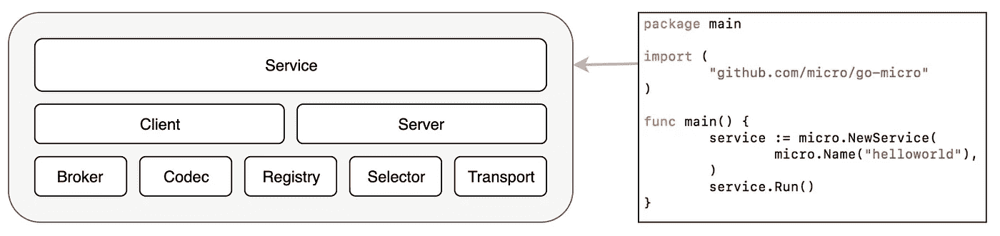

# Micro 在行动，第 1 部分:入门

> 原文：<https://itnext.io/micro-in-action-getting-started-a79916ae3cac?source=collection_archive---------0----------------------->


微在行动

2020.04.02 更新:该系列的 Micro 版本从 v1.18.0 升级到 v2.4.0

先说这个系列文章里的[微](https://micro.mu/)。

我们将逐步建立一个基于微的服务，在这个过程中解释微的特性。我们将从基本概念和主题开始，然后转向高级功能。

微操掌握后很厉害，很好用。但是它发展如此之快，导致其文档严重缺失、滞后或过时。

许多功能没有记录在案。很多基础问题都要在 Github 上咨询或者在 Slack 上问，反馈很少。

钻研源代码成了唯一实用的学习方法。这对用户非常不友好，也阻碍了 Micro 被更多人采用。

这也是我开始这一系列文章的原因。希望能帮到你。(注:该系列基于 micro v2.24.0)

# 那么微观到底是什么呢？

先来看看它的[网站首页](https://micro.mu/):

> 构建、共享和协作微服务的最简单方式
> 
> Micro powers 是一个开放的全球服务平台，开发人员可以在云和其他环境中构建微服务，而不会有管理基础设施的麻烦。

然后公文第 4 页的[声明:](https://micro.mu/docs/goals.html)

> Micro 是一个微服务生态系统，专注于提供产品、服务和解决方案，以支持现代软件驱动型企业的创新。

你明白了吗？我不知道。

看完它所有的文档，让我给你一个更直白的定义:

Micro 是一套帮助开发者构建和管理微服务的工具。它包含两个部分:

1.  [**go-micro**](https://github.com/micro/go-micro) :一个 Golang 微服务开发框架。它是核心。通过利用它，开发人员可以快速构建微服务。这些微服务的典型类型是 gRPC。
2.  [**微**](https://github.com/micro/micro) :命令行工具。虽然不是强制的，但是为微开发和管理提供了很多便利。例如，模板项目生成、运行时状态检查和服务调用。这个工具也是基于 **go-micro** 。

另外， [**go-plugins**](https://github.com/micro/go-plugins) 在大多数情况下都是必须的，是一系列的插件。它提供了许多不同的选择，包括服务发现、异步消息传递和传输协议。由于 **go-micro** 设计为插件架构，有了这些插件，可以实现非常灵活的组合，满足各种需求。用户可以随时开发自己的插件进行进一步扩展。

好吧，为什么官方的定义这么宏大抽象？

因为 Micro [Asim Aslam](https://medium.com/u/139d4f55a09a?source=post_page-----a79916ae3cac--------------------------------) 的创造者不仅仅是提供工具。他最近的努力旨在[建立一个“分布式网络”](https://medium.com/microhq/building-a-global-services-network-using-go-quic-and-micro-2c1cf9b89c8?source=collection_home---6------0-----------------------)——尽管在我看来有相当多的重要问题[需要解决，而且可行性值得怀疑。](https://medium.com/@dche423/looks-very-ambitious-im-a-little-bit-curious-about-micro-network-9c82078016bc)

因此，如果您想要的只是加速组织中微服务的开发和治理，您可以只关注其核心功能。这也是本系列文章关注的地方

# go-micro 的设计师

为了方便理解，我们先介绍一下 **go-micro** 的架构。

go-micro 的目标是简化微服务开发和分布式系统构建。实际上，在每个分布式系统中总是需要做一些工作。

因此 **go-micro** 将这些常见任务抽象成接口。这将开发人员从底层实现细节中解放出来，降低了学习和开发成本。使得非常快速地构建灵活且健壮系统成为可能。



来自[https://micro.mu/](https://micro.mu/)

在这些接口中，**服务**是核心接口。它负责协调其他接口一起工作。我们将在后面深入探讨。

以下是重要接口的示例:

## 服务发现

服务发现是每个分布式系统都必须解决的问题。 **go-micro** 将这个任务抽象成一个接口`github.com/micro/go-micro/v2/registry/Registry`:

```
// The registry provides an interface for service discovery
// and an abstraction over varying implementations
// {consul, etcd, zookeeper, ...}
type **Registry** interface {
   Init(...Option) error
   Options() Options
   Register(*Service, ...RegisterOption) error
   Deregister(*Service) error
   GetService(string) ([]*Service, error)
   ListServices() ([]*Service, error)
   Watch(...WatchOption) (Watcher, error)
   String() string
}
```

任何实现这个接口的插件都可以扮演服务发现的角色。其实[很多实现](https://github.com/micro/go-plugins/tree/master/registry)已经在 **go-plugins** 中提供了，包括对 etcd/consul/zookeeper 等主流产品的支持，以及内存中的轻量级实现。默认实现基于多播 DNS (mdns)，不需要任何配置，开箱即用

## 异步消息传递

异步消息传递是构建松耦合和健壮系统的关键技术。对应的 **go-micro** 接口为:`github.com/micro/go-micro/v2/broker/Broker`

```
// Broker is an interface used for asynchronous messaging.
type **Broker** interface {
   Init(...Option) error
   Options() Options
   Address() string
   Connect() error
   Disconnect() error
   Publish(topic string, m *Message, opts ...PublishOption) error
   Subscribe(topic string, h Handler, opts ...SubscribeOption) (Subscriber, error)
   String() string
}
```

**go-plugins** 中已经有几个[经纪人插件](https://github.com/micro/go-plugins/tree/master/broker)包括 RabbitMQ、Kafka、NSQ 等。，默认实现基于 HTTP，不需要任何配置。

## 多媒体数字信号编解码器

编解码器接口(`github.com/micro/go-micro/v2/codec/Codec`)定义微服务之间通信的消息编码/解码格式。

```
// Codec encodes/decodes various types of messages used within go-micro.
// ReadHeader and ReadBody are called in pairs to read requests/responses
// from the connection. Close is called when finished with the
// connection. ReadBody may be called with a nil argument to force the
// body to be read and discarded.
type **Codec** interface {
   Reader
   Writer
   Close() error
   String() string
}
```

目前支持的包括 json / bson / msgpack 等。

除了上面的三个接口，还有许多其他接口:

*   **服务器**，定义微服务的服务器
*   **传输**，定义传输协议
*   **选择器**，抽象服务选择的逻辑。您可以使用这个接口实现各种负载平衡策略
*   **包装器**，定义了可以包装服务器/客户端请求的中间件

如您所见， **go-micro** 在拆分和抽象分布式系统方面做得很好，并提供了丰富的默认实现。如果需要任何扩展功能，开发人员可以很容易地构建一个新的插件，并将其应用到系统中。

有了这个坚实的基础，开发人员可以更专注于业务逻辑开发，而不是专注于繁琐的基础任务。送货效率大大提高

# 用 Micro 构建 gRPC 服务

开始使用 Micro 的最快方法是通过命令行工具`micro`创建一个模板项目。

## 安装微二进制版本 2.4.0

注意:不要使用官方网站提供的脚本 *install.sh，因为它总是安装最新版本，而你需要的是一个特定的稳定版本。*

```
**GO111MODULE=on**  go get github.com/micro/micro/v2@v2.4.0
```

## 创建项目

```
micro new --namespace=com.foo --gopath=false hello
```

命令的每个部分都有自己的含义:

*   **微新建**，运行**微**命令行工具的**新建**子命令，创建 gRPC 服务
*   **您好**，指定服务名
*   **— namespace=com.foo** ，为服务提供一个名称空间
*   **— gopath=false** ，生成代码到当前目录，而不是＄GOPATH(由于 Golang 支持 [Go 模块](https://blog.golang.org/using-go-modules)，新项目应该放在＄GOPATH 之外)

支持其他一些论点，我们将在后续文章中解释它们。

命令执行后，我们将得到如下屏幕输出:

```
Creating service com.foo.srv.hello in hello.
├── main.go
├── generate.go
├── plugin.go
├── handler
│   └── hello.go
├── subscriber
│   └── hello.go
├── proto/hello
│   └── hello.proto
├── Dockerfile
├── Makefile
├── README.md
├── .gitignore
└── go.moddownload protobuf for micro:brew install protobuf
go get -u github.com/golang/protobuf/{proto,protoc-gen-go}
go get -u github.com/micro/protoc-gen-micro/v2compile the proto file hello.proto:cd hello
protoc --proto_path=.:$GOPATH/src --go_out=. --micro_out=. proto/hello/hello.proto
```

## 安装依赖项

由于 Micro 使用 Protobuf 来定义服务接口，所以我们需要先安装 Protobuf 相关的依赖项。以 Mac 环境为例:

```
# install protobuf
brew install protobuf# install protoc-gen-go
go get -u github.com/golang/protobuf/{proto,protoc-gen-go}# install protoc-gen-micro
**GO111MODULE=on** go get -u **github.com/micro/protoc-gen-micro/v2**
```

注意`protoc-gen-micro`不是 Protobuf 核心的一部分，是微团队开发的 Protobuf 扩展，专门用来生成微相关代码。你需要通过`GO111MODULE=on`显式启用 Go 模块，否则你会遇到一个错误(一个已知的[问题](https://github.com/micro/protoc-gen-micro/issues/66)

## 执行

正如你所看到的，项目中生成了一个 **Makefile** ，其中包含了几个常用的任务。所以您可以使用命令`make`来编译和运行项目。

**明白了**:您需要先显式安装 **go-micro v2.4.0** :

```
go get github.com/micro/go-micro/v2@v2.4.0
```

然后 **go.mod** 的内容会改为 **:**

```
module hellogo 1.14require github.com/micro/go-micro/v2 v2.4.0
```

为什么我们必须先安装一个特定的版本？通过这样做，我们希望避免在代码编译期间自动安装最新版本的 **go-micro** 。如前所述，Micro 进化很快，有时最新版本还不够稳定。

例如，有 6 个版本的 **go-micro** 在 35 天内发布。一些版本作为最新版本只存在了几个小时，他们被替换为热修复严重问题。

幸运的是，Go 模块可以帮助我们锁定依赖性并确保交付质量。

有了以上准备，我们现在可以编译并运行第一个服务了:

```
make build && ./hello-service
```

我们将得到如下屏幕输出:

```
make build && ./hello-serviceprotoc --proto_path=. --micro_out=Mgithub.com/micro/go-micro/api/proto/api.proto=github.com/micro/go-micro/v2/api/proto:. --go_out=Mgithub.com/micro/go-micro/api/proto/api.proto=github.com/micro/go-micro/v2/api/proto:. proto/hello/hello.protogo build -o hello-service *.go2020-04-02 11:12:47  level=info Starting [service] go.micro.service.hello
2020-04-02 11:12:47  level=info Server [grpc] Listening on [::]:53451
2020-04-02 11:12:47  level=info Broker [eats] Connected to [::]:53453
2020-04-02 11:12:47  level=info Registry [mdns] Registering node: go.micro.service.hello-063d6dae-826b-49f5-9141-df525af8a6b1
2020-04-02 11:12:47  level=info Subscribing to topic: go.micro.service.hello
```

你得到的监听地址和节点 uuid 可能和我的不同，不要担心，我们稍后解释。

从屏幕输出可以看到，`make build`首先运行`protoc`，编译**。proto** 文件，run `go build`，生成可执行二进制文件 **hello-service。**

最后， **hello-service** 启动，准备上菜。

# 摘要

本文介绍了 Micro 的核心概念和功能，指导用户安装它，创建并运行第一个最简单的 gRPC 服务。

本系列的后续文章将深入示例项目的代码，解释 micro 的更多特性，并尝试改变它的默认行为。

未完待续。

另请参见:

*   [Micro in Action，第 2 部分:Bootstrap 终极指南](/micro-in-action-part-2-71230f01d6fb)
*   [微在行动，第 3 部分:调用服务](/micro-in-action-part-3-calling-a-service-55d865928f11)
*   [微在行动，第四部:发布/订阅](https://medium.com/@dche423/micro-in-action-part4-pub-sub-564f3b054ecd)
*   [Micro 在行动，第 5 部分:消息代理](/micro-in-action-part-5-message-broker-a3decf07f26a)
*   [微在行动，第 6 部分:服务发现](/micro-in-action-part6-service-discovery-f988988e5936)
*   [微动作，第 7 部分:断路器&速率限制器](/micro-in-action-7-circuit-breaker-rate-limiter-431ccff6a120)
*   [微操作，Coda:分布式 Cron 作业](/micro-in-action-coda-distributed-cron-job-a2b577885b24#39d6-3ace13696421)
*   [微在行动的索引页](https://medium.com/@dche423/micro-in-action-1be29b057f2d)