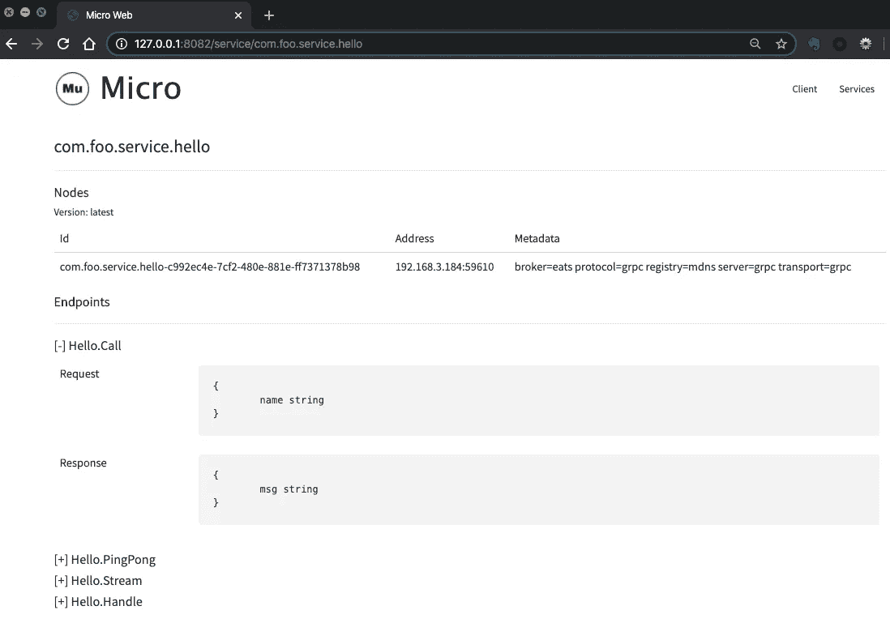

# Micro In Action，第 2 部分:Bootstrap 终极指南

> 原文：<https://itnext.io/micro-in-action-part-2-71230f01d6fb?source=collection_archive---------0----------------------->


微在行动

这是“Micro in Action”系列文章的第 2 篇，讨论了 [Micro](https://micro.mu/) 。我们将一步一步地构建微服务，并在此过程中解释 Micro 的特性。我们将从基本概念和主题开始，然后转向高级功能。

# 项目布局

在上一篇文章中，我们创建了一个简单的项目并运行它。本文继续这个旅程，首先介绍项目结构和每个文件的用途。

**注意**:由于本系列文章的主题都是微观的，无关的话题将被忽略，比如项目布局的最佳实践、如何连接数据库、依赖注入(如果有兴趣可以看[我的另一篇文章](/mastering-wire-f1226717bbac))等。因此，我们只对项目内容进行说明，不做任何不相关的调整。

项目布局如下:

```
.
├── main.go
├── generate.go
├── plugin.go
├── proto/hello
│   └── hello.proto
│   └── hello.pb.go
│   └── hello.pb.micro.go
├── handler
│   └── hello.go
├── subscriber
│   └── hello.go
├── Dockerfile
├── README.md
├── .gitignore
└── go.mod
```

以下是项目中的文件列表:

*   **main.go** ，项目主文件，后面会详细解释
*   **generate.go** ，只包含一行`//go:generate make proto`，与`go generate`集成。确保在执行 `go generate` 期间会自动调用`make proto`
*   **plugins.go** ，这个文件目前是空的。按照 Micro 的惯例，建议在这里管理所有插件的导入，后面会用到。
*   **proto/hello/hello . proto**，一个 [gRPC](https://grpc.io/docs/guides/concepts/) 服务定义文件，定义了一个名为`Hello`的 RPC 服务。在这个服务中，声明了 3 种典型的 RPC 方法:一元 RPC、服务器流 RPC 和双向流 RPC
*   **proto/hello/hello.pb.go，** golang 源文件由`protoc`从上述`.proto`文件生成
*   **proto/hello/hello . Pb . micro . go**，golang 生成的源文件`protoc-gen-micro`，进一步简化了开发者的工作。它定义了`HelloSerivce`接口和`HelloHandler`接口。后者是我们实现和完成业务逻辑所需的接口
*   **handler/hello.go** ，实现业务逻辑的文件。它定义了一个`Hello`对象，该对象实现了`HelloHandler`接口。
*   **subscriber/hello.go** ，实现异步消息订阅和处理的文件。它展示了处理消息的两种不同方式，一种是通过对象方法，另一种是通过函数。
*   **Dockerfile** ，定义如何构建 Docker 图像
*   **Makefile** ，定义了几个常见的任务，编译、测试、构建 Docker 镜像等。
*   **README.md** ，包含项目的基本信息
*   **。gitignore** ，默认忽略 hello-service
*   **go.mod** ，go 模块文件

**注**:文件夹`proto`有特殊含义。虽然没有技术上的限制，但是在 Micro 的约定中，每个项目根目录下的`proto`文件夹是用来存储“接口”文件的。这既包括项目需要向外界公开的接口，也包括项目所依赖的其他接口。例如，假设我们需要依赖另一个服务 **foo** 来实现业务逻辑。然后我们将创建一个名为`proto/foo`的文件夹，并将三个文件`foo.proto, foo.pb.go, foo.pb.micro.go`放入其中。

# 自举说明

让我们来看看自举过程， **main.go** :

```
package main

import (
   "github.com/micro/go-micro/v2"
   log "github.com/micro/go-micro/v2/logger"

   "hello/handler"
   "hello/subscriber"

   hello "hello/proto/hello"
)

func main() {
   // New Service
   service := micro.NewService(
      micro.Name("com.foo.service.hello"),
      micro.Version("latest"),
   )

   // Initialise service
   service.Init()

   // Register Handler
   hello.RegisterHelloHandler(service.Server(), new(handler.Hello))

   // Register Struct as Subscriber
   micro.RegisterSubscriber("com.foo.service.hello", service.Server(), new(subscriber.Hello))

   // Run service
   if err := service.Run(); err != nil {
      log.Fatal(err)
   }
}
```

代码大致分为 4 个部分，分别是导入依赖项、创建和初始化服务、注册业务处理处理程序和运行服务。

## 导入依赖关系

这部分只有一行代码值得单独解释:

```
hello "hello/proto/hello"
```

我们将一个显式的包名`hello`设置为`hello/proto/hello`。这也是 Micro 的一个约定:为所有接口导入包设置显式包名。这避免了依赖导入代码的原始包名。在实践中，如果不做特殊设置，自动生成代码的包名会比较长。以`hello.pb.go`为例，它的包名是`com_foo_srv_hello`。显然，设置一个显式的包名是更好的选择。

## 创建和初始化服务

```
// New Service
service := micro.NewService(
   micro.Name("com.foo.srv.hello"),
   micro.Version("latest"),
)
```

我们使用方法`micro.NewService(opts …Option) Service` 来创建一个服务。这个方法接受 multiply `micro.Option`作为它的参数，然后创建并返回一个`micro.Service`的实例

显然`micro.Option`是控制服务的关键。上面的示例代码使用选项分别指定服务名和版本号。

目前有 29 个选项可用于控制服务的所有方面。有些选项可以多次指定，形成叠加效果(后面会介绍)。

然而，如此重要的选项没有任何文档。想学的话，挖[源码](https://github.com/micro/go-micro/blob/v1.18.0/options.go)是必经之路。而且大多数`Option`的源代码没有任何注释，这进一步增加了学习的难度。

虽然本文无意成为 Micro 的终极参考手册，但我决定列出 Micro v2.4.0 的所有 29 个选项，并在下面逐一解释。因为这些选项对于理解和使用 Micro 非常重要，而且没有其他资料可以参考。

1.  **微。Name(n string)选项**，指定服务名。一般命名约定是`$namespace. $type. $name`。`$namespace` 表示项目的命名空间，`$type`表示服务类型(如 gRPC 和 web)。gRPC 服务类型通常缩写为`srv`。服务实例启动后，该名称将自动注册到`Registry`中，这将成为服务发现的基础。默认为`go.micro.server`。注意:因此，必须指定该选项，否则所有节点都使用相同的默认名称，这将导致混乱
2.  **微。版本(v 字符串)选项**，指定服务版本。默认值是启动时的格式化字符串。选择合适的版本号，结合正确的`Selector`，可以实现优雅的旋转升级、灰度释放、A / B 测试等多种操作。
3.  **微。地址(addr string)选项**，指定 gRPC 服务地址。默认是本地主机地址和随机端口的组合。因为客户端通过`Registry`发现服务，随机端口不会影响该发现。然而，在实践中，常常指定固定的端口号，这将有利于操作和安全控制。
4.  **微。注册 TTL(t 时间。Duration)选项**，指定注册表中服务注册信息的 TTL。默认值是 1 分钟
5.  **微。寄存器间隔(t 时间。Duration)选项**，指定服务向注册中心报告其状态的时间间隔。默认值为 30 秒。当服务遇到意外停机时，这两个与注册表相关的选项有助于避免“无效注册信息”。
6.  **微。wrap handler(w…服务器。HandlerWrapper)选项**，包装服务处理程序。它在概念上类似于 [Gin 中间件](https://github.com/gin-gonic/gin#using-middleware)，并集中控制处理程序的行为。包装器可以在多个层中应用，执行顺序是从外向内(在后面的文章中将提供一个例子)
7.  **微。wrap subscriber(w…服务器。SubscriberWrapper)选项**，类似于 WrapHandler，只是它用于在异步消息传递中包装订阅者。
8.  **微。wrap call(w…客户端。CallWrapper)选项**，包装来自客户端的每个方法调用。
9.  **微。WrapClient(w …client。Wrapper)选项**，包装服务客户端，可以多层应用，执行顺序是从内到外。
10.  **微。BeforeStart(fn func() error)选项**，在服务启动前设置多个回调函数。
11.  **微。BeforeStop(fn func() error)选项**，服务停止前设置多个回调函数。
12.  **微。AfterStart(fn func() error)选项**，服务启动后设置多个回调函数。
13.  **微。AfterStop(fn func() error)选项**，服务停止后设置多个回调函数
14.  **微。Action(a func(*cli。Context))选项**，处理命令行参数。支持子命令和标志。详见 [micro/cli](https://github.com/micro/cli)
15.  **微。标志(标志…cli。Flag)选项**，处理命令行标志。详见 [micro/cli](https://github.com/micro/cli)
16.  **微。Cmd(c cmd。Cmd)选项**，指定命令行处理对象。默认情况下由`[newCmd](https://github.com/micro/go-micro/blob/v2.4.0/config/cmd/cmd.go#L383)`生成，该对象支持几个默认的环境变量和命令行参数。本质上是 cli.Flag 的内置集合**注**:至于命令行支持，Micro 同时有优点也有缺点。好处是提供了很多默认选项，可以节省开发者的时间。缺点是这种设计对用户程序有很强的侵入性:框架要求开发人员根据 micro/cli 以统一的方式处理他们的命令行参数。否则，程序将报告错误，并且无法运行。例如，如果我们运行`./hello-service --foo=bar,`，我们将得到一个错误:`Incorrect Usage. Flag provided but not defined: --foo=bar`。好在`micro.Cmd`可以弥补侵扰带来的问题。如果一个现有的项目想要引入 Micro，并且它已经有了自己的命令行处理机制，那么你需要使用`micro.Cmd`来覆盖默认行为(同时失去默认的命令行处理能力)。关于命令行处理，本文后面将提供进一步的解释。
17.  **微。元数据(md map[string]string)选项**，指定服务元数据。元数据通常用于标记和分组服务，实现定制的负载平衡策略等。
18.  **微。运输(t 运输。Transport)选项**，指定传输协议，默认为 HTTP
19.  **微。选择器(s 选择器。Selector)选项**，指定节点选择器实现不同的加载策略。默认为随机选择器
20.  **微。注册表(r 注册表。Registry)选项**，指定用于服务发现的`Registry`。默认是 mDNS 的`Registry`
21.  **微。服务器的服务器。服务器)选项**，如果默认选项不符合您的要求，请指定自定义选项`Server`。。默认为`rpcServer`
22.  **微。HandleSignal(b bool)选项**，切换捕获 TERM、INT 和 QUIT 的信号处理程序的自动安装。默认为`true`
23.  **微。上下文(ctx 上下文。Context)选项**，指定服务的初始上下文。默认为`context.BackGround()`，可用于控制使用寿命等
24.  **微。客户端(c 客户端。Client)选项**，指定服务客户端。默认为`rpcClient`
25.  **微。经纪人(b 经纪人。Broker)选项**，指定发布/订阅使用的消息代理.默认为 HTTP 代理
26.  **微。个人资料(p 个人资料。Profile)选项**，用于调试配置文件的配置文件
27.  **微。Tracer(t trace。Tracer)选项**，Tracer 为服务设置跟踪器
28.  **微。Auth(一个 auth。Auth)选项**，Auth 设置服务的授权。(根据官方的 Slask，这个 API 不够稳定，没有准备好在 2.4.0 版本中投入生产)
29.  **微。配置(c 配置。Config)选项**，Config 设置服务的配置

因此，通过指定适当的`Option`，服务的行为可以高度定制。例如，要修改服务注册信息的 TTL:

```
...
// New Service
service := micro.NewService(
   micro.Name("foo.bar"),
   micro.Version("v1.0"),
   // change default TTL value
   **micro.RegisterTTL(5 * time.*Minute*),**
   ...
)
...
```

**注**:以上大部分选项可以用多种方式指定。源文件中的硬编码只是其中的一种方式。事实上，Micro 建议用户通过环境变量指定选项，因为这提供了更大的灵活性。以`micro.RegisterTTL`为例，我们可以在运行时通过环境变量`$ MICRO_REGISTER_TTL=value`或者命令行标志 `—-register_ttl=value`(值以秒为单位)来指定。目前没有关于这些内置选项的文档。运行`./hello-service -h`将显示它们的简要描述。想了解完整的细节，自己去挖`[newCmd](https://github.com/micro/go-micro/blob/v2.4.0/config/cmd/cmd.go#L383)`的出处。本系列的后续文章将进一步解释这个主题。

创建后，您可以初始化服务:

```
// Initialize service
service.Init()
```

`service.Init`方法可以接受与`micro.NewService`相同的参数。所以以上 29 个选项也可以用在`service.Init`中。它们具有相同的效果，只是时间不同。

因为此时已经创建了服务，所以我们可以从服务实例中检索信息。例如，您可以读取随机端口:

```
// Initialize service
**service**.**Init**(
   // print log after start
   micro.AfterStart(func() error {
      log.Infof("service listening on %s!",
         **service.Options().Server.Options().Address,**
      )
      return nil
   }),
)
```

## 注册业务处理者

```
// Register Handler
hello.RegisterHelloHandler(service.Server(), new(handler.Hello))

// Register Struct as Subscriber
micro.RegisterSubscriber("com.foo.service.hello", service.Server(), new(subscriber.Hello))
```

只有在处理程序注册之后，我们的业务代码才能真正对外提供服务。下面是两个典型的注册操作:

1.  注册 gRPC 处理程序。创建一个`handler.Hello`对象，并在`Server`上注册它。因为`handler.Hello`实现了`HelloHandler`接口，所以可以传递给`hello.RegisterHelloHandler`，否则会出错。一个`Server`可以注册多个`Handlers`，提供不同的业务功能。
2.  注册消息处理对象。第一个参数是消息主题，第二个参数是`Server`，第三个参数是消息处理对象。

关于异步消息传递的更多细节，我们将在后面的专门文章中讨论。

## 运行服务

```
if err := service.Run(); err != nil {
      log.Fatal(err)
}
```

此时，服务终于开始运行了

# 检查运行时状态

正如在[上一篇文章](/micro-in-action-getting-started-a79916ae3cac)中提到的，命令行工具`micro`可以用于在运行时检查和操作服务。让我们试一试。

服务启动后，运行`micro web`:

```
$ micro web2020-04-02 17:16:48  level=info service=web HTTP API Listening on [::]:8082
2020-04-02 17:16:48  level=info service=web Starting [service] go.micro.web
2020-04-02 17:16:48  level=info service=web Server [grpc] Listening on [::]:60537
2020-04-02 17:16:48  level=info service=web Registry [mdns] Registering node: go.micro.web-dc1270ba-8b1f-4f05-92ec-57fb450efaaa
```

如您所见，一个服务器正在本地主机端口 8082 上侦听。

**注意**:端口 8082 是默认值，可以通过环境变量或命令行标志修改。运行`micro web -h`获取详细信息。

然后访问[**http://127 . 0 . 0 . 1:8082/service/com . foo . service . hello**](http://127.0.0.1:8082/service/com.foo.service.hello)查看服务状态。以下是截图:



微型网络

从上面的图片中，我们可以查看关于该服务的各种信息:

*   服务名称
*   服务节点列表。如果多个节点同时运行，您将看到所有节点。
*   每个节点的信息:版本、唯一 id、地址、元数据等。
*   端点。服务定义、gRPC 服务名、方法名、参数信息、数据类型等。

因此可以通过`micro web`轻松检查服务的各种运行时状态。你可能会问，`./hello-service`和`micro web`互不调用，它是怎么知道这个信息的？答案就在前面提到的服务发现中。Micro 内置了对服务发现的支持。在默认设置下，服务发现基于 mDNS，因此只要它们在同一个局域网中，它们就会自动发现彼此。

当然，`micro web` **远不止此**。我们只显示与当前主题相关的功能。后续文章将对此进行更多介绍。

# 摘要

这是“微在行动”系列文章的第二篇，我们做了几件事:

1.  介绍了在前一篇文章中创建的项目布局，解释了每个文件的用途。
2.  对照源代码逐行分析一个微基础服务的引导过程。
3.  考虑到 Micro 缺乏文档，本文全面介绍了`micro.NewService`支持的所有选项。
4.  最后，我们使用`micro web`来检查服务的运行状态

未完待续。

另请参见:

*   [Micro In Action，第 1 部分:入门](/micro-in-action-getting-started-a79916ae3cac)
*   [Micro 在行动，第 3 部分:调用服务](/micro-in-action-part-3-calling-a-service-55d865928f11)
*   [微在行动，第 4 部分:发布/订阅](https://medium.com/@dche423/micro-in-action-part4-pub-sub-564f3b054ecd)
*   [Micro 在行动，第 5 部分:消息代理](/micro-in-action-part-5-message-broker-a3decf07f26a)
*   [微在行动，第 6 部分:服务发现](/micro-in-action-part6-service-discovery-f988988e5936)
*   [微动在动作，第 7 部分:断路器&限速器](/micro-in-action-7-circuit-breaker-rate-limiter-431ccff6a120)
*   [微操作，Coda:分布式 Cron 作业](/micro-in-action-coda-distributed-cron-job-a2b577885b24#39d6-3ace13696421)
*   [微在行动的索引页](https://medium.com/@dche423/micro-in-action-1be29b057f2d)