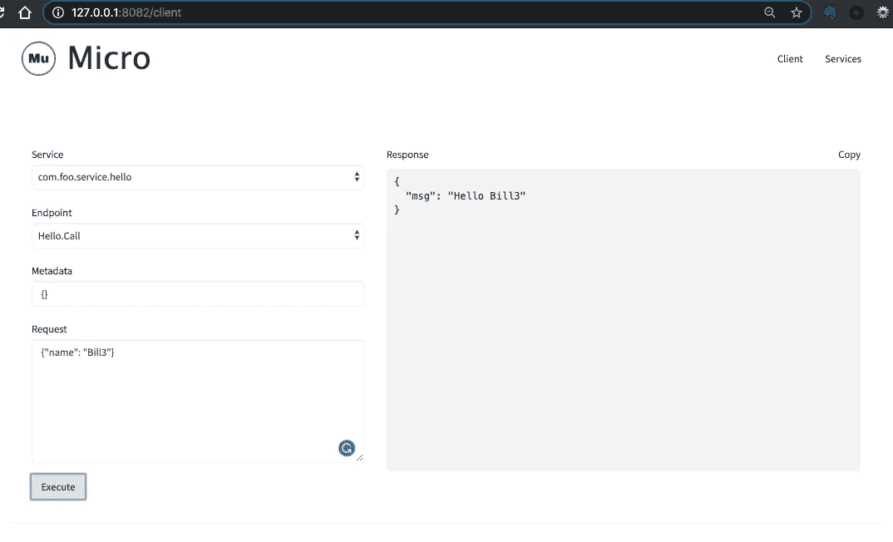

# Micro 在行动，第 3 部分:调用服务

> 原文：<https://itnext.io/micro-in-action-part-3-calling-a-service-55d865928f11?source=collection_archive---------3----------------------->


微在行动

这是“Micro in Action”系列文章的第 3 篇，讨论了 [Micro](https://micro.mu/) 。我们将一步一步地构建微服务，并在此过程中解释 Micro 的特性。我们将从基本概念和主题开始，然后转向高级功能。

今天我们将讨论如何调用基于微处理器的 gRPC 服务。

在[上一篇文章](/micro-in-action-part-2-71230f01d6fb)中，我们创建了一个服务，现在我们可以调用它了。最简单的方法是通过多功能命令行工具`micro`。

# 使用命令行工具调用服务

首先，我们使用命令`list`列出所有可用的服务:

```
$ **micro list services**com.foo.service.hello
go.micro.nats.broker
```

名为`com.foo.srv.hello`的服务是我们的目标服务，`go.micro.http.broker`是消息代理服务的默认实现，现在不讨论这个。

在调用之前，我们可以使用`get`命令查看该服务的详细信息，包括服务版本、端点定义、元数据和节点信息等。

```
$ **micro get service com.foo.service.hello**
service  com.foo.service.helloversion latestID Address Metadata
com.foo.service.hello-c992ec4e-7cf2-480e-881e-ff7371378b98 192.168.3.184:59610 transport=grpc,broker=eats,protocol=grpc,registry=mdns,server=grpcEndpoint: Hello.CallRequest: {
    name string
}
Response: {
    msg string
}...
```

然后我们可以用命令`call`调用服务:

```
$ micro call com.foo.service.hello Hello.Call '{"name": "**Bill**"}'error calling com.foo.service.hello.Hello.Call: 
{"id":"go.micro.client","code":408,"detail":"context deadline exceeded","status":"Request Timeout"}
```

我们用 JSON 字符串(用单引号括起来)构造请求并调用服务。不幸的是，我们有一个错误。这是 Micro v2 的一个[已知 bug](https://github.com/micro/micro/issues/392) ，希望能尽快解决。

此外，micro 还支持交互模式。

# 交互模式下的呼叫服务

调用`cli`命令后，我们将进入交互模式:

```
$ micro cli
micro>
```

**注意**:交互和非交互模式下的命令不一样。例如，列出所有服务的交互命令是`list`而不是`list services`。原因是在非交互模式下，micro 需要支持更丰富的语义(比如可以用`list nodes`列出网络中的所有节点)。IMO 这是一个设计决策，它带来了一些概念上的不一致，不容易理解。

```
$ micro cli
micro> **list** com.foo.service.hello
go.micro.nats.brokermicro>
micro> **get** com.foo.service.hello
service  com.foo.service.helloversion latestID Address Metadata
com.foo.service.hello-df4e5d69-9226-4c12-9b1e-1c06def9426e 192.168.3.184:49297 broker=eats,protocol=grpc,registry=mdns,server=grpc,transport=grpc
...micro>
micro> **call** com.foo.service.hello Hello.Call {"name": "Bill2"}error calling com.foo.service.hello.Hello.Call: {"id":"go.micro.client","code":408,"detail":"context deadline exceeded","status":"Request Timeout"}micro>
```

注意，在交互模式下构建请求时，我们不需要引用 JSON 字符串。由于前面提到的错误，`call`命令也失败了。

# 使用基于 web 的客户端调用服务

Micro 还提供了一个基于 web 的客户端，支持用户在浏览器中调用服务。

运行`micro web`后，你会在[http://127 . 0 . 0 . 1:8082/client](http://127.0.0.1:8082/client)找到如下界面。您可以通过点击“执行”按钮来调用所选择的服务/端点，然后响应内容将以 JSON 格式显示在右侧。



# 通过代码调用服务

上面提到的方法只是为了方便运行时调试。一般来说，我们通过代码调用服务。

让我们创建一个客户端项目，布局如下:

```
.
├── main.go
├── plugin.go
├── proto/hello
│   └── hello.proto
│   └── hello.pb.go
│   └── hello.pb.micro.go
├── go.mod
├── go.sum
```

除了 **main.go** 之外，其他文件的内容与[上一篇文章](/micro-in-action-part-2-71230f01d6fb)中描述的相同，此处不再赘述。

以下是 **main.go** 中的代码:

客户端/main.go

*   首先，创建并初始化`micro.Service`的一个实例，并将其命名为“**com . foo . service . hello . client”**。该名称没有特殊含义，在实际项目中可能会有所不同。
*   然后创建一个`HelloSevice`的客户端实例。我们传递给方法`hello.NewHelloService`的第一个参数是要调用的服务的名称。第二个参数是从服务实例中获得的`github.com/micro/go-micro/v2/client.Client,`的实例。
*   下一步是调用服务方法。首先，传入`context.Context`实例。这里，我们用`context.TODO()`来简化例子。在真实的项目中，应该传入实际的上下文实例；然后我们传入请求对象。

代码准备好后，您可以编译并运行:

```
$ go run main.go plugin.go
Hello Bill 4
$
```

将显示预期的响应。

如果服务此时没有运行，将会报告一个错误:

```
$ go run main.go plugin.go 
{"id":"go.micro.client","code":500,"detail":"service com.foo.service.hello: not found","status":"Internal Server Error"}
$
```

至此，您完成了任务。

# 总结

本文讨论了如何调用基于微处理器的 gRPC 服务。

Micro 提供了相当多的工具，用于在运行时检查服务状态和调用服务。这些工具支持命令行和浏览器。然而，有些命令现在无法工作，因为 Micro v2 中仍然存在一些严重的错误。

最后，我们创建了一个客户端项目，并用代码完成了服务调用。

未完待续。

另请参见:

*   [Micro 在行动，第 1 部分:入门](/micro-in-action-getting-started-a79916ae3cac)
*   [Micro In Action，第 2 部分:Bootstrap 终极指南](/micro-in-action-part-2-71230f01d6fb)
*   [微在行动，第四部分:发布/订阅](https://medium.com/@dche423/micro-in-action-part4-pub-sub-564f3b054ecd)
*   [Micro 在行动，第 5 部分:消息代理](/micro-in-action-part-5-message-broker-a3decf07f26a)
*   [微在行动，第 6 部分:服务发现](/micro-in-action-part6-service-discovery-f988988e5936)
*   [微操作，第 7 部分:断路器&限速器](/micro-in-action-7-circuit-breaker-rate-limiter-431ccff6a120)
*   [微操作，Coda:分布式 Cron 作业](/micro-in-action-coda-distributed-cron-job-a2b577885b24#39d6-3ace13696421)
*   [微在行动的索引页](https://medium.com/@dche423/micro-in-action-1be29b057f2d)