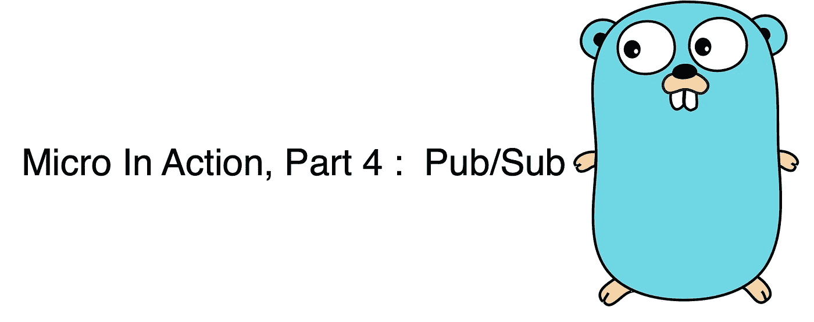

# 微在行动，第四部分:发布/订阅

> 原文：<https://itnext.io/micro-in-action-part4-pub-sub-564f3b054ecd?source=collection_archive---------1----------------------->



微在行动

这是“微在行动”系列文章的第 4 篇，讨论[微](https://micro.mu/)。我们将一步一步地构建微服务，并在此过程中解释 Micro 的特性。我们将从基本概念和主题开始，然后转向高级功能。

今天我们来谈谈异步消息处理。

异步消息处理是构建可伸缩、高容错系统的关键技术。虽然功能强大，但开发起来也相当繁琐，要考虑很多技术细节。它远没有同步系统简单明了。

幸运的是，Micro 对这种编程模型进行了非常优雅的抽象和封装。所以我们可以方便地使用它。

此外，通过 Micro 的接口抽象，我们可以透明地(或几乎透明地)支持各种消息代理。

默认情况下，Micro 提供了一个嵌入式 Nats 消息代理。同时还通过[插件](https://github.com/micro/go-plugins/tree/master/broker)为主流消息经纪人提供广泛支持，包括 Kafka、RabbitMQ、MQTT、NSQ、亚马逊 SQS 等。这使得我们在切换消息代理时几乎不需要修改任何业务代码。

Micro 以两种不同的方式支持异步消息传递。

一个是[发布/订阅](https://en.wikipedia.org/wiki/Publish%E2%80%93subscribe_pattern)，另一个是通过`micro.Broker`接口处理消息。前者相对简单，而后者提供了更多的灵活性。

Micro 内置的发布/订阅功能统一并简化了消息的发送、接收、编码和解码。这将开发人员从底层技术细节中解放出来，让他们专注于创造商业价值。大多数情况下，我们应该选择这种方式。

下面我们将举例分析一个发布/订阅系统的开发。

# 订阅消息

在本系列的第一篇文章中，我们创建了一个样例项目，它已经包含了与消息订阅相关的代码。

首先，我们定义消息处理处理器。**的代码。/subscriber/hello.go** 如下:

```
package subscriber

import (
   "context"
   log "github.com/micro/go-micro/v2/logger"

   hello "hello/proto/hello"
)

type Hello struct{}

func (e *Hello) **Handle**(ctx context.Context, msg *hello.Message) error {
   log.Info("Handler Received message: ", msg.Say)
   return nil
}
```

结构的函数或方法都可以用于消息处理。只要它的签名是`func(context.Context, v interface{}) error`

注意，我们的处理函数的第二个参数是`*hello.Message`，它是在。原型文件。Micro 自动解码消息，所以我们可以在消息处理程序中直接使用它。

准备好消息处理程序后，您需要注册它。**的相关代码。/main.go** 如下:

```
...
// Register Struct as Subscriber
micro.**RegisterSubscriber**("com.foo.service.hello", service.Server(), new(subscriber.Hello))
...
```

上面的代码注册了两个消息处理处理程序，这些处理程序将接收来自名为“ **com.foo.service.hello** ”的主题的消息。

如果您想对订阅行为进行更多的控制，您需要向`micro.RegisterSubscriber`传递额外的参数。让我们先来看看这个方法的签名:

```
func **RegisterSubscriber**(topic string, s server.Server, h interface{}, opts ...**server.SubscriberOption**) error
```

第一个参数表示主题。第二个参数是`server.Server`，可以从`service.Server()`中获得。第三个参数是消息处理程序。

最后一个是控制订阅行为的可选参数。它的类型是`server.SubscriberOption`。目前，Micro 提供 4 种内置选项:

1.  **服务器。DisableAutoAck()** ，处理完消息后，禁用消息的自动确认。
2.  **服务器。SubscriberContext(ctx 上下文。Context)** ，设置上下文选项以允许 broker SubscriberOption 通过.
3.  **服务器。InternalSubscriber(b bool)，**指定不向发现系统通告订户
4.  **服务器。SubscriberQueue(n string)** ，跨订户分发消息得共享队列名.

注意:我个人认为框架暴露的选项太少。如果你有更高的要求，比如你想控制消息的持久性或重传策略，你必须求助于`micro.Broker`接口。希望这可以在未来的版本中得到增强

以上选项中，`server.SubscriberQueue`是值得单独说明的一个。

我们知道在发布/订阅模型中有队列(或某些平台中的通道)的概念。如果一个主题的多个订阅者有自己的队列，那么消息将被复制并分发到不同的队列，这样每个订阅者都可以接收所有的消息。

默认情况下，Micro 为每个订户实例创建一个全局唯一的队列。如果您想与多个订户实例共享一个队列，那么您需要通过`server.SubscriberQueue`显式地指定队列名称:

```
micro.RegisterSubscriber("com.foo.srv.hello", service.Server(), subscriber.Handler, **server.SubscriberQueue("foo_bar")**)
```

这样，订户实例将共享同一个队列。所以消息会被分发到某个节点进行处理，避免了同一条消息被重复处理。

考虑到在分布式系统中，多个服务实例在不同的节点上运行是一个常见的场景，我的建议是:除非您知道自己在做什么，否则**总是显式地指定队列名称——即使当前只有一个订阅实例**。最常见的做法是用主题命名队列。

至此，发布/订阅模型的 **Sub** 部分准备就绪。让我们开始工作在**酒吧**部分。

# 发布消息

让我们创建一个名为 **pub** 的发布消息的项目，其结构如下:

```
.
├── main.go
├── plugin.go
├── proto/hello
│   └── hello.proto
│   └── hello.pb.go
│   └── hello.pb.micro.go
└── go.mod
```

除了 **main.go** 之外，其他文件的内容与[上一篇文章](/micro-in-action-part-2-71230f01d6fb)中描述的相同，此处不再赘述。

以下是 **main.go** 中的代码:

main.go

*   首先创建并初始化`micro.Service`的一个实例，命名为“**com . foo . SRV . hello . pub”**。该名称没有特殊含义，在实际项目中可能会有所不同。
*   然后指定向其发送消息的主题，并创建一个`micro.Publisher` 实例。
*   然后每秒发送一条消息，类型为`*hello.Message`，框架会自动对消息进行编码。

与订阅功能类似，发布接口也支持选项，这些选项可用于控制发布的行为。`micro.Publisher`界面的定义如下:

```
// Publisher is syntactic sugar for publishing
type Publisher interface {
   Publish(ctx context.Context, msg interface{}, opts ...**client.PublishOption**) error
}
```

目前，Micro 仅提供一个内置发布选项:

*   **当事人。with exchange(e string)publish option**，设置要路由消息的交换机。

# 跑起来

准备好 **pub** 项目后，运行 **hello server** 和 **pub** 项目。

然后我们会在 **hello server、**的控制台中看到接收消息的日志，每秒一行:

```
$ go run main.go plugin.go 
2020-04-03 10:10:22  level=info Starting [service] com.foo.service.hello
2020-04-03 10:10:22  level=info Server [grpc] Listening on [::]:52863
2020-04-03 10:10:22  level=info Broker [eats] Connected to [::]:52865
2020-04-03 10:10:22  level=info Registry [mdns] Registering node: com.foo.service.hello-04df9f5a-f93e-437e-9272-0f6a37a99e4e
2020-04-03 10:10:22  level=info Subscribing to topic: com.foo.service.hello
2020-04-03 10:10:22  level=info Handler Received message: 2020-04-03 10:10:22.994619 +0800 CST m=+25.013864340
2020-04-03 10:10:23  level=info Handler Received message: 2020-04-03 10:10:23.994576 +0800 CST m=+26.013819155
2020-04-03 10:10:24  level=info Handler Received message: 2020-04-03 10:10:24.994613 +0800 CST m=+27.013852978
...
```

# 结论

Micro 完全支持异步消息传递。它既支持高级发布/订阅模型，也支持通过`micro.Broker`进行的低级操作。

**Pub/Sub** 大大简化了异步消息传递的开发，这样我们就可以专注于业务逻辑而不是技术细节。

开发人员只需要定义发布者、订阅者和消息内容。所有其他工作都由框架完成。不再需要考虑异步消息传递系统中的常见问题，如消息路由、重传和接收确认，也不再需要考虑消息编码和解码。

当然，这种简化也带来了一些局限性。如果 Pub/Sub 不能满足您的需求，请关注本系列的下一篇文章，我们稍后将讨论与`micro.Broker`的消息传递

未完待续。

另请参见:

*   [Micro 在行动，第 1 部分:入门](/micro-in-action-getting-started-a79916ae3cac)
*   [Micro In Action，第 2 部分:Bootstrap 终极指南](/micro-in-action-part-2-71230f01d6fb)
*   [微在行动，第 3 部分:调用服务](/micro-in-action-part-3-calling-a-service-55d865928f11)
*   [Micro 在行动，第 5 部分:消息代理](/micro-in-action-part-5-message-broker-a3decf07f26a)
*   [微在行动，第 6 部分:服务发现](/micro-in-action-part6-service-discovery-f988988e5936)
*   [微动作，第 7 部分:断路器&速率限制器](/micro-in-action-7-circuit-breaker-rate-limiter-431ccff6a120)
*   [微操作，Coda:分布式 Cron 作业](/micro-in-action-coda-distributed-cron-job-a2b577885b24#39d6-3ace13696421)
*   [微在行动的索引页](https://medium.com/@dche423/micro-in-action-1be29b057f2d)