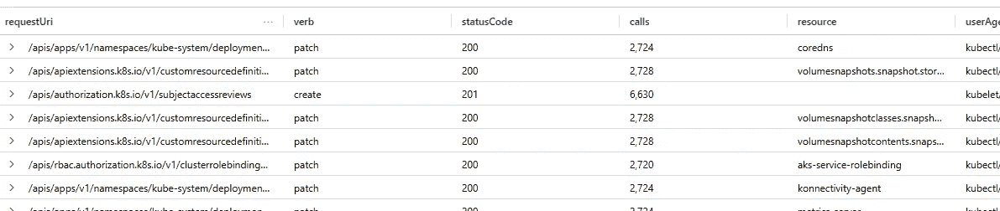

# 微型培训:AKS 审计 API 调用

> 原文：<https://itnext.io/micro-training-aks-auditing-api-calls-321682f45773?source=collection_archive---------7----------------------->

这需要在集群上安装 [container insights](https://learn.microsoft.com/en-us/azure/azure-monitor/containers/container-insights-enable-aks?tabs=azure-cli) ，并正确配置日志分析工作区。

从集群诊断设置区域启用 KubeAudit 诊断设置。

```
Monitoring -> Diagnostic settings -> Add diagnostic setting
```

```
Enter a name -> Kubernetes Audit -> Send to Log Analytics workspaceSave
```


*   监控->日志
*   退出弹出的查询
*   摄入一段时间后，您应该会看到 AzureMetrics 表。


运行下面的查询，该查询将解析日志和提取数据，以突出显示从特定资源进行了多少次调用、什么动词、状态代码、资源和用户代理。

```
//Audit call Breakdown
AzureDiagnostics
| where Category == 'kube-audit'
| extend JSON = parse_json(log_s)
| extend stage = JSON.stage
| where stage == "ResponseComplete"
| extend verb = tostring(JSON.verb)
| extend statusCode = tostring(JSON.responseStatus.code)
| extend userAgent = tostring(JSON.userAgent)
| extend user = tostring(JSON.user.username)
| extend sourceIPs = tostring(JSON.sourceIPs)
| extend resourceType = tostring(JSON.objectRef.resource)
| extend resourceName = tostring(JSON.objectRef.name)
| extend requestUri = tostring(JSON.requestURI)
| summarize calls = count(), resource = any(resourceName), userAgent = any(userAgent) by requestUri, verb, statusCode
```



如果你喜欢这样的东西，请鼓掌，如果有你想看的特别的东西，请告诉我。

# 其他感兴趣的链接

*   [集装箱见解](https://learn.microsoft.com/en-us/azure/azure-monitor/containers/container-insights-onboard)
*   [日志分析数据收集](https://learn.microsoft.com/en-us/azure/azure-monitor/essentials/data-collection)
*   [日志分析代理](https://learn.microsoft.com/en-us/azure/azure-monitor/agents/log-analytics-agent)
*   [KQL 语言](https://learn.microsoft.com/en-us/azure/data-explorer/kusto/query/)