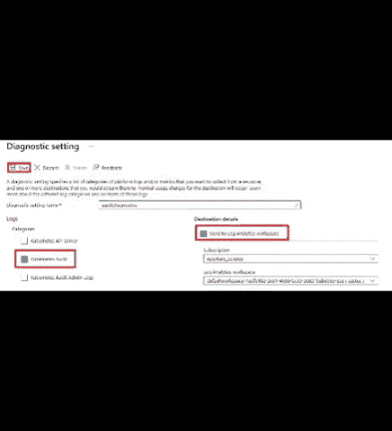
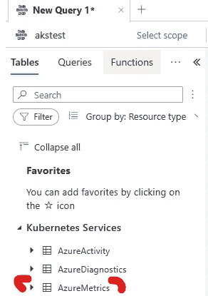
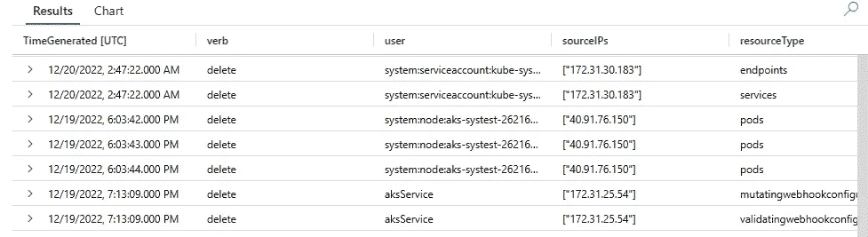

# 微型培训:AKS 审核资源删除

> 原文：<https://itnext.io/micro-training-aks-auditing-resource-deletions-287968e9ca14?source=collection_archive---------8----------------------->

这需要在集群上安装 [container insights](https://learn.microsoft.com/en-us/azure/azure-monitor/containers/container-insights-enable-aks?tabs=azure-cli) ，并正确配置日志分析工作区。

从集群诊断设置区域启用 KubeAudit 诊断设置。

```
Monitoring -> Diagnostic settings -> Add diagnostic setting

Enter a name -> Kubernetes Audit -> Send to Log Analytics workspace

Save
```



*   监控->日志
*   退出弹出的查询
*   摄入一段时间后，您应该会看到 AzureMetrics 表。



运行下面的查询，该查询将解析日志并提取数据，以突出显示谁删除了什么、从哪里删除、时间等。请记住，在非 RBAC 集群中，您不会像预期的那样看到用户名。

```
//Who deleted stuff?
AzureDiagnostics
| where Category == "kube-audit"
| extend JSON = parse_json(log_s)
| extend stage = JSON.stage
| extend verb = JSON.verb
| where stage == "ResponseComplete"
    and verb == "delete"
| extend userAgent = JSON.userAgent
| extend user = JSON.user.username
| extend sourceIPs = JSON.sourceIPs
| extend resourceType = JSON.objectRef.resource
| extend resourceName = JSON.objectRef.name
| extend requestUri = JSON.requestURI
| project TimeGenerated, verb, user, sourceIPs, resourceType, resourceName, requestUri, JSON
```



就像这样，您可以解析 json 日志并打印出有用信息。随心所欲地调整它。

如果你喜欢这样的东西，请鼓掌，如果有你想看的特别的东西，请告诉我。

# 其他感兴趣的链接

*   [集装箱见解](https://learn.microsoft.com/en-us/azure/azure-monitor/containers/container-insights-onboard)
*   [日志分析数据收集](https://learn.microsoft.com/en-us/azure/azure-monitor/essentials/data-collection)
*   [日志分析代理](https://learn.microsoft.com/en-us/azure/azure-monitor/agents/log-analytics-agent)
*   [KQL 语言](https://learn.microsoft.com/en-us/azure/data-explorer/kusto/query/)