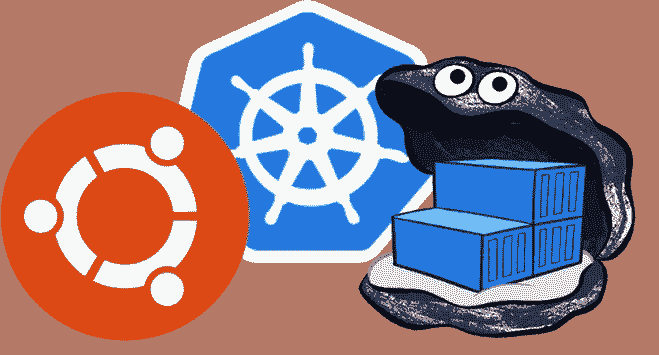

# Microk8s Docker 注册表

> 原文：<https://itnext.io/microk8s-docker-registry-c3f401faa760?source=collection_archive---------2----------------------->

一个朋友曾经问，为什么人们更喜欢 microk8s 而不是 minikube？…从那以后我们再也没说过话。真实故事！

这是一个很难回答的问题，尤其是对一个工程师来说。答案并不明显，主要是因为这与个人偏好有关。让我告诉你为什么。



从 Microk8s 的角度来看，这是拥有一个带有注册表的本地 Kubernetes 集群所必须做的事情:

```
sudo snap install microk8s --edge --classic
microk8s.enable registry
```

## 这有什么了不起的？

*   它超级快！一对夫妇数百 MB 的互联网管道，你都设置好了。
*   您可以省去浏览文档来设置和配置带有持久存储和注册表的 Kubernetes 的痛苦。

## 那么这为什么不好呢？

*   作为一名 Kubernetes 工程师，你可能想知道引擎盖下发生了什么。部署了什么？什么图像？在哪里？
*   作为 Kubernetes 用户，您可能需要配置注册表。图像存储在哪里？您能更改任何访问凭据吗？

你明白为什么这是偏好的问题了吗？Minikube 是在 VM 中设置 Kubernetes 的成熟解决方案。它可以在任何地方运行(甚至在 windows 上),它只做一件事，建立一个 Kubernetes 集群。

另一方面，microk8s 提供 Kubernetes 作为应用。它坚持己见，并且向自动化通用开发工作流迈出了一步。说到开发工作流...

# 注册表的完整故事

microk8s 附带的注册表可在`localhost`的端口`32000`上获得。它是一个不安全的注册表，因为，说实话，在做本地开发时，谁会关心安全性:)。

而且越来越好了，看看这个！microk8s 使用的 docker 守护进程被[配置为信任](https://github.com/ubuntu/microk8s/blob/master/microk8s-resources/default-args/docker-daemon.json)这个不安全的注册表。当我们想要上传图像时，我们就与这个守护进程对话。最简单的方法是使用 microk8s 附带的`microk8s.docker`命令:

```
# Lets get a Docker file first
wget [https://raw.githubusercontent.com/nginxinc/docker-nginx/ddbbbdf9c410d105f82aa1b4dbf05c0021c84fd6/mainline/stretch/Dockerfile](https://raw.githubusercontent.com/nginxinc/docker-nginx/ddbbbdf9c410d105f82aa1b4dbf05c0021c84fd6/mainline/stretch/Dockerfile)# And build it
microk8s.docker build -t localhost:32000/nginx:testlocal . microk8s.docker push localhost:32000/nginx:testlocal
```

> 如果您喜欢使用外部 docker 客户端，您应该将它指向 docker 正在监听的套接字:
> 
> `docker -H unix:///var/snap/microk8s/docker.sock ps`

要使用本地注册表中的图像，只需在清单中引用它:

```
apiVersion: v1
kind: Pod
metadata:
  name: my-nginx
  namespace: default
spec:
  containers:
  - name: nginx
    image: localhost:32000/nginx:testlocal
  restartPolicy: Always
```

并部署有:

```
microk8s.kubectl create -f the-above-awesome-manifest.yaml
```

[](https://asciinema.org/a/f28BuWcP6KNZZuCOSAA7JnQ9J) [## Microk8s 和注册表

### 由 kjackal 录制

asciinema.org](https://asciinema.org/a/f28BuWcP6KNZZuCOSAA7JnQ9J) 

# 这个帖子要保留什么？

你想要 Kubernetes？我们将其作为(sn)应用程序交付！

你想在 microk8s 中看到你的工具链吗？给我们写封短信。[给我们发个 PR！](https://github.com/ubuntu/microk8s/pulls)

我们很高兴看到快乐的 Kubernauts！

那些来这里八卦的人。他不是一个好朋友(很明显！).我们只是在一次 meetup 上认识的:)！

# 参考

*   Microk8s 主站点: [http://microk8s.io](http://www.microk8s.io)
*   Microk8s 回购:【https://github.com/ubuntu/microk8s 
*   Microk8s 注册表:[https://github . com/Ubuntu/micro k8s/blob/master/docs/registry . MD](https://github.com/ubuntu/microk8s/blob/master/docs/registry.md)