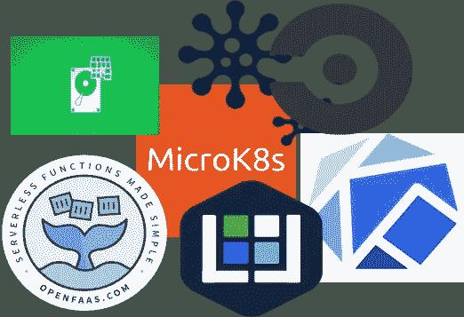

# 野外的 MicroK8s

> 原文：<https://itnext.io/microk8s-in-the-wild-9f05aeee8d87?source=collection_archive---------4----------------------->

随着 MicroK8s 越来越受欢迎，我想花点时间提一些使用 micro Kubernetes 发行版的项目。但在此之前，我先做一些介绍。对于那些不熟悉 Kubernetes 的人来说，Kubernetes 是一个开源的容器编排器。它向您展示了如何部署、升级和供应您的应用程序。这是所有主要参与者(谷歌、微软、IBM、亚马逊等)聚集在一个框架周围，使其成为非官方标准的罕见场合之一。



[MicroK8s](https://microk8s.io/) 是 Kubernetes 的一个分布。这是一个[快照包](https://snapcraft.io/microk8s)，它在您的机器上建立了一个 Kubernetes 集群。您可以拥有一个 Kubernetes 集群，用于本地开发、CI/CD 或只是为了了解 Kubernetes，只需:

```
sudo snap install microk8s --classic
```

如果你在 Mac 或 Windows 上，你将需要一个 [Linux 虚拟机](/microk8s-on-macos-98f1de3aa63e)。

在接下来的内容中，你会发现一些关于人们如何使用 MicroK8s 的例子。注意，这并不是 MicroK8s 用法的完整列表，只是我碰巧意识到的一些努力。

## [春云 Kubernetes](https://github.com/spring-cloud/spring-cloud-kubernetes)

本项目使用 [CircleCI](https://circleci.com/) 进行 CI/CD。MicroK8s 提供了一个本地 Kubernetes 集群，在这里运行[集成测试](https://github.com/spring-cloud/spring-cloud-kubernetes/tree/master/spring-cloud-kubernetes-integration-tests)。启用的插件有 dns、docker 注册表和 Istio。集成测试需要使用 kubeconfig 文件和 dockerd 的套接字插入 Kubernetes 集群。这项工作是在这个[拉请求](https://github.com/spring-cloud/spring-cloud-kubernetes/commit/9f02f7e7533b36e4f3e03b8918acc4dbf4a95444)中介绍的(感谢 George ),它激励我们添加一个`microk8s.status`命令来等待集群上线。例如，我们可以等待 5 分钟，让 MicroK8s 给出:

```
microk8s.status --wait-ready --timeout=300
```

## [micro k8s 上的 open FAAS](https://johnmccabe.net/technology/projects/openfaas-on-microk8s/)

在今年的配置管理训练营中，我遇到了乔·麦科贝,《T2 用 MicroK8s 部署 OpenFaaS》一书的作者。我将重复他的话“被我能够让一个基本的实验室环境运行起来的速度和轻松程度所震撼”。

## [**那么无所不能呢？**](/files-upload-from-kubeless-on-microk8s-to-minio-607e06598a4b)

似乎部署 MicroK8s 的容易性与无服务器框架的软件开发的容易性是相辅相成的。Kubeless 的用户也在踢 MicroK8s 的轮胎。查看“[文件从 MicroK8s 上的 Kubeless 上传到 Minio](/files-upload-from-kubeless-on-microk8s-to-minio-607e06598a4b) ”和“[无服务器 MicroK8s Kubernetes](https://medium.com/@bluszcz/serverless-microk8s-kubernetes-fcd6b875cd33) ”。

## [micro k8s 上的 SUSE 云应用平台(CAP)](https://dimitris.karakasilis.me/2019/01/27/scf-on-microk8s.html)

在他的博客文章中，迪米特里斯详细描述了他为了让软件在 MicroK8s 上运行而必须做的所有配置。最有趣的部分是这种努力背后的动机。正如他所说，“…微型 k8…使用您机器的资源，而不必事先决定虚拟机的大小。”正如他向我解释的那样，他的应用程序只在引导过程中施加了很大的内存压力。微 k8 使他能够在初始化阶段后回收未使用的内存。

## [库贝弗洛](https://www.kubeflow.org/docs/started/getting-started-multipass/)

Kubeflow 是 [Kubernetes 和 AI/ML](https://github.com/leigh-johnson/kubeflow-microk8s-demo) 之间缺失的一环。Canonical 积极参与了这项工作，所以…你绝对应该去看看。当然，我有偏见，但让我告诉你一个真实的故事。我有一个朋友，给了他三台机器来部署 Tensorflow 并运行一些实验。她当时没有任何经验，所以…三个节点集群都没有完全相同的设置方式。总会有些不对劲。这种令人挠头的情况只是使用库贝弗洛的一个原因。

## [Transcrobes](https://transcrob.es/post/single-user-prod-microk8s/)

Transcrobes 来自 MicroK8s 社区的活跃成员。它可以作为语言学习的辅助工具。“系统知道你知道什么，所以可以给你适当的帮助，让你能够理解你不知道的单词，但为你知道的东西让路。”这里 MicroK8s 用于快速原型制作。我们祝你一切顺利，安东，祝你好运！

## 总结

我们已经看到了许多有趣的用例，包括 CI/CD、无服务器编程、实验室设置、快速原型制作和应用程序开发。如果您有 MicroK8s 用例，请告诉我们。来在 [Kubernetes slack](https://kubernetes.slack.com/) 上的#microk8s 说 *hi* 和/或在野生页面上对我们的 [MicroK8s 发出拉请求。](https://github.com/ubuntu/microk8s/blob/master/docs/community.md)

## 参考

[](https://microk8s.io/) [## MicroK8s -快速、轻便的上游开发人员 Kubernetes

### 它没有弹性，但它在轨道上。将其用于离线开发、原型制作、测试，或者在虚拟机上作为…

microk8s.io](https://microk8s.io/) [](https://github.com/ubuntu/microk8s) [## ubuntu/microk8s

### kubernetes 集群在一瞬间。在 GitHub 上创建一个帐户，为 ubuntu/microk8s 的开发做出贡献。

github.com](https://github.com/ubuntu/microk8s) [](https://github.com/spring-cloud/spring-cloud-kubernetes/tree/master/spring-cloud-kubernetes-integration-tests) [## 春云/春云-库伯内特

### Kubernetes 与 Spring Cloud Discovery 客户端、配置等的集成...-春天的云/春天的云-库伯内特

github.com](https://github.com/spring-cloud/spring-cloud-kubernetes/tree/master/spring-cloud-kubernetes-integration-tests) [](https://johnmccabe.net/technology/projects/openfaas-on-microk8s/) [## 用 MicroK8s 部署 OpenFaaS

### 作为季节性家庭实验室整理的一部分，我在我的 NUC 上重新安装了 Ubuntu Bionic Beaver (18.04)，而不是使用…

johnmccabe.net](https://johnmccabe.net/technology/projects/openfaas-on-microk8s/) [](/files-upload-from-kubeless-on-microk8s-to-minio-607e06598a4b) [## 文件从 MicroK8s 上的 Kubeless 上传到 Minio

### 无服务器上传到对象存储

itnext.io](/files-upload-from-kubeless-on-microk8s-to-minio-607e06598a4b) [](https://medium.com/@bluszcz/serverless-microk8s-kubernetes-fcd6b875cd33) [## 无服务器 MicroK8s Kubernetes

### 在基于 Snap 的 Kubernetes 集群上安装 Kubeless 和裂变

medium.com](https://medium.com/@bluszcz/serverless-microk8s-kubernetes-fcd6b875cd33)  [## MicroK8s 上的 SUSE 云应用平台

### 除非你一直生活在岩石下，否则你可能知道 kubernetes 是什么。如果你一直生活在岩石下…

季米特里斯.卡拉卡斯利斯.我](https://dimitris.karakasilis.me/2019/01/27/scf-on-microk8s.html) [](https://transcrob.es/post/single-user-prod-microk8s/) [## Microk8s 上的单用户生产

### 这是我在 4g 上从单独的服务器应用程序迁移跨平台应用程序的经历的小型系列的第 1 部分…

transcrob.es](https://transcrob.es/post/single-user-prod-microk8s/) [](https://github.com/leigh-johnson/kubeflow-microk8s-demo) [## 利-强生公司/库贝弗洛-micro k8s-演示

### 通过 Microk8s 和 Multipass 开始使用 kube flow(Kubernetes 的机器学习工具包)…

github.com](https://github.com/leigh-johnson/kubeflow-microk8s-demo)