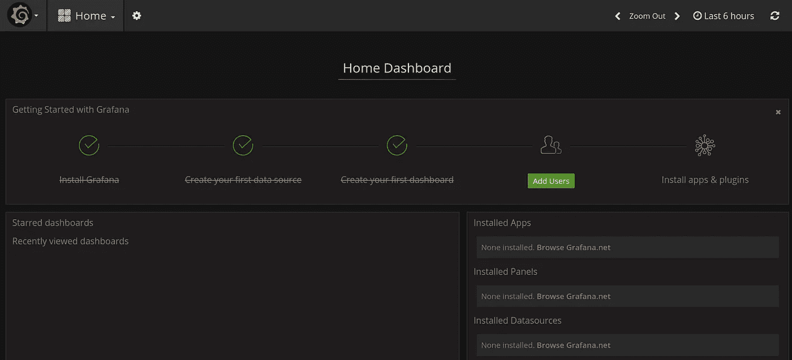

# MacOS 上的 MicroK8s

> 原文：<https://itnext.io/microk8s-on-macos-98f1de3aa63e?source=collection_archive---------0----------------------->


[MicroK8s](https://microk8s.io/) 是 Kubernetes 的本地部署。让我们跳过所有的技术细节，只接受 Kubernetes 不能在 MacOS 或 Windows 上运行。你可能会想“我见过 Kubernetes 在 MacOS 笔记本电脑上运行，那是什么样的魔法？”很简单，Kubernetes 运行在一个虚拟机中。您可能看不到虚拟机，或者它甚至可能不是一个成熟的虚拟系统，但某种程度的虚拟化是存在的。这正是我们将在这里展示的。我们将设置一个虚拟机，并在其中安装 MicroK8s。安装完成后，我们将讨论如何使用 in-VM-Kubernetes。

# MacOS 上的多路虚拟机

可以说，在 MacOS 上获得 Ubuntu VM 最简单的方法是 multipass。前往[发布页面](https://github.com/CanonicalLtd/multipass/releases)获取最新包。安装它就像双击。pkg 文件。

要使用 MicroK8s 启动虚拟机，我们需要:

```
multipass launch --name microk8s-vm --mem 4G --disk 40G
multipass exec microk8s-vm -- sudo snap install microk8s --classic
multipass exec microk8s-vm -- sudo iptables -P FORWARD ACCEPT
```

请确保您预留了足够的资源来承载您的部署；上面我们得到了 RAM 的`4GB`和硬盘的`40GB`。我们还确保去往/来自 pod 网络接口的数据包可以被转发到/来自默认接口。

我们的虚拟机有一个 IP 地址，您可以使用它进行检查:

```
> multipass list
Name                    State             IPv4             Release
microk8s-vm             Running           10.141.241.164   Ubuntu 18.04 LTS
```

请记下此 IP，因为我们的服务将在那里提供。

您可能会发现其他方便的多通道命令:

*   在虚拟机内部获得一个 shell:

```
multipass shell microk8s-vm
```

*   关闭虚拟机:

```
multipass stop microk8s-vm
```

*   删除并清理虚拟机:

```
multipass delete microk8s-vm 
multipass purge
```

# 使用 MicroK8s

要在虚拟机中运行一个命令，我们可以使用以下命令获得一个多通道 shell:

```
multipass shell microk8s-vm
```

要执行命令而不获取 shell，我们可以像这样使用`multipass exec`:

```
multipass exec microk8s-vm -- sudo /snap/bin/microk8s.status
```

与 MicroK8s 交互的第三种方式是通过 Kubernetes API 服务器监听 VM 的端口 16443。我们可以使用 microk8s' `kubeconfig`文件和本地[安装的 kubectl](https://kubernetes.io/docs/tasks/tools/install-kubectl/) 来访问 in-VM-kubernetes。以下是方法:

```
multipass exec microk8s-vm -- sudo /snap/bin/microk8s.config > kubeconfig
```

在主机上安装 kubectl，然后使用`kubeconfig`:

```
kubectl --kubeconfig=kubeconfig get all --all-namespaces
```

## 访问虚拟机内服务—启用附加组件

让我们首先启用 dns 和仪表板。在本博客的其余部分，我们将展示访问 Grafana 的不同方法:

```
multipass exec microk8s-vm -- sudo /snap/bin/microk8s.enable dns dashboard
```

我们通过以下方式检查部署进度:

```
> multipass exec microk8s-vm -- sudo /snap/bin/microk8s.kubectl get all --all-namespaces
```

所有服务运行后，我们可以继续查看如何访问控制面板。



我们仪表板上的涂鸦

## 访问虚拟机内服务—使用 Kubernetes API 代理

API 服务器位于我们虚拟机的端口 16443 上。让我们看看代理路径是什么样子的:

```
> multipass exec microk8s-vm -- sudo /snap/bin/microk8s.kubectl cluster-info
...Grafana is running at [https://127.0.0.1:16443/api/v1/namespaces/kube-system/services/monitoring-grafana/proxy](https://127.0.0.1:16443/api/v1/namespaces/kube-system/services/monitoring-grafana/proxy)...
```

通过将`127.0.0.1`替换为虚拟机的 IP，在本例中为`10.141.241.164`，我们可以在:

```
[http://](http://10.141.241.164:8080/api/v1/namespaces/kube-system/services/monitoring-grafana/proxy)[10.141.241.164](http://10.141.241.164:8080/api/v1/namespaces/kube-system/services/monitoring-grafana/proxy)[:16443/api/v1/namespaces/kube-system/services/monitoring-grafana/proxy](http://10.141.241.164:8080/api/v1/namespaces/kube-system/services/monitoring-grafana/proxy)
```

您将被要求输入显示在底部的用户名和密码:

```
> multipass exec microk8s-vm -- sudo /snap/bin/microk8s.config
```

## 访问虚拟机内服务—设置代理

与我们上面所做的非常相似，我们可以要求 Kubernetes 为我们创建一个代理。

```
> kubectl --kubeconfig=kubeconfig proxy
Starting to serve on 127.0.0.1:8001
```

让代理打开终端。

在第二个终端上，使用以下命令获取正在运行的服务的代理端点:

```
> kubectl --kubeconfig=kubeconfig cluster-info
```

我们通过用`127.0.0.1`替换虚拟机的 IP 和从`https`到`http`的协议来实现代理。仪表板位于:

```
[http://127.0.0.1:8001/api/v1/namespaces/kube-system/services/monitoring-grafana/proxy/?orgId=1](http://127.0.0.1:8001/api/v1/namespaces/kube-system/services/monitoring-grafana/proxy/?orgId=1)
```

你可以在[官方文档中读到更多关于构造代理路径](https://kubernetes.io/docs/tasks/access-application-cluster/access-cluster/#manually-constructing-apiserver-proxy-urls)的内容。

## 访问虚拟机内服务—使用节点端口服务

我们可以在虚拟机的一个端口中公开我们的服务，并从那里访问它。这种方法使用节点端口服务类型。我们首先确定我们想要公开的部署:

```
> multipass exec microk8s-vm -- sudo /snap/bin/microk8s.kubectl get deployment -n kube-system  | grep grafana
monitoring-influxdb-grafana-v4   1         1         1            1           22h
```

然后，我们创建节点端口服务:

```
multipass exec microk8s-vm -- sudo /snap/bin/microk8s.kubectl expose deployment.apps/monitoring-influxdb-grafana-v4 -n kube-system --type=NodePort
```

我们现在有一个用于 Grafana 服务的端口:

```
> multipass exec microk8s-vm -- sudo /snap/bin/microk8s.kubectl get services -n kube-system  | grep NodePort
monitoring-influxdb-grafana-v4   NodePort    10.152.183.84   <none>        8083:32580/TCP,8086:32152/TCP,3000:32720/TCP   13m
```

格拉夫纳在这里映射到`32720`的`3000`端口上。此端口是随机选择的，因此可能会因您而异。在我们的例子中，服务在`10.141.241.164:32720`上可用，即 multipass microk8s-vm IP 和映射到 port grafana 的`3000`端口的随机端口。

# 结论

MacOS(或 Windows)上的 MicroK8s 将需要一个 VM 来运行。这与任何其他当地的 Kubernetes 解决方案没有什么不同，它有一些很好的好处。虚拟机为您提供了额外的隔离层。你可以完全控制其他人可以看到什么，而不是使用你的主机并可能向外界公开 Kubernetes 服务。当然，这种隔离会带来一些额外的管理开销，这可能不适用于开发环境。试一试，然后[告诉我们](https://microk8s.io/)你的想法！

# 链接

*   微 k8s:[https://microk8s.io/](https://microk8s.io/)
*   安装库贝克特尔:[https://kubernetes.io/docs/tasks/tools/install-kubectl/](https://kubernetes.io/docs/tasks/tools/install-kubectl/)
*   MacOS 上的 multipass:[https://discourse . Ubuntu . com/t/multipass-now-available-for-MAC OS/6824](https://discourse.ubuntu.com/t/multipass-now-available-for-macos/6824)
*   Kubernetes 上的服务访问选项:[https://Kubernetes . io/docs/tasks/access-application-cluster/access-cluster/# manually-constructing-API server-proxy-URLs](https://kubernetes.io/docs/tasks/access-application-cluster/access-cluster/#manually-constructing-apiserver-proxy-urls)

[](https://github.com/CanonicalLtd/multipass/releases) [## 标准 TD/多遍

### 多路编排虚拟 Ubuntu 实例。通过创建一个…

github.com](https://github.com/CanonicalLtd/multipass/releases)