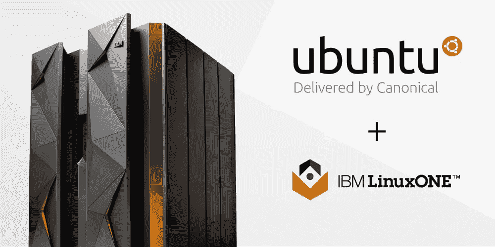
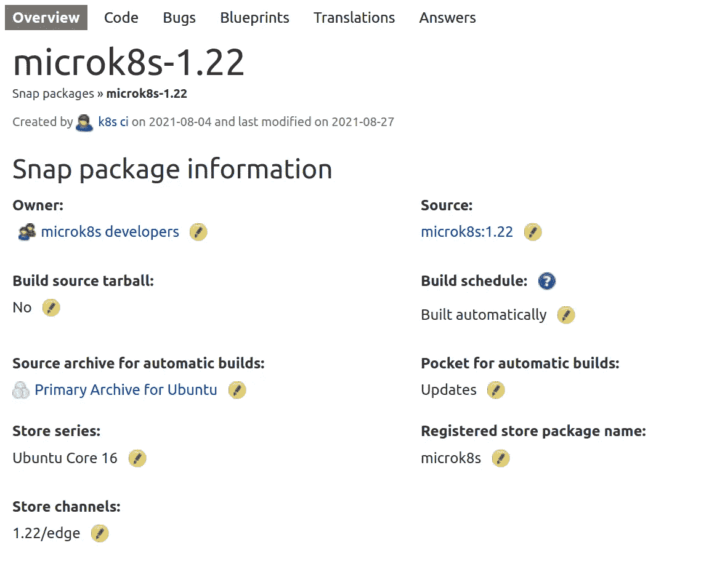
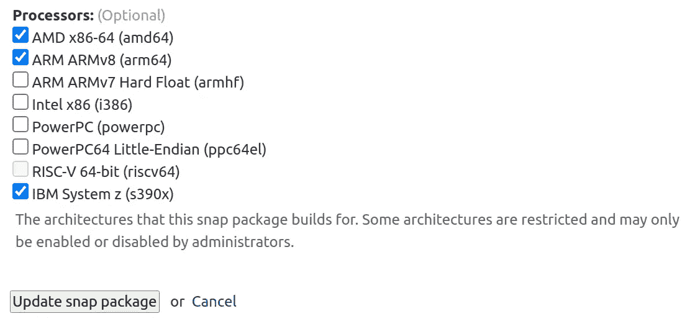

# S390x 上的 MicroK8s！

> 原文：<https://itnext.io/microk8s-on-s390x-93aed164d467?source=collection_archive---------3----------------------->

s390x 或 IBM Z 是由 IBM 的天才们带给我们的奇异(至少对我来说)架构之一。

尽情欣赏那些您在自己的家庭实验室里永远也不会拥有的华丽的 IBM 大型机:)

IBM Z 大型机是那些不适合你的巨型机器。不要心疼，它们甚至超过了小公司的需求。所以你可能会问“MicroK8s 和这种不那么微型的机器有什么关系”？嗯，MicroK8s 正在增长生产级功能，s390x 就是其中之一。此外，在快照上支持新的体系结构非常简单！让我们看看怎么做。

## 为什么 s390x 易于支持？

MicroK8s [代码存在于 github](https://github.com/ubuntu/microk8s) (就像普通的 youtuber 所说的“喜欢并订阅”)上，并被镜像到 launchpad 的[中。这就是奇迹发生的地方！在 launchpad 中，您可以要求 launchpad builders 构建您的快照并将其推送到频道/轨道。对于 MikroK8s，从 v1.22 到 v1.10 的每一个 Kubernetes 版本都有一个这样的构建器。以下是 1.22 snap builder 的配置方式，以便它自动组装 MicroK8s snap 部件，并将它们放入 1.22/edge 通道:](https://launchpad.net/microk8s)

microk8s-1.22 snap builder 配方。

最激动人心的部分出现在您单击此快照生成器上的编辑按钮时:

所有的建筑只需点击一下鼠标。

是的，你答对了。这些都是您可以为其构建快照的体系结构；只需勾选复选框！您的 snap 可以支持常见的*x86–64*和 *ARM* 以及 *IBM 的 s390x* 和 *PowerPC* 。我迫不及待地想要得到一个 RISC-V 版本。

# 周末项目！

不要再浪费时间了。把你的软件放在弹指间，驶向“巨大的机会之海”。

***尽情享受！***

# 链接

 [## GitHub-Ubuntu/micro k8s:micro k8s 是一个小型、快速、单包的 Kubernetes，面向开发者、IoT…

### 单包完全兼容的轻量级 Kubernetes，可在 42 种风格的 Linux 上运行。完美适用于:典范力量…

github.com](https://github.com/ubuntu/microk8s)  [## 构建选项| Snapcraft 文档

### 默认情况下，Snapcraft 使用 Multipass 来简化构建过程，并将构建环境限制在一个…

snapcraft.io](https://snapcraft.io/docs/build-options)  [## IBM Z - Wikipedia 上的 Linux

### IBM Z 上的 Linux(或简称为 Z 上的 Linux，以前称为 Z 系统上的 Linux)是 Linux……

en.wikipedia.org](https://en.wikipedia.org/wiki/Linux_on_IBM_Z)