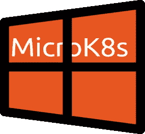

# Windows 上的 MicroK8s，规范的方式

> 原文：<https://itnext.io/microk8s-on-windows-the-canonical-way-ed15fd4e5476?source=collection_archive---------3----------------------->

MicroK8s 是一个紧凑的 Kubernetes 发行版，它将在你的 PC 上安装一个完整的单节点 Kubernetes 集群。这对于地方发展、CI/CD 和资源可能有限的边缘来说是非常好的。

安装 MicroK8s 非常简单:

```
sudo snap install microk8s --classic 
```

# 在 Windows 机器上

MicroK8s 和 Kubernetes 需要一个 Linux 内核才能运行。目前，实现这一点的方法是在虚拟机(VM)中运行 MicroK8s。



在 Windows 上获得 VM 的标准方法是使用 [multipass](https://multipass.run/) 。Multipass 为您提供了一个易于使用的界面来管理 Windows、MacOS 和 Linux 上的虚拟机。您可以选择在 Windows Pro 和 Enterprise 上使用 HyperV 创建虚拟机，也可以利用本地安装的 VirtualBox。

这是你必须做的:

*   转到[https://github.com/CanonicalLtd/multipass/releases/](https://github.com/CanonicalLtd/multipass/releases/)并抓取 windows 可执行文件。
*   打开命令提示符或 PowerShell 并运行

```
multipass launch ubuntu -n microk8s-vm -mem 4G -disk 40G
```

在上面，我们将虚拟机命名为`microk8s-vm`，并给它分配 RAM 的`4GB`和磁盘的`40GB`。

你可以在这里阅读更多关于 multipass 安装和 VM 创建过程[的内容。](https://discourse.ubuntu.com/t/installing-multipass-for-windows/9547)

# 在虚拟机中获取 MicroK8s

安装 MicroK8s 非常简单:

```
multipass exec microk8s-vm - sudo snap install microk8s -classic
multipass exec microk8s-vm - sudo iptables -P FORWARD ACCEPT
```

# 从这里去哪里？

在我们之前的博客[中，我们展示了如何管理 VM 和托管的 MicroK8s，所以这是开始熟悉这个设置的好地方。](/microk8s-on-macos-98f1de3aa63e)

你可能会在[官方文档](https://microk8s.io/docs/)中找到关于 MicroK8s 的有趣信息。

最后，看看 Canonical Ltd .提供的[生产级产品。我很高兴看到 Canonical 的承诺。生产级 K8s 分发版(CDK)在内部和/或公共云中运行。包括 MicroK8s 在内的所有产品都包含在一个简化、一致的支持合同中。](https://www.ubuntu.com/kubernetes)

# 链接

*   micro k8s[https://microk8s.io/](https://microk8s.io/)
*   多通[https://multipass.run/](https://multipass.run/)
*   https://www.ubuntu.com/kubernetes[Canonical](https://www.ubuntu.com/kubernetes)生产 Kubernetes