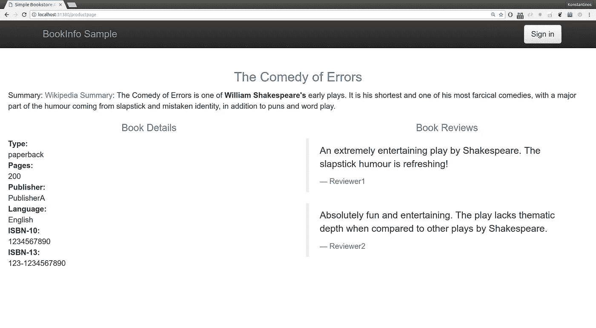
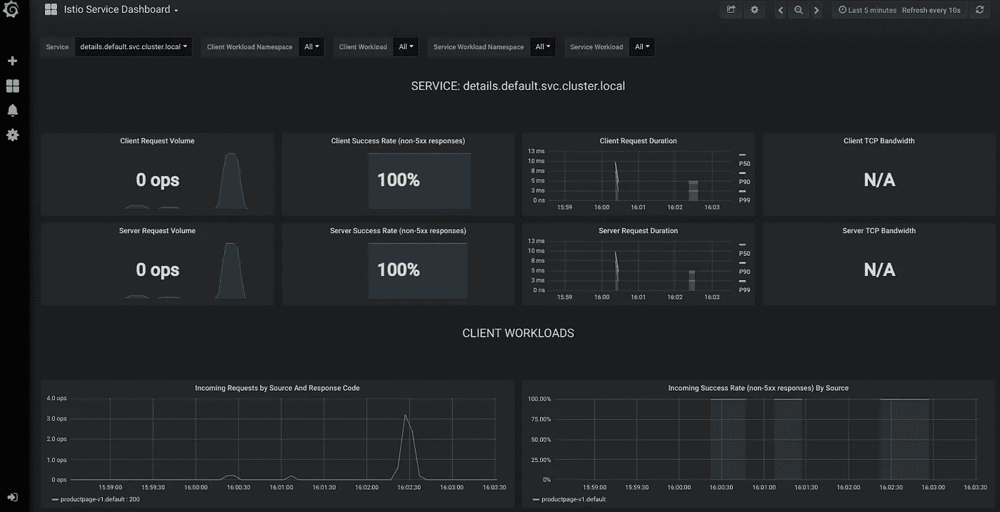
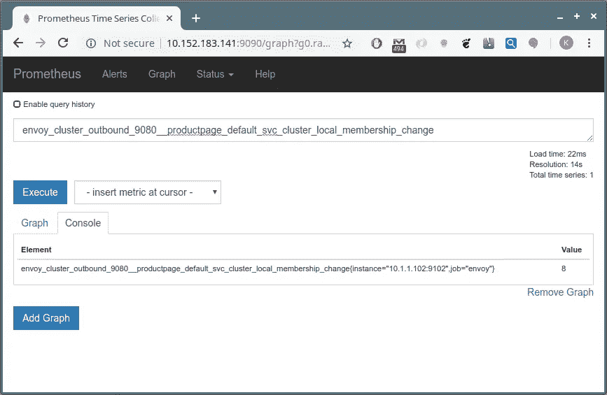
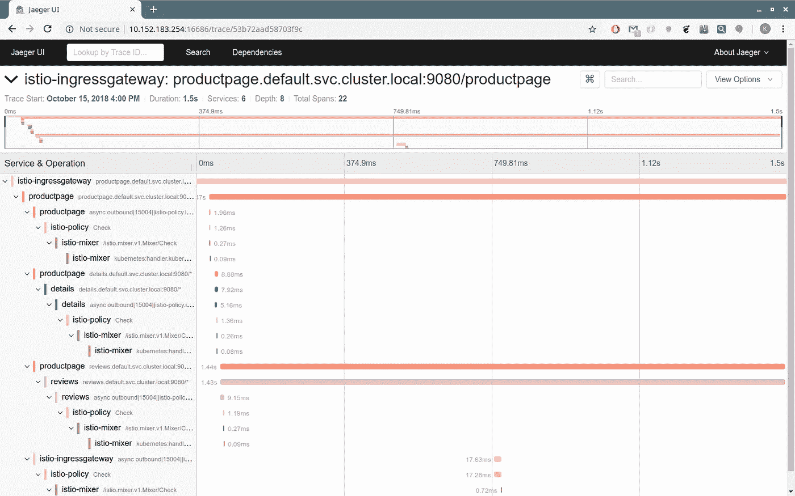
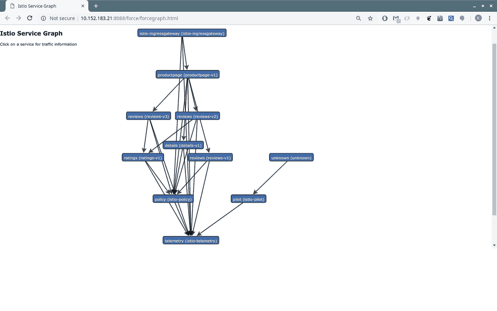

# Microk8s 竖起桅杆，扬帆远航

> 原文：<https://itnext.io/microk8s-puts-up-its-istio-and-sails-away-104c5a16c3c2?source=collection_archive---------0----------------------->

作为企业级软件，Istio 几乎会立刻给你留下深刻印象。与其说是因为它引入了复杂性，不如说是因为它为您的服务网格增加了一些功能。必备功能打包在一个连贯的框架中:


*   交通管理
*   安全策略
*   遥感勘测
*   性能调整

由于 microk8s 将自己定位为本地 Kubernetes 集群开发人员的原型，所以毫不奇怪 Istio 的部署变得非常简单。让我们从 microk8s 部署本身开始:

```
> sudo snap install microk8s --classic
```

Istio 部署可用于:

```
> microk8s.enable istio
```

现在我们需要回答一个问题。我们是否希望[在边车](https://istio.io/docs/concepts/security/#mutual-tls-authentication)之间实施相互 TLS 认证？Istio 为您的服务放置一个代理，以便控制路由、安全等。如果我们知道我们有一个非 Istio 和 Istio 支持服务的混合部署，我们宁愿不实施相互 TLS:

```
> microk8s.enable istio
Enabling Istio
Enabling DNS
Applying manifest
service/kube-dns created
serviceaccount/kube-dns created
configmap/kube-dns created
deployment.extensions/kube-dns created
Restarting kubelet
DNS is enabled
Enforce mutual TLS authentication ([https://bit.ly/2KB4j04](https://bit.ly/2KB4j04)) between sidecars? If unsure, choose N. (y/N): y
```

信不信由你，我们已经完成了，Istio v1.0 服务正在建立，您可以通过以下方式检查部署进度:

```
> watch microk8s.kubectl get all --all-namespaces
```

为了您的方便，我们将`istioctl`打包在 microk8s 中:

```
> microk8s.istioctl get all --all-namespaces
NAME                          KIND                                      NAMESPACE      AGE
grafana-ports-mtls-disabled   Policy.authentication.istio.io.v1alpha1   istio-system   2mDESTINATION-RULE NAME   HOST                                             SUBSETS   NAMESPACE      AGE
istio-policy            istio-policy.istio-system.svc.cluster.local                istio-system   3m
istio-telemetry         istio-telemetry.istio-system.svc.cluster.local             istio-system   3mGATEWAY NAME                      HOSTS     NAMESPACE      AGE
istio-autogenerated-k8s-ingress   *         istio-system   3m
```

不要被服务和部署的数量吓到，一切都在`istio-system`名称空间之下。我们准备开始探索了！

# 演示时间！

Istio 需要在你的部署舱中加入边车。在 microk8s 中，支持自动注入，所以您唯一需要做的就是用`istion-injection=enabled`标记您将要使用的名称空间:

```
> microk8s.kubectl label namespace default istio-injection=enabled
```

现在让我们从 1.0 Istio 版本中抓取`bookinfo`示例并应用它:

```
> wget [https://raw.githubusercontent.com/istio/istio/release-1.0/samples/bookinfo/platform/kube/bookinfo.yaml](https://raw.githubusercontent.com/istio/istio/release-1.0/samples/bookinfo/platform/kube/bookinfo.yaml)
> microk8s.kubectl create -f bookinfo.yaml
```

以下服务将很快推出:

```
> microk8s.kubectl get svc
NAME          TYPE        CLUSTER-IP       EXTERNAL-IP   PORT(S)    details       ClusterIP   10.152.183.33    <none>        9080/TCP   kubernetes    ClusterIP   10.152.183.1     <none>        443/TCP    productpage   ClusterIP   10.152.183.59    <none>        9080/TCP   ratings       ClusterIP   10.152.183.124   <none>        9080/TCP   reviews       ClusterIP   10.152.183.9     <none>        9080/TCP
```

我们可以使用他们拥有的集群 IP 来访问服务；例如，我们可以通过将浏览器指向`10.152.183.59:9080`来访问上面示例中的`productpage`。但是让我们按照规则来玩，并且[遵循关于通过节点端口公开服务的官方说明](https://istio.io/docs/examples/bookinfo/#determining-the-ingress-ip-and-port):

```
> wget [https://raw.githubusercontent.com/istio/istio/release-1.0/samples/bookinfo/networking/bookinfo-gateway.yaml](https://raw.githubusercontent.com/istio/istio/release-1.0/samples/bookinfo/networking/bookinfo-gateway.yaml)
> microk8s.kubectl create -f bookinfo-gateway.yaml
```

为了通过入口到达`productpage`,我们无耻地复制了示例指令:

```
> microk8s.kubectl -n istio-system get service istio-ingressgateway -o jsonpath='{.spec.ports[?(@.name=="http2")].nodePort}'
31380
```

我们的节点是本地主机，因此我们可以将浏览器指向[http://localhost:31380/product page](http://localhost:31380/productpage)



# 给我看一些图表！

当然，在博客文章中，图表看起来很漂亮，所以，给你。



格拉夫纳服务

您需要获取 Grafana 服务的集群 IP:

```
microk8s.kubectl -n istio-system get svc grafana
```

普罗米修斯也可用同样的方式。

```
microk8s.kubectl -n istio-system get svc prometheus
```



普罗米修斯服务

对于痕迹，您需要查看`jaeger-query`。

```
microk8s.kubectl -n istio-system get service/jaeger-query
```



耶格服务

servicegraph 端点可用于:

```
microk8s.kubectl -n istio-system get svc servicegraph
```



服务图表

我应该就此打住。请访问 [Istio 文档](https://istio.io/docs/)了解更多关于如何利用 Istio 所提供服务的详细信息。

# 这篇文章要保留什么

*   Istio 有很大的价值。这是一个为企业准备 Kubernetes 的框架。
*   Microk8s 可以让你快速启动运行。[写信给我们](https://github.com/ubuntu/microk8s/issues)告诉我们你想看到的改进。
*   不要害怕失败。一艘沉船可能比一艘帆船更有价值。

# 参考

 [## microk8s —本地上游 kubernetes

### 在您的机器上安装一个本地 upstream @kubernetes 集群来玩、测试和开发…

microk8s.io](https://microk8s.io/) [](https://istio.io/) [## 伊斯迪奥

### 连接、保护、控制和观察服务。

istio.io](https://istio.io/)