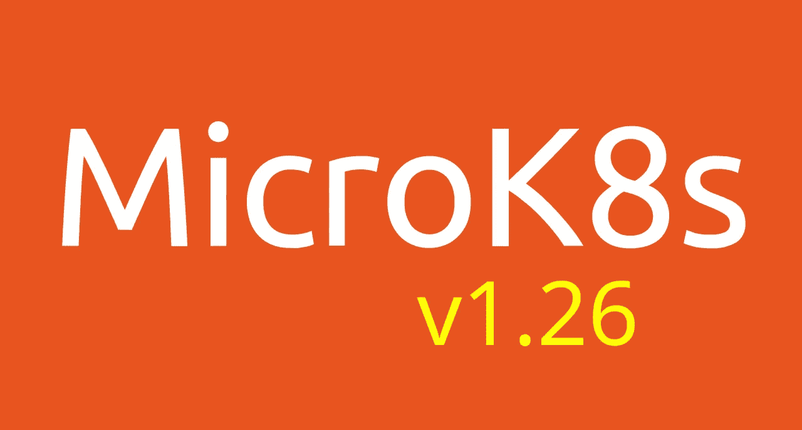

# MicroK8s v1.26 出来了！

> 原文：<https://itnext.io/microk8s-v1-26-is-out-e9cda567844e?source=collection_archive---------2----------------------->

[MicroK8s](https://microk8s.io/) 为您带来了[最新的 Kubernetes](https://kubernetes.io/blog/2022/12/09/kubernetes-v1-26-release/) 版本，它是一个易于安装和维护的软件包。什么是 MicroK8s？MicroK8s 是一个小型、快速、安全、经过认证的 Kubernetes 发行版，几乎可以安装在任何 Linux 机器上。它提供了 Kubernetes 核心组件的功能，占地面积小，可从单个节点扩展到高可用性生产多节点集群。它意味着用于离线开发，原型，测试，CI/CD。



要开始使用:

```
sudo snap install microk8s --classic --channel=1.26
```

您期望从 Kubernetes 集群获得的一切都随 MicroK8s 一起提供:

```
# enable dns
sudo microk8s enable dns
# enable ingress and storage
sudo microk8s enable ingress
sudo microk8s enable hostpath-storage
```

`kubectl`和`helm`也被封装:

```
sudo microk8s kubectl get all -A
sudo microk8s helm version
```

如果你想组建一个多节点 HA 集群或者有自己的一套`microk8s enable/disable`命令(称为插件)，请看一下[官方文档](https://microk8s.io/docs)。

# 在过去的 4 个月里，是什么让我们忙碌？

自上一版本以来所有主要更新的详细列表可以在发布公告中找到[。以下是亮点。](https://github.com/canonical/microk8s/releases/tag/v1.26)

## 合作伙伴和社区插件

很高兴与生态系统密切合作，并将以下插件纳入社区报告:

*   [ondat](https://www.ondat.io/) :大规模运行有状态工作负载。
*   [sosivio](https://sosiv.io/) :让下一代 Kubernetes 安全变得简单。
*   [gopaddle](https://gopaddle.io/) :在很短的时间内调配多云集群、对接应用、部署、监控和构建 DevOps 管道。
*   [KWasm](https://kwasm.sh/) :云原生 WebAssembly 的工具。

## 核心插件

作为 Canonical 维护的插件的一部分， [MinIO](https://min.io/) 通过提供高性能、S3 兼容的对象存储扩展了我们的核心插件生态系统。

## 集群 API 支持

[用于 AMD64 和 ARM64 的 MicroK8s 引导和控制平面 CAPI 提供商](https://cluster-api.sigs.k8s.io/reference/providers.html)。看看[集群 API 部署说明](https://github.com/canonical/cluster-api-bootstrap-provider-microk8s/blob/main/README.md)如何轻松获得任何 Kubernetes 版本的集群。

## EKS D

[EKS-D](https://aws.amazon.com/blogs/opensource/introducing-amazon-eks-distro/) 是一个 Kubernetes 发行版，由亚马逊弹性 Kubernetes 服务(EKS)使用，具有扩展支持。引入了新的跟踪以适应所有 EKS-D 版本:1.22、1.23 和 1.24。例如，获得 1.24 版本，包括:

```
snap install microk8s --classic --channel=1.24-eksd/stable
```

EKS-D 轨道捆绑了 EKS 发行版的额外补丁以及各种存储和认证插件，提供了与 EKS 类似的体验，并具有 MicroK8s 的所有附加优势。

# 一如既往，一个大大的“谢谢”

致我们的贡献者:

*   [@dalbani](https://github.com/dalbani) ，用于帮助升级 containerd
*   [@oscr](https://github.com/oscr) ，关于我们的集群 API 提供者的代码改进
*   [@doggy808](https://github.com/doggy8088) ，用于修复 Windows 和 macOS 上的 dashboard-proxy 命令
*   [@barrettj12](https://github.com/barrettj12) ，用于改善“microk8s”组的管理
*   [@ortegarenzy](https://github.com/ortegarenzy) ，感谢他在库伯莱代币搜索中的表现
*   [@zacbayhan](https://github.com/zacbayhan) ，用于将 OpenEBS 插件更新到 3.3.x
*   [@MrRoundRobin](https://github.com/MrRoundRobin) ，用于改进多节点集群的可观测性
*   [@dud225](https://github.com/dud225) ，让 K8s 服务提醒在 observability 插件中工作
*   [@plomosits](https://github.com/plomosits) ，用于改进调度器和控制器普罗米修斯刮
*   [@naqvis](https://github.com/naqvis) ，用于将 osm-edge 插件升级到 1.1.2 版，并引入一个新命令`microk8s osm`
*   [@AnaisUrlichs](https://github.com/AnaisUrlichs) ，用于将右舷 addon 重命名为 Trivy
*   [@renugadevi-2613](https://github.com/renugadevi-2613) ，感谢贡献 gopaddle 插件
*   [@hubvu](https://github.com/hubvu) ，感谢贡献 ondat 插件
*   [@0xE282B0](https://github.com/0xE282B0) ，感谢给我们 KWASM.sh 插件
*   [@DanArlowski](https://github.com/DanArlowski) 和 sosivio 团队，对于各自的插件
*   [@Azuna1](https://github.com/Azuna1) ，用于将 istio 升级到 v1.15.3

# 了解更多信息，并来见我们

有关 MicroK8s 的更多信息，请查阅官方[文档](https://microk8s.io/docs/)，并为该项目做出贡献，请访问 [GitHub 查看 repo——canonical/micro k8s:micro k8s 是一款面向开发人员、物联网和 edge 的小型、快速、单包 Kubernetes。](https://github.com/ubuntu/microk8s)，或者在 [Kubernetes Slack](http://slack.kubernetes.io/) ，在 [**#microk8s**](https://discuss.kubernetes.io/tag/microk8s) 频道跟我们聊天！