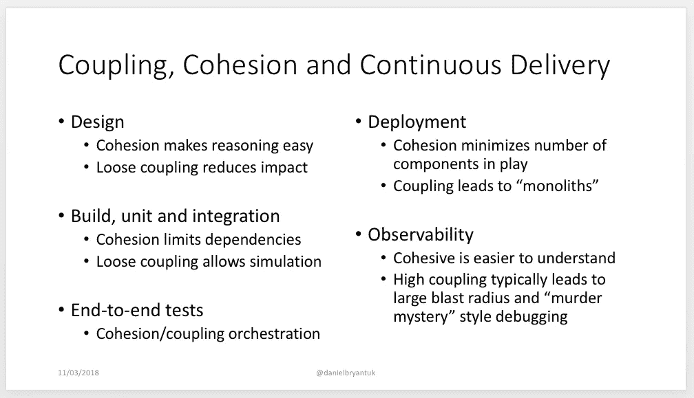
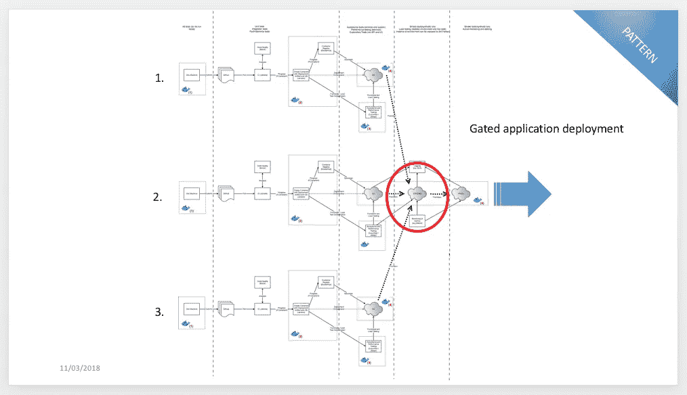
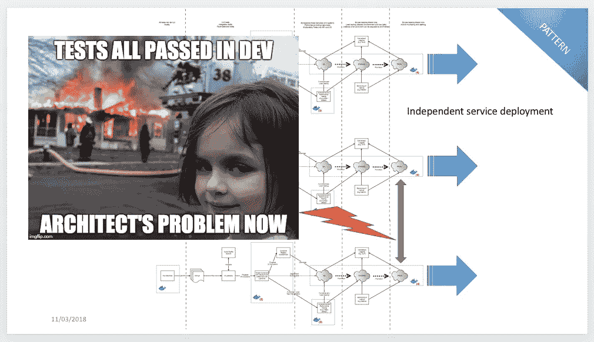
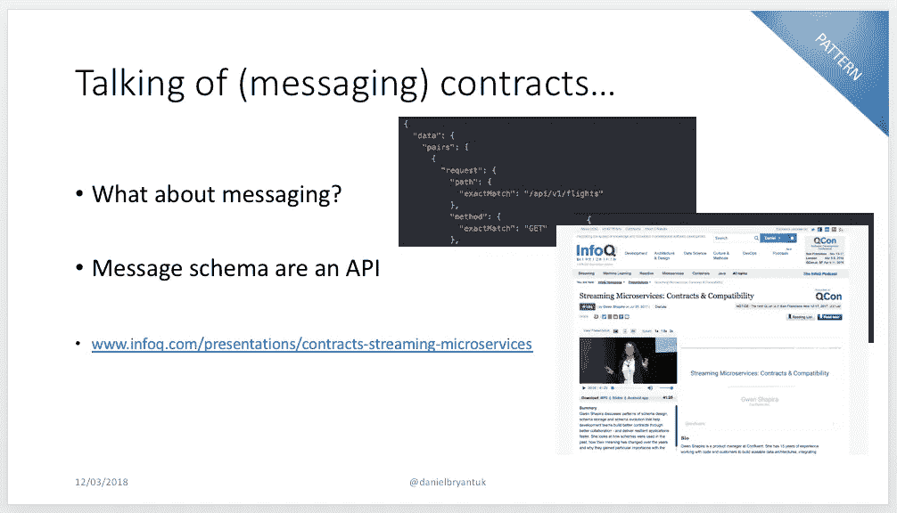
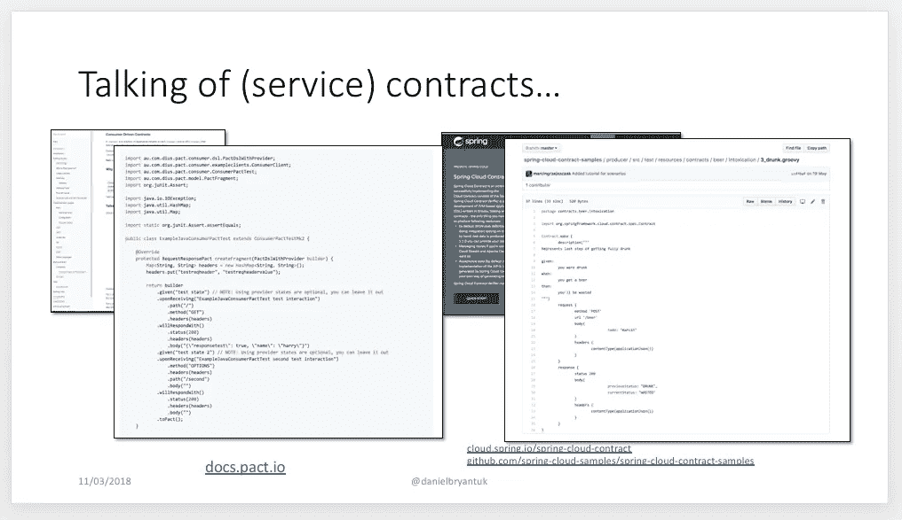
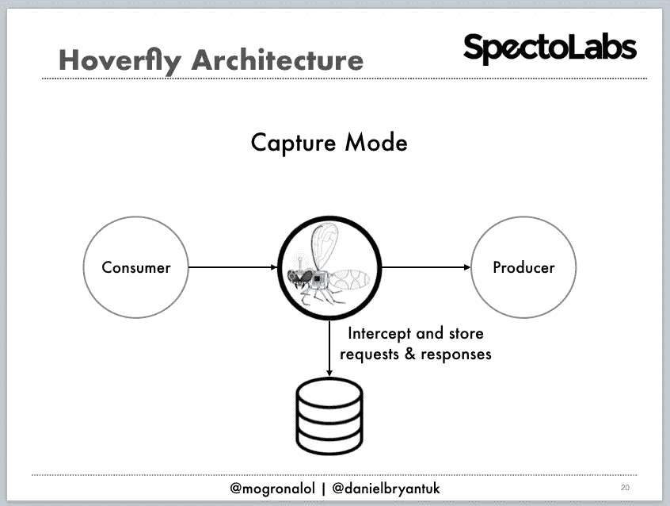
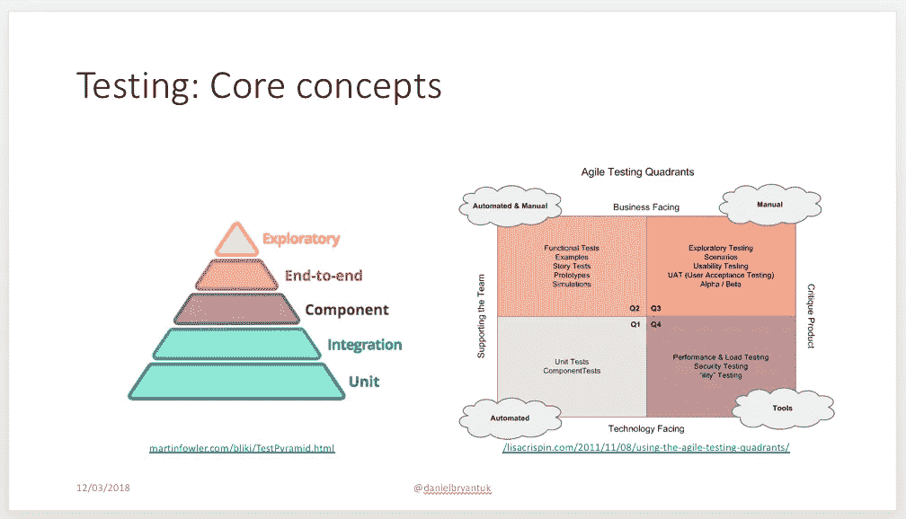

# 微服务测试:耦合和内聚(一路向下)

> 原文：<https://itnext.io/microservice-testing-coupling-and-cohesion-all-the-way-down-a9f100cda523?source=collection_archive---------4----------------------->

在过去的几个月里，Andrew Morgan 和我一直在教授几个关于微服务测试的研讨会，最引人注目的是今年早些时候在 T2 奥赖利沙康和 T4 伦敦 QCon。这总是很有趣——我们喜欢分享我们的知识，我们通常会学到很多东西，并且我们还可以一瞥许多参与者的测试方法。

测试微服务项目的“最佳实践”在很大程度上仍然是一个不断发展的领域——我目前的主要材料包括[托比·克莱姆森 2014 年的优秀作品](https://martinfowler.com/articles/microservice-testing/)(以及更新后的由哈姆·沃克撰写的“[实用测试金字塔](https://martinfowler.com/articles/practical-test-pyramid.html)”)，还有[辛迪·斯里达哈兰的](https://twitter.com/copyconstruct)更现代的关于“[测试微服务的文章,](https://medium.com/@copyconstruct/testing-microservices-the-sane-way-9bb31d158c16)以及[我自己的尝试](https://specto.io/blog/2016/8/16/recipe-for-designing-building-testing-microservices/)——但我开始明白了这通常是一件好事，因为围绕实践边缘的[反模式](https://skillsmatter.com/skillscasts/5722-the-seven-deadly-sins-of-microservices)的形成有时可以表明一种方法的整体成熟。这篇文章包含了我对测试基于微服务的应用程序的最新高水平思考。

**TL；博士**

*   设计微服务时考虑耦合和内聚(是啊是啊，我知道，但我是说真的**考虑一下这个，甚至做一些[前期设计](http://www.codingthearchitecture.com/2017/10/11/evolutionary_design_still_requires_up_front_thinking.html)！).**
*   **注意各种类型的“独石”渗入系统的设计和操作中——不止一种独石方法！**
*   **避免过度依赖“单一的”端到端测试。**
*   **使用契约——通过像 gRPC 和 Avro 这样的 IDL，或者像 Pact 和 Spring Cloud Contract 这样的 CDC 工具——来定义和测试服务间集成。**
*   **适当使用模仿、存根和虚拟化/模拟来隔离内部服务测试。**
*   **测试时避免平台/基础设施过度耦合——如果您的基础设施测试设置对于本地测试来说看起来太复杂，那么它很可能就是如此。**
*   **分类并定义每个测试类别的目的——单元、集成、组件、e2e 等——并确保不仅在组内，而且在实施过程中的一致性(和单一的变更理由)。**

# **建筑耦合与衔接**

**我相信你以前已经听说过这些——也许是在大学里，也许是从一本书上，或者也许是在当地的聚会上——但是每个人都“知道”在一般情况下你应该努力构建松散耦合和高度内聚的系统。我不会谈论太多，因为其他人像马丁·福勒、T2、罗伯特·马丁、T4、西蒙·布朗和其他许多人已经谈论这个话题很多年了。然而，快速提醒一下核心概念不会有什么坏处:**

*   **[耦合](https://en.wikipedia.org/wiki/Coupling_(computer_programming)):组件了解其他组件的程度。想想定义良好的接口、控制反转等**
*   **[内聚](https://en.wikipedia.org/wiki/Cohesion_(computer_science)):一个组件内的元素属于一起的程度。考虑单一责任原则和单一改变原因**

**我在纽约奥赖利·萨肯的[会议上谈到了这些特性如何在持续交付周期的每个阶段发挥作用:](https://www.slideshare.net/dbryant_uk/oreilly-sacon-ny-2018-continuous-delivery-patterns-for-contemporary-architecture)**

****

**因此，在这篇文章的剩余部分，我将假定我们都同意这些属性有利于为我们构建的软件系统创建良好的[演进架构](https://www.thoughtworks.com/books/building-evolutionary-architectures)——毕竟，这种快速和安全地演进我们的应用程序的能力是接受微服务架构风格作为构建许多([但不是所有](http://basho.com/posts/technical/microservices-please-dont/))现代软件系统的当前“最佳实践”风格的核心。**

**我认为有趣的是，这种松散耦合和高内聚的“海龟一路向下”的心态可以应用于我们的目标、实践和工具——特别是在测试方面。**

# **测试耦合和内聚力**

**在使用微服务模式设计系统时，创建一个[分布式整体](http://www.codingthearchitecture.com/2014/07/06/distributed_big_balls_of_mud.html)是非常容易的——我知道，我曾经这样做过——但是也很容易让整体溜进其他地方。我的朋友[马修·斯凯尔顿](https://twitter.com/matthewpskelton)发表了一系列精彩的演讲，讲述了可以融入项目的“[软件巨块](https://www.slideshare.net/SkeltonThatcher/teams-and-monoliths-matthew-skelton-london-devops-june-2017/34)”的类型:**

*   **应用整体**
*   **加入了 DB**
*   **整体构建(重建一切)**
*   **整体释放(耦合)**
*   **整体思维(标准化)**

**我将“站在巨人的肩膀上”，并建议第六种类型的整体可能是“测试整体”(有点类似于马修定义的整体构建和发布类型)。老实说，我并不只是站在马修的肩膀上，因为同为伦敦人的 CD 大师[史蒂夫·史密斯](https://twitter.com/SteveSmithCD)已经表示，他认为“[端到端测试被认为是有害的](https://www.continuousdeliveryconsulting.com/blog/end-to-end-testing-considered-harmful/)”。从本质上来说，史蒂夫建议的是(整体地)把一切都旋转起来，以验证系统有一堆问题，尤其是“分解谬误”和“廉价投资谬误”。我认为，测试基于微服务的应用程序的挑战可能比这更阴险。**

## **高耦合微服务测试**

**很多人(所有人)的终极目标？)基于微服务的应用是每个服务的独立可部署性。如果做得正确，这可以提高部署的速度，并相应地提高系统发展的速度。然而，我们中的许多人都必须从某个地方开始，因此我们通常从门控微服务部署开始——隔离设计和构建我们的微服务(最好是与跨职能团队一起),并在发布到生产环境之前在试运行环境中一起验证我们的所有服务。这不是一个特别糟糕的模式，但它并没有提供多少独立的进化速度:**

****

**许多团队成功地实现了这种模式，然后试图走向独立部署。唯一的障碍是，至少有一些服务是相互依赖的——可能是通过 RPC API 调用或消息有效负载契约。如果团队忘记了这一点，那么他们通常会在测试期间成功地在本地验证一切，但是服务(和应用程序)可能会在生产中失败。在 SACON，我拿这个(以及我作为“微服务架构师”所扮演的角色)开玩笑:**

****

**根据我的经验(轶事),开发人员和架构师在能够促进跨域边界的松散耦合(和隔离)的技术方面经验有限，我的假设是，这主要是因为这对于 monolith 来说不是一个大问题——或者如果是，它相对容易捕捉和修复，因为所有的域都被捆绑到一个工件中进行测试和部署。分布式计算的原始“遗留”方法，如 CORBA 和经典 SOA，通过采用接口定义语言(IDL)和 web 服务契约(T2)绕过了这一挑战，接口定义语言有点讽刺地被称为[“OMG”IDL](http://www.omg.org/corba/omg_idl.htm)。**

**在一个不相关的话题上，我有点像一个历史极客，在这个社区中一个广为接受的说法是“历史不会重复，但它经常押韵”。因此，当我说 IDLs 和契约的现有解决方案正是我在测试微服务时推荐的方法时，我的创新有限。使用像 [gRPC](https://grpc.io/docs/guides/concepts.html) 这样的 IDL 进行服务间 RPC，使用 [Avro](https://avro.apache.org/docs/1.8.2/idl.html) 进行消息负载定义(可能是为了 [Kafka](https://github.com/gwenshap/kafka-examples/tree/master/AvroProducerExample) )对于跨服务边界的接口验证有很大帮助。**

****

**对于更松散耦合的通信方法，如 [HTTP](https://github.com/spring-cloud-samples/spring-cloud-contract-samples) 和 [AMQP](https://dius.com.au/2017/09/22/contract-testing-serverless-and-asynchronous-applications/) 消息负载，我推荐测试技术，如[消费者驱动契约](https://martinfowler.com/articles/consumerDrivenContracts.html)工具[契约](https://docs.pact.io/)和 [Spring Cloud 契约](https://cloud.spring.io/spring-cloud-contract/):**

****

**这方面的最后一个警告是，要意识到将自己与测试框架或基础设施配置联系起来。作为软件开发人员、测试人员和架构师，我们的大部分工作都是关于权衡取舍，但是通常战斗的一半是**发现你在第一时间做出权衡取舍**——我已经看到许多工程师(怀着良好的意愿)创建了极其复杂和高度耦合的定制测试框架。这从语言平台本身开始——在我偏爱 JVM 的世界里，我看到人们以易于测试的名义，通过在越来越多的定制框架元素和脚手架上分层，严重滥用了令人敬畏的 Spring Boot 应用程序框架——并延伸到基础设施/运营领域——例如，要求本地安装 Docker、Kubernetes、Ansible、Cassandra、MySQL、互联网(你明白这一点)以便能够初始化测试。**

> **我见过许多工程师(怀着良好的意愿)创建极其复杂和高度耦合的定制测试框架。**

**我在这个领域稍有偏见(之前曾在 [SpectoLabs](https://specto.io/) 担任 CTO)，但我经常使用服务虚拟化或 API 模拟工具来最小化测试耦合。像 [Hoverfly](https://hoverfly.io/) 、 [Mountebank](http://www.mbtest.org/) 或 [WireMock](http://wiremock.org/) 这样的工具允许我通过运行自动化测试来“虚拟化”依赖服务——也许是由 [Serenity BDD](http://www.thucydides.info/) 或 [Gatling](https://gatling.io/) 驱动的——针对真实服务(在类似生产的环境中运行)并记录响应。然后，我可以在各种测试类别中重放这些响应，而不需要启动完整的服务和支持基础设施。**

****

**这个领域中同样有效的工具包括[嘲弄和打击](https://martinfowler.com/articles/mocksArentStubs.html)，但是要注意你的依赖加倍的心理模型的模糊或不良发展——很容易将你的偏见和误解编码到测试加倍中，当被测试的系统遇到生产环境的现实时，这将会回来困扰。**

## **低内聚力微服务测试**

**内聚就是所有属于一起的东西，从测试开始，这是显而易见的——将单元测试组合在一起，将集成测试组合在一起，等等。—但当您考虑“改变的单一原因”时，很快就会延伸到更多方面。这听起来可能是显而易见的，但是如果您正在重构单个微服务的内部，那么这可能不会影响您和您的团队已经创建的一些端到端的、愉快的、面向业务的测试。如果您在服务中交换数据存储，那么服务的 API 契约测试可能不需要更改。如果您正在为集成测试更改场景数据，那么您可能不需要确保单元测试仍然正确工作。你明白我的意思，但我经常遇到这些挑战。**

> **这听起来可能是显而易见的，但是如果您正在重构单个微服务的内部，那么这可能不会影响您和您的团队已经创建的一些端到端的、愉快的、面向业务的测试。**

**我目前在这一领域的假设是，如果工程师们花多一点时间预先明确指定需要测试什么，以及每个测试类别的目标是什么，那么我们将处于更好的状态。Lisa Crispin 和 Janet Gregory 在这一领域做了出色的工作，他们的书分别是《[敏捷测试](http://amzn.to/2tHAkk2)》和《[更敏捷的测试](http://amzn.to/2p9A7Aj)》。我经常相信，我们开始测试微服务的初衷是好的，但很快就转变为“所有测试测试所有东西”的方法。这通常表现为“[冰淇淋蛋卷](https://medium.com/@fistsOfReason/testing-is-good-pyramids-are-bad-ice-cream-cones-are-the-worst-ad94b9b2f05f)”测试反模式，或者沉重的顶部和底部测试“金字塔”,其中有许多单元测试和许多端到端测试，但没有多少集成或组件测试。我们可以在一个整体中摆脱这一点，但对于我们支持的微服务的松散耦合架构来说就不那么容易了。**

****

**在我最近的 SACON 演讲中，完整的幻灯片以更多的“[当代架构的连续交付模式](https://www.slideshare.net/dbryant_uk/oreilly-sacon-ny-2018-continuous-delivery-patterns-for-contemporary-architecture)”的形式深入到这些概念中**

# **离别的思绪**

**在这篇文章的结尾，我将说明这些观察和想法很大程度上是基于我自己的轶事经验，但我很幸运通过我的咨询、会议出席和教学活动看到了这个行业的一个广泛的横截面。正如微服务架构模式正在发展一样，操作和测试模式也在发展，这取决于我们所有人分享我们的知识，并不断地创造“最佳实践”。**

**今年晚些时候，我计划写一系列关于微服务测试的挑战和良好实践的文章，但是我最好先完成我的书“Java 中的[连续交付](https://www.safaribooksonline.com/library/view/continuous-delivery-in/9781491986011/)”!**

**我希望这篇文章有所帮助，我很想知道你测试微服务的经验和挑战！**

***本文原载于* [*大牛个人媒体账号*](https://medium.com/@danielbryantuk/microservice-testing-coupling-and-cohesion-all-the-way-down-b84dacf8cff0) *。***