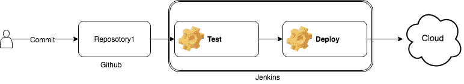
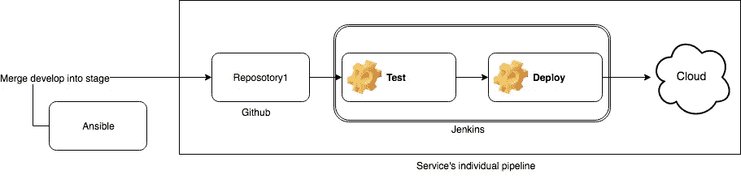
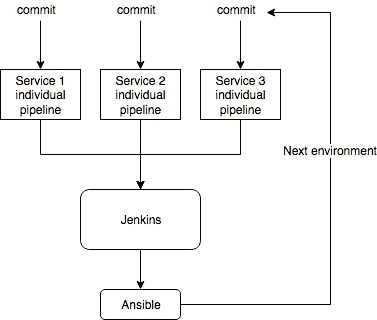
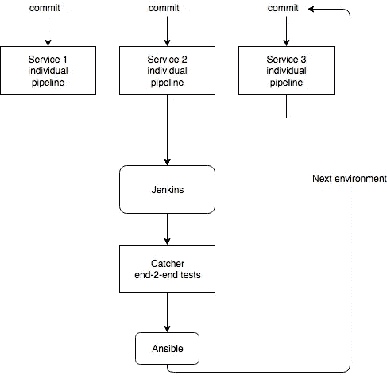

# 微服务和持续交付

> 原文：<https://itnext.io/microservices-and-continuous-delivery-1e8c75b37ab1?source=collection_archive---------3----------------------->

想象一个典型的情况——昨天你的 devops 工程师被老虎吃了。你很难过，因为他没有完成你项目的发布系统。它包含 4 个存储库:2 个后端，1 个前端，1 个数据管道。

现在，您应该为您明天的项目建立一个部署管道。

在本文中，您将了解如何设置 [Jenkins](https://jenkins.io/) 、 [Ansible](https://www.ansible.com/) 和 [Catcher](https://github.com/comtihon/catcher) 来用 E2E 测试和最少的工作构建多环境生产就绪 CI/CD。

# 独立管道

第一步是为每个服务建立一个单独的管道。我假设您是一名优秀的开发人员，并且您为每个服务都有一个单独的 git 存储库。

在这里，你需要做的就是写一个 Jenkins 管道，并通过组织插件手动或自动地将其提供给 Jenkins。每次提交时都会触发管道。它将对每个分支进行测试。在环境分支(开发、阶段或主)的情况下，它也将构建 docker 映像并将它部署到正确的环境。



## 设置一个[代理](https://jenkins.io/doc/book/pipeline/syntax/#agent)

代理是每个詹金斯管道的起点。最常见的就是`agent any`，除非你不需要什么特别的东西。

## 设置[触发器](https://jenkins.io/doc/book/pipeline/syntax/#triggers)

您的管道应该在每次提交时被触发。如果无法从外部网络访问您的 Jenkins，请使用`pollSCM`。

## 设置[环境](https://jenkins.io/doc/book/pipeline/syntax/#environment)变量

它们使您的生活变得更加容易，因为它们允许您以最小的改动复制粘贴您的 Jenkinsfile。
环境应包括 docker 图像名称。

```
environment { 
  IMAGE_NAME = "<your_docker_registry_url:port>/<your_project>:${env.BUILD_NUMBER}-${env.BRANCH_NAME}" 
  LATEST_IMAGE_NAME = "<your_docker_registry_url:port>/<your_project>:latest-${env.BRANCH_NAME}" 
}
```

## 设置普通[步骤](https://jenkins.io/doc/book/pipeline/syntax/#stage)

公共步骤是应该在每个分支上调用的步骤。即使是特征分支。

```
steps { 
  sh "make test" 
}
```

记住，坚持标准是明智的决定(否则你也会被老虎吃掉)。因此，确保您的存储库中有一个 [Makefile](https://en.wikipedia.org/wiki/Makefile) 。它是你的朋友，因为它允许你建立语言无关的管道。即使你的新开发人员不知道你的编程语言或构建系统，他们也会理解，调用`make test`将测试你的项目。

这也是通知的合适位置。使用`slackSend`到[向项目的](https://jenkins.io/doc/pipeline/steps/slack/)[时差](https://slack.com)通道发送通知。

```
slackSend color: "warning", message: "Started: ${env.JOB_NAME} - ${env.BUILD_NUMBER} (<${env.BUILD_URL}|Open>)"
```

## 设置特殊的构建步骤

特殊步骤是仅在对特殊分支进行更改时运行的步骤。Jenkins 允许您使用 when 条件:

```
stage('Build') {
  when {
    expression {
      return env.BRANCH_NAME == 'master' || env.BRANCH_NAME == 'develop' || env.BRANCH_NAME == 'stage' 
    }
  } 
  steps { 
    sh "docker build -t ${env.IMAGE_NAME} ."
    sh "docker push ${env.IMAGE_NAME}" 
    sh "docker tag ${env.IMAGE_NAME} ${env.LATEST_IMAGE_NAME}" 
    sh "docker push ${env.LATEST_IMAGE_NAME}" 
  }
}
```

## 设置特定于环境的部署

除了`when`条件，您还应该选择合适的映像或配置来部署正确的环境。我使用[马拉松](https://mesosphere.github.io/marathon/)和我的 dev/stage/prod 使用不同的 CPU 限制、秘密和其他配置。它们存储在`marathon/marathon_<env>.json`中。因此，在部署之前，您应该选择合适的配置文件。为此使用脚本:

```
stage('Deploy_api'){
  when {
    expression { 
      return env.BRANCH_NAME == 'master' || env.BRANCH_NAME == 'develop' || env.BRANCH_NAME == 'stage' 
    }
  } 
  steps { 
    script { 
      if (env.BRANCH_NAME == 'master') { 
        env.MARATHON = "marathon/marathon_prod.json" 
      } else if (env.BRANCH_NAME == 'stage') { 
        env.MARATHON = "marathon/marathon_stage.json" 
      } else { 
        env.MARATHON = "marathon/marathon_dev.json" 
      } 
    } 
    marathon( 
        url: 'http://leader.mesos:8080', 
        docker: "${env.IMAGE_NAME}", 
        filename: "${env.MARATHON}" 
    ) 
  } 
}
```

# 可能的提升角色

设置从一个环境到另一个环境的提升的最简单的方法是触发之前配置的单独的管道。



在之前的[文章](https://justtech.blog/2019/04/27/ansible-and-jenkins-automate-your-scritps/)中，我向您展示了将 Jenkins 与 Ansible 一起使用要好得多。这里没有例外(想象一下，老虎也吃了你的詹金斯机器)。

我们将使用包装在 Ansible 角色中的 python 脚本。对于那些没有读过我上一篇文章的人来说，可以使用 groovy jenknis 共享库，但不推荐使用:

*   开发和调试这样的库是很困难的，因为本地安装了不同版本的 Jenkins、Jenkins groovy 插件和 groovy。
*   这使得您的发布高度依赖于您的 Jenkins，这是可以的，直到您决定转移到另一个配置项，或者您的 Jenkins 停机，您需要进行发布。

## Python 脚本

要触发从开发到阶段的升级，您应该将开发合并到阶段并推动它。仅此而已。推送后，它的内部管道将被触发。

python 脚本本身:

1.  克隆存储库
2.  签出您要提升的分支机构
3.  合并以前环境的分支
4.  推它！

这看起来很容易，尽管这里有一些提示。

比起 python 的库，更喜欢你系统的 git。在这种情况下，您可以在本地运行时使用自己的密钥。

```
def call_with_output(cmd: str, directory='.'): 
  output = subprocess.Popen(cmd.split(' '), 
                            stdout=subprocess.PIPE, 
                            stderr=subprocess.STDOUT, 
                            cwd=directory) 
  stdout, stderr = output.communicate() 
  if stderr is None: 
    return stdout 
  raise Exception(stderr)
```

如果您的存储库不是公共的，您应该通过令牌克隆它。注意，`git_user`、`git_token`和`company`是可变变量。它们不会经常改变，所以我将它们存储在角色的默认变量中。

```
call_with_output(f'git clone [https://{{](/{{) git_user }}:{{ git_token }}@github.com/{{ company }}/{ repo }.git')
```

如果没有变化就不要调用`push`就好。但是并不是所有的 git 版本都有相同的输出。`up-to-date`不同于`up to date`。我花了一段时间才注意到这一点。

```
changes = call_with_output(f"git merge { from_branch }", repo).decode("utf-8").strip() 
if changes != "Already up to date." and changes != "Already up-to-date.": 
  call_with_output(f"git push origin HEAD:{ to_branch }", repo)
```

将时差通知直接发送到项目的频道也是一个好主意。你可以通过 slack [webhook](https://api.slack.com/incoming-webhooks) 来完成。

```
def notify_slack(callback, message): 
  response = requests.post(callback, 
                           data=json.dumps({'text': message}), 
                           headers={'Content-Type': 'application/json'} ) 
  if response.status_code != 200: 
    raise ValueError('Request to slack returned an error %s, the response is:\n%s' 
                     % (response.status_code, response.text) )
```

# 詹金斯共享管道

现在你有了一个负责推销角色。是时候为整个项目创建一个 Jenkins 管道了，它会为你调用 Ansible。这个管道可以由您手动触发，也可以由项目的任何服务自动触发。



从添加参数开始:

```
parameters { 
  choice(choices: 'develop\nstage\nmaster', description: 'Which environment should I check?', name: 'environment') 
}
```

部署步骤:

```
stage('Promote dev to stage') { 
  when { 
    expression { 
      return params.environment == 'develop' 
    } 
  } 
  steps { 
    deploy_all('develop', 'stage')
  }
}
```

其中`deploy_all`使用您创建的角色下载您的 ansible 存储库，并为正在部署的项目的每个服务调用它。

```
def deploy_all(from, to) { 
  git branch: 'master', 
      credentialsId: "${env.GIT_USER_ID}", 
      url: "https://github.com/<your_company>/<your_ansible_repo>"    
  deploy('repo_1', from, to) 
  deploy('repo_2', from, to) 
  deploy('repo_3', from, to) 
} def deploy(repo, from, to) { 
  ansiblePlaybook( 
        playbook: "${env.PLAYBOOK_ROOT}/deploy_service.yaml", 
        inventory: "inventories/dev/hosts.ini", 
        credentialsId: ${env.SSH_USER_ID}, 
        extras: '-e "to=' + "${to}" + ' from=' +"${from}" + ' repo=' + "${repo}" + ' slack=' + "${env.SLACK_CALLBACK}" + '" -vvv') 
}
```

现在您拥有了所有服务的部署管道，并且可以手动调用它。这比手动调用 3 个项目的管道快 3 倍。但这还不是我们的目标。

我们需要这个管道被我们的任何内部管道触发。

将此步骤添加到服务的所有 3 个 Jenkins 文件中:

```
stage('Trigger promotion pipeline) { 
  when { 
    expression { 
      return env.BRANCH_NAME == 'master' || env.BRANCH_NAME == 'develop' || env.BRANCH_NAME == 'stage' 
    } 
  } 
  steps { 
    build job: "../<jenkins_promote_project_pipeline_name>/master", 
          wait: false, 
          parameters: [ 
            string(name: 'environment', value: String.valueOf(env.BRANCH_NAME)) 
          ] 
  } 
}
```

自动化部分现在完成了。合并功能分支后，将运行本地服务的测试，并将服务部署到开发环境中。之后，管道立即触发整个项目的推广管道。所有被更改的服务都将被部署到下一个环境中。

# 添加端到端测试

自动提升是好的，但它有什么意义呢？它只是将您的更改从一个环境转移到另一个环境，而没有任何高级别的验收测试？

在 Catcher 的文章[中，我已经提到过，绿色服务的测试不能给你绝对的把握，你的服务可以正常地相互作用。为了确保整个系统正常工作，您需要在您的推广渠道中添加端到端测试。](https://justtech.blog/2019/05/16/end-to-end-microservices-testing-with-catcher/)



要添加 Catcher 端到端测试，只需在 Jenkins 共享管道的存储库项目中创建`inventory`和`tests`(我假设您有单独的 git 存储库，其中存储了管道、带有部署描述的自述文件等)。

在清单中，您应该提到针对每种环境的所有项目服务。`develop`的费用:

```
backend1: "http://service1.dev:8000" 
frontend: "http://service2.dev:8080" 
backend2: "http://service3.dev:9000" 
database: "http://service4.dev:5432"
```

在`tests`中，您应该进行端到端测试。最简单的事情就是检查他们的健康状况。它会告诉你，他们至少在工作。

```
--- 
steps: 
  - http: 
      name: 'Check frontend is up' 
      get: 
        url: '{{ backend1 }}' 
  - http: 
      name: 'Check backend1 is up' 
      post: 
        url: '{{ backend1 }}/graphql' 
        body: ''' { __schema { types { name } } }''' 
        headers: 
          Content-Type: "application/graphql" 
  - http: 
      name: 'Check backend2 is up' 
      get: 
        url: '{{ backend2 }}/healthcheck' 
  - postgres: 
      conf: '{{ database }}' 
      query: 'select 1'
```

在部署之前，将测试步骤添加到您的 jenkins 管道中。不要忘记创建一个 Makefile 文件。

```
stage('Prepare') { 
  steps { 
    sh "make conda" 
    sh "make requirements" 
  }
}
```

确保您选择了合适的环境。你应该总是测试相同的环境，这在`patameter.environment`中有详细说明。

```
stage('Test') { 
  steps { 
    script { 
      if (params.environment == 'develop') { 
        env.INVENTORY = "dev.yml" 
      } else { 
        env.INVENTORY = "stage.yml" 
      } 
    } 
    sh "make test INVENTORY=${env.INVENTORY}" 
  } 
}
```

Makefile 的一部分:

```
CONDA_ENV_NAME ?= my_e2e_env 
ACTIVATE_ENV = source activate ./$(CONDA_ENV_NAME) .PHONY: conda 
conda: $(CONDA_ENV_NAME) 
$(CONDA_ENV_NAME): 
  conda create -p $(CONDA_ENV_NAME) --copy -y python=$(PY_VERSION) 
  $(ACTIVATE_ENV) && python -s -m pip install -r requirements.txt .PHONY: requirements 
requirements: 
  $(ACTIVATE_ENV) && python -s -m pip install -r requirements.txt .PHONY: test 
test: 
  $(ACTIVATE_ENV) && catcher script/tests -i inventory/${INVENTORY}
```

# 禁用自动产品升级

端到端测试不错，但并不完美。您不应该让每个更改都实时部署在 prod 上。除非你喜欢晚上工作。

为`promote stage to master`管道的步骤添加一个输入。如果没有人按这个输入，它将被忽略。

```
stage('Promote stage to prod') { 
  when { 
    expression { 
      return params.environment == 'stage' 
    } 
  } 
  steps { 
    script { 
      def userInput = false 
      try { 
        timeout(time: 60, unit: 'SECONDS') { 
          userInput = input(id: 'userInput', 
                            message: 'Promote current stage to prod?', 
                            parameters: [ 
                                [$class: 'BooleanParameterDefinition', defaultValue: false, description: '', name: 'Promote']
                            ])
        }
      } catch(err) { 
      } 
      if (userInput) { 
        print('Deploying prod') 
        deploy_all('stage', 'master') 
      } else { 
        print('Skip deploy') 
      } 
    } 
  } 
}
```

在这种情况下，只有在 stage 的 e2e 测试成功并且用户决定要升级更改后，才会部署 prod。

# 结论

这种管道允许您一次部署一堆微服务，只需对现有基础架构进行最少的更改，因为我们重用每个服务的内部部署管道，您可能已经有了。

它并不完美，因为它没有考虑不完整的构建或红色服务级别测试。但它允许您在部署期间节省时间，并通过在一个位置设置所有相关服务来消除人为错误因素。

在我的下一篇文章中，我将向您展示一组微服务的回滚管道的示例。