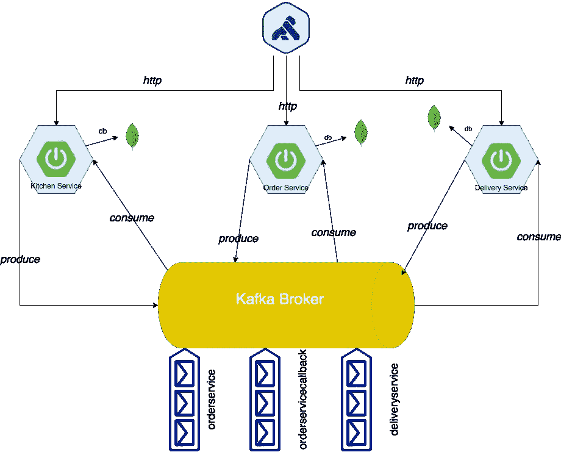
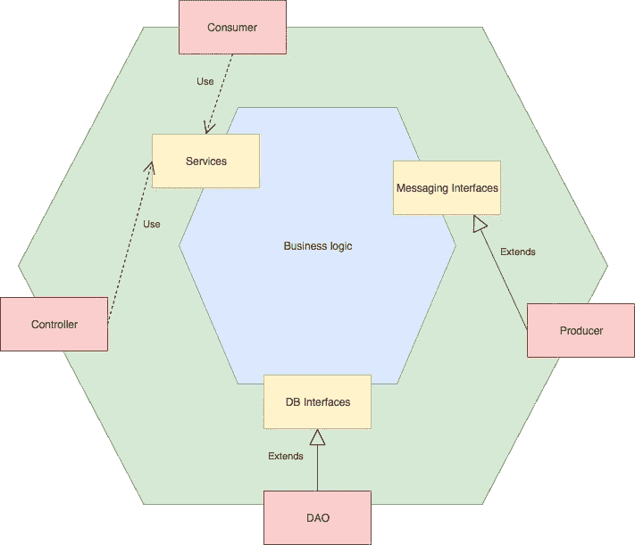

# 微服务架构:Saga 模式的实现

> 原文：<https://itnext.io/microservices-architecture-an-implementation-of-saga-pattern-dbbe5d881c78?source=collection_archive---------1----------------------->

由 [Unsplash](https://unsplash.com?utm_source=medium&utm_medium=referral) 上的科坦·拉杰普特[拍摄的照片](https://unsplash.com/@ketan_rajput?utm_source=medium&utm_medium=referral)

在过去的几年中，微服务是目前行业中的热门话题之一，在不需要微服务的情况下也是如此。通常，架构设计是错误的，可能它更像是一个微型整体服务。如果你对这些基本问题中的一个回答“是”，那么你的架构是错误的，很可能是:-D

*   你有你的服务的单一实例吗？
*   您有单一的数据库(或模式)吗？
*   服务之间的通信是同步的吗？
*   …

有很多问题需要回答，但在这篇文章中，我将向您展示一个简单的符合模式的微服务架构，该架构基于由 **Chris Richardson** 所著的“*微服务模式*”一书。

在我的例子中，主要的想法是为“McPaspao”，我假设的快餐，构建一个管理软件:-D .下面是基于域的初步分析:

*   订单管理
*   厨房管理
*   交付管理

*订单管理*管理汉堡订单，*厨房管理*管理厨房工作(例如:烹饪汉堡或冰箱管理)，*配送管理*管理汉堡的配送。所以我至少需要三个不同的服务，每个都有自己的数据库，然后每个服务都需要相互通信。在这种情况下，还需要其他五个组件:

*   订单数据库
*   厨房数据库
*   交付数据库
*   消息服务
*   API 网关

在微服务架构 API 网关中，消息服务和每服务数据库是用于解决许多问题的常见模式，例如:

*   **消息服务**:服务经常协作处理许多请求，因此它们必须使用进程间通信协议。更具体地说是异步消息传递系统。
*   **每个服务的数据库**:服务的数据库必须是实现的一部分，以确保良好的耦合，从而可以独立开发、部署和扩展。
*   **API 网关**:在微服务架构中，有大量的服务、协议、地址、端口、安全策略、冗余策略等。API 网关模式试图解决这个问题，它为客户端提供了一个单一的入口点来管理所有列出的方面等等。

这是架构的大图， *API 网关*是[孔](https://konghq.com/kong)，*消息服务* [Kafka](https://kafka.apache.org/) 和*每个服务的数据库* [MongoDB](https://www.mongodb.com/) 。这个项目在 Github 上的[这里](https://github.com/paspao/McPaspaoTakeAway)。

每个微服务都是按照*六边形*架构风格实现的:核心逻辑嵌入在六边形内部，六边形的边被视为输入和输出。目标是以一种将核心逻辑与外部元素隔离的方式对对象进行分层:核心逻辑位于画面的中心，所有其他元素都被视为集成点(DB、API、消息传递)。我们讨论通过调用业务逻辑处理来自外部的请求的*入站适配器*，以及由业务逻辑调用的*出站适配器*(以调用外部应用程序)。一个*端口*定义了一组操作，即业务逻辑如何与外部交互。

图中*控制器*和*消费者*为入站适配器，*服务*为入站端口，*消息接口*和 *DB 接口*为出站端口，*道*和*生产者*为出站适配器。

为了解释所使用的内部架构，我将展示单个微服务的细节，即*交付服务*。它有一个单独的 api 来监控交付的状态，它定义了一个*入站端口 IDeliveryAPI* :

类 *DeliveryApi* 是一个*入站适配器*:

类别 *DeliveryService* 代表*业务逻辑*:

接口 *IDeliveryPublisher* 是一个*出站端口*:

类 *DeliveryPublisher* 是一个*出站适配器*:

每个微服务(在我的例子中)内部都有这种风格的架构，以确保软件层之间的高度耦合。但这只是单个微服务的内部架构，例如，其他微服务也可能使用*分层*架构风格。

好吧，一个涉及每个微服务的简单用例是*订单管理*，即:一个浏览器请求一个汉堡，*订单服务*接收订单并将其写入数据库，订单管理工作完成，但要完成订单，它需要联系*厨房服务*，因此它发送一个主题消息(以确保异步的进程间通信)， *厨房服务*正在监听这个主题，它使用消息并处理订单，通过另一个主题向*订单服务*提供反馈。 当*厨房服务*做好汉堡后，它向*递送服务*发送一条消息，而*递送服务*处理该消息，递送汉堡并发送反馈。微服务之间的每个通信都通过消息代理，在我的例子 *Kafka* 中，我应用了一个*编排传奇模式*，即:

> 传奇是一系列本地事务。每个本地事务更新数据库并发布消息或事件来触发 saga 中的下一个本地事务。如果本地事务由于违反业务规则而失败，则 saga 会执行一系列补偿事务，以撤销之前的本地事务所做的更改。有两种协调传奇的方式:
> 
> -编排-每个本地事务发布触发其他服务中的本地事务的域事件
> 
> -编排—编排器(对象)告诉参与者要执行哪些本地事务
> 
> 克里斯·理查森

为了查看整个架构，我使用了下面列出的 docker-compose.yml (docker 应用程序):

就像上面的大图一样，有三个服务和三个数据库，然后是 Kafka broker，这是一个个性化的图像，在 borad 上已经有了所有需要的主题:

*   订单服务
*   订单服务回调
*   厨房服务
*   送货服务

在 Kafka 容器中还有一个 Zookeeper 的实例，需要启动 Kafka，你可以在这里阅读如何创建它。

最后一个组件是 API 网关， *Kong* :经典安装使用类似于 *Postgresql* 的数据库，但是也可以通过声明的方式启动 Kong，遵循 Kong *kong.yml* 的简单配置:

在这个例子中，我以最简单的方式使用 API 网关，没有任何认证和授权服务或服务副本或服务发现等。为了避免在主要方面混淆:实现*编排传奇模式*。

要构建项目，您可以使用 *maven* 然后手动启动每个服务，或者您可以使用多级 Docker 文件构建所有内容(您必须在 Docker 19.x 上启用*实验特性*):

然后用命令开始:

考验的时候到了！

您可以使用 Swagger 用户界面验证每个微服务都在运行:

*   订单服务:[*http://localhost:8000/kitchen-Service/swagger-ui . html*](http://localhost:8000/kitchen-service/swagger-ui.html)
*   厨房服务[*http://localhost:8000/order-service/swagger-ui . html*](http://localhost:8000/order-service/swagger-ui.html)
*   交付服务[*http://localhost:8000/delivery-service/swagger-ui . html*](http://localhost:8000/delivery-service/swagger-ui.html)

现在我想要一个汉堡！！！厨房需要一些汉堡，冰箱是空的，所以(你必须安装 [jq](https://stedolan.github.io/jq/) ):

我添加了两个汉堡，现在我请求订购两个汉堡:

在第一步中，订单进入*等待*状态，然后*烹饪*、*包装*和*交付*状态。如果再次运行脚本，系统没有足够的汉堡，下一个订单将处于*等待*状态，然后*中止*。

我希望本指南将帮助您阐明微服务架构的强大和复杂性，这只是一个使用简单和基本组件实现的实际示例，但您可以猜测何时使用或不使用它。感谢您的阅读。