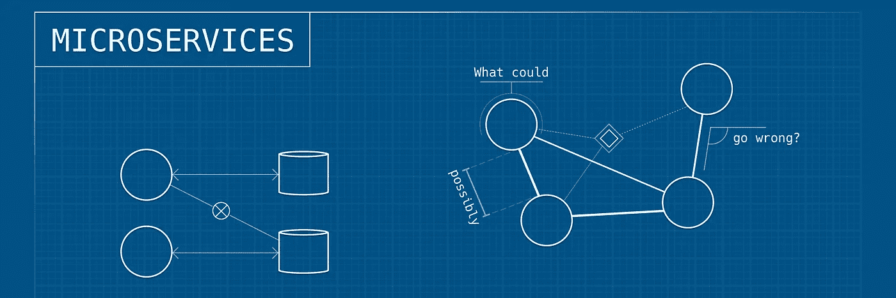
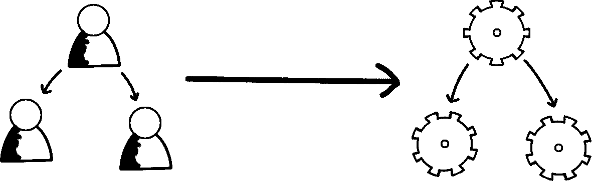
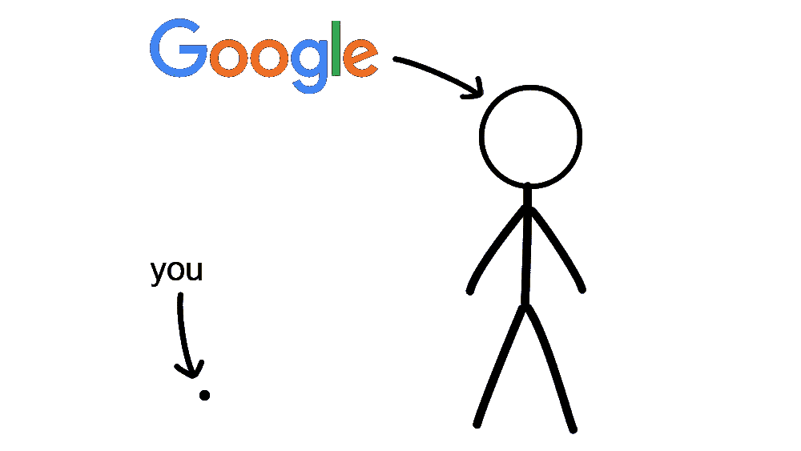
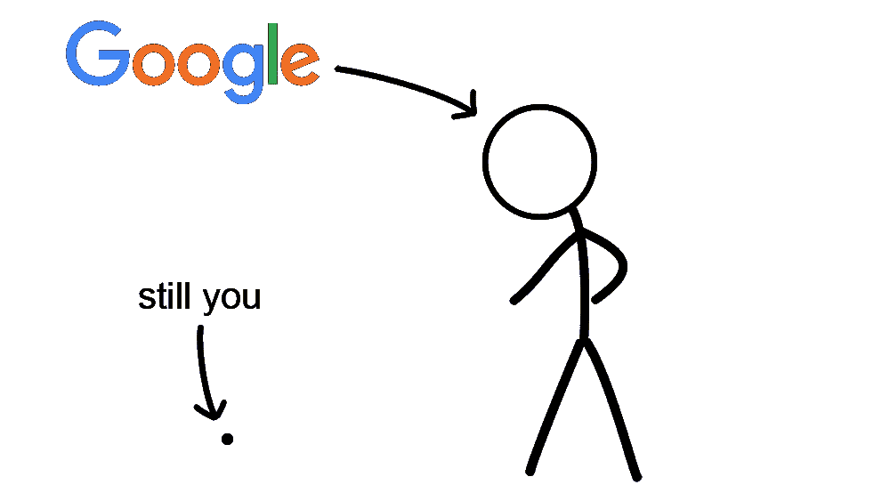
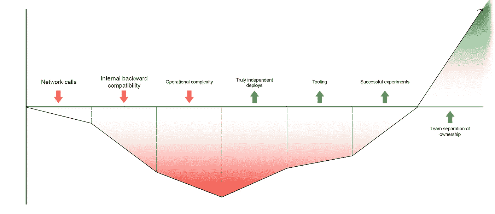

# 艰难地学习:微服务

> 原文：<https://itnext.io/microservices-c8b5dbdd58b8?source=collection_archive---------0----------------------->

## 回顾我是如何无视规则并为此后悔的

2016 年末，我和我的团队开始搭建一个全新的平台。拥有这样一张白纸是开发人员的梦想——没有遗留代码，不用担心向后兼容性，最重要的是，我们可以为工作选择正确的技术。

三年后，在经历了许多痛苦和磨难之后，我来到这里做一点回顾。不过，在开始之前，我要承认两件事。

*   马后炮是 20/20
*   没有灵丹妙药

没有办法知道以不同的方式做事情是否会导致更少的挫折，但肯定有一些关于领域/架构的非常重要的建议，我们选择忽略。当时，我们认为我们知道得更多。

因此，对于那些正在开始类似旅程的人来说，这里有一些我后悔没有采纳的最重要的建议。

# 被忽视的建议 1:康威定律

[这条定律](https://en.wikipedia.org/wiki/Conway%27s_law)指出，不可避免地，你的系统架构将在某种程度上类似于你公司的组织结构。

随着我们平台的发展，我们已经编写和运行了 30 到 40 个微服务，这取决于你如何计算。并不是所有的都存在，有些已经被改写成不同的语言，等等。

问题是，自从我们开始构建以来，我们从来都只是少数后端开发人员。因为我们一直是一个小的、紧密结合的团队，每个开发人员将负责所有的服务。架构决策是作为一个团队做出的，随叫随到意味着处理任何领域的潜在问题。

正如您可能从高服务开发人员比率中猜到的那样，我们最终得到了许多“分离”但紧密耦合的服务。这对我们伤害很大。

由于这种耦合，通过同时“仅仅”部署跨服务变更来减少我们的工作量的诱惑一直存在，这与[独立部署](https://youtu.be/PFQnNFe27kU?t=1352)原则背道而驰。

# 被忽视的建议 2:你不是谷歌

微服务的一个较小的好处是它们可以独立扩展。在我们最初的设计中，我们已经分离了预计会成为规模瓶颈的组件。事实检验:这一问题的规模远远超出了我们可能遇到的任何事情。

事实上，我们不仅猜测域的边界，而且每个服务都有一定的开销。我们运行一组 sidecar 容器和 [Kubernetes Daemonsets](https://kubernetes.io/docs/concepts/workloads/controllers/daemonset/) 用于操作功能(比如监控和日志记录)。到了一定程度，我们在支持基础设施上花费的资源超过了实际应用。很大一部分。

现在，我不是说我们用一个整体会更好，但是如果我们从一个更简单的架构开始，我们可以:

*   当我们对领域越来越有信心，并找到正确的抽象时，就把碎片分开
*   收集真正的性能瓶颈在哪里的数据，如果这成为一个问题的话
*   通过重叠支持基础架构节省了大量资金

# 被忽视的建议 3:你仍然不是谷歌

微服务的另一个好处是可以自由选择最适合工作的工具。我们在试验各种语言，并运行用 [Python](https://www.python.org/) 、 [NodeJS](https://nodejs.org/en/) 和 [Golang](https://golang.org) 编写的服务。总的来说，这很棒，但是在编写共享库时却成了一场噩梦，因为相同的代码必须用三种不同的语言实现。

我确实相信尝试不同的工具，但我们最终把一切都视为生产就绪和长期存在的。如果你正在编写内部共享库，使用它们的服务不再是一个实验。

我不得不接受只使用一种语言的现状。事实证明这完全没问题。尽可能多地进行实验，但是拥有一个可重复且一致的主堆栈也是很有价值的。如果您的所有服务都在同一个保护伞下运行(例如，带有数据库连接的 web 服务器)，这种情况就更真实了。

# 被忽视的建议 4:一切都是交易

事实证明，微服务架构有很多缺点。我不会在这里深入讨论(其他人已经[这样做了](https://martinfowler.com/articles/microservice-trade-offs.html)，但是我认为理解你注册的目的是什么是很重要的。

如果我们坐下来研究利弊，我们可能会发现，只有当我们成长为多个后端团队，使用不同的软件来解决不同的问题时，它才是值得的。

通往净正价值的旅程

# 惩罚

我们花了时间和精力原路返回。2019 年 1 月，我们退一步，寻找我们架构中最大的结。我们发现了 10 个紧密耦合的服务，只要碰一下其中一个，它们就会像纸牌搭的房子一样倒塌。从那以后，我们将这十个军种合并为一个军种，并且没有回头。

我们也逐渐淘汰了我们的 Python 服务，除了 Golang 服务。在某些情况下，这意味着文字重写到 NodeJS 中。我们只剩下一组要维护的共享 JavaScript 库。

# 学习

如果我能回到过去，给自己一些警示，我会说以下的话:

*   为你知道自己存在的问题做设计，在猜测未来的时候要非常细致。
*   更安全的做法是从几个较大的服务开始，随着边界的显露，将它们分割开来。一个好的经验法则是，一个微服务比两个好，除非你能清楚地说出拆分它们的原因。当然，有*和*许多合理的理由，但是在继续之前，确保你知道它们是如何应用的。
*   当试验和建立 MVP 服务时，要非常清楚你*不会*做什么，并坚持下去。很容易陷入维护一些不是正确解决方案的东西。