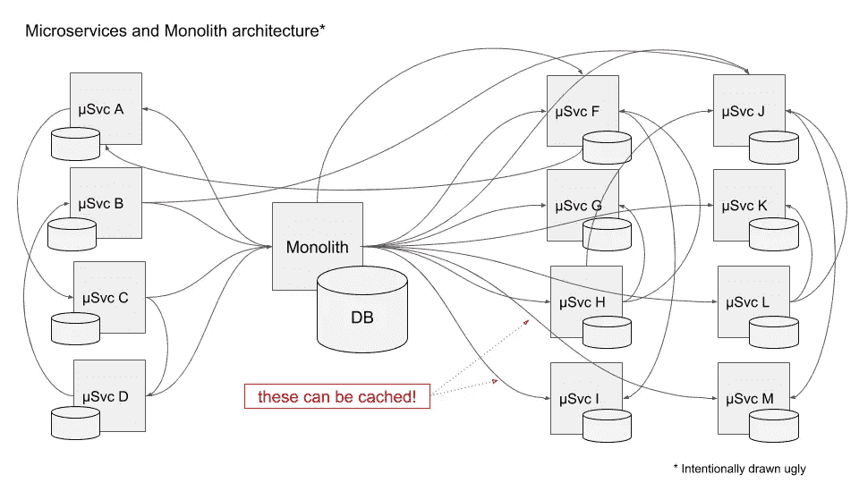
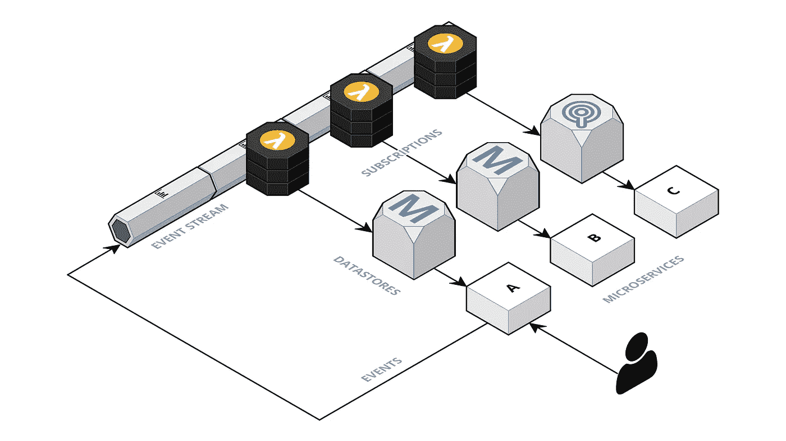
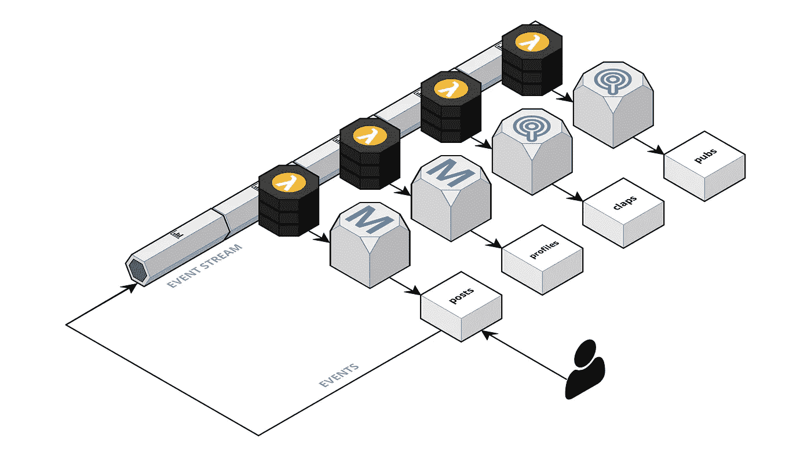
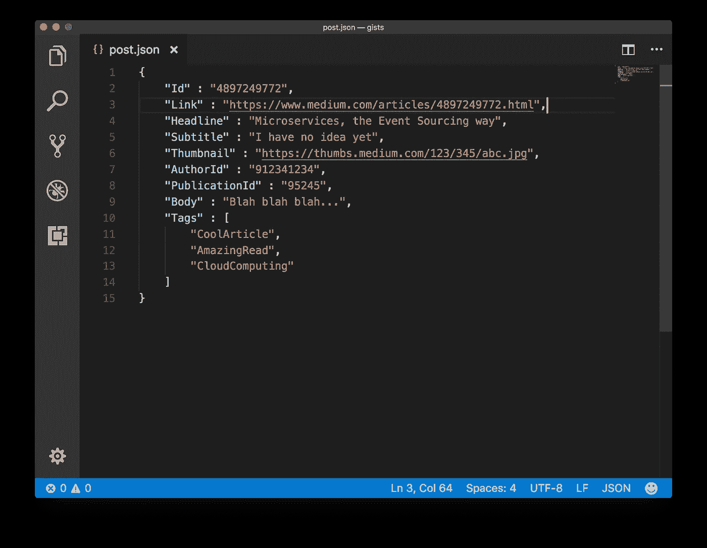
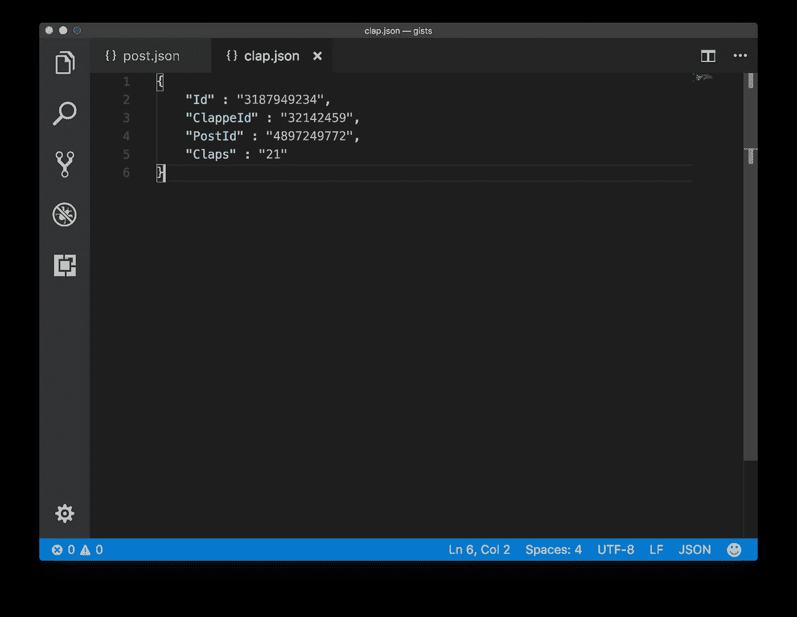
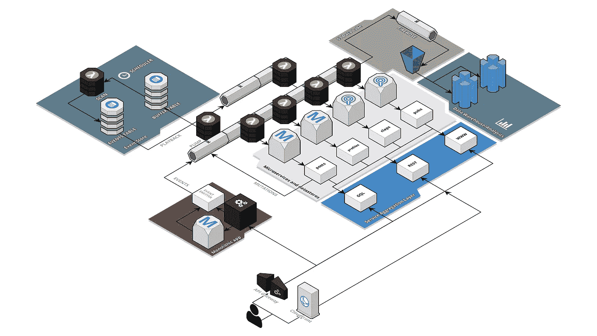

# 微服务事件源方式

> 原文：<https://itnext.io/microservices-the-event-sourcing-way-124a8a772680?source=collection_archive---------2----------------------->


在 [Unsplash](https://unsplash.com?utm_source=medium&utm_medium=referral) 上 [NeONBRAND](https://unsplash.com/@neonbrand?utm_source=medium&utm_medium=referral) 拍摄的照片

## 吻别巨石

[*点击这里在 LinkedIn 上分享这篇文章*](https://www.linkedin.com/cws/share?url=https%3A%2F%2Fitnext.io%2Fmicroservices-the-event-sourcing-way-124a8a772680)

在 [*上一篇*](/from-monoliths-to-microservices-b6b851ab43e3) 文章中，我写了一种在从单片架构迁移到微服务时加快迭代速度的方法，以及一旦单片被驯服并在 CI/CD 管道中作为 Kubernetes 部署运行时使用 [*扼杀者模式*](https://www.martinfowler.com/bliki/StranglerApplication.html) 。

现在是时候更深入一点了，看看 [*事件源*](https://martinfowler.com/eaaDev/EventSourcing.html) 和 [*CQRS*](https://martinfowler.com/bliki/CQRS.html) 作为圣杯，它将防止你陷入迁移到微服务的许多经典陷阱，但也可能发现新的陷阱。

一旦你开始考虑你可能遇到的问题，在你刚刚建立的同一个 Kubernetes *围墙花园*中的 Monolith 和你的新的、萌芽中的微服务，*数据一致性*可能是需要担心的事情。因为您希望尊重微服务的独立数据存储库的*架构约束，但不可避免的是，一些数据会在 Monolith 和一个或多个微服务数据存储库中找到需要的方式。*

> 想象一下，你得到了一部新手机，但旧手机上仍有内容，你还没有真正弄清楚新手机是如何工作的，所以你把旧手机保持在 wifi 上，然后…嗯，我认为这个比喻有点道理。

回到正题。因为毕竟一切都是(或者可以成为)服务，所以您仍然可以从一个地方到另一个地方访问数据。那个*感觉很安心*。你站在白板前，开始画一个箭头，从整体到微服务 A，然后另一个，到微服务 C，然后另一个，回到整体，然后另一个…



虚构的图，不要在家里尝试

很快，事情将开始看起来像这个图表，然后你会开始怀疑这个微服务的想法是否有一些根本性的缺陷。

最后，你正在做的是用*网络调用*替换旧的但是可靠的*进程调用*，用*分布式系统*替换*单个进程*，并且你非常清楚 [*网络是可靠的*](https://en.wikipedia.org/wiki/Fallacies_of_distributed_computing) ，并且还有你的计算机科学教授告诉你关于 [*CAP 定理*](https://en.wikipedia.org/wiki/CAP_theorem) 的记忆，并且感觉他们一直从你的肩膀后面偷看你的白板而且*他们也不帮忙！*

大约 10 分钟后，你也可能突然有一个灯泡亮了，这是一个充满希望的时刻，你开始认为这(当然)是 HTTP，所以你可以*缓存*它。那就是你在上面画红框的时候。尤里卡。或者不是。你很快就会意识到缓存并不能拯救世界:你需要注意的一切都是系统状态的一个*突变*，缓存是为了别的事情。

在 30 分钟的时候，一旦你开始考虑在这个*弗兰克建筑中进行监控、故障排除和调试，一种微妙而纯粹的恐怖感就会出现。*你记得有一天你在某处读到关于*分布式跟踪*的内容。你 [*谷歌一下*](https://www.google.com/search?q=distributed+tracing) ，很快就意识到这不是银弹，而只是你需要实现*和*的其他东西。哎哟。

还不到一个小时，就很明显地发现，您还必须实现一种机制*来重试失败的 HTTP 调用*，可能采用指数回退策略，降低您的应用程序的可用性，然后，哦不，在*网络分区*的情况下，数据可能不一致(只是说“*有人在以太网电缆上绊倒了”*的更好的说法)。因为 [*上限不仅仅是一个定理*](https://mwhittaker.github.io/blog/an_illustrated_proof_of_the_cap_theorem/) 。

但是嘿，至少你可以扩展这些微服务，所以性能应该会更好，不是吗？这会让你高兴一点点，直到你想到 [*N+1 问题*](https://www.infoq.com/articles/N-Plus-1) 。

那是什么？想起*中的*。我是说，这个网站。想象一下，有一个存储*帖子*的微服务和一个存储*掌声*的微服务。并考虑如何返回一个包含相应掌声计数的 *N* 帖子列表(1 个查询)(每个帖子 1 个查询，所以 *N* )。就这样， *N+1 个查询*。由于每个查询都有大约 30 毫秒的延迟，您可能要等将近一秒钟才能在主页上显示 30 篇文章的列表。效率不是很高。

“为什么没人告诉我？”

你开始怀念那块巨石了吗？

# 活动采购和 CQRS 的救援


照片由[文森特·索罗门](https://unsplash.com/@vincentiu?utm_source=medium&utm_medium=referral)在 [Unsplash](https://unsplash.com?utm_source=medium&utm_medium=referral) 拍摄

*事件采购*和 *CQRS* 的基本思路其实很简单。你可以在[更有声望的来源](https://www.google.com/search?q=event+sourcing+and+cqrs)上读到它，但是快速电梯间距是应用程序状态中的每一个*突变*(或者 CQRS 的说法是*命令*)都被发布到一个*事件流*。然后，多个服务订阅*事件流*，读取它们感兴趣的事件，并将结果状态保存在独立的数据存储中。

看起来是这样的:



基本的准系统活动采购

对于每个微服务，您都有一个订阅事件流的函数，侦听新事件，如果事件与服务的领域相关，则将它们的影响保存到服务数据存储中。每个订阅可以捕获一个事件(或其中的一部分),并保存在每个数据存储中。

数据存储的设计目标是优化读取或查询，以便将面向它们的微服务的延迟降至最低。这就是 CQRS 的意义。

感到困惑？想看下一个故事吗？你的巨石呢？



中型(虚拟)微服务架构

很公平，所以为了让事情更具体，让我们继续假设你正在这个架构上构建介质:你有一个用于*成员档案*的微服务，一个用于*帖子*，一个用于*鼓掌*，一个用于*出版物*。可能还有一些，因为你不知道的秘密，因为你不在那里工作。

你可以看到它在上面的样子。

> 声明:我真的不知道 Medium 是如何构建的。我想如果我真的想知道的话，我可以谷歌一下。



发布后事件示例

因此，在这个中型微服务架构中，当我最终完成这篇文章并将其发布到*帖子*微服务时，它将依次更新自己的数据存储，然后在事件流中发布一个事件，用于应用程序中可能关心我的帖子发生了什么的任何其他内容。

同样订阅了事件流的*会员资料*服务也将获取该事件的一些片段，在我的资料中添加该故事的链接(可能还会获取*标题*和*副标题*，以及缩略图的链接)。如果我将此作为出版物的一部分发布(比如说[*it next . io*](https://itnext.io/)*)**出版物*服务的订阅者也将捕获事件的一些片段，并更新*出版物数据库*。单个事件，以及每个微服务的大量更新。

你可能会问“为什么？”。因为通过这种方式，当我查看我的个人资料时，我可以获得我已经发布的故事列表，并且这样做不需要*成员个人资料*服务来查询或者甚至知道*帖子*服务。*帖子*服务实际上可能会中断几秒钟，我不知道。当然，有人会注意到，但不是我，对我来说这才是最重要的。



Clap 事件示例

这个故事一旦发表，你可能会决定为它*鼓掌*。这就是*拍手*服务的另一个事件，它也被*帖子*服务捕获，为什么不被*个人资料* *服务*和发布服务捕获。你鼓掌，事情就发生了。

*试试吧:)。*

在这个模型中，*每个服务对某些数据或领域*都是权威的，但是每个服务也知道为查询提供有意义的响应所需的其他一切，而不需要向其他服务请求任何东西。

看到了吗？现在一切都*解开*，每个微服务都是自力更生，就像长大了一样。

在这一点上，我需要说，如果这一切让你想起了[](https://en.wikipedia.org/wiki/Publish%E2%80%93subscribe_pattern)*，那么，你是对的。类似的，但是*有点扭曲*。*

*在事件源中，*事实的单一来源是事件流*，而不是单个服务数据存储。此外，与 PubSub 相反，事件在被读取时不会从流中移除。仅这个属性，事件流的*不变性*和*持久性*，使得每个数据存储都可以被清除，并且可以通过从时间开始开始读取事件来*重建。**

*好吧，你可能会说，这是伟大的，但发生了什么事呢？因为*中*当然有，而且需要去。*

*好吧，它来了。*

# *进入巨石*

**

*丹尼尔·冯·阿彭在 [Unsplash](https://unsplash.com?utm_source=medium&utm_medium=referral) 拍摄的照片*

*所以，我已经谈到了*扼杀整体*，以及如何逐渐将功能从整体转移到微服务。我已经提到过，活动采购是一种解决方案。但是怎么做呢？*

*简单:让整块石头成为*事件发射器*。单块应用程序状态的每一个变化都作为一个新事件发送到流中。然后，您可以让微服务订阅这些事件，并更新它们的数据存储。无论 Monolith 和整个应用程序状态发生什么变化，现在都会反映在微服务自己的数据存储中。*

*还需要*创建一个初始状态*，从 Monolith datastore 中提取当前状态并将其放入事件流中。把它想象成你将要写的最后一篇 ETL(我在骗谁呢？).*

*一旦对一个*域*有权威的服务赶上了，就该开始向它路由只读流量了。*突变*仍将被路由至整块，直到*域*不再与整块相关。*

*回到*中的*，让我们想象你从编写一个 *ETL* 开始，它将所有的*帖子*加载到事件流中。并且，您在 Monolith 中添加代码，以便当一个新的帖子被创建(或者被编辑)时，它将一个相应的事件发送到流中。*

*这可能需要几天的时间，但有一天早上你会看到你的帖子订阅功能已经赶上了，这意味着我们为帖子提供的微服务已经准备好接收阅读流量了。*

*您仍然在向 Monolith 发送突变(或*写流量*，因为那里仍然有许多其他函数需要知道帖子是何时创建的。比方说，Monolith 中的*成员档案*功能。跑的那个*

```
*SELECT * FROM posts WHERE member_id=123243 LIMIT 30*
```

*是的，那还是需要的。*

*但是你是无情的，你继续为其他*域*写 ETL，一个接一个。简介？已迁移。拍手？完成了。你是一个*迁徙英雄*。*

*一旦 Monolith 不再需要知道一个特定的*域*，那么你就可以开始将写流量(突变)路由到微服务。一个接一个，你已经在不丢失数据和保持(至少*最终*)系统一致性的情况下扼杀了这个整体。*

*最后，它会是这样的:*

**

*整个*

*下一篇[文章](/creating-a-blueprint-for-microservices-and-event-sourcing-on-aws-291d4d5a5817)将详细介绍如何实现这一切(至少在 AWS 上，使用 Kinesis、Lambda、DynamoDB、RDS、ApiGateway、CloudFront、Edge Functions、Kubernetes 等等)，以及你需要接受的约束，以及你需要知道的陷阱，以使这一切工作。*