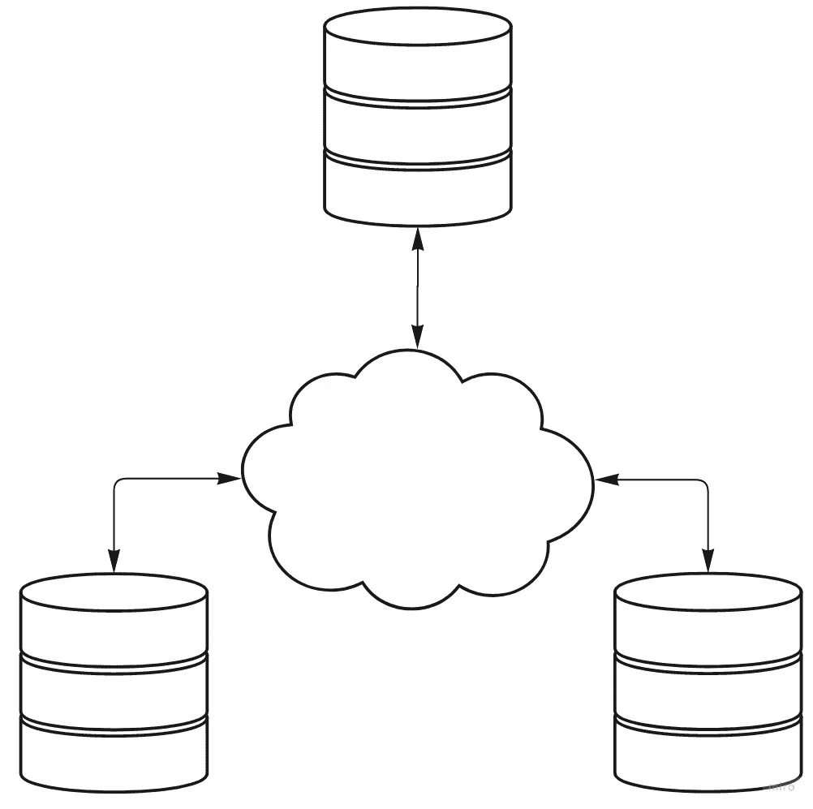

# 微服务:为什么我们认为沟通是错误的

> 原文：<https://itnext.io/microservices-why-we-think-about-communication-wrong-d7590847cc8d?source=collection_archive---------2----------------------->

在之前的系列文章中，我们已经确定微服务缺乏一致性保证。在这个新的系列中，我们将看看什么是一致性保证，它们必须遵循什么样的原则，并对这种系统的硬限制进行推理。

[https://andrasgerlits . medium . com/why-developing-micro services-look-so-easy-if-its so-hard-d 72 a 28 ce 7 be 1](https://andrasgerlits.medium.com/why-does-developing-microservices-look-so-easy-if-its-so-hard-d72a28ce7be1)

一致的系统是由它对事件排序的能力来定义的。由此可见，一个一致的分布式系统是一个可以在任意数量的计算机之间通知用户任意数量的事件顺序的系统。如果你有这样一个系统，你可以建立一个数据库，基本上所有开发人员都熟悉。拥有一个响应迅速的分布式数据库在很大程度上是一个未解决的(并且被认为是无法解决的)问题，超出了一些固定的限制。在本文中，我们将深入探讨我们如何思考这种系统，当前感知的限制是什么，它们实际上有什么样的限制，并定义可以建立的这种系统的最佳可能。

# 数据库和订单

首先，一些定义。我们的系统为事件排序。我们可以(有点懒洋洋地)说，它们是“系统收集的一些信息”。更难的是什么是“秩序”。在我们的日常生活中，我们把点餐和数数联系在一起。我们一个接一个地执行食谱中编号的步骤，最后，我们有了一个蛋糕。对于长期记录，我们通常依靠时钟(和日期，但日期也是由时钟定义的)。例如，我们按照收到文档的顺序存储文档。它们通常标有日期，甚至有时间戳，以确定它们在全球秩序中的位置。

为什么？为什么我们需要不同事件之间的单一订单？我们在这里试图实现的是什么？我们试图向我们的用户展示一个在数据库中建模的“一致的世界观”。例如，如果我们的系统显示 John 购买了 5 月 23 日起飞的 TU837 航班的座位 32A，我们不能将它也卖给 Mary。这种限制已经说明了一些后果。首先，任何单一信息都需要一个物理位置。如果没有在某个地方对某条信息进行排序，玛丽和约翰的计算机可能会在谁赢的问题上“意见不一”。如果没有中央计算机，他们中的任何一个都可以决定购买该票，他们都可以在自己的计算机上看到该票，并在其他人也这样做的信息到达他们之前购买该票。它们彼此离得越远，问题就越频繁，但是即使计算机紧挨着放置，也需要为这些可能性做好计划。

## 物理时钟

在我们的生活中，我们将时钟视为时间的共同定义，因此也是近似的顺序。他们被期望有小的差异，所以当协调像“下午 6 点见面”这样的行动时，我们直觉地应用一些小的公差。这在我们心中根深蒂固。这导致了一种共同的错觉，认为只要我们的时钟调得足够精确，就存在一个我们都能遵守的宇宙时间坐标。这正是目前大多数分布式数据库的构建方式。每一组相互靠近的计算机都有一个非常精确的时钟，与所有其他位于远处的时钟相一致。这些系统中最好的例子(由谷歌建立)在任何两个这样的时钟之间有 7 毫秒的公差。这是通过花费大量的金钱和精力来调优和维护这个设置来实现的。参与这些系统的任何计算机都必须能够以微小的延迟“观察”这样的时钟。由于运行这些时钟是昂贵的，并且由于计算机必须非常靠近它们才能工作，这使得这些系统既昂贵又庞大。他们对时间的共同理解变成了一堵墙，越过这堵墙，一切都没有意义。换句话说，扩展这些系统受到这种时钟的本地可用性及其在系统中的参与的限制。因此，您必须将系统可以访问的所有数据移动到这些数据库中。一旦你有了多个这样的数据库，或者你需要它们与谷歌指定的数据中心之外的其他计算机交流，这些承诺就失效了。

## 时钟是由什么构成的？

假设我们要么没有这样的时钟，不想把我们所有的数据都转移到谷歌云中，要么我们想让世界上的任何一台计算机都参与到我们的一致系统中。我们能做什么？是什么让谷歌建立了一个可以在遥远的地方工作的系统？不是时钟本身，而是它们相信任何两个时钟之间的偏差不会超过几毫秒的能力。换句话说:他们共同的想法是，他们可以在 7 毫秒的误差范围内可靠地“告诉”任何其他地方的时间。因此，每当他们看本地时钟时，他们也能了解到远处时钟的当前状态。这是运行系统的实际动力，时钟只是让这一切发生。这个原则的缺点也是正确的:他们只能允许谷歌信任的这个系统中的时钟来满足这个要求。单个流氓时钟可能会破坏整个系统的这些保证，不管它们在哪里。

由此可见，分布式时钟是计算机之间的某种共享解决方案，用于可靠地了解可能相距遥远的信息之间的排序信息。注意语言。我们在用距离换时间。这不是巧合。在任何分布式系统中，我们都必须从其他系统获取信息，为此，我们需要花费一些时间。

我们在学校都学过，当我们凝视星星时，我们实际上是在看它们几千年或几百万年前的图像。换句话说，当我们看更远的东西时，我们看的还是以前的样子。计算机网络通信的物理限制使得情况变得更糟。自从我们“查看”远程系统以来，它所保存的信息可能已经改变。反之亦然。在我们等待交易所另一端的计算机的结果时，离我们较近的信息也可能发生了变化。这导致了我们所认为的“真相”的不确定性。如果我们向远程系统请求某些东西(基于我们开始时发现的一些本地信息),如果本地信息在此期间发生变化，我们该怎么办？

不管这个问题的答案是什么，我们都必须做出一些不舒服的权衡。无论我们选择如何解决这个问题，我们都需要以某种方式为客户建立一个特定的“时间”点，我们可以比较信息并确定它是“早”还是“晚”。让我们总结一下到目前为止我们对一致性系统的了解。首先，它有一个共同的想法，即如何理解整个系统中任何其他计算机的“时间”概念，以及如何将远程时间与本地时间进行比较。其次，它需要决定如何处理我们刚刚讨论过的“信息不对称”。

请注意，我们一直在谈论时间和空间(交流)以及它们之间的权衡。在 CockroachDB 这样的系统中，精确物理时间的缺失通过计算机之间更多的通信来弥补。再说一次，这不是巧合。每当我们在查看遥远的信息时，我们都在进行时间旅行，所以为了让客户理解呈现给他们的信息，我们还必须“冻结”当地时间的进展(从我们客户的角度来看)。事实是时间和交流是紧密相连的。当在物理课上讨论时，这是显而易见的，但是在计算机科学文献中，它的分支大多被忽略了。

## 定义时钟

我们在文章开头说过，世界时间坐标是一种错觉。不可避免的事实是，时间与测量它的地方有着内在的联系。时间在山顶和山脚流动的方式不同。在物理意义上，我的时间在足够精确的尺度上对任何其他人都没有任何意义，因此任何在不同系统之间订购信息的系统都必须在如何克服这一事实的政策上做出任意选择。对我们来说，选择“挂钟”可能很直观，但这并不意味着它比其他方法更“正确”。我们对“分布式时钟”的定义在本文中已经讨论了很多，所以让我们把它放在一边:

> 分布式时钟是一个系统，它允许我们用标签来标记输入的信息，当与来自任何其他计算机的其他此类标签相比时，该标签可以是“之前”、“之后”或“同时”。

这个定义令人惊讶的结果是，我们的系统与其计算机之间的通信方式也是一种时钟。来自远程计算机的输入信息必须以某种方式重新标记，以便可以与我们的本地信息进行比较。在某种意义上，通信算法是一个元时钟，它协调来自系统内多个时钟的信息。认识到这个事实可以帮助我们改进我们的分布式系统。

# 摘要

## 网络是嘈杂的地方

我们简单提到了计算机网络是善变的野兽。它们中断了通信信道，通常不可预测，并给我们留下了计算机间信息交流速度的巨大差异。围绕这一事实的一个观察(以及这些属性如何与一致的系统相关)几乎已经成为分布式系统固有问题的同义词。这就是所谓的“上限定理”。一种解释方式是，当我们等待来自远程计算机的信息时，该信息延迟了，我们需要在等待更长时间或向客户端提供潜在的不完整信息之间做出选择。我们将在下一篇文章中讨论网络噪声的影响，目前，我们只想将问题简化为“网络延迟”的问题，即:我们如何处理网络交付时间天生不可靠的问题？

## 时钟、交流和意义

您是否注意到我们是如何将“本地”和“远程”信息归入整洁的存储桶中的？显然，这是一种武断的看待事物的方式。有多本地？有多远？本地在哪里结束，远程从哪里开始？除了这种二进制，我们需要讨论距离的尺度，以及如何将其转化为我们对当地时间的理解。我们已经讨论过，系统可以用其时钟和将远程时钟值转换为本地时钟值的算法来描述，因此我们将在这个框架中讨论我们的理想系统。

我们将理想系统定义为允许我们尽可能快地读取和转换远程和本地计算机之间的时钟值的系统。理想情况下，它应该能够以完美的准确度在远程时钟之间进行即时翻译，尽可能减轻网络延迟的影响，并尽可能快地完成所有这些工作。

我们将在下一篇文章中讨论这样一个系统。

[https://medium.com/p/653a245915b](https://medium.com/p/653a245915b)