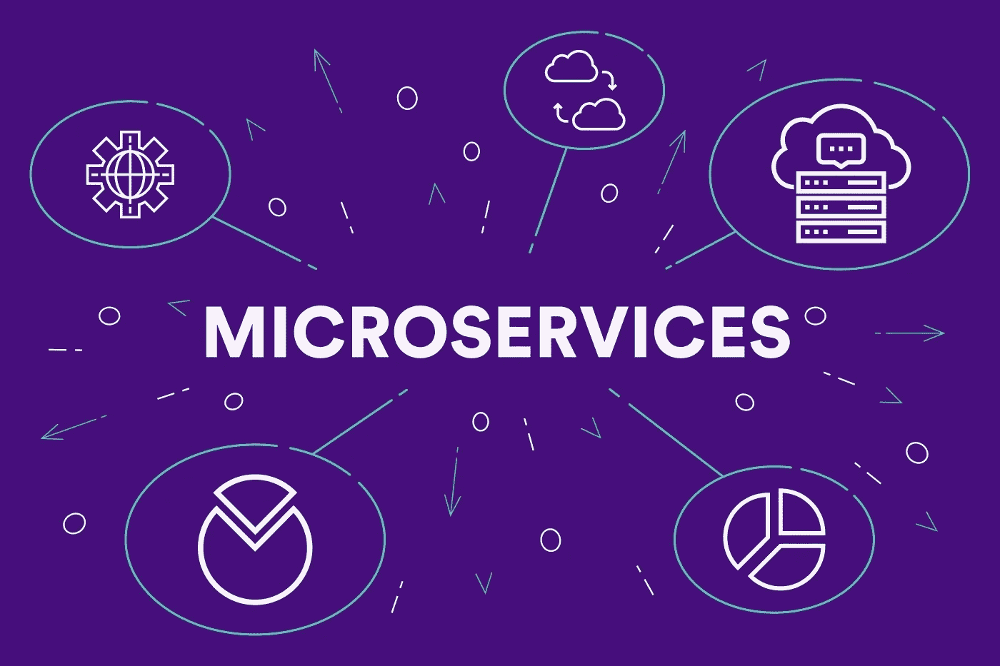

# 具有无服务器框架的微服务

> 原文：<https://itnext.io/microservices-with-serverless-framework-3a4ee4d721ed?source=collection_archive---------0----------------------->



构建易于扩展的解决方案似乎总是将架构放在微服务上；然而，当试图采用减少基础设施和利用 AWS Lambda 等技术的更多无服务器解决方案时，这似乎有点棘手。经过多次实验后，我将尝试为我的项目设计一个可行的解决方案。

# 不要被困在教程中


很容易在网上找到一些很棒的教程，然后开始跟着做一些东西，但是这很快就会让你得到一个很棒的教程设计的解决方案，而不是你可以继续做下去的东西。依靠你的微服务经验，看看你想要达到的目标，这真的很重要

1.  一个独立且可单独测试的架构
2.  与服务相关的 API，但是可以连接到一组更大的 API
3.  由服务拥有和管理的数据

# 分解任务

有些人可能会在这一点上与我争论，但我喜欢在单一回购中建立服务。它允许开发人员在代码库中看到服务的所有部分，但如果多人在一起工作，则需要良好的代码管理过程。我将给出一个我喜欢使用的文件夹结构。我也倾向于在 VS 代码中使用 devContainers，并在文件夹顶部设置林挺，但我不会花任何时间来设置它。

```
service/
  layers/ # this is for any AWS layers that might be created
  rest/ # outward facing REST APIs  
  graphql/ # in case you have a graphql interface
  logic/ # business logic based lambdas
  libraries/ # in here is where I keep shared libraries
  infrastructure/ # databases, message buses, etc
```

不要太在意文件夹的名字，那都是主观的，可能是有意义的，但是想法才是最重要的

**层**

我不会在这里花太多时间。这个文件夹用于设置我希望服务使用的任何 AWS Lambda 层。我尝试按服务创建图层，即使这意味着服务之间存在重叠。它允许你以这种方式更新版本而不会给其他服务带来风险。如果你不用图层，但是用了 Lambdas，我真的建议你看一看。

**REST 和 Graphql**

这很明显，对吗？你的 API 有自己的文件夹。在这里的设计中需要注意的重要一点是，您的 API 只有一个任务，即认证、授权和验证来自服务外部的输入。我们将到达逻辑文件夹，但是一般的方法是 API 不应该直接与基础设施(数据库、消息总线、S3 等)交互。这样做是为了给基础设施提供一些保护。API 有问题，通过使用这种分层的方法，你确实会因为多个 lambda 调用而导致更多的延迟(你可以用 warmers 来缩短这个时间)，但是你可以得到一个很大的好处，那就是能够收紧它们可以与之对话的权限。

这种责任的中断还允许以两种方式使用 lambdas，等待响应以便可以发送回数据，或者只是向 lambda 发送一些不需要响应的数据，以便可以更快地返回给用户。

最后一件事是让 API 独立，这样你就可以在 service.example.com 得到请求。通过这种方式，API 是完全隔离的，您可以在不中断大量代码的情况下替换它。在 AWS 中，你可以把它和 CloudFront 捆绑在一起。在这一点上，我认为总是使用区域端点。为什么你会问？你可以通过手动设置一个 CloudFront 发行版来实现与全局端点相同的功能，这样你就有更多的能力来以你想要的方式配置它。

**逻辑**

这是橡胶接触路面的地方。你把所有的处理能力都放在这里，与基础设施连接。通过将这一点从 API 代码中分离出来，您可以在不同的 API(REST 和 Graphql)中利用相同的代码，使用不同于 API 的语言，并在进行更改时将测试覆盖范围减少到逻辑而不是 API。

通过使用无服务器将它们分解到自己的部署中，您还可以在控制台中直接访问它们进行测试，或者将它们链接到管理仪表板。

**基础设施**

当使用无服务器框架时，你可以在 yml 文件中完全定义你的资源，我也支持这样做，但是有一些警告:

1.  仅定义可以移除的基础架构。像 SNS，Eventbridge 等服务，你可以删除而不会丢失数据，这是很好的选择。真的想一想，如果您在您的平台中丢弃了一个 SQS 队列或一个 DynamoDB 用户。你可能会处于恐慌状态。
2.  确保导出您构建的任何内容，以便可以在其他服务中使用。设置一个创建命名导出的资源部分可以非常方便地从服务的其他部分更快地引用基础设施。也就是说，这并不重要，因为您可以动态创建 ARNs。

我还发现了一些其他的事情，总是用你的艺名来命名你的基础设施资源。像 storeTable-dev 和 petsTable-dev 这样的东西可以帮助你知道你在接触什么，并且让开发者用一个专门为他们测试新变化的平台来提升服务。当进行单元测试时，它进入了一个没有更多模仿的世界，但是我不打算在这里深入讨论这个问题。

定义更加数据安全的基础设施时，您可以使用 Terraform、Cloudformation 或 AWS CLI(通过脚本)来完成。只要确保在您的部署脚本中，您可以有选择地构建测试环境，但不要通过代码更改来部署它。在可能的情况下，总是放上云状标志，这样你就不会犯错误而想在岩石下爬行。

# 那是一个包裹


我希望这些学习对你有所帮助。一如既往，我喜欢了解人们对不同事物的看法，所以请添加评论，这样我们就可以互相学习彼此的经验。如果你看到我们团队没有想到的东西，请大声说出来。

现在，如果你来这里寻找一个详细的一步一步设置微服务抱歉，这没有击中目标，但如果人们想了解更多的细节设置，我可以看到一个多部分的文章。