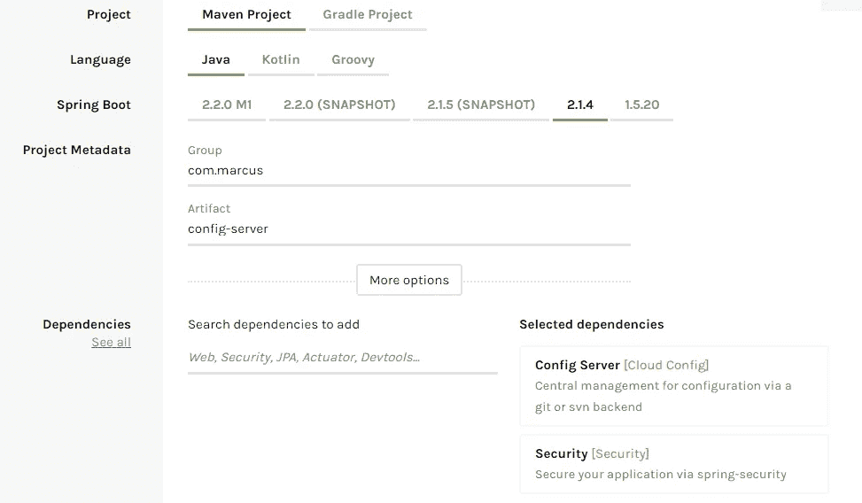
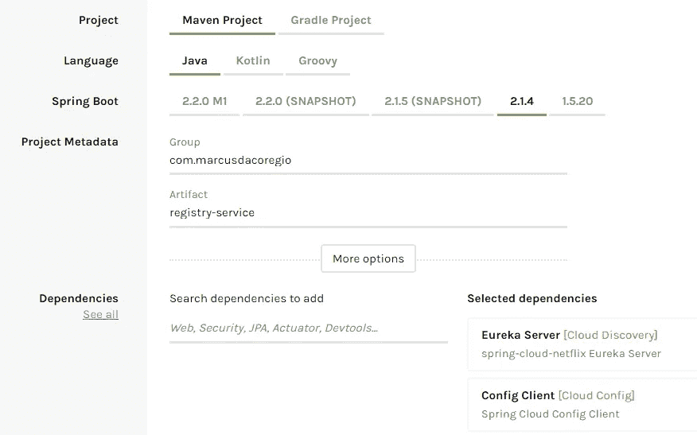
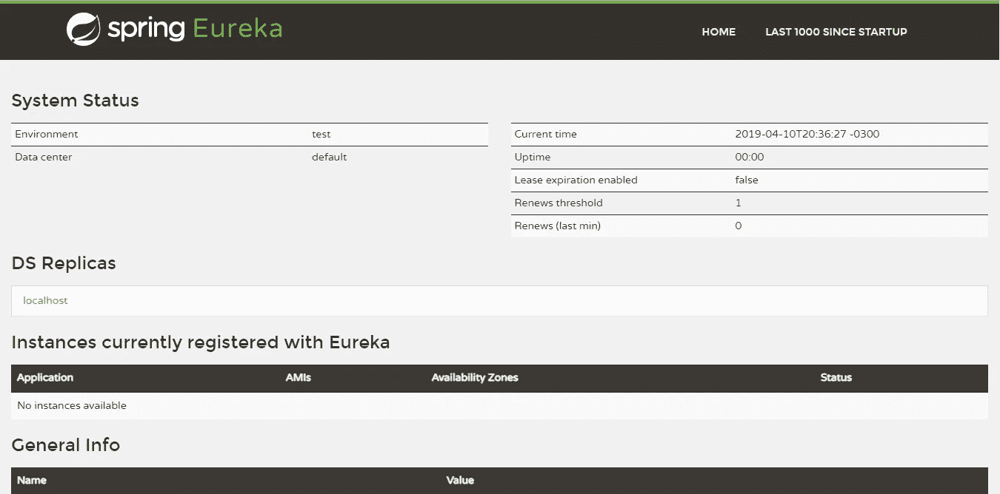
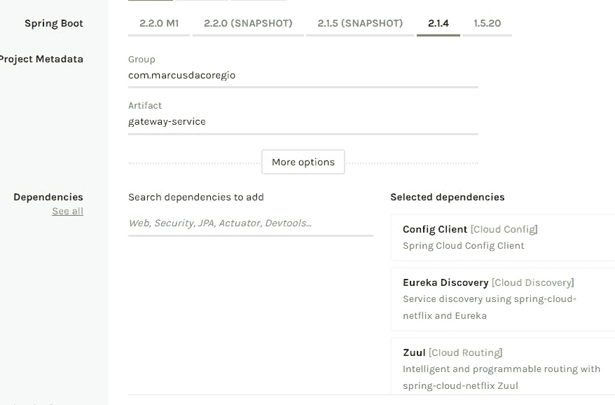
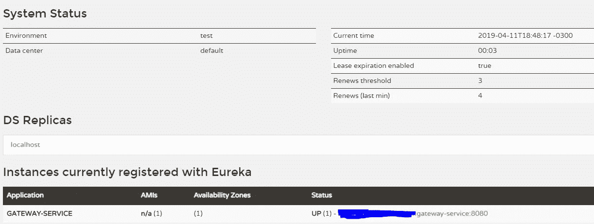

# Spring Boot 和春天云的微服务。从配置服务器到 OAuth2 服务器(没有内存内容)—第 1 部分

> 原文：<https://itnext.io/microservices-with-spring-boot-and-spring-cloud-16d2c056ba12?source=collection_archive---------1----------------------->

在本指南中，我们将使用 Spring Boot、Spring Cloud 和 MongoDB 构建一个工作应用程序，该应用程序将在微服务架构中创建用户并验证/授权用户和客户端。
我不会使用我们总是在大多数指南中看到的 **inMemory** 配置。

本指南将由 3 部分组成:
第一部分:创建配置、注册表和网关服务；
[第二部分](/microservices-with-spring-boot-and-spring-cloud-20f689b17fc7):创建认证服务，对用户进行认证；
[第三部分](https://medium.com/@marcusdacoregio/microservices-with-spring-boot-and-spring-cloud-441e3dabc67d):创建账号服务，注册新用户的那个；

我假设您已经对微服务和 Spring Boot 有所了解。

# 创建配置服务

config 应用程序将负责为每个服务提供 spring 配置。有了它，您可以集中您的配置文件，并根据您的工作环境(如开发、QA 或生产)将它们分开。[这里](https://cloud.spring.io/spring-cloud-config/multi/multi__spring_cloud_config_server.html)是对配置服务器更详细的解释。

我将使用 [Spring Initializr](https://start.spring.io/) 生成项目，它将在 [GitHub repo](https://github.com/marcusdacoregio/oauth2-spring-boot) 中可用。配置将如下所示:



生成配置服务

我们需要在`ConfigServerApplication`类中添加注释`@EnableConfigServer`。

```
@SpringBootApplication
@EnableConfigServer
public class ConfigServerApplication {
    public static void main(String[] args) {
        SpringApplication.*run*(ConfigServerApplication.class, args);
    }
}
```

这个注释告诉 Spring 这个应用程序将作为一个配置服务器。

现在我们将把`application.properties`文件重命名为`application.yml`，并将这些配置添加到其中:

```
**spring**:
  **cloud**:
    **config**:
      **server**:
        **native**:
          **search-locations**: classpath:/shared *#tells spring where to locate the config files* **profiles**:
    **active**: native *#we are using native because the config server uses a git repo by default* **security**:
    **user**:
      **password**: 1234 *#the password which apps will use to access its configurations* **server**:
  **port**: 8888 *#the port where the config-server will be acessible*
```

在`resources`文件夹中创建文件夹`shared`。在刚刚创建的文件夹中创建另一个包含以下内容的`application.yml`:

```
*#This configuration file will hold common configs to be shared among all files* **eureka**:
  **instance**:
    **prefer-ip-address**: false
  **client**:
    **serviceUrl**:
      **defaultZone**: [http://localhost:8761/eureka/](http://localhost:8761/eureka/) #where our registry server is located

**security**:
  **oauth2**:
    **resource**:
      **user-info-uri**: [http://auth-service/uaa/users/current](http://auth-service/uaa/users/current) #which uri will be used to find the user
```

让我们运行应用程序并访问[http://localhost:8888/actuator/health](http://localhost:8888/actuator/health)。您应该会看到这样的消息:

{"status":"UP"}

# 创建注册表服务

现在我们将使用网飞尤里卡来构建注册服务。这个服务负责注册和发现我们应该构建的许多服务。这样，我们不需要知道我们创建的每个服务的 IP 地址，我们只需要知道它们的名称，剩下的工作由 discovery 完成。

让我们使用 [Spring Initializr](https://start.spring.io/) 生成项目:



生成注册表服务

打开`RegistryServiceApplication`类并添加`@EnableEurekaServer`注释，如下所示:

```
@SpringBootApplication
@EnableEurekaServer
public class RegistryServiceApplication {
    public static void main(String[] args) {
        SpringApplication.*run*(RegistryServiceApplication.class, args);
    }
}
```

这个注释告诉 Spring 激活与 Eureka 服务器相关的配置。

删除文件`application.properties`，在 resources 文件夹下创建一个名为`bootstrap.yml`的文件，内容如下:

```
*#This file is the entrypoint for spring to know where to look for the configuration file and hold the initial configuration* **spring**:
  **application**:
    **name**: registry-service *#name of the application* **cloud**:
    **config**:
      **uri**: http://localhost:8888 *#where the config-service is running* **fail-fast**: true *#the service will not run if it can't reach the config-service* **password**: 1234 *#password of the config-service* **username**: user *#username of the config-service* **eureka**:
  **instance**:
    **prefer-ip-address**: true *#when the application registers with eureka, it uses its IP address rather than its hostname* **client**:
    **registerWithEureka**: false *#tells the built-in eureka client to not register itself with eureka, because we should act as a server* **fetchRegistry**: false
```

我们告诉注册服务查看 [http://localhost:8888](http://localhost:8888) 来找到它的配置，所以我们需要在配置服务上为它创建一个配置文件。

在`config-service/resources/shared`文件夹中，我们创建一个名为`registry-service.yml`的文件，内容如下:

```
**server**:
  **port**: 8761 *#the default port used for eureka servers*
```

现在运行 config-service 和 registry-service，并访问 [http://localhost:8761/](http://localhost:8761/) 。您应该会看到这样一个页面:



尤里卡仪表板视图

在那里您可以找到注册到 Eureka 服务器的服务。

当查找它的配置时，服务将搜索与在`bootstrap.yml`文件的`spring.application.name`属性中定义的名称相同的配置。您甚至可以访问[http://localhost:8888/registry-service/default](http://localhost:8888/registry-service/default)，以用户名 user 和密码 1234 进行身份验证来查看配置。

# 创建网关服务

现在我们将使用 [Spring 网飞 Zuul](https://cloud.spring.io/spring-cloud-netflix/multi/multi__router_and_filter_zuul.html) 构建网关服务。该服务负责将传入的请求映射到特定的微服务，它也可以充当负载平衡器。

让我们使用 [Spring Initializr](https://start.spring.io/) 生成项目:



生成网关服务

我们需要给我们的主类`GatewayServiceApplication`添加两个注释:

```
@SpringBootApplication
@EnableDiscoveryClient
@EnableZuulProxy
public class GatewayServiceApplication {
    public static void main(String[] args) {
        SpringApplication.*run*(GatewayServiceApplication.class, args);
    }
}
```

`@EnableDiscoveryClient`告诉 Spring 启用发现客户端实现。

设置一个 Zuul 服务器，这样它就可以将请求转发给其他服务。该服务可以通过配置或通过 Discovery (Eureka)服务器手动配置。

在`application.properties`的位置创建`bootstrap.yml`文件，内容与注册表服务几乎相同:

```
**spring**:
  **application**:
    **name**: gateway-service
  **cloud**:
    **config**:
      **uri**: http://localhost:8888
      **fail-fast**: true
      **password**: 1234
      **username**: user
```

现在我们需要为网关服务创建配置文件。

在`config-service/resources/shared`文件夹中，我们创建一个名为`gateway-service.yml`的文件，内容如下:

```
**zuul**:
  **ignoredServices**: '*'
  **host**:
    **connect-timeout-millis**: 20000
    **socket-timeout-millis**: 20000

  **routes**:
    **auth-service**:
      **path**: /uaa/** *#path that will be intercepted* **url**: auth-service *#which url the request will e mapped to* **stripPrefix**: false *#if zuul should replace the "/uaa/" segment* **sensitiveHeaders**:

    **account-service**:
      **path**: /accounts/**
      **serviceId**: account-service
      **stripPrefix**: false
      **sensitiveHeaders**:

**server**:
  **port**: 8080
```

在本指南的后面部分，我给出了一些我们需要的配置。

现在，您可以运行您的网关服务应用程序并访问 [http://localhost:8761/](http://localhost:8761/) 来查看该服务是否在 Eureka 服务器中注册。您应该会看到类似这样的内容:



运行网关服务实例的 Eureka 服务器视图

就这样，我们完成了本指南的第一部分。我们已经创建了微服务架构的基础。

在第二部分中，我们将创建 auth 服务，它将对用户和客户机进行身份验证和授权。我期待着听到你们的任何问题。如果这个指南对你有帮助，请告诉我。

记住代码可以在 [GitHub](https://github.com/marcusdacoregio/oauth2-spring-boot) 上找到。

第二部分可用[此处](https://medium.com/@marcusdacoregio/microservices-with-spring-boot-and-spring-cloud-20f689b17fc7)。
第三部快到了。