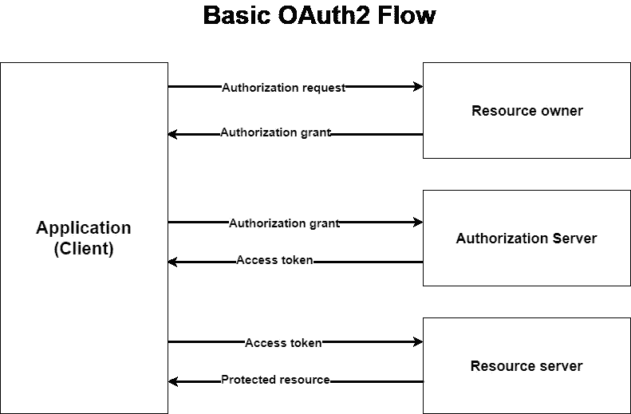
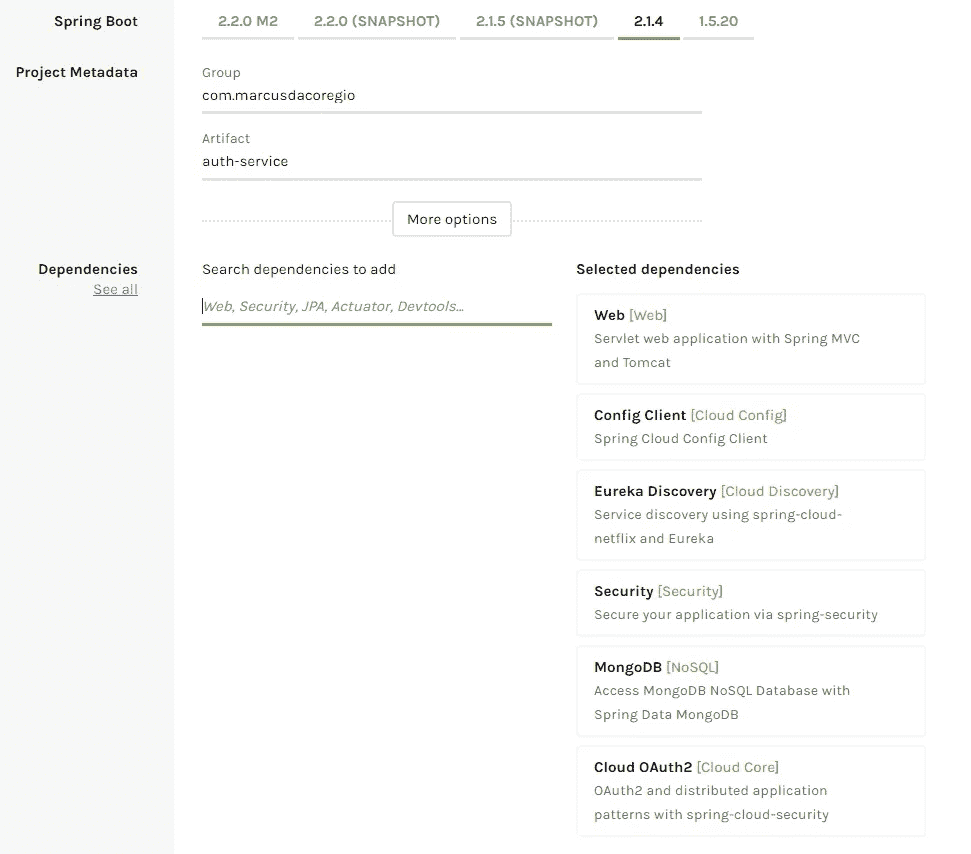
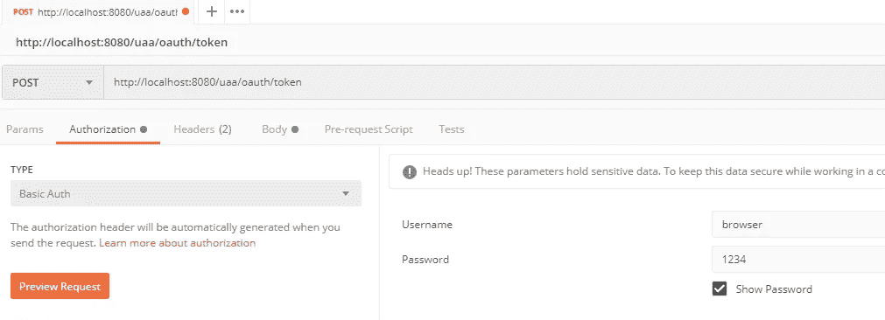
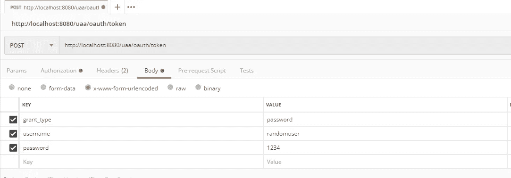

# Spring Boot 和春天云的微服务。从配置服务器到 OAuth2 服务器(没有内存内容)—第 2 部分

> 原文：<https://itnext.io/microservices-with-spring-boot-and-spring-cloud-20f689b17fc7?source=collection_archive---------0----------------------->



大家好，在这第二部分，我们将建立认证服务。这就是我们在这本指南中要找的人。
第一部分可用[此处](/microservices-with-spring-boot-and-spring-cloud-16d2c056ba12)。

我们不会使用那些 ***inMemory*** 配置，auth 服务将构建在 MongoDB 之上，能够创建用户、对他们进行身份验证、存储他们的令牌/刷新令牌，并在需要时撤销它。

记住代码可以在 [GitHub](https://github.com/marcusdacoregio/oauth2-spring-boot) 上找到。

# 创建身份验证服务

让我们开始创建授权服务，我们将使用 [Spring Initializr](https://start.spring.io/) 来创建 maven 项目。像图像一样生成它。



## 添加注释

在您喜欢的 IDE 中导入生成的项目。
打开`AuthServiceApplication`类添加一些注释。从`@EnableResourceServer`注释开始，它将启用一个 Spring 安全过滤器，通过一个传入的 OAuth2 令牌对请求进行身份验证。

下一个是我们已经知道的`@EnableDiscoveryClient`，它将允许发现客户端实现让我们的认证服务在注册服务中注册。

最后一个是`@EnableGlobalMethodSecurity`，启用 Spring Security 全局方法安全。将注释中的`prePostEnabled` 字段设置为`true`以启用 Spring Security 的 pre post 注释，我们稍后会用到它们。

```
@SpringBootApplication
@EnableResourceServer
@EnableDiscoveryClient
@EnableGlobalMethodSecurity(prePostEnabled = true)
public class AuthServiceApplication {
    public static void main(String[] args) {
        SpringApplication.*run*(AuthServiceApplication.class, args);
    }
}
```

## 添加应用程序的配置文件

将`application.properties`文件重命名为`bootstrap.yml`，并添加以下配置:

```
**spring**:
  **application**:
    **name**: auth-service
  **cloud**:
    **config**:
      **uri**: http://localhost:8888
      **fail-fast**: true **password**: 1234
      **username**: user
```

在配置服务应用程序中，创建`auth-service.yml`文件来保存授权服务的配置。

```
**spring**:
  **data**:
    **mongodb**:
      **host**: localhost
      **port**: 27017
      **username**: oauth-user
      **password**: password
      **database**: oauth-db**server**:
  **servlet**:
    **context-path**: /uaa
  **port**: 8081
```

如果你不知道为什么创建这些文件，我推荐你阅读这篇[文章的第一部分。](/microservices-with-spring-boot-and-spring-cloud-16d2c056ba12)

## 创建域实体及其 DAO

让我们开始创建**权限枚举。**

```
import org.springframework.security.core.GrantedAuthority;

public enum Authorities implements GrantedAuthority {
    *ROLE_USER*;

    @Override
    public String getAuthority() {
        return name();
    }
}
```

这个 enum 负责定义我们的 auth 服务的权限，它实现了代表授予一个 [Authentication](https://docs.spring.io/spring-security/site/docs/4.2.11.RELEASE/apidocs/org/springframework/security/core/Authentication.html) 对象的权限的`GrantedAuthority`接口。

现在创建用户实体来代表我们的用户。

```
@Document
public class User implements UserDetails {
    @Id
    private String id;

    @Indexed(unique = true)
    private String username;

    private String password;

    private boolean activated;

    private String activationKey;

    private String resetPasswordKey;

    private Set<Authorities> authorities = new HashSet<>(); ...getters and setters
}
```

为了简单起见，我省略了 getters 和 setters，但是您可以在这里检查它们。`User`类实现了`UserDetails`接口，该接口提供了要封装到认证对象中的核心用户信息。`@Document`、`@Id`和`@Indexed`注释是 Mongo 用的，这里就不赘述了，可以在评论区问。

创建**用户存储库**作为我们的 DAO。

```
import com.marcusdacoregio.authservice.domain.User;
import org.springframework.data.mongodb.repository.MongoRepository;
import org.springframework.stereotype.Repository;

import java.util.Optional;

@Repository
public interface UserRepository extends MongoRepository<User, String> {
    Optional<User> findByUsername(String username);
}
```

现在是我们的定制实现`UserDetailsService`，它是一个加载用户特定数据的核心接口。它作为用户 DAO 在整个 spring 框架中使用，并且是 DaoAuthenticationProvider 使用的策略。你可以在[官方文档](https://docs.spring.io/spring-security/site/docs/5.1.5.RELEASE/api/org/springframework/security/core/userdetails/UserDetailsService.html)中了解更多。

```
@Service
public class CustomUserDetailsService implements UserDetailsService {

    private final UserRepository userRepository;

    public CustomUserDetailsService(UserRepository userRepository) {
        this.userRepository = userRepository;
    }

    @Override
    public UserDetails loadUserByUsername(String username) throws UsernameNotFoundException {
        return userRepository.findByUsername(username)
                .orElseThrow(() -> new UsernameNotFoundException("Username " + username + " not found"));
    }

}
```

好了，到这里为止，我们创建了一些需要的类来处理我们的用户。

现在我们将创建一些类来处理我们的客户机，这些客户机是想要使用身份验证的资源服务器。让我们从表示授权客户端细节的类开始。

```
@Document
public class AuthClientDetails implements ClientDetails {
    private static final long *serialVersionUID* = 1L;

    @Id
    private String id;

    private String clientId;

    private String clientSecret;

    private String grantTypes;

    private String scopes;

    private String resources;

    private String redirectUris;

    private Integer accessTokenValidity;

    private Integer refreshTokenValidity;

    private String additionalInformation; ...getters and setters
}
```

你可以在这里查看这个类的 getters 和 setters 的详细信息。查看`ClientDetails`的[文档](https://docs.spring.io/spring-security/oauth/apidocs/org/springframework/security/oauth2/provider/ClientDetails.html)会很不错。

下一个类是`AuthClientRepository`为`AuthClientDetails`做我们的刀。

```
@Repository
public interface AuthClientRepository extends MongoRepository<AuthClientDetails, String> { Optional<AuthClientDetails> findByClientId(String clientId);}
```

现在是类`AuthClientDetailsService`，它实现了[**ClientDetailsService**](https://docs.spring.io/spring-security/oauth/apidocs/org/springframework/security/oauth2/provider/ClientDetailsService.html)**，这是一个提供 OAuth2 客户端细节的服务接口。**

```
@Service
public class AuthClientDetailsService implements ClientDetailsService {
    private final AuthClientRepository authClientRepository;

    public AuthClientDetailsService(AuthClientRepository authClientRepository) {
        this.authClientRepository = authClientRepository;
    }

    @Override
    public ClientDetails loadClientByClientId(String clientId) {
        return authClientRepository.findByClientId(clientId).orElseThrow(IllegalArgumentException::new);
    }
}
```

**在下一节中，我们将在 Spring 中开始配置安全性和 OAuth2。**

## **在 Spring 中配置安全性和 OAuth2**

**从`WebSecurityConfig`类开始，它将扩展`WebSecurityConfigurerAdapter`抽象类。**

**在它上面，我们定义了一些安全的东西和我们的`AuthenticationManager`，以利用我们之前创建的`CustomUserDetailsService`。**

```
@Configuration
public class WebSecurityConfig extends WebSecurityConfigurerAdapter {

    @Autowired
    private CustomUserDetailsService userDetailsService;

    @Override
    protected void configure(HttpSecurity http) throws Exception {
        // @formatter:off
        http
                .authorizeRequests().anyRequest().authenticated()
                .antMatchers("/oauth/**").permitAll()
                .and()
                .csrf().disable();
        // @formatter:on
    }

    @Override
    protected void configure(AuthenticationManagerBuilder auth) throws Exception {
        auth.userDetailsService(userDetailsService)
                .passwordEncoder(passwordEncoder());
    }

    @Override
    @Bean
    public AuthenticationManager authenticationManagerBean() throws Exception {
        return super.authenticationManagerBean();
    }

    @Bean
    public PasswordEncoder passwordEncoder() {
        return new BCryptPasswordEncoder();
    }

}
```

**我们将 Spring Security 配置为授权任何经过身份验证的请求，但是允许在 ***/oauth/***** 端点上的任何请求，即使没有经过身份验证。
我们确实将`CustomUserDetailsService`设置为由[**AuthenticationManager**](https://docs.spring.io/spring-security/site/docs/5.1.5.RELEASE/api/org/springframework/security/authentication/AuthenticationManager.html)**使用，并定义了密码编码器来使用[**BCryptPasswordEncoder**](https://docs.spring.io/spring-security/site/docs/5.1.5.RELEASE/api/org/springframework/security/crypto/bcrypt/BCryptPasswordEncoder.html)中的实现。****

****现在创建`OAuth2AuthorizationCofig`，它充当配置 OAuth2 授权服务器的策略。****

```
**@Configuration
@EnableAuthorizationServer
public class OAuth2AuthorizationConfig extends AuthorizationServerConfigurerAdapter {

    @Autowired
    @Qualifier("authenticationManagerBean")
    private AuthenticationManager authenticationManager;

    @Autowired
    private CustomUserDetailsService userDetailsService;

    @Autowired
    private AuthClientDetailsService authClientDetailsService;

    @Autowired
    private PasswordEncoder encoder;

    @Override
    public void configure(ClientDetailsServiceConfigurer clients) throws Exception {
        clients.withClientDetails(authClientDetailsService);
    }

    @Bean
    public TokenStore tokenStore() {
        return new MongoTokenStore();
    }

    @Override
    public void configure(AuthorizationServerEndpointsConfigurer endpoints) throws Exception {
        endpoints
                .tokenStore(tokenStore())
                .authenticationManager(authenticationManager)
                .userDetailsService(userDetailsService);
    }

    @Override
    public void configure(AuthorizationServerSecurityConfigurer oauthServer) throws Exception {
        oauthServer
                .tokenKeyAccess("permitAll()")
                .checkTokenAccess("isAuthenticated()")
                .passwordEncoder(encoder)
                .allowFormAuthenticationForClients();
    }

}**
```

****`@EnableAuthorizationServer`启用一个 [**授权端点**](https://docs.spring.io/spring-security/oauth/apidocs/org/springframework/security/oauth2/provider/endpoint/AuthorizationEndpoint.html) 和一个 [**令牌端点**](https://docs.spring.io/spring-security/oauth/apidocs/org/springframework/security/oauth2/provider/endpoint/TokenEndpoint.html) 公开端点用于认证和授权。****

****我们定义了要使用的`AuthClientDetailsService`实现，以及一个定制的[**token store**](https://docs.spring.io/spring-security/oauth/apidocs/org/springframework/security/oauth2/provider/token/TokenStore.html)**实现来使用 MongoDB 存储生成的令牌。我想让你在这里检查一下 [**MongoTokenStore** 的实现，还有](https://github.com/marcusdacoregio/oauth2-spring-boot/blob/master/auth-service/src/main/java/com/marcusdacoregio/authservice/config/mongodb/MongoTokenStore.java) [MongoConfig](https://github.com/marcusdacoregio/oauth2-spring-boot/blob/master/auth-service/src/main/java/com/marcusdacoregio/authservice/config/mongodb/MongoConfig.java) 和 [MongoProperties](https://github.com/marcusdacoregio/oauth2-spring-boot/blob/master/auth-service/src/main/java/com/marcusdacoregio/authservice/config/mongodb/MongoProperties.java) ，我就不放在这里了，因为会变得乱七八糟。******

****我已经创建了 [MongoBeeConfig](https://github.com/marcusdacoregio/oauth2-spring-boot/blob/master/auth-service/src/main/java/com/marcusdacoregio/authservice/config/mongodb/MongoBeeConfig.java) 类来在我们的 Mongo 数据库中插入一些初始数据，它使用了 [Mongobee](https://github.com/mongobee/mongobee) 库，这是一个用于 Java 的 MongoDB 数据迁移工具，就像用于关系数据库的 Flyway 或 Liquibase。我们将在之后创建这个初始数据。****

## ****用 Docker 给我们提供一个 Mongo 数据库****

****好的，到目前为止我们已经配置了 MongoDB，但是我们还没有安装它。我们将使用一个[***docker-compose***](https://github.com/marcusdacoregio/oauth2-spring-boot/blob/master/docker-compose.yml)文件为我们提供它，而不是安装和配置它。****

```
**mongo-oauth:
  image: mongo:4.0.4
  restart: always
  environment:
    MONGO_INITDB_ROOT_USERNAME: root
    MONGO_INITDB_ROOT_PASSWORD: example
    MONGO_INITDB_DATABASE: oauth-db
    MONGODB_USER: oauth-user
    MONGODB_DATABASE: oauth-db
    MONGODB_PASS: password
  log_opt:
    max-size: "10m"
    max-file: "10"
  ports:
    - 27017:27017
  volumes:
    - ./mongo-init/init-mongo.sh:/docker-entrypoint-initdb.d/init-mongo.sh

mongo-express-oauth:
  image: mongo-express:0.49
  restart: always
  ports:
    - 10081:8081
  environment:
    ME_CONFIG_MONGODB_ADMINUSERNAME: root
    ME_CONFIG_MONGODB_ADMINPASSWORD: example
    ME_CONFIG_MONGODB_SERVER: mongo-oauth
    ME_CONFIG_MONGODB_PORT: 27017
  links:
    - mongo-oauth**
```

****你需要安装 Docker([不知道 Docker 是什么？](https://medium.com/@yannmjl/what-is-docker-in-simple-english-a24e8136b90b))。在某个地方创建一个文件***docker-compose . yml***，在同一个地方，你需要有一个名为 ***mongo-init*** 的文件夹，里面有一个名为***init-mongo . sh***的文件。您可以将***init-mongo . sh***[中的内容复制到这里](https://github.com/marcusdacoregio/oauth2-spring-boot/blob/master/mongo-init/init-mongo.sh)，它用于创建数据库和用户定义的环境变量***docker-compose . yml .*******

****一旦一切就绪，在首选终端中运行命令`docker-compose up --build`来创建并启动 MongoDB 容器。****

## ****创建我们授权服务的第一个客户端****

****我们现在需要一个客户机从我们的用户那里检索访问令牌。让我们用**密码**和**刷新令牌** [授予类型](https://oauth.net/2/grant-types/)来创建他。
从 **Mongobee** 创建一个 **ChangeLog** ，在应用程序启动时插入这个客户端。用以下内容创建一个名为`InitialValuesChangeLog`的类:****

```
**@ChangeLog
public class InitialValuesChangeLog { @ChangeSet(order = "001", id = "insertBrowserClientDetails", author = "Marcus Hert Da Corégio")
    public void insertBrowserClientDetails(MongoTemplate mongoTemplate) {
        AuthClientDetails browserClientDetails = new AuthClientDetails();
        browserClientDetails.setClientId("browser");
        browserClientDetails.setClientSecret("$2a$10$fWNTd3H.u7G/aNROVQSifebOkZ2xzU5nUPOCI2Ld42M8E25/ljJqK");
        browserClientDetails.setScopes("ui");
        browserClientDetails.setGrantTypes("refresh_token,password");

        mongoTemplate.save(browserClientDetails);
    }}**
```

****其中，我们在 MongoDB 上创建了一个新的 **AuthClientDetails** ，它具有一个秘密、范围和授权类型，能够基于用户凭证获得访问令牌。
客户端秘密是从 **BCryptPasswordEncoder** 为值 **1234** 生成的散列。****

****让我们创建另一个`@ChangeSet`来创建一个**用户**，以便我们能够使用之前用于**浏览器客户端**的相同密码来验证他。我现在不会创建端点，因为这将是本文下一部分的内容:)。****

```
**@ChangeSet(order = "002", id = "insertUserToTestAuthentication", author = "Marcus Hert Da Corégio")
public void insertUserToTestAuthentication(MongoTemplate mongoTemplate) {
    Set<Authorities> authorities = new HashSet<>();
    authorities.add(Authorities.*ROLE_USER*);

    User user = new User();
    user.setActivated(true);
    user.setAuthorities(authorities);
    user.setPassword("$2a$10$fWNTd3H.u7G/aNROVQSifebOkZ2xzU5nUPOCI2Ld42M8E25/ljJqK");
    user.setUsername("randomuser");

    mongoTemplate.save(user);
}**
```

## ****测试我们到目前为止所做的事情****

****好的，现在我们将做一些请求来看看我们做的是否有效:d .我推荐你使用 [Postman](https://www.getpostman.com/) 来做 HTTP 请求。分别运行配置、注册表、网关和身份验证服务。****

****打开 Postman，让我们向[http://localhost:8080/uaa/oauth/token](http://localhost:8080/uaa/oauth/token)发出 POST 请求，为我们的 **randomuser** 和**浏览器**客户端检索一个访问令牌。****

********

****请求的授权详细信息****

********

****请求的请求正文详细信息****

****发送此请求时，我收到了以下响应正文:****

```
**{
    "access_token": "38f1a0ac-a762-4b2a-af51-45a26d97e2bd",
    "token_type": "bearer",
    "refresh_token": "fad35f6f-84e8-4c37-abc5-73c77018f885",
    "expires_in": 43199,
    "scope": "ui"
}**
```

****就这样，我们已经完成了我们要找的东西。认证终于起作用了，你可以在 [http://localhost:10081](http://localhost:10081) 通过 Mongo Express 在 MongoDB 上检查生成的令牌。****

****让我知道你是否也做了这个作品，我希望如此！****

## ****我们将在第三部分做什么****

****接下来我们要做的是创建一个帐户服务，这个应用程序将管理我们的用户，通过我们的认证服务进行认证等等。****

****检查第三部分[此处](https://medium.com/@marcusdacoregio/microservices-with-spring-boot-and-spring-cloud-441e3dabc67d)。****

****我希望你们喜欢它，随时与我分享任何问题。****