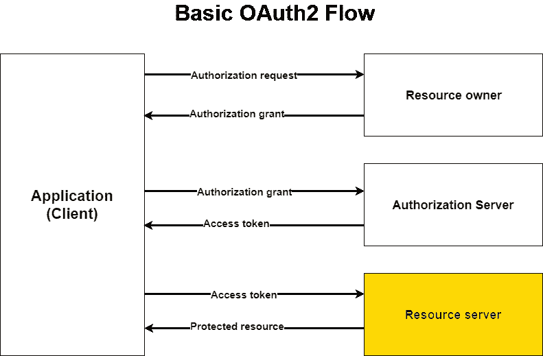
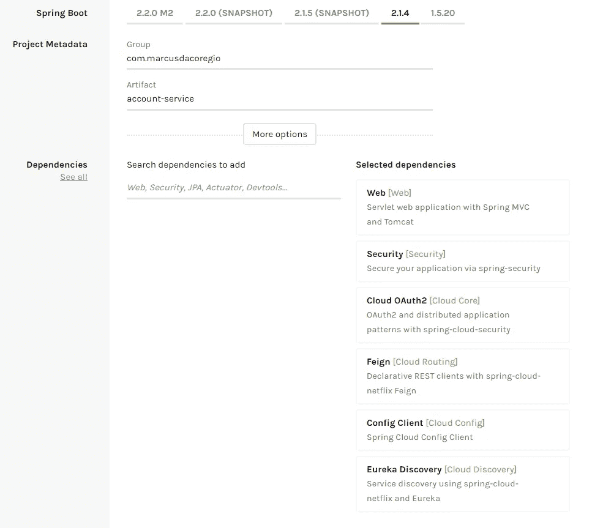
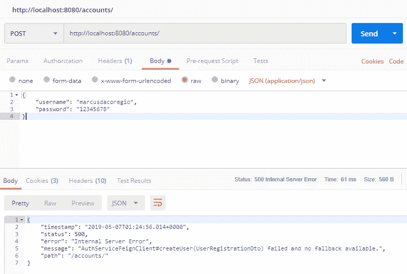
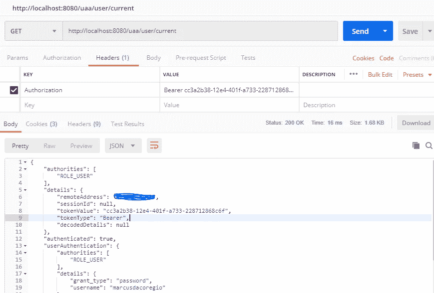

# Spring Boot 和春天云的微服务。从配置服务器到 OAuth2 服务器(没有内存内容)—第 3 部分

> 原文：<https://itnext.io/microservices-with-spring-boot-and-spring-cloud-441e3dabc67d?source=collection_archive---------2----------------------->



好了，我们到了。我们构建了一个认证服务，负责在微服务架构中对我们的用户和客户端进行认证和授权。

现在我们将构建帐户服务，这个人负责创建用户，并将为此保存业务逻辑，因为我们不会将业务逻辑放在负责身份验证/授权的服务上。我们可能要发送帐户激活电子邮件或短信，做其他处理，所以我们将这个逻辑分开。
在第三部分中，我们将学习如何使用 Spring Boot 和 Spring Cloud 创建和配置资源服务器。

## 创建帐户服务项目

像往常一样，我们将使用 [Spring Initializr](https://start.spring.io/) 为我们生成项目，如下图所示创建它。



生成帐户服务项目

## 添加应用程序的配置文件

将`application.properties`文件重命名为`bootstrap.yml`,并添加以下配置:

```
spring:
  application:
    name: account-service
  cloud:
    config:
      uri: http://localhost:8888
      fail-fast: true
      password: 1234
      username: user
  main:
    allow-bean-definition-overriding: true #i dont remember why but i think there is a bug with spring cloud and OAuth2ClientContext
```

在配置服务应用程序中，创建`account-service.yml`文件来保存授权服务的配置。

```
security:
  oauth2:
    client:
      clientId: account-service
      clientSecret: 1234
      accessTokenUri: http://localhost:8081/uaa/oauth/token
      grant-type: client_credentials
      scope: server

server:
  servlet:
    context-path: /accounts
  port: 8082

feign:
  hystrix:
    enabled: true
```

如果你不知道为什么创建这些文件，我推荐你阅读这篇文章的第一部分。

打开配置服务项目中的文件`/resources/shared/application.yml`，添加以下信息:

```
*#This configuration file will hold common configs to be shared among all files* eureka:
  instance:
    prefer-ip-address: false
  client:
    serviceUrl:
      defaultZone: http://localhost:8761/eureka/

security:
  oauth2:
    resource:
      user-info-uri: http://localhost:8080/uaa/user/current
      token-info-uri: [http://](http://auth-service/uaa/oauth/check_token)localhost:8080[/uaa/oauth/check_token](http://auth-service/uaa/oauth/check_token) **#add this information**
```

这个 URL 将从我们的资源服务器中的 auth 服务向我们提供我们的 UserDetails 实现。

## 添加注释

我们的主要客户服务类是这样的:

```
@SpringBootApplication
@EnableDiscoveryClient
@EnableOAuth2Sso
@EnableFeignClients
@EnableGlobalMethodSecurity(prePostEnabled = true)
public class AccountServiceApplication {
    public static void main(String[] args) {
        SpringApplication.*run*(AccountServiceApplication.class, args);
    }
}
```

`@EnableOAuth2Sso`将在一个使用 Spring Security 的 web 应用程序中为 OAuth2 客户端启用配置，并希望使用来自我们的 auth-service 的授权代码授权，并创建一个所有路径都安全的`WebSecurityConfigurerAdapter`。并且`@EnableFeignClients`扫描声明它们为假客户端的接口。

## 配置资源服务器

用以下内容创建一个名为`ResourceServerConfig`的类:

```
@Configuration
@EnableResourceServer
public class ResourceServerConfig extends ResourceServerConfigurerAdapter {

    private final ResourceServerProperties sso;

    private final OAuth2ClientContext oAuth2ClientContext;

    @Autowired
    public ResourceServerConfig(ResourceServerProperties sso, OAuth2ClientContext oAuth2ClientContext) {
        this.sso = sso;
        this.oAuth2ClientContext = oAuth2ClientContext;
    }

    @Bean
    @ConfigurationProperties(prefix = "security.oauth2.client")
    public ClientCredentialsResourceDetails clientCredentialsResourceDetails() {
        return new ClientCredentialsResourceDetails();
    }

    @Bean
    public RequestInterceptor oauth2FeignRequestInterceptor() {
        return new OAuth2FeignRequestInterceptor(oAuth2ClientContext, clientCredentialsResourceDetails());
    }

    @Bean
    public OAuth2RestOperations restTemplate(OAuth2ClientContext oauth2ClientContext) {
        return new OAuth2RestTemplate(clientCredentialsResourceDetails(), oauth2ClientContext);
    }

    @Bean
    @Primary
    public ResourceServerTokenServices resourceServerTokenServices() {
        return new UserInfoTokenServices(sso.getUserInfoUri(), sso.getClientId());
    }

    @Override
    public void configure(HttpSecurity http) throws Exception {
        http.authorizeRequests()
                .antMatchers(HttpMethod.*POST*, "/").permitAll()
                .antMatchers(HttpMethod.*OPTIONS*, "/").permitAll()
                .anyRequest().authenticated();
    }
}
```

在这个类中，我们配置我们的资源服务器来允许任何 POST 请求到`/accounts/`路径，因为想要创建新帐户的人没有登录。任何其他请求都需要进行身份验证。
此外，我们正在配置 Feign 使用一个 [OAuh2RestTemplate](https://docs.spring.io/spring-security/oauth/apidocs/org/springframework/security/oauth2/client/OAuth2RestTemplate.html) 来发出认证请求。

## 在授权服务中插入帐户服务客户端详细信息

由于我们正在创建另一个微服务，我们需要将其注册为我们的 auth 服务的客户端。
打开 auth service 项目上的`InitialValuesChangeLog`类，添加另一个`ChangeSet`。

```
@ChangeSet(order = "003", id = "insertAccountServiceClientDetails", author = "Marcus Hert Da Corégio")
public void insertAccountServiceClientDetails(MongoTemplate mongoTemplate) {
    AuthClientDetails accountServiceClientDetails = new AuthClientDetails();
    accountServiceClientDetails.setClientId("account-service");
    accountServiceClientDetails.setClientSecret("$2a$10$fWNTd3H.u7G/aNROVQSifebOkZ2xzU5nUPOCI2Ld42M8E25/ljJqK");
    accountServiceClientDetails.setScopes("server");
    accountServiceClientDetails.setGrantTypes("refresh_token,client_credentials");

    mongoTemplate.save(accountServiceClientDetails);
}
```

它与**浏览器**客户端几乎相同，但具有不同的[范围](https://oauth.net/2/scope/)和[授权类型](https://oauth.net/2/grant-types/)。

## 在身份验证服务中创建用户端点

在这里，我将向您列出需要对认证服务进行的更改。我不会把代码放在这里，因为它会变得太乱，相反，我会在资源库中附加类的链接。

*   [在 auth service 主类](https://github.com/marcusdacoregio/oauth2-spring-boot/blob/master/auth-service/src/main/java/com/marcusdacoregio/authservice/AuthServiceApplication.java)上添加 `[@EnableResourceServer](https://github.com/marcusdacoregio/oauth2-spring-boot/blob/master/auth-service/src/main/java/com/marcusdacoregio/authservice/AuthServiceApplication.java)` [注释。](https://github.com/marcusdacoregio/oauth2-spring-boot/blob/master/auth-service/src/main/java/com/marcusdacoregio/authservice/AuthServiceApplication.java)
*   创建[用户服务接口](https://github.com/marcusdacoregio/oauth2-spring-boot/blob/master/auth-service/src/main/java/com/marcusdacoregio/authservice/service/UserService.java)及其[实现](https://github.com/marcusdacoregio/oauth2-spring-boot/blob/master/auth-service/src/main/java/com/marcusdacoregio/authservice/service/UserServiceImpl.java)。
*   为[用户注册](https://github.com/marcusdacoregio/oauth2-spring-boot/blob/master/auth-service/src/main/java/com/marcusdacoregio/authservice/dto/UserRegistrationDto.java)和[返回用户](https://github.com/marcusdacoregio/oauth2-spring-boot/blob/master/auth-service/src/main/java/com/marcusdacoregio/authservice/dto/UserDto.java)创建 [DTO](https://en.wikipedia.org/wiki/Data_transfer_object) 。
*   创建用于处理 HTTP 请求的[用户控制器](https://github.com/marcusdacoregio/oauth2-spring-boot/blob/master/auth-service/src/main/java/com/marcusdacoregio/authservice/controller/UserController.java)。

有了这手牌，我们就可以转向客户服务了。如果你对此有任何问题，欢迎在评论区问我。

## 创建虚拟客户端

现在的问题是，我们如何从帐户服务向 auth service 发出请求？为此，我们使用了 [Feign](https://spring.io/projects/spring-cloud-openfeign) ，这是一个 Java 到 HTTP 的客户端绑定器，它使得为我们的服务之间的通信创建接口变得容易。

让我们开始创建`AuthServiceFeignClient`接口。

```
import com.marcusdacoregio.accountservice.dto.UserDto;
import com.marcusdacoregio.accountservice.dto.UserRegistrationDto;
import org.springframework.cloud.openfeign.FeignClient;
import org.springframework.web.bind.annotation.PostMapping;
import org.springframework.web.bind.annotation.RequestBody;

@FeignClient(name = "auth-service")
public interface AuthServiceFeignClient {

    @PostMapping(value = "/uaa/user")
    UserDto createUser(@RequestBody UserRegistrationDto user);

}
```

`@FeignClient`是一个接口注释，声明应该创建一个带有该接口的 REST 客户机。我们作为值传递的名称是在我们的注册表服务上注册的微服务的名称，这样我们就不需要使用我们在微服务环境中不知道的 IP 地址。

我已经从 auth service 复制了 dto，但是您可以创建一个子模块 auth service，将 dto 放在其中，并作为 account service 的依赖项添加。

现在让我们创建`AccountService`接口及其实现。

```
public interface AccountService {

    */**
     * Invokes Auth Service user creation
     *
     ** ***@param*** *user
     ** ***@return*** *created account
     */* UserDto create(UserRegistrationDto user);
}
```

```
@Service
public class AccountServiceImpl implements AccountService {

    private final AuthServiceFeignClient authServiceFeignClient;

    public AccountServiceImpl(AuthServiceFeignClient authServiceFeignClient) {
        this.authServiceFeignClient = authServiceFeignClient;
    }

    @Override
    public UserDto create(UserRegistrationDto user) {
        return authServiceFeignClient.createUser(user);
    }
}
```

和我们的控制器来处理请求:

```
@RestController
public class AccountController {

    private final AccountService accountService;

    public AccountController(AccountService accountService) {
        this.accountService = accountService;
    }

    @PostMapping
    public UserDto createNewAccount(@RequestBody UserRegistrationDto user) {
        return accountService.create(user);
    }

}
```

## 测试我们所做的

好了，打开 [Postman](https://www.getpostman.com/) 让我们做一个请求，测试一下东西是否工作。

使用用户名和密码主体向`http://localhost:8080/accounts/`创建 POST 请求:

# 请注意这个请求，因为它在 URI[*http://localhost:8080/accounts****/***](http://localhost:8080/accounts/)的末尾有一个额外的斜线

如果你试图在没有斜线的上下文路径中做一个 POST 请求，比如 **/uaa** 或者 **/accounts** ，它将会失败，错误消息也不会很清楚(我仍然没有弄清楚为什么)。感谢乔治提醒我这件事！


一切正常。如果您尝试使用相同的用户名创建一个新用户，您将会收到一条难看的响应消息，如下所示:



这是因为我们在 auth 服务上抛出的异常并没有映射到一个 [ResponseEntity](https://www.baeldung.com/spring-response-entity) 之类的东西，而且 Feign 不知道如何处理另一个服务抛出的异常。我们可以使用`[@ExceptionHandler](https://spring.io/blog/2013/11/01/exception-handling-in-spring-mvc)`注释来实现这一点。我会把这个作为你的家庭作业。

您可以通过创建此用户来请求令牌，以查看这是否有效并获得访问令牌。如果你不知道如何做到这一点，请查看本文的第二部分。

你也可以用这样的授权头向`http://localhost:8080/uaa/user/current`发出 GET 请求: *Bearer your_access_token。*



## 结论

有什么问题随时和我分享，我想我什么都没忘。该代码可在 [GitHub](https://github.com/marcusdacoregio/oauth2-spring-boot) 上获得。同样检查本条的第[第](/microservices-with-spring-boot-and-spring-cloud-16d2c056ba12)和第[第二部分](/microservices-with-spring-boot-and-spring-cloud-20f689b17fc7)。