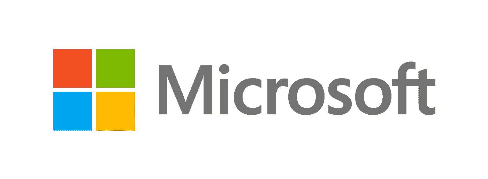

# Microsoft Azure Blob 存储:优点/缺点以及如何将其与 Javascript 一起使用

> 原文：<https://itnext.io/microsoft-azure-blob-storage-pros-cons-and-how-to-use-it-with-javascript-ca5aaf5d5ffd?source=collection_archive---------3----------------------->



本文是系列文章**“云存储提供商，选择哪一个？”**。您可以在这里查看其他文章:

1.  [亚马逊 S3:利与弊以及如何使用 Javascript](https://medium.com/@javidgon/amazon-s3-pros-cons-and-how-to-use-it-with-javascript-701fffc89154)
2.  [谷歌云存储:利与弊以及如何使用 Javascript](https://medium.com/@javidgon/google-cloud-storage-pros-cons-and-how-to-use-it-with-javascript-ea9ce60a94c0)
3.  Microsoft Azure Blob 存储:优点/缺点以及如何将其与 Javascript 一起使用
4.  [Backblaze B2:利与弊以及如何使用 Javascript](https://medium.com/@javidgon/backblaze-b2-pros-cons-and-how-to-use-it-with-javascript-8c2d2a9a69d9)
5.  [数字海洋空间:利与弊以及如何使用 Javascript](https://medium.com/@javidgon/digital-ocean-spaces-pros-cons-and-how-to-use-it-with-javascript-1802559ce2bd)
6.  [Wasabi 热存储:利弊以及如何与 Javascript 一起使用](https://medium.com/@javidgon/wasabi-pros-cons-and-how-to-use-with-javascript-fa528c3779a2)

微软最近因其梦幻般的 Azure 云套件而脱颖而出。如果你没有机会尝试，让我告诉你，它值得一看。话虽如此，其存储服务与其他公司相比如何？值得吗？最后，这完全取决于您的需求，但是在使用它时，我发现了一些可能有助于您澄清这些问题的要点。

免责声明:价格和功能随时都在变化。如果有错误请告诉我:)

## 赞成的意见

*   **很好的文档**，非常容易使用。它不像亚马逊 AWS 那样完整，但围绕 API 构建已经足够了
*   **Hot class 的价格**(约 0.018 美元/GB/月)相当不错。归档级价格是业界最低的价格之一(大约每 GB/月 0.002 美元)
*   **每种必需品的不同存储类别**:热(经常使用)、冷(不常使用)和存档(长期存储)
*   **耐久性高。微软Azure Blob 存储使用默认的复制策略 RA-GRS，在给定的一年内为对象提供 99.9999999999999%(16 个 9)的持久性。这一比例超过了榜单上的所有供应商**
*   从热门课程下载数据完全免费。如果您经常获取文件，这是一笔非常划算的交易
*   **许多不同的存储选项取决于您的需求** : Blob、归档、队列、文件或磁盘
*   **在注册**(30 天内)并在 12 个月内选择服务后，您将获得 200 美元用于 Microsoft Azure 服务

## 骗局

*   要获得直接支持，**您需要购买每月 29 美元起的支持计划。**
*   **其他提供商如 Backblaze 的标准接入价格更便宜**(大约 0.005 美元/GB/月)
*   所有不同的储物选项最终都会让人感到困惑。例如，对于初学者来说，知道何时使用 Blob 服务而不是文件服务并不容易。在我看来，亚马逊 AWS 和谷歌云存储在解释和简化产品方面做得更好

## 好吧，那很酷，但是我为什么要在比赛中使用它呢？

*   **如果你对微软 Azure Cloud** 进行了大量投资，并使用其资源来构建你的基础设施，这几乎是必须的，也是值得的！
*   **如果你是一家看重微软带来的东西的公司**(品牌、稳定性、数十年的经验)
*   **如果您不介意每月支付支持费用**，这也是一个不错的选择，因为他们的客户服务质量很高，并且在许多国家都有本地支持
*   如果你经常下载大文件(在热门课程中是免费的)，与其他提供商相比，你可以用微软 Azure 节省相当多的钱
*   **如果您是一家有企业需求(例如 SLA、SSO…)** 的公司，微软可能是最佳选择，因为他们的企业就绪型解决方案已经成熟，而且他们的大部分产品都基于大客户

# 如何在 Javascript 中使用它

1.  如何安装库

```
npm install azure-storage
```

2.如何认证

3.如何创建存储桶

4.如何删除存储桶

5.如何上传文件

6.如何下载文件

7.如何删除文件

8.如何列出存储桶中的所有文件

我希望这篇文章足以让你熟悉 Microsoft Azure Blob 存储。如果你错过了什么，请告诉我！

祝您愉快！