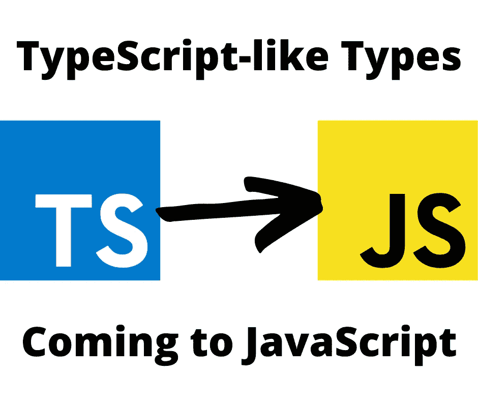

# 微软提议将类似类型脚本的类型语法引入 JavaScript

> 原文：<https://itnext.io/microsoft-proposes-bringing-typescript-like-type-syntax-to-javascript-cdbbda7f5a2?source=collection_archive---------2----------------------->

## 近期目标是通过添加类型信息来增加代码分析工具的功能



作者图片

**你并不是每天都能在 Twitter 上看到 TypeScript 成为热门话题。但是，微软将类型语法引入 JavaScript 的提议无疑是一件大事，值得成为 Twitter 的热门话题。JavaScript 的类型？**

喜欢 JavaScript 这种非类型语言的人不用担心。微软的提议是不在 JavaScript 中添加类型检查或强制。相反，该建议增加了类型声明的语法，但将其视为注释。这大概意味着 JavaScript 引擎可以有选择地关注类型语法并做一些有用的事情。但是，现在的目标是向 JavaScript 代码添加更多信息，以便编程工具可以做更多有用的事情。


2022 年 3 月 9 日晚推特“What's Trending”屏蔽

世界上正在发生一些非常重要的事情。理论上，Twitter 上的“热门话题”板块应该反映什么是重要的。但是，正如我上面所说的，像 TypeScript 这样的东西并不是每天都达到这种重要程度，所以让我们试着理解一下这是怎么回事。

首先，当然 JavaScript 在其存在的整个过程中对类型的支持很少。使用`typeof`或`instanceof`来区分事物是可能的，并且`number`和`string`之间有轻微的行为差异，但是总的来说我们在 JavaScript 中有一个自由选择。这被认为是生产率的提高，因为 JavaScript 程序员在编写代码时需要处理的事情更少了。这与 Java 程序员形成了鲜明的对比，Java 程序员做任何事情都必须点上每个“I”并跨过每个“t”。

随着我们的 JavaScript 程序变得越来越大，理论上，严谨地编写代码变得越来越重要。正如我在书中写的

[*快速入门使用 Node.js 上的 Typescript 和 TypeORM 进行 CLI 和 web 应用*](https://www.amazon.com/Quick-Typescript-TypeORM-Node-js-applications-ebook/dp/B07S87X4ZK?crid=1P423P8Y4EG42&keywords=quick%20start%20typescript%20node.js&qid=1646896504&sprefix=%2Caps%2C346&sr=8-1&linkCode=ll1&tag=thereikipage&linkId=30046c86ca06bffbf60c9ec07836ee73&language=en_US&ref_=as_li_ss_tl) :

> 在一个小的应用程序中，一个程序员可以很容易地检查代码，找出编码错误，并记住整个程序。但是，在大型团队开发的大型应用程序中，手动查找编码错误要困难得多。很可能，在大型应用程序中，没有一个程序员能够理解所有的东西，这使得用可视化代码评审来捕捉 bug 变得更加困难。

虽然这本书是关于如何在 Node.js 上使用 TypeScript，但我觉得有必要说明在 JavaScript 中使用类型的情况。也就是说，我们正在用 JavaScript 编写越来越大的应用程序。我相信这意味着我们需要 JavaScript 生态系统中更强大的工具来管理更大的代码堆。

但是..我跑题了，因为微软的提议并不是要给 JavaScript 带来类型检查。相反，微软的提议仅仅是让在常规 JavaScript 中使用类型语法成为可能，并让类型语法被视为注释。

为什么把语法引入 JavaScript 只是为了忽略它？显然，目的是让 JavaScript 工具对类型信息做一些事情。这可能意味着像 ESLint 或 IDE 之类的工具可以拥有更丰富的信息。有了更丰富的信息，这个工具可以为程序员做更多有用的事情。

# JavaScript+类型的语法示例

建议将结果称为 JS+类型或 JavaScript+类型。

[微软的提议](https://devblogs.microsoft.com/typescript/a-proposal-for-type-syntax-in-javascript/)指出，目前我们可以像这样使用 JSDoc 语法:

```
/**
 * @param a {number}
 * @param b {number}
 */
function add(a, b) {
    return a + b;
}
```

像 JSDoc 这样的 JavaScript 工具可以查看这些结构化的注释并做一些有用的事情。例如，TypeScript 可以读取这些注释，为它提供执行类型检查所需的信息。JavaScript 执行引擎会忽略这一点，但是其他工具可以注意这一点来执行有用的功能。

我们的建议是这样写的:

```
function add(a: number, b: number) {
     return a + b; 
}
```

这正是 TypeScript 语法。

第 0 阶段提案描述了许多要支持的特定语法:

```
function stringsStringStrings(p1: string, p2?: string,
                             p3?: string, p4 = "test"): string {
     // TODO 
} let x: string; interface Person {
     name: string;
     age: number; 
} type CoolBool = boolean;class Person {
     name: string;
     constructor(name: string) {
         this.name = name;
     }
      getGreeting(): string {
         return `Hello, my name is ${this.name}`;
     } 
} const point = JSON.parse(serializedPoint) as ({ x: number, y: number }); type Foo<T> = T[]  interface Bar<T> {
     x: T; 
} function foo<T>(x: T) {
     return x; 
} class Box<T> {
     value: T;
     constructor(value: T) {
         this.value = value;
     } 
} add<number>(4, 5) 
new Point<bigint>(4n, 5n)
```

换句话说，这完全是照本宣科。

# JavaScript+类型的优势

对于 TypeScript 或 Flow，在执行代码之前有一个编译步骤。许多语言的程序员都有编译步骤，但是 JavaScript 程序员从来没有过。执行前不需要编译有助于提高生产率。

该提案将类型信息描述为*类型注释*。作为注释，像`const x: number = 42`这样的声明中的类型信息被视为注释。这意味着大多数工具将解析类型注释，然后忽略它。但是也可以开发其他工具来做一些有用的事情。

# 下一步是什么？

微软计划在 TC39 委员会 2022 年 3 月的全体会议上，将此作为 *Stage 1* 提案提出。在那个阶段，ECMAScript 委员会将会认为这个特性值得进一步开发。

JavaScript 执行引擎会有添加类型检查的选项吗？不。以下是微软要说的:

> *我们认为这样做会给 JavaScript 和 TypeScript 用户带来一系列问题，比如运行时性能、与现有 TypeScript 代码的兼容性问题，以及停止类型检查领域创新的风险。*
> 
> *相反，我们只是提出与 TypeScript 兼容并受其启发的语法，它可以被任何类型检查器使用，但会被 JavaScript 引擎跳过。我们相信这种方法对每个人来说都是最有前途的，并将继续允许 TypeScript、Flow 和其他人继续创新。*

我相信这是 JavaScript 生态系统向前迈出的激动人心的一步。它符合 TypeScript 被用作试验语言特性的沃土的模型，其中一些特性将变成官方的 JavaScript 语言提案。一旦这个特性被标准化，看看有什么编程工具变得可用将会很有趣。

# 关于作者

[***大卫·赫伦***](https://davidherron.com) *:大卫·赫伦是一名作家和软件工程师，专注于技术的明智使用。他对太阳能、风能和电动汽车等清洁能源技术特别感兴趣。David 在硅谷从事了近 30 年的软件工作，从电子邮件系统到视频流，再到 Java 编程语言，他已经出版了几本关于 Node.js 编程和电动汽车的书籍。*

*原载于*[*https://techsparx.com*](https://techsparx.com/nodejs/news/2022/typescript-trending.html)*。*