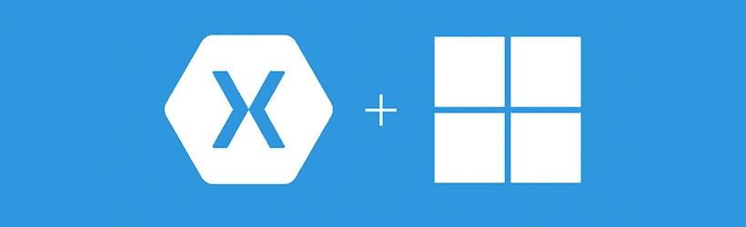

# 微软收购 Xamarin 的战略举措

> 原文：<https://itnext.io/microsoft-strategic-move-to-purchase-xamarin-35289a44bf74?source=collection_archive---------5----------------------->

上周[微软](http://topics.nytimes.com/top/news/business/companies/microsoft_corporation/index.html?inline=nyt-org)签署协议收购 [Xamarin](https://xamarin.com/) ，一家移动软件开发平台提供商。

Xamarin 成立于 2011 年，可以说是微软跨平台环境愿景的实现，可以超越 Windows(微软[)。NET 框架](http://www.microsoft.com/net/multiple-platform-support)。专注于移动平台的 Xamarin 创建了一个版本的。NET 可以在 iOS、Android 和 Windows 上运行。开发人员可以使用 Xamarin 在 C#中创建应用程序的公共核心，然后为每个单独的移动平台开发应用程序的用户界面(在原生 UI 设计工具的帮助下)。

微软和 Xamarin 在 2013 年开始了一项全球合作，以便让微软开发者能够使用 C#和 Visual Studio 开发原生 iOS 和 Android 应用程序。2014 年，两家公司的合作达到了一个新的水平，微软开源了大部分。网；这使得 Xamarin 更容易与. NET 兼容。Xamarin 还宣布为 Visual Studio 用户提供免费的 Xamarin Starter Edition。

这一期待已久的收购旨在填补。NET 对不同操作系统的平台支持。微软一直试图帮助其开发者社区开发可以在任何设备和平台上运行的应用。这次收购使微软拥有了这样的软件体系。正如微软公司副总裁斯科特·格思里[所说](http://blogs.microsoft.com/blog/2016/02/24/microsoft-to-acquire-xamarin-and-empower-more-developers-to-build-apps-on-any-device/):

“Xamarin、Visual Studio、Visual Studio Team Services 和 Azure 的组合提供了一个完整的移动应用程序开发解决方案，该解决方案提供了为每台设备开发、测试、交付和检测移动应用程序所需的一切。”

此外，Xamarin 和。NET 可以加强微软的通用 Windows 平台( [UWP](https://msdn.microsoft.com/en-us/library/windows/apps/dn726767.aspx) )并主动使其成为跨平台。Windows 10 旨在开创微软的 UWP，开发者可以编写一个有可能在任何 Windows 设备上运行的应用程序。Xamarin 可以通过提供面向 iOS 和 Android 的 C#编译器，将 UWP 带入下一个阶段。

根据《纽约时报》的报道，这笔交易也反映了谷歌、亚马逊网络服务和微软在未来几年内控制大部分计算世界的竞争。“在这场竞争中，A.W.S .拥有早期的领先优势和巨大的初创开发者份额。谷歌因其低廉的价格和强大的功能而备受吹捧。微软在现有服务器中拥有最多的企业软件，并试图将这些客户转移到 Azure 云上。”

A.W.S .谷歌和微软的 Azure 都在他们的云系统中增加了一些功能，开发者可以利用这些功能更容易地开发产品。原因是让更多的客户进入他们的云，并在他们进入后销售额外的功能。根据这一战略，微软一直在努力增强其移动能力，以销售更多的云服务。因此，Mirosoft 专注于添加工具，让开发人员能够为多个平台开发应用程序。Xamarin 可以让微软有优势向不仅为 Windows，也为 iOS 和 Android 开发的程序员出售其 Azure。

此次收购可能是微软在云公司中的第一次收购，因为它们正在努力争取更大的市场份额。