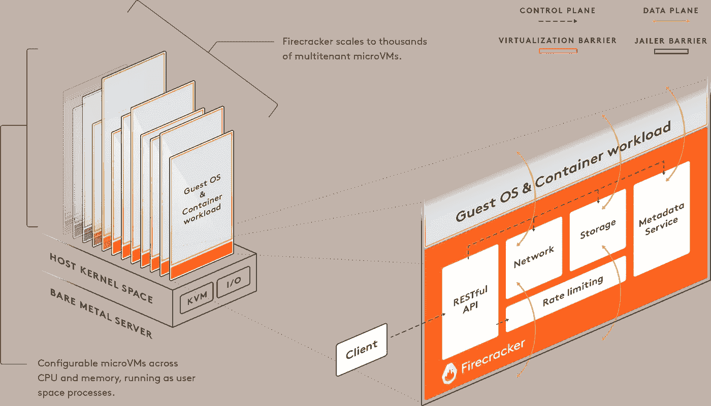

# microVM:无服务器计算的另一个抽象层次

> 原文：<https://itnext.io/microvm-another-level-of-abstraction-for-serverless-computing-5f106b030f15?source=collection_archive---------2----------------------->

## 如何用消防员在无权限的环境下运行一个 microVM？



演职员表:[https://firecracker-microvm.github.io/](https://firecracker-microvm.github.io/)

多年来，云计算是说服用户和企业花钱将服务托管在云数据中心的服务器上的一种方式。事物在变化，仅仅提供基本的存储和处理能力已经成为过去。如今的云服务非常复杂，每一种都需要适当的培训才能使用。分布式数据存储、负载平衡器、存储、无服务器和容器自动化和协调服务只是大量云计算服务的几个例子。

人们现在可以在云服务(软件即服务)上运行一个软件，在多个云提供商上托管[五九 SLA](https://en.wikipedia.org/wiki/High_availability#Percentage_calculation) ，有效地在全球范围内提供高可用性，所有这些都从一个中心位置进行控制，自动化并与市场上最新的尖端技术相协调。这些技术的数量还在不断增长。

今天，大多数云提供商使用开源模式来分发他们的技术和软件。其中的例子有[库伯内特](https://github.com/kubernetes/kubernetes)、[码头工人](https://github.com/docker/docker-ce)和[鞭炮](https://github.com/firecracker-microvm/firecracker)。容器化和轻量级虚拟机只是在云上部署应用程序的各种方式中的两种。各有利弊。但在这篇文章中，我将介绍 bargade，这是一个轻量级虚拟机，或 microVM，由 Amazon 创建的管理工具，用于运行他们的无服务器平台。与容器化相反，特别是 docker，它使用一个带有 cgroups、名称空间等的共享 Linux 内核。，microVMs 使用在基于内核的虚拟机(KVM)之上虚拟化的独立 Linux 内核。microVM 的优点是更少的内存开销(5 MB)，非常小的优化内核和安全性。最有趣的部分是，它是用 [Rust](http://rust-lang.org/) 编写的，有一个令人敬畏的 [Go](http://golang.org/) SDK，并且已经为它开发了许多工具:

[](https://github.com/firecracker-microvm/firecracker) [## 鞭炮-微姆/鞭炮

### 我们的使命是实现容器和功能工作负载的安全、多租户、最小开销的执行。阅读…

github.com](https://github.com/firecracker-microvm/firecracker) [](https://github.com/firecracker-microvm/firecracker-containerd) [## 鞭炮容器

### 自动化状态测试 Lint 这个库支持使用容器运行时 containerd 来管理鞭炮……

github.com](https://github.com/firecracker-microvm/firecracker-containerd) [](https://github.com/firecracker-microvm/firecracker-go-sdk) [## 鞭炮-micro VM/鞭炮-go-sdk

### 这个包是一个 Go 库，用来与鞭炮 API 交互。它被设计成一个抽象的…

github.com](https://github.com/firecracker-microvm/firecracker-go-sdk) [](https://github.com/firecracker-microvm/firectl) [## 鞭炮——微姆/火

### Firectl 是一个基本的命令行工具，可以让你通过命令行运行任意的鞭炮微麦克风。这让…

github.com](https://github.com/firecracker-microvm/firectl) [](https://github.com/weaveworks/ignite) [## weaveworks/ignite

### Weave Ignite 是一款开源虚拟机(VM)管理器，具有容器 UX 和内置 GitOps 管理功能…

github.com](https://github.com/weaveworks/ignite) 

有一个演示项目展示了 microVM 的能力和特性，展示了它可以在不到一分钟的时间内运行 4k microVMs 的速度:

[](https://github.com/firecracker-microvm/firecracker-demo) [## 鞭炮-微型麦克风/鞭炮-演示

### 这个演示展示了鞭炮的灵活性和高密度的能力。它已经在 EC2 I3.metal 主机上运行过了

github.com](https://github.com/firecracker-microvm/firecracker-demo) 

几个月前，我已经开始尝试它，并编写了一些 bash 脚本和一个简单的 README，以便能够展示如何下载项目二进制文件或从源代码构建项目，并快速开始使用 microVMs:

[](https://github.com/mostafa/firefighter) [## mostafa/消防员

### 消防员，现在，作为一套脚本下载或从源构建鞭炮和火焰

github.com](https://github.com/mostafa/firefighter) 

为了使用它，只需在磁盘上的某个地方克隆项目，然后运行`get_latest.sh`或`build_latest.sh`。要获得最新的二进制文件以及预建的 Debian 和 Alpine 内核和 rootfs，你只需要安装 [curl](https://curl.haxx.se/) 。但是为了从源代码构建它，你应该安装 Rust 编译器。安装 Rust 编译器和工具链最简单的方法，只需下载并安装 [rustup](https://rustup.rs/) 安装程序就可以轻松安装其他东西。Rust 官方网站上有一个简单的教程，提供了如何做到这一点的说明。为了构建最新版本，我假设你已经安装了 [Debian GNU/Linux](http://debian.org/) ，因为 APT。

[](https://www.rust-lang.org/tools/install) [## 安装铁锈

### 使用 rustup(推荐),看起来像是在运行 macOS、Linux 或其他类似 Unix 的操作系统。下载 Rustup 和…

www.rust-lang.org](https://www.rust-lang.org/tools/install) 

虽然从源代码构建给了您完全的控制权和可定制性，但是对于纯粹的实验来说，只需下载二进制文件和相关文件就可以了！

```
$ **git clone** [**https://github.com/mostafa/firefighter**](https://github.com/mostafa/firefighter)
$ **cd firefighter**
$ **./get_latest.sh**
```

这个脚本下载了最新的带进度条的鞭炮、firectl 和 jailer 二进制文件，还有 Alpine 和 Debian 内核以及位于`images`目录下的 rootfs。

不带选项或带`help`运行以下命令将打印使用说明:

```
$ **./run_microvm.sh**
Usage:
run_microvm.sh start <distro-name> | <vmlinuz.bin> <rootfs.ext4>
run_microvm.sh stop
run_microvm.sh config
run_microvm.sh status
run_microvm.sh helpAvailable distros:
 - debian
 - alpine
```

要运行 Alpine microVM，只需运行以下命令，它需要 root/sudo 权限:

```
$ **./run_microvm.sh start alpine** Giving read/write access to KVM to user
[sudo] password for user:
Booting kernel: images/alpine-vmlinuz.bin
Image: images/alpine.ext4
...
Enable routing from/to MicroVM
Run MicroVM
...
Welcome to Alpine Linux 3.8
Kernel 4.14.55-84.37.amzn2.x86_64 on an x86_64 (ttyS0)localhost login:
```

使用`root`作为用户名和密码，您可以登录 microVM。在 microVM 中运行以下命令以启用互联网访问:

```
$ **ip addr add 172.16.0.2/24 dev eth0**
$ **ip route add default via 172.16.0.1 dev eth0**
$ **echo "nameserver 8.8.8.8" > /etc/resolv.conf**
$ **ping -c 3 google.com** PING google.com (172.217.20.46): 56 data bytes
64 bytes from 172.217.20.46: seq=0 ttl=54 time=4.270 ms
64 bytes from 172.217.20.46: seq=1 ttl=54 time=5.979 ms
64 bytes from 172.217.20.46: seq=2 ttl=54 time=6.455 ms--- google.com ping statistics ---
3 packets transmitted, 3 packets received, 0% packet loss
round-trip min/avg/max = 4.270/5.568/6.455 ms
```

现在，您可以在另一个终端上使用以下命令停止 microVM:

```
$ **./run_microvm.sh stop**
```

暂时就这样了。你应该弄清楚如何利用这一点。

这是一个简单的开源项目，欢迎任何反馈和贡献。

**穆斯塔法·莫拉迪安**T3*Sr .*SWE @[负载冲击](https://medium.com/u/7df2fe2c0bfd?source=post_page-----5f106b030f15--------------------------------)
[GitHub](http://github.com/mostafa)|[LinkedIn](https://www.linkedin.com/in/mostafa-moradian/)|[Twitter](https://twitter.com/MosiMoradian)