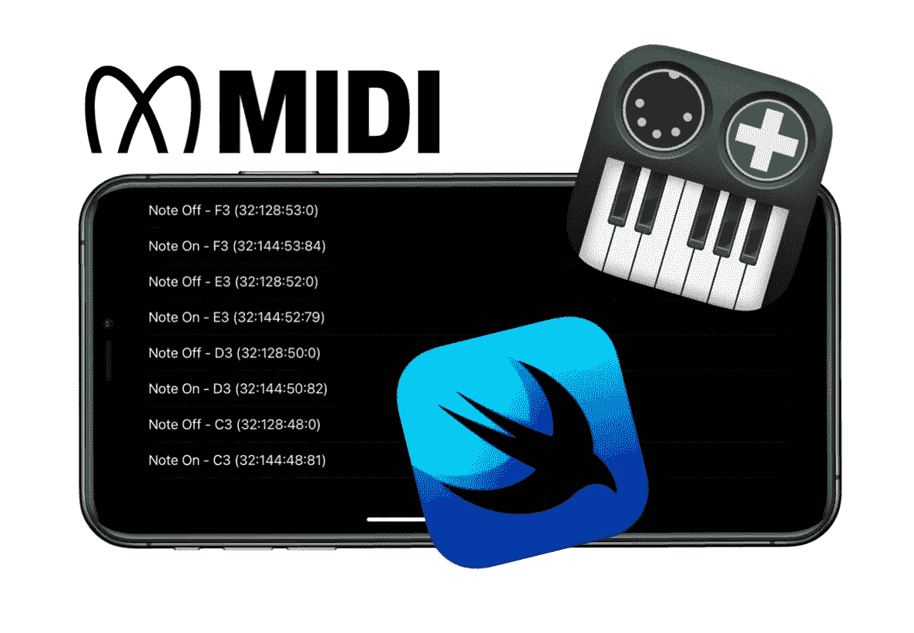
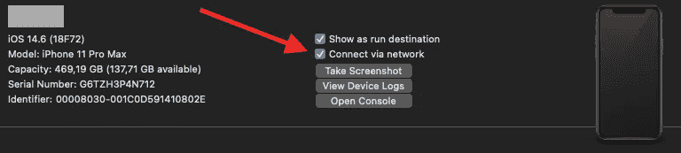

# Swift 中的 MIDI 监听器

> 原文：<https://itnext.io/midi-listener-in-swift-b6e5fb277406?source=collection_archive---------0----------------------->

## CoreMIDI 实用介绍



这篇文章是一个编程教程，教你如何用自己的代码在 iPhone、iPad 或 Mac 上接收 MIDI 信息。它将提供一个代码遍历和一个可下载的 Xcode 项目，以及一个完整的工作示例。

## 背景

2013 年 8 月 26 日，我买了一个罗兰 A-88 MIDI 控制器。我真的以为我有时间自学弹钢琴。

众所周知，我对事物充满好奇，我曾问自己“什么是 MIDI，从那个控制器出来的是什么？”。是的，我可以走捷径，下载一个应用程序，但是…

就在一年前，我从 PC 转向 Mac，并渴望尝试任何 macOS 和 iOS 开发。

一个新的项目诞生了:迷笛援助。

[](https://twissmueller.medium.com/midi-aid-ab4454cfee58) [## MIDI Aid

### 编辑描述

twissmueller.medium.com](https://twissmueller.medium.com/midi-aid-ab4454cfee58) 

这么多关于学习钢琴。

当时的 app 都是用 Objective-C 和 UIKit 做的。当时很难找到任何关于 CoreMIDI 的教程，但我已经设法完成了。MIDI Aid 的首次发布是在 2014 年 2 月 8 日。

随着 Swift 和 SwiftUI 的推出，世界发生了变化。至少是我的世界，当然还有许多其他苹果开发者。CoreMIDI 本身也有一些我想用的更新。

我已经用 Swift 和 SwiftUI 完全重写了 MIDI Aid，并于 2020 年 11 月 26 日发布。

在 CoreMIDI 上总是很难找到足够的教程，而且随着所有新的变化，大多数都在一夜之间过时了。有一个空白。没有完整的代码示例说明如何从 iOS、iPadOS 或 macOS 设备上的控制器接收简单的 MIDI 消息。

这篇文章通过提供一个代码遍历和一个完整的 Xcode 项目填补了空白。

为 macOS 或 iOS 编译它，插入 USB MIDI 设备并开始敲击按键，或者在你的设备上触发 MIDI 信息的任何东西。

当应用程序收到一个 MIDI 信息，它将被记录。目前，它支持“音符开”和“音符关”事件，但也可以很容易地扩展到其他类型。

**在这里** **可以下载到 Xcode-workspace 的** [**。**](https://www.buymeacoffee.com/twissmueller/e/35726)

请注意:我没有在编写代码时考虑所谓的 SysEx 消息，因为我没有办法测试我的控制器。

## 先决条件

遵循本教程需要做一些事情。

让我们假设你有某种类型的 MIDI 控制器，你需要一种方法将其连接到你的 Mac、iPhone 或 iPad。

连接 MIDI 控制器有三种方式:

*   经典的 MIDI 电缆
*   usb 电缆
*   蓝牙。

USB 线是最简单的一种，因为它可以直接插入你的苹果设备。可能需要 USB-A 转 Lightning 或 USB-C 适配器。

如果您的设备不支持 USB，传统的 MIDI 端口需要使用适配器电缆，例如 [Roland UM-ONE mk2](https://www.roland.com/de/products/um-one_mk2/) 。

蓝牙也是一个选项，但需要更多的编码，至少对于 iOS 来说是这样，我在本教程中没有提到。有像 Roland WM-1 这样的设备可以通过蓝牙传输所有的 MIDI 信号。

回到先决条件，你当然也需要 Xcode。我已经用 Xcode 12.5.1 编写并测试了代码。

谈到 Xcode，你可能想知道当你的 MIDI 设备插入到你的 iOS 设备时，如何调试你的代码。Xcode 里有一个设置，表示可以通过 WiFi 启动 app。

只需打开`Window` - > `Devices and Simulators`，选择你的 iOS 设备，激活“通过网络连接”。从现在开始，从 Xcode 启动 iOS 设备上的应用程序不需要 USB 电缆。



通过网络连接

## 代码走查

现在，是时候写一些代码了。我提供了所需的类以及它们到苹果文档的链接，并引用了苹果的描述。

一切都以 a 开头

*   `[MIDIClientRef](https://developer.apple.com/documentation/coremidi/midiclientref)`

> 客户端对象派生自 MIDIObjectRef。它没有拥有对象。

```
var midiClient: MIDIClientRef = 0
```

然后，我们通过调用

*   `[MIDIClientCreateWithBlock](https://developer.apple.com/documentation/coremidi/1495330-midiclientcreatewithblock)`

> 创建一个带有回调块的 MIDI 客户端。

```
MIDIClientCreateWithBlock("Client" as CFString, &midiClient) { midiNotification in
   ...
}
```

当我们的 MIDI 设置发生变化时，这个回调函数将被调用。当设备插入时，它需要“内部”连接。这个在最后解释。

```
switch (notification.messageID) {
    ...
    case .msgObjectAdded:
         NSLog("msgObjectAdded")
         // connect the source, see below
```

下一步是声明一个

*   `[MIDIPortRef](https://developer.apple.com/documentation/coremidi/midiportref)`

> port 对象派生自 MIDIObjectRef，其所属对象是 MIDIDeviceRef。它代表一个输入或输出端口，并提供与任意数量的 MIDI 源或目的地进行通信的方法。

```
var inputPort: MIDIPortRef = 0
```

与上面类似，需要创建端口对象。我们通过调用

*   `[MIDIInputPortCreateWithProtocol](https://developer.apple.com/documentation/coremidi/3566488-midiinputportcreatewithprotocol)`

> 创建一个输入端口，客户端可以通过该端口接收来自任何 MIDI 源的 MIDI 信息。

```
MIDIInputPortCreateWithProtocol(
            midiClient,
            "Input Port as CFString" as CFString,
            MIDIProtocolID._1_0,
            &inputPort) {  [weak self] eventList, srcConnRefCon in 
    ...            
}
```

我们继续使用类型为`UnsafePointer<MIDIEventList>`的`eventList`。这是我们想要提取的 MIDI 数据。

*   `[MIDIEventList](https://developer.apple.com/documentation/avfaudio/midieventlist/)`

> MIDI 事件包的可变长度列表。

从那里我们可以继续分析 MIDI 信息。

```
let midiEventList: MIDIEventList = unsafePointerMidiEventList.pointee
var packet = midiEventList.packet

(0 ..< midiEventList.numPackets).forEach { _ in
    ...        
}
```

在循环中，我们可以提取所有的数据包。

```
let words = Mirror(reflecting: packet.words).children
words.forEach { word in
    let uint32 = word.value as! UInt32
    guard uint32 > 0 else { return }
    midiPacket = MidiPacket(
        first: UInt8((uint32 & 0xFF000000) >> 24),
        second: UInt8((uint32 & 0x00FF0000) >> 16),
        third: UInt8((uint32 & 0x0000FF00) >> 8),
        fourth: UInt8(uint32 & 0x000000FF))        
}
```

我不清楚的是包数(`numPackets`)。根据我的观察，我按下一个键它的一个包，释放一个键，另一个包，等等。

也许当接收到一个不祥的 SysEx 消息时，会有更多的数据包。就我记忆所及，这些信息的长度是可变的。

最后，我们连接来源。

首先，我们通过以下方式获得源的数量

*   `[MIDIGetNumberOfSources](https://developer.apple.com/documentation/coremidi/1495116-midigetnumberofsources)`

> 返回系统中源的数量。

```
let sourceCount = MIDIGetNumberOfSources()
```

我们遍历每个源索引来检索源

*   `[MIDIGetSource](https://developer.apple.com/documentation/coremidi/1495168-midigetsource)`

> 返回系统中的源。

```
var source = MIDIGetSource(sourceIndex)
```

然后每个源通过调用

*   [MIDIPortConnectSource](https://developer.apple.com/documentation/coremidi/1495278-midiportconnectsource)

> 建立从源到客户端输入端口的连接。有效性

```
MIDIPortConnectSource(inputPort, source, &source)
```

我将连接源代码的代码放在一个单独的函数中，并调用两次。首先，我在初始化并创建了`MIDIClientRef`和`MIDIPortRef`之后，在启动时调用它。然后，每当有新设备插入时，我也会调用它。

## 结论

希望这篇教程能让你实现自己的基于 CoreMIDI 的代码。

从将 MIDI 控制器连接到 Mac、iPhone 或 iPad，然后在代码中设置正确的结构，最后在屏幕上显示 MIDI 信息，我们经历了所有需要的步骤。

除了显示 MIDI 信息，还有很多其他的使用案例。当然，MIDI 信息也可以由代码生成，以控制其他 MIDI 设备。也许在未来，会有另一个教程，但也许我应该先学会弹钢琴。

如果有任何不清楚的地方，或者万一你在实现你的特定用例时有困难，请随时留下你的评论。

**在这里** **可以下载到 Xcode-workspace 的** [**。**](https://www.buymeacoffee.com/twissmueller/e/35726)

感谢您的阅读！

*   如果你喜欢这个，请跟随我
*   给我买杯咖啡让我继续前进
*   支持我和其他媒体作者[在这里注册](https://twissmueller.medium.com/membership)

[https://twissmueller.medium.com/membership](https://twissmueller.medium.com/membership)

## 资源

*   [CoreMIDI](https://developer.apple.com/documentation/coremidi)
*   [在 swift 中使用 MIDIPacketList](https://stackoverflow.com/q/26494434/1065468)
*   [Swift 中的 CoreMIDI 回调](https://stackoverflow.com/questions/28924831/coremidi-callbacks-in-swift)