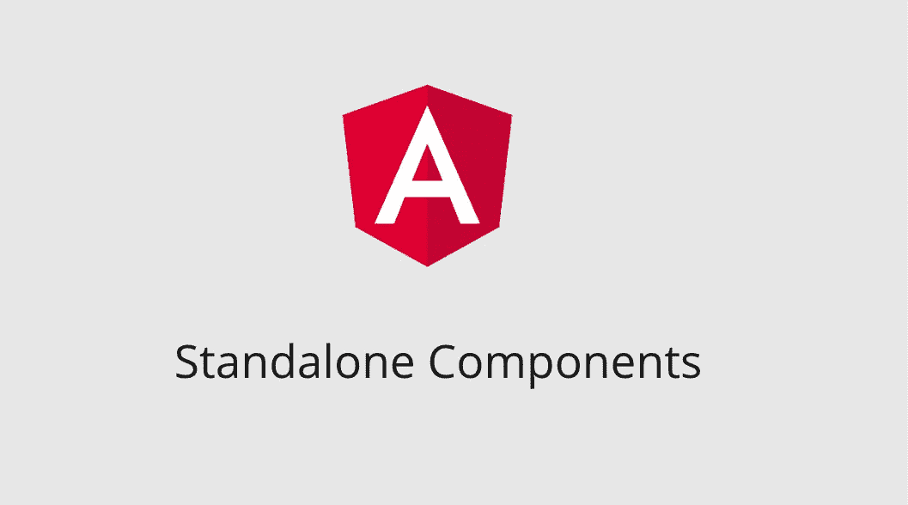
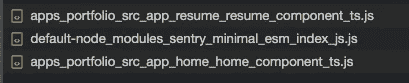

# 利用独立组件将 Angular v13 迁移到 v14 RC

> 原文：<https://itnext.io/migrate-angular-v13-to-v14-rc-utilizing-standalone-components-fba181ec9a16?source=collection_archive---------0----------------------->



角形独立组件

如果你最近在看 [Angular 社区](https://github.com/angular/angular/discussions/43784)，你会知道独立组件正在流行。让我对 RFC 的独立组件感到兴奋的是:

*   使用起来更简单，
*   更容易推理，
*   写起来不那么冗长，而且
*   编译速度更快(更多详情请见 [#43165](https://github.com/angular/angular/issues/43165) )。

今天，在本文中，我将向您展示我利用新的独立组件迁移现有 Angular v13 应用程序的经验。我没有把它们全部迁移，但这足以理解这个过程。

总的来说，这个过程非常简单，你不需要做太多的改变。

## 迁移流程(Nx Workspace)

如果您正在创建一个新项目——而不是 Nx，只需运行这个命令

```
npx @angular/cli@next new standalone-app
```

如果要升级现有的 app，需要更新 package.json 中的`@angular/cli`，然后运行迁移脚本。

```
// package.json"@angular/cli": "14.0.0-rc.0",
```

运行迁移脚本(Nx Workspace)

```
dalenguyen$ npx nx migrate [@angular/core](http://twitter.com/angular/core)@14.0.0-rc.0Fetching meta data about packages.
It may take a few minutes.
Fetching [@angular/core](http://twitter.com/angular/core)@14.0.0-rc.0>  NX  The migrate command has run successfully.- package.json has been updated
- migrations.json has been generated>  NX  Next steps:- Make sure package.json changes make sense and then run 'yarn'
- Run 'yarn nx migrate --run-migrations'
- To learn more go to [https://nx.dev/using-nx/updating-nx](https://nx.dev/using-nx/updating-nx)
```

## 拔靴带

```
// main.ts - Angular v13platformBrowserDynamic().bootstrapModule(AppModule)
  .catch(err => console.error(err));
```

使用`bootstrapApplication`引导一个新的应用程序，它可能需要一些将在所有组件&路由中使用的提供者。如果您使用材料，在某些情况下将需要“BrowserAnimationsModule”。

```
// main.ts - Angular v14bootstrapApplication(AppComponent, {
  providers: [
     importProvidersFrom(BrowserAnimationsModule),
     importProvidersFrom(RouterModule.forRoot(APP_ROUTES))
  ],
}).catch((err) => console.error(err))
```

## 按指定路线发送

```
// app-routing.module.ts - Angular v13const routes: Routes = [
  { path: '', component: HomeComponent },
  { path: 'resume', component: ResumeComponent },
  ...
  { path: '**', redirectTo: '' },
]
```

差不多吧。使用`loadComponent`，它将为每个路由路径生成 lazyload chuck 文件。

```
// app-routing.module.ts - Angular v14export const APP_ROUTES: Routes = [
  { path: '', loadComponent: () => import('./home/home.component').then((m) => m.HomeComponent) },
  { path: 'resume', component: ResumeComponent },
  ...
  { path: '**', redirectTo: '' },
]// RouterModule is removed and moved to main.ts
```



独立组件中的惰性卡盘文件

## 成分

```
// Angular v13[@Component](http://twitter.com/Component)({
  selector: 'app-intro',
  templateUrl: './intro.component.html',
  styleUrls: ['./intro.component.scss'],
})
export class IntroComponent {}
```

对于独立方法，所有的模块或服务都将在组件中提供。

```
// Angular v14[@Component](http://twitter.com/Component)({
  changeDetection: ChangeDetectionStrategy.OnPush,
 ** imports: [MatIconModule],**
 ** providers: [NavService],**
  selector: 'app-intro',
  **standalone: true,**
  templateUrl: './intro.component.html',
  styleUrls: ['./intro.component.scss'],
})
export class IntroComponent {}
```

此时，您可以删除所有未使用的 NgModule，如 AppModule 或其他模块。更多例子可以查看我在 Github 上的 [PR。](https://github.com/dalenguyen/dalenguyen.github.io/pull/55/files)

快乐重构(独自一人):D