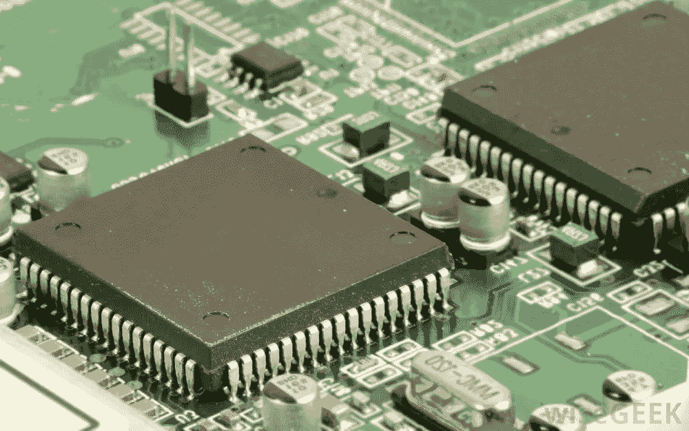

# 从基尔迁移到 SDCC

> 原文：<https://itnext.io/migrate-from-keil-to-sdcc-dd3362c087a7?source=collection_archive---------2----------------------->



今天我在用 Keil uVision 5 编译代码时出现了以下错误:

```
*** FATAL ERROR L250: CODE SIZE LIMIT IN RESTRICTED VERSION EXCEEDED MODULE: C:\KEIL\C51\LIB\C51FPS.LIB (-----) LIMIT: 0800H BYTES
```

在谷歌搜索后，我发现`0800H` (2KB)是评估版的代码大小限制，这意味着如果我想在我的程序中添加更多的功能，我必须购买一个许可证。然而，Keil 没有在他们的网站上给出准确的定价模型，我真的不想只为我的爱好项目填写他们的报价表。

所以唯一的选择就是找到一个开源的替代品。幸运的是我很容易就找到了 [SSDC](http://sdcc.sourceforge.net/) (小型设备 C 编译器)，它支持 8051。

# 装置

安装非常简单——只需进入他们的下载页面，下载适合您操作系统的版本。我用的是 Windows，所以我下载了一个 64 位的 Windows。安装后，您将得到`sdcc`命令:

```
> sdcc --version
SDCC : mcs51/z80/z180/r2k/r2ka/r3ka/gbz80/tlcs90/ez80_z80/z80n/ds390/pic16/pic14/TININative/ds400/hc08/s08/stm8/pdk13/pdk14/pdk15 4.1.0 #12072 (MINGW64)
published under GNU General Public License (GPL)
```

# 移民

然后我试着编译我的源代码。我的 Keil 项目有两个 C 文件:`main.c`和`tm1638.c`。根据 SDCC 文件，支持文件应该用`-c`选项编译，然后链接到主程序:

```
> sdcc -c tm1638.c
> sdcc main.c tm1638.rel
```

我尝试运行这两个命令，并修复了一些凯尔和 SDCC 之间的不兼容。不同之处在于:

*   自定义头文件必须用双引号括起来。例如，我的项目在与`main.c`相同的目录中有一个`tm1638.h`。在基尔`#include <tm1638.h>`作品中，但在 SDCC，它必须写成`#include "tm1638.h"`。
*   8051 头文件有不同的名称。在基尔我们用`#include <reg52.h>`，但是在 SDCC 我们用`#include <8052.h>`。
*   Keil 中的`sbit`、`sfr`对应 SDCC 的`__sbit`、`__sfr`。在基尔我们用`sfr P0 = 0x80; sbit P0_1 = P0 ^ 1;`，而在 SSDC 我们用`__sfr __at (0x80) P0; __sbit __at (0x81) P0_1;`。详见[文件](http://sdcc.sourceforge.net/doc/sdccman.pdf)。
*   大多数时候我们不需要使用`__sfr`来定义端口。`8052.h`已经为我们定义了公共端口，所以我们只需要用宏给它们起一个可读的名字。例如:`#define DIO P1_0`
*   Keil 中的`[code](https://www.keil.com/support/man/docs/c51/c51_le_pgmmem.htm)`关键字对应 SDCC 中的`__code`。所以我们在基尔`unsiged char code sevenseg_hex[] = {...};`所做的必须写成在 SSDC`__code unsigend char sevenseg_hex[] = {...};`。
*   `interrupt`在基尔变成了`__interrupt`。所以使用下面的代码来定义一个中断处理程序:`void timer0() __interrupt 1 { ... }`

有了这些修改，我的代码编译得相当好，并且成功地生成了`main.ihx`文件。然后我只需要用下面的命令将其转换成`hex`格式:

```
> packihx main.ihx > main.hex
```

而且这个十六进制文件是可以下载并正常工作的！

# 生成文件

使用 SSDC 的另一个好处是命令行支持，这意味着我可以使用`Makefile`来管理我的项目。首先我安装了 GNU Make for Windows:

```
(with adminstrator) > chocolatey.exe install make
```

然后创建了下面的`Makefile`:

```
ifeq ($(OS),Windows_NT) 
RM = del /Q /F
CP = copy /Y
ifdef ComSpec
SHELL := $(ComSpec)
endif
ifdef COMSPEC
SHELL := $(COMSPEC)
endif
else
RM = rm -rf
CP = cp -f
endifCC := sdcc
PACKIHX := packihx.PHONY: all cleanall: tm1638-counter.hexclean:
        -$(RM) -f *.asm *.lk *.lst *.map *.mem *.rel *.rst *.sym *.asm *.ihx *.hextm1638.rel: tm1638.h tm1638.c
        $(CC) -c tm1638.cmain.ihx: tm1638.h main.c tm1638.rel
        $(CC) main.c tm1638.relmain.hex: main.ihx
        $(PACKIHX) main.ihx > main.hex
```

现在运行`make`将生成十六进制文件。不再需要离开 VSCode 编辑器。