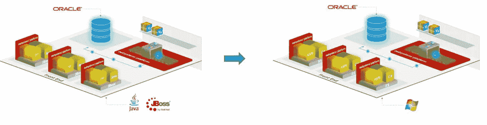

# 将外部系统环境从 JAVA 堆栈迁移到。网络堆栈

> 原文：<https://itnext.io/migrate-outsystems-environment-from-java-stack-to-net-stack-ca2daeb9c42f?source=collection_archive---------5----------------------->

# 为什么我们需要改变堆栈

在 OutSystems 的最新版本中。NET-stack 已更新，而 Java-stack 未更新。大多数新开发的产品也添加到了。网络堆栈版本。在撰写本文时的最新版本 OutSystems 11 中，还没有可用的 JAVA 栈版本。JAVA-stack 的现有用户必须考虑是继续使用 JAVA-stack 还是迁移到。网络堆栈。

如果栈的变化是由升级到 OutSystems 版本 11 引起的，那么最好从 JAVA 栈迁移到。NET-stack，在版本升级之前。成功完成后，您可以开始升级到 OutSystems 版本 11。**不要同时做两个改变**。

为了迁移到。NET-stack，您需要考虑一些事情:

*   应用服务器至少需要是 Windows server 2016
*   Wildfly，Jboss 或者 Weblogic 都会被 IIS 取代
*   外部系统 JAVA 进程将是 windows 服务
*   构建模块将在应用程序池中运行

对于每个公司来说，环境都是独特的，需要不同的方法。应该考虑几个步骤。本文主要描述了这些步骤，并提供了一些关于堆栈更改的建议。

迁移到。NET-stack 处于环境中的应用程序没有变化的时期。因此，在两个堆栈中都不需要构建新的功能。

如果只使用标准的外部系统组件，则堆栈更改非常容易。所有 JAVA 代码或来自 OutSystems Forge 的 JAVA 专有组件的更改都需要更改。这种情况不常发生。开发人员通常在 JAVA 堆栈环境中构建额外的特性，这些特性在。NET-stack 环境或者作为来自[外部系统锻造](https://www.outsystems.com/forge/)的组件。JAVA 堆栈中的所有这些更改都必须撤消或更改为。净组件。

# 分步指南:

*   使用. NET 平台安装创建一个额外的环境。对于此环境，使用与所有运行环境相同的许可证密钥。当没有可用的免费许可证插槽时，您可以要求外部系统支持人员添加一个额外的许可证插槽。这个环境的发布级别必须与 JAVA 环境相同。安装所有必要的组件，包括新环境中的 forge 组件。
*   创建一个包含将来会用到的所有应用程序(空间和扩展)的解决方案。该解决方案将被上传并安装在新环境中。当可以使用相同的许可证时，它可以毫无问题地上传。如果不是这样，您必须将解决方案上传到 IPP 门户网站。
*   所有基于 JAVA-stack 的 forge 组件都需要被替换。NET 组件并更改对这些新组件的引用。
*   专门用 JAVA 编写的扩展需要在. NET 中重新发布。在集成中，在低于版本 11 的 Studio 版本中，您可以选择为 JAVA 开发。净或两者兼有。如果开发总是使用“both”选项，那么扩展可能会正确工作。如果使用 J2EE 选项，您需要通过将它们发布到新环境中来仔细检查所有的扩展。所有的扩展必须在所有的功能上进行测试。
*   完成这些步骤后，就可以开始测试了。与非常了解应用程序的有经验的用户或测试人员一起工作。必要的更改可以由几个高级开发人员来完成。这是一条基于经验的建议。不要把时间浪费在不是由堆栈更改直接创建的更改上。为了有清晰和直接的交流，最好让分配的团队保持小规模。

# 一些经验教训

*   保持现有环境中的变更数量最少，否则，您必须构建这些变更两次。
*   如果你想升级到 OutSystems 11，检查这个版本的要求。OutSystems 11 环境所需的最低操作系统是 Windows server 2016。
*   OutSystems 11 不再支持 MySQL 在其上运行平台数据库。支持的数据库系统有:

*   与一个小团队一起进行堆栈更改。
*   不要将堆栈更改与任何其他功能更改同时进行。