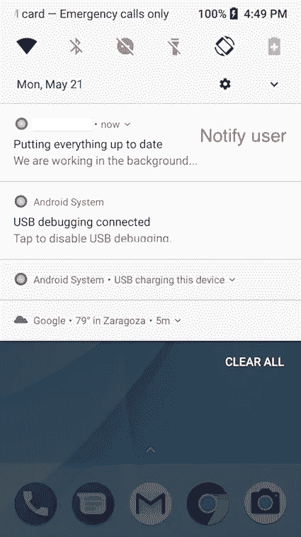
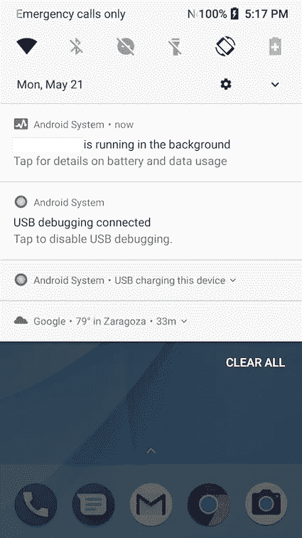

# 将您的应用迁移到 Android Oreo

> 原文：<https://itnext.io/migrate-your-app-to-android-oreo-e0fa794b1d21?source=collection_archive---------4----------------------->

在接下来的几个月里，所有 Android 开发者都将迎来新的变化。谷歌将确保 Google Play 中所有应用程序的最佳性能，因此出于这一目的，将迫使 Android 开发者将其应用程序定位于 Android Oreo。

在 Google I/0 2018 期间，宣布从 2018 年 8 月起，开发者上传到 Google Play 的所有新应用都必须针对 Android Oreo (8.0)。从 2018 年 11 月开始，该要求也将影响现有应用的更新。

关于这种迁移，我们必须记住的变化是:

1.  服务—背景限制
2.  [广播接收机](/migrate-your-app-to-android-oreo-part-2-broadcastreceivers-3f1f12f764fc)
3.  [通知](/migrate-your-app-to-android-oreo-part-3-notifications-b59d7c6313f9)
4.  运行时权限
5.  警告
6.  Firebase 云消息传递(截止日期:2019 年 4 月)


# **1。服务—背景限制**

这不是一个新问题。它是在 Android Oreo 发布时推出的，但由于采用率低，许多 Android 开发者尚未将 Android Oreo 作为目标。(2018 年 5 月 5%左右—[https://developer.android.com/about/dashboards/](https://developer.android.com/about/dashboards/))

您可以通过以下链接了解这些限制背后的动机的更多详情:

[](https://developer.android.com/about/versions/oreo/background) [## 后台执行限制| Android 开发者

### 针对 Android 8.0 或更高版本的应用程序的新后台限制。

developer.android.com](https://developer.android.com/about/versions/oreo/background) 

我们必须面对的第一个变化是，如果我们的应用程序不在前台(如果我们的应用程序在前台，我们可以调用方法“startService()”)，我们**不**被允许调用**“startService()”**在后台进行一些工作(位置更新，同步数据…)。在这种情况下，当我们调用 startService 时，将会抛出一个异常 **IllegalStateException** 。

相反，我们将使用“**startForegroundService()**”。我们有大约 5 秒的时间来显示一个通知，告诉用户我们正在后台进行一些操作。这些通知将在我们的服务运行时生效，并在服务结束时消失。



通知用户我们正在后台工作

因此，在我们的服务中，我们必须做的第一件事是显示通知:

另一点。如果我们需要在后台启动一项服务，而应用程序不在前台(例如:收到推送通知后)，系统会显示如下内容:



和另一个场景一样，当工作完成时，通知会消失。

✋ **重要的** ✋

1.  **尽快隐藏通知**👀

如果我们希望我们的**通知**尽快被**隐藏**，我们必须调用“*stop foreground(true)；”*服务结束时*。*打这个电话，当服务结束时，通知会消失。如果我们不这样做，通知将在状态栏中保留一段时间，直到系统让它消失。

**2。避免通知声音**🔊

我们必须记住的另一个问题是**通知会发出声音**，因此根据我们分配给通知的优先级，当服务启动时，我们可能会对通知声音感到惊讶。所以这不是我们想要的行为，为了解决这个问题**我们必须给我们的通知分配低优先级**。我们不能分配较低的优先级，如果我们这样做，系统会在启动服务时使应用程序崩溃。

```
val channel = NotificationChannel(channelId,          BuildConfig.NOTIFICATION_CHANNEL_SILENT_NAME, NotificationManager.IMPORTANCE_LOW)
```

我们建议只为静默通知创建一个通知通道，这样我们可以避免用声音提醒用户，而其他通知将继续正常运行。

您可以在此处检查通知[的所有优先级。](https://developer.android.com/training/notify-user/channels)

有了所有这些限制，谷歌想要的是确保开发者在推出一项服务之前在后台研究它是否是最好的方式。通过这种方式，您将获得更好的用户体验和更好的设备性能。

# **意向服务→工作意向服务**

直到现在，当我们想要启动一个意图服务来在后台运行一些长时间的操作时，我们称之为“startService()”,但是从现在开始，就像我们以前说的那样，它不再被允许了。

所以我们要做的改变很容易。我们所有的意向服务看起来都是这样的:

现在我们必须从 **JobIntentService** 扩展。JobIntentService 类似于服务，但是它将工作排入兼容 Android 目标上的 JobScheduler。

一旦我们有了 JobIntentService，要在后台执行这个操作，我们必须做如下所示的事情:

并且不要忘记更新您的 AndroidManifest.xml，表明该服务是绑定作业服务。

接下来的帖子试图理解我们在应用程序中针对 Android Oreo 所做的其他改变。

我希望这篇文章对你有用，如果你发现有什么不对的地方，不要犹豫，告诉我们。

## **有趣的链接**

[https://medium . com/exploring-Android/exploring-background-execution-limits-on-Android-Oreo-ab 384762 a66c](https://medium.com/exploring-android/exploring-background-execution-limits-on-android-oreo-ab384762a66c)

[https://Android . JL else . eu/keep-these-background-services-working-when-targeting-Android-Oreo-SDK-26-CBF 6 cc 2 BDB 7 f](https://android.jlelse.eu/keep-those-background-services-working-when-targeting-android-oreo-sdk-26-cbf6cc2bdb7f)

**号外:**这个视频以一种简单的方式展示了我们在接下来的几个月里针对 Android Oreo 和更高版本必须完成的所有改变。