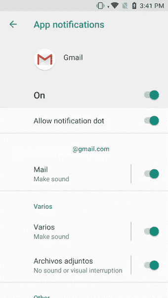
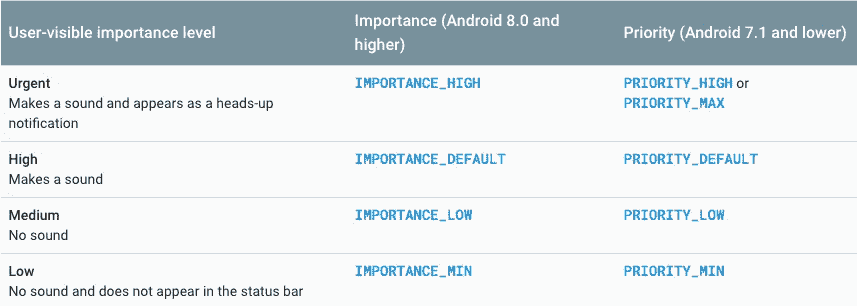

# 将您的应用迁移到 Android Oreo——第 3 部分通知

> 原文：<https://itnext.io/migrate-your-app-to-android-oreo-part-3-notifications-b59d7c6313f9?source=collection_archive---------0----------------------->


图片来自[www.pexels.com](http://www.pexels.com)

Android Oreo (8.0)带来了许多很酷的新功能，如画中画、智能文本选择等等。但是最重要的变化之一出现在通知领域。

1.  [服务—背景限制](/migrate-your-app-to-android-oreo-e0fa794b1d21)
2.  [广播接收机](/migrate-your-app-to-android-oreo-part-2-broadcastreceivers-3f1f12f764fc)
3.  **通知**
4.  运行时权限
5.  警告
6.  Firebase 云消息传递(截止日期:2019 年 4 月)

现在有了 Android Oreo，开发者可以通过为每个通知创建不同的**通道**来分离通知的行为。重要的是，没有为通知指定通道，该通知不会出现在状态栏中。

所有使用相同通道的通知将具有相同的行为，因此根据通知的重要性创建**不同的通道非常重要。**

例如，我们可以为我们的应用程序的最紧急通知创建一个频道，每个通知都有振动、警报声音和通知灯。如果我们的应用程序有另一种不太重要的通知，我们可以创建一个更安静的通道，只在状态栏中显示通知，没有声音和灯光。

在这里，您可以看到 Gmail 的通知渠道:



Gmail 通知渠道

# **如何在 Android Oreo 中显示通知？**

*   **在 Android Oreo** 之前，当我们想要创建一个通知时，我们必须这样做:

在安卓奥利奥之前显示通知

你可以看到在 Android Oreo 之前，我们没有指定任何关于渠道的内容。所以所有的通知都有相同的行为。

*   **现在有了 Android Oreo** ，要显示一个通知，我们必须这样做:

使用 Android Oreo 显示通知

所以如果你详细分析代码，区别在于我们要为版本≥ Android Oreo 的 Android 设备创建一个通道。

```
if (Build.VERSION.SDK_INT >= Build.VERSION_CODES.O) { 
    val channel = NotificationChannel(channelId,
                    BuildConfig.NOTIFICATION_CHANNEL_ALARMS_NAME,
                    NotificationManager.IMPORTANCE_DEFAULT)
    notificationManager.createNotificationChannel(channel) 
}
```

Android Oreo 中引入的另一个变化是通知的重要性，在下表中，您可以检查**通知**的**不同重要性**:



通知的重要性

如果您想进一步定制您的通道的默认通知行为，您可以在`[NotificationChannel](https://developer.android.com/reference/android/app/NotificationChannel.html)`上调用`[enableLights()](https://developer.android.com/reference/android/app/NotificationChannel.html#enableLights(boolean))`、`[setLightColor()](https://developer.android.com/reference/android/app/NotificationChannel.html#setLightColor(int))`和`[setVibrationPattern()](https://developer.android.com/reference/android/app/NotificationChannel.html#setVibrationPattern(long[]))`等方法。

# 👮**重要的**👮

**但是请记住，一旦您创建了频道，您就不能更改这些设置，并且用户可以最终控制这些行为是否处于活动状态。**

# 如何删除通知频道？

将来，您可能会创建一个通知通道，但是从现在开始我们不想再使用它了。以下示例代码演示了如何删除通知通道:

# 服务必须显示通知

在[之前的帖子](/migrate-your-app-to-android-oreo-e0fa794b1d21)中，我们解释了在 Android Oreo 中使用服务的局限性。我们说过，如果我们想在后台使用服务，我们必须通过状态栏中的通知来警告用户。

因此，如果我们不希望此通知发出声音或振动，我们建议创建一个“无声”频道，并强调以下重要性:

```
NotificationManager.IMPORTANCE_LOW
```

这是**最小重要性**，我们可以在**启动服务**时将其设置为通知，如果您使用“Importance_min ”,当您启动它时将会抛出一个异常。

如果你想了解更多信息，你可以查看官方文档[这里](https://developer.android.com/training/notify-user/channels)。

希望这篇帖子对你有帮助。编码快乐！

👏😃