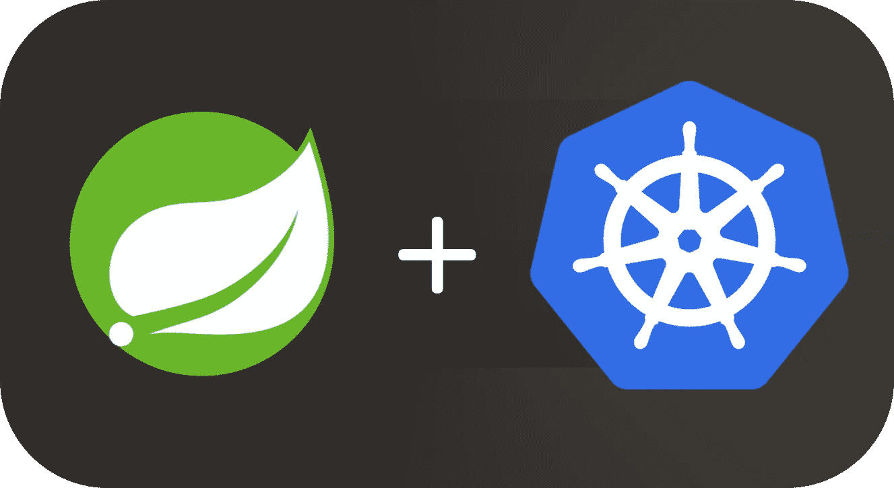

# 通过 5 个步骤将 Spring Boot 服务迁移到 Kubernetes

> 原文：<https://itnext.io/migrating-a-spring-boot-service-to-kubernetes-in-5-steps-7c1702da81b6?source=collection_archive---------0----------------------->

您想要的微服务组合

许多 java 开发人员使用 Spring 框架来创建 web 服务。但是，保持它在生产中运行可能是一个相当大的挑战，有太多的方式来运行它，太多的云提供商。当然，你可以使用像 *aws elastic beanstalk* 这样的服务，通过自动伸缩、零停机部署、部署新版本所需的基础设施经验少等来保持它的运行。然而，这些服务对预算低的人来说成本很高，同时也失去了对服务基础设施的大量控制。

这是我们在 GoBots 的问题，我们的预算很低，我想以低成本获得弹性豆茎的所有好处。那时我发现了 Kubernetes。它做了我想要的一切，而且它是开源的！完美的权利？首先要做的是。

## 1 —生成 Docker 图像

我不会在这篇文章中详细介绍 Kubernetes 是如何工作的，你可以访问他们的[文档](https://kubernetes.io/docs/home/)来了解更多。但是让我总结一下它是如何工作的。您从应用程序中创建一个 Docker 图像，并“告诉”Kubernetes 启动您创建的图像的一个或多个实例。因此，我们的第一步是从我们的 Spring Boot 服务创建一个图像。

Spring 在这个[教程](https://spring.io/guides/gs/spring-boot-docker/)中提到了这一点，这一步非常简单，也非常容易执行。下面是我们现在使用的 Dockerfile 文件的一个例子。

我们当前的 docker 文件

有了这个和 docker 构建插件，我们可以运行`gradle clean buildDocker`(或者使用 [maven docker 插件](https://github.com/spotify/docker-maven-plugin))并构建我们的 docker 映像。请注意，它将为您在`gradle.properties`或`build.gradle`上配置的版本创建一个带有版本标签的映像。我们目前正在使用 gradle 发布插件来创建发布任务的图像。

## 2 —创建部署和我们的 pod

好吧！我们创建了 or 图像，现在要把它放到 Kubernetes 上，我们需要把它上传到一个*注册表上。*我们可以上传到公共 docker 注册表(更简单的方法)，但是每个人都可以访问该图像！由于我们的服务是私人的，我们需要上传到一个私人注册。幸运的是，Gcloud 为您的帐户提供了私人注册。本[教程](https://cloud.google.com/container-registry/docs/pushing-and-pulling)中介绍了如何上传图片。

这样一来，我们终于可以在 Kubernetes 集群上部署或服务了！因为我们使用 Gcloud，所以用 GKE 创建集群非常容易，按照这个[教程](https://cloud.google.com/kubernetes-engine/docs/quickstart)来做(或者[这个](https://kubernetes.io/docs/setup/pick-right-solution/)在 AWS、Azure、Bluemix 等上设置集群)。在创建了集群并配置了连接到它的命令行之后，我们需要创建一个[部署](https://kubernetes.io/docs/concepts/workloads/controllers/deployment)(或者一个[复制控制器](https://kubernetes.io/docs/concepts/workloads/controllers/replicationcontroller/))来使我们的应用程序可伸缩。我们使用以下配置作为我们的临床配置。

考虑到我们在上一步中配置了 Kubernetes 命令行界面(kubectl ),我们可以使用`kubectl apply -f Deployment.yml`为 Kubernetes 集群创建一个具有这种配置的新部署。过一会儿，你可以用`kubectl get deployment spring-boot-deployment`检查部署的状态，用`kubectl get pods spring-boot-app`检查 pod，如果你想检查 pod 的日志，你可以使用`kubectl log`命令。

## 3 —通过服务公开我们的 pod

现在，随着我们的 pod 的运行，我们需要创建一个[服务](https://kubernetes.io/docs/concepts/services-networking/service/)来向世界展示我们的 pod。以下配置用于创建我们的服务。

如您所见，服务配置非常简单。然而，这种配置是不公开的。我们可以将服务类型设置为**负载平衡器**，因为 gcloud 会自动为我们的服务创建一个真正的负载平衡器和一个外部 ip。我们实际上尝试过这样做，但是在这种配置下，我们无法正确设置 TLS 和 HTTPS。我们希望我们的服务只能被 HTTPS 协议访问。但是我们怎么做呢？

## 4 —入口路由

所以我挖得更深，找到了 Kubernetes 入口。这是一个较新的功能，但它工作得很好。它几乎像一个使用类型 **LoadBalancer** 的服务一样工作，但是您可以设置定制的路由规则。以下是我们的入口配置。

如您所见，我们将入口设置为仅允许与`kubernetes.io/ingress.allow-http: "false"`的 HTTPS 连接。但是，如果您注意的话，可以看到这个文件上有一个 TLS 配置。我们需要首先创建一个 *Secret* 来保存我们的 ssl 证书数据，以供入口访问。使用下面的配置就可以做到这一点。

## 5 —秘密

应用所有配置后，我们可以使用`kubectl get ingress spring-boot-ingress`命令检查我们应用程序的外部 ip。通过 HTTPS 和 *voulá，*我们的 Spring Boot 应用程序运行在 Kubernetes 集群上！

## 重要！Kubernetes 服务在默认的 pod 端口和端点“/”上执行健康检查。如果您没有映射该端点或者它是安全的，您需要包括`**livenessProbe**` **和** `**readinessProbe**` `**configuration.** [**Here**](https://kubernetes.io/docs/tasks/configure-pod-container/configure-liveness-readiness-probes/) **is how to do that.**`

我建议在部署到生产环境之前用 *minikube* 测试这些设置，这样您可以熟悉 Kubernetes 环境。文档页有非常好的[教程](https://kubernetes.io/docs/tutorials/)。

使用`**kubectl set image deployment/spring-boot-deployment spring-boot-app=your-new-image**` 部署新版本，或者使用`**kubectl edit deployment spring-boot-deployment**` 简单编辑配置。使用第二个命令，您可以同时更新图像和 pod 的数量。如果你只想缩放应用程序，运行`**kubectl scale deployment spring-boot-deployment --replicas=10**` 或创建一个[自动缩放](https://kubernetes.io/docs/concepts/workloads/controllers/deployment/#scaling-a-deployment)配置。

更新部署导致 Kubernetes 以零停机时间推出更新，因为它会处理一切，您可以高枕无忧。在将基础设施转移到 GKE 后，我们可以更少地担心应用程序的健康，而更多地关注它的开发。Kubernetes 与 Jenkins、GitLab CI、BitBucket Pipelines 等 CI 工具配合使用确实很简单。我们目前正在与 GitLab CI 集成，git lab CI 为 Kubernetes 提供了强大的支持，并将为我们部署应用程序提供更大的灵活性。

希望我关于将 Spring Boot 服务迁移到 Kubernetes 集群的研究能在将来帮助你(和我自己:)。