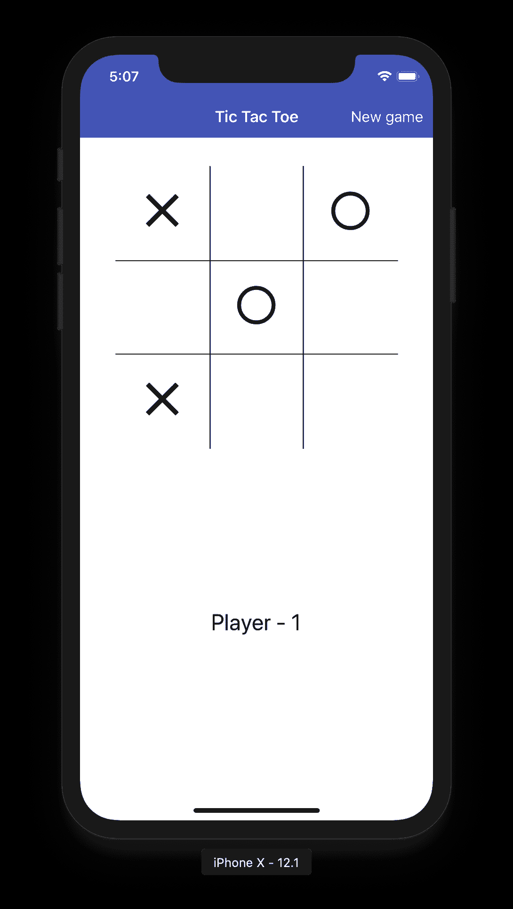
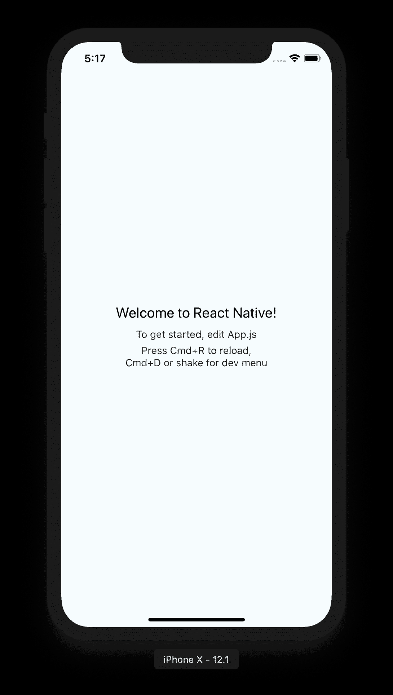
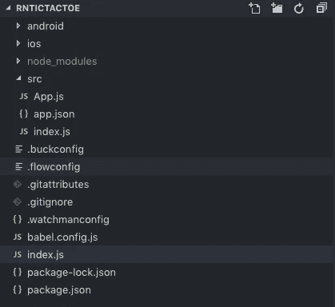
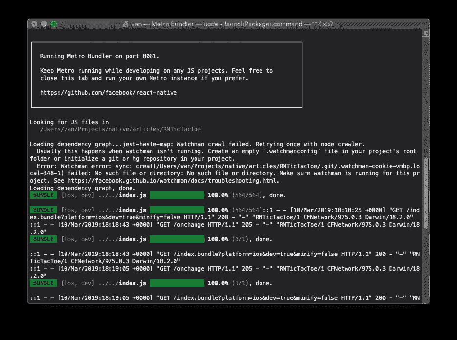
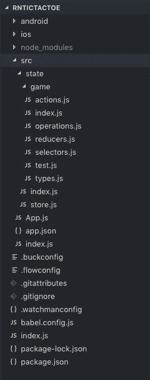
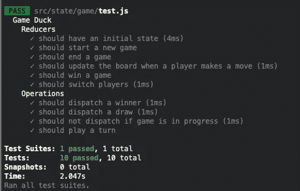
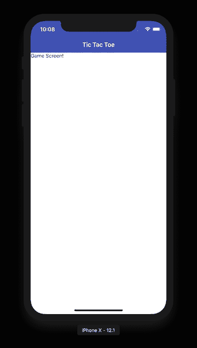
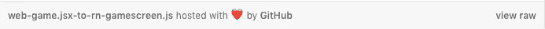

# 将基于 Web 的 React 井字游戏迁移到 React Native

> 原文：<https://itnext.io/migrating-a-web-based-react-tic-tac-toe-game-to-react-native-ff7cac124f0?source=collection_archive---------4----------------------->



去年我用 React 和 Material-UI (MUI)写了一个[井字游戏](https://medium.com/@vanister/learn-react-redux-by-making-a-tic-tac-toe-game-part-1-of-5-dc9111ca09ad)游戏。现在，我想尽可能多地将该应用程序迁移到 React Native，以便它可以在移动设备上运行。

游戏中最难移植的部分是样式，因为 MUI 组件库与 React Native 不兼容。另一方面，由于 MUI 使用 JSS 作为它的样式，这可能有助于用最少的改变带来大多数用于样式的类。

什么是[反应土著](https://facebook.github.io/react-native/) (RN)？文档称，这是一个用于构建真正的原生应用的框架，可以为 Android 或 iOS 原生编译，而不是像其他原生框架一样使用 web-view 包装器。在很大程度上，你所需要知道的就是 [React](https://reactjs.org/) 和 JavaScript 来构建一个移动应用。

React Native 团队做了大量工作，提供了 React 中的许多常用组件，这些组件将编译到各自的操作系统组件中。有时候，你需要构建 React Native 中不存在的自定义[本机组件](https://facebook.github.io/react-native/docs/native-modules-setup)(桥)来获得你需要的功能，但对于这个应用程序，我们不需要这样做。

对于这次迁移，我将创建一个新的存储库，并使用 GitHub Gists 保存文件的旧版本，然后用 React 本机代码修改它。这样，您就可以查看要点并查看对其所做的更改，而不必在 web Tic Tac Toe 源代码库中创建新的分支。

## 设置

***注意 01:我在使用 VS 代码的 Mac 上进行这次迁移，不确定它是否也适用于 Windows 环境。***

***注 02:我还将展示文章大部分内容的 iOS 模拟器截图。然而，我将展示 iOS 模拟器和 Android 模拟器的最终截屏，以证明移植在两个平台上都有效。***

遵循 React Native (RN) [入门](https://facebook.github.io/react-native/docs/getting-started)页面上的操作系统设置说明。确保遵循“ *React Native CLI 快速入门*”选项卡。在我的情况下，我按照 macOS/iOS/Android 的设置步骤。

如果您还没有从 RN 文档的“入门”一节开始这样做，请通过运行以下命令创建一个新项目:

```
**# As of this article, the latest version of 
# React Native is v0.58 cd to your project directory 
# and run:**$ react-native init RNTicTacToe**# Alternatively, if you do not want to install the 
# react-native cli globally, you can run:**$ npx -p react-native-cli react-native init RNTicTacToe**# Once the project is created cd into it.**$ cd RNTicTacToe
```

在新创建的项目中，使用方便的脚本更新`package.json`文件，以在 iOS 或 Android 中启动应用程序。

```
**# File: package.json**{
  "name": "RNTicTacToe",
  ...
  ...
  "scripts": {
    "android": "react-native run-android",
    "ios": "react-native run-ios",
    "rn": "react-native"
  }
  ...
  ...
}
```

我们知道我们将需要 Redux，一个导航框架和一个图标包，因为网页版的游戏使用 Redux 进行状态管理，一个导航条显示一个菜单，其中有一个“新游戏”按钮和组件中图标的材料图标。

```
**# Add Redux and React Navigation, which is the community 
# supported navigation framework for React Native.**$ npm install --save redux redux-thunk react-redux prop-types
$ npm install --save react-navigation react-native-gesture-handler
$ npm install --save react-native-vector-icons
```

包装:

*   [**Redux**](https://redux.js.org) **，**[**Redux Thunk**](https://www.npmjs.com/package/redux-thunk)**，**[**React-Redux**](https://www.npmjs.com/package/react-redux)**和**[**prop types**](https://www.npmjs.com/package/prop-types)—用于管理状态，延迟调度和连接状态存储到 React 组件。
*   [**React 导航**](https://reactnavigation.org) **和** [**React 原生手势处理程序**](https://reactnavigation.org/docs/en/getting-started.html#installation)**——React 原生 app 中处理导航的社区包。我们将用它来创建带有“新游戏”按钮的标题栏。**
*   **[**React 原生矢量图标**](https://github.com/oblador/react-native-vector-icons)—React 原生应用的图标集。这将用于为玩家选择图标。**

**让我们将 React 原生矢量图标(vector-icons)链接到 iOS 和 Android 项目。我们可以通过从之前用于初始化项目的`react-native-cli`中运行`link`命令来自动完成这项工作。你可以在这里查看安装步骤。**

```
**# If you installed the react-native-cli globally, run:**$ react-native link react-native-vector-icons**# If you used `npx` to initialize the project, run:**$ npx -p react-native-cli react-native link react-native-vector-icons**# or if you added `rn` to the package.json scripts:**$ npm run rn -- link react-native-vector-icons**# Do the same for React Native Gesture Handler:**$ npm run rn -- link react-native-gesture-handler**# You should see 'successful' messages printed in the terminal**
```

**此时，如果您运行这个项目，在 iOS 模拟器或 Android 模拟器中应该会出现样板启动屏幕。**

****

**iOS 模拟器，样板开始屏幕。**

```
**# Run on the iOS Simulator:**$ npm run ios**# or for Android:**$ npm run android
```

**在我们开始迁移之前，还有一件事情需要完成。我希望项目结构反映传统的 JavaScript 项目，其中源代码位于`src`文件夹中，而不是项目的根目录。**

**让我们更新样板项目结构来反映这一点。**

```
# Add a folder to the project root called `src`.
# Add an `index.js` file to the `src` folder.
# Move the `app.json` file to the `src` folder.
# Move the `App.js` file at the root into the `src` folder.# You can delete the `__tests__` folder. 
# We will be migrating over our tests from the 
# web project into the `src` folder.# The project directory should look this this:
```

****

**我们将需要用当前项目根目录中的代码更新新的`src/index.js`文件，以使应用程序再次工作。**

**将根文件`index.js`的内容复制到`./src/index.js`文件中。**

```
**# File: ./src/index.js**// content originally in the ./index.js file
import { AppRegistry } from 'react-native';
import App from './App';
import { name as appName } from './app.json';AppRegistry.registerComponent(appName, () => App);
```

**更新根目录下的`index.js`文件，导入`src`文件夹下的`index.js`文件。**

```
**# File: ./index.js**import './src/index';
```

**关闭/退出 iOS 模拟器，并确保运行 Metro bundler 的终端已停止。**

****

**麦德龙·邦德勒。**

**再次运行`npm run ios`以确保应用程序运行无误。**

## **移民**

**我们将从迁移 Redux 状态存储和 ducks 开始，然后是 React 容器组件，最后是表示组件。之后，我们将通过微调风格和定位来润色应用程序。**

**让我们从克隆现有的网络游戏[井字游戏](https://github.com/vanister/medium.com)开始，在一个单独的 VS 代码窗口中打开它。我发现最好将这两个项目放在一起，这样移动代码更容易。**

```
**# Clone from GitHub**$ git clone https://github.com/vanister/medium.com.git
```

****还原状态****

**由于 RN 本质上是 React，除了一些组件与 web 版本不同之外，我们应该能够不加修改地迁移我们的 Redux 状态。**

**在 web 项目中，打开`src/state/ducks/`文件夹并将`game`文件夹复制到`RNTicTacToe`项目的`src/state/`文件夹中。**

**接下来，打开 web 的`src/state/ducks/utils/game.js`文件，并将其内容复制到`RNTicTacToe/src/state/game/selectors.js`文件中。**

*****注 03:我决定将*** `***utils/game.js***` ***文件移到游戏状态的*** `***selectors.js***` ***文件中，因为这就是它们的本来面目。*****

**然后将网页的`src/state/ducks/index.js`和`src/state/store.js`复制到`RNTicTacToe/src/state/`文件夹。**

**最后，打开每个复制的文件，并确保相应地更新引用。它们很可能是`selectors.js`、`operations.js`和`store.js`文件，因为它们引用了 web 项目结构中的`utils`和`ducks`文件夹。**

****

**RNTicTacToe 状态文件夹。**

**为了确认我们已经移动了所有的 redux 文件并正确地更新了引用，在`RNTicTacToe`项目的终端中运行`npm test`，所有的测试都应该通过了。**

****

**从“RNTicTacToe”终端输出“npm test”。**

****Redux 商店提供商****

**既然 reducers 和操作正在工作，那么让我们设置应用程序，为稍后在迁移中使用它们的组件提供 Redux 存储。**

**打开网站的`src/index.js`文件，并将其内容复制到`RNTicTacToe/src/index.js`文件中。接下来用下面的要点替换`RNTicTacToe/src/index.js`文件的内容。**

*****注 04:直接在 gist.github.com 上转到要点，选择*** `***revisions***` ***查看 web 代码和 React 原生代码变化之间的变化。*****

**RNTicTacToe/src/index.js 文件。**

**再次运行应用程序，或者如果 iOS 模拟器和 Metro Bundler 仍在运行，请点击`Command+R`刷新应用程序。**

**您也可以通过点击`Command+D`然后选择“启用实时重装”来启用实时重装**

****标题和导航****

**在我们开始迁移组件之前，我们应该添加一个应用程序标题栏，类似于 Material-UI 为我们的 web 应用程序提供的标题栏。我们将使用 React 导航来实现这一点。**

**如果我们需要的话，使用 React 导航来创建我们的应用程序标题也将为我们提供导航或顶级模态展示的支持。**

**让我们首先为我们的“screens”创建一个文件夹，它也将在稍后的迁移中充当我们的容器组件。**

**将以下文件添加到`screens`文件夹:`screens.js`、`index.js`和`GameScreen.js`。**

**`screens.js`文件是我们在应用程序中保存屏幕常量的地方，因此我们不必直接依赖其他可能需要它的组件中的神奇字符串。**

```
**// File: src/screens/screens.js**const GAME = 'Game';export default {
  GAME
};
```

**`index.js`文件是我们在`screens`文件夹中保存屏幕注册码和公共模块集中导出的地方。**

```
**// File: src/screens/index.js**import { createStackNavigator } from 'react-navigation';
import screens from './screens';
import GameScreen from './GameScreen';const { GAME } = screens;const createAppNavigator = () => { 
  const appNavigator = createStackNavigator(
    {
      [GAME]: GameScreen
    },
    {
      initialRouteName: GAME,
      defaultNavigationOptions: {
        headerTintColor: '#fff',
        headerStyle: {
          ***// material blue theme color***backgroundColor: '#3f51b5'
        }
      }
    }
  ); return appNavigator;
};export {
  createAppNavigator
};**// we export screens here so we can use it in other
// modules with just an import to `./screens`** 
export default screens;
```

**目前，`GameScreen.js`文件只是 web 项目中被迁移的`Game.jsx`容器组件的一个存根。**

```
**// File: src/screens/GameScreen.js**import React, { Component } from 'react';
import { 
  StatusBar, 
  StyleSheet, 
  Text, 
  View 
} from 'react-native';class GameScreen extends Component {
  // part of react-navigation to style the header
  static navigationOptions = {
    title: 'Tic Tac Toe'
  }; render() {
    return (
      <View style={styles.container}>
        <StatusBar barStyle='light-content'></StatusBar>
        <Text>Game Screen!</Text>
      </View>
    );
  }
}const styles = StyleSheet.create({
  container: {
    flex: 1
  }
});export default GameScreen;
```

**最后，打开`App.js`文件，用我们刚刚从`screens`文件夹中写的导航和标题代码更新它。**

```
**// File: src/App.js**import React from 'react';
import { createAppContainer } from 'react-navigation';import { createAppNavigator } from './screens';const appNavigator = createAppNavigator();
const AppContainer = createAppContainer(appNavigator);const App = () => {
  return (
    <AppContainer></AppContainer>
  );
};export default App;
```

**再次运行该应用程序，我们应该会看到一个带有蓝色标题栏、白色主体和文本“游戏屏幕”的屏幕**

****

**iOS 模拟器，带有 React 导航标题和游戏屏幕。**

**你会看到很多改变使用了 React Native 内置的 Flexbox 进行布局和定位。你可以在这里阅读更多关于 Flexbox 的信息。**

**[](https://css-tricks.com/snippets/css/a-guide-to-flexbox/) [## Flexbox | CSS-技巧完全指南

### 我们的 CSS flexbox 布局综合指南。这份完整的指南解释了 flexbox 的一切，重点是所有…

css-tricks.com](https://css-tricks.com/snippets/css/a-guide-to-flexbox/)** 

****表象/无状态成分****

**创建一个`src/components/`文件夹来保存我们所有的演示组件。**

**为负责在网格中呈现`X`或`O`的组件添加一个名为`Square.js`的文件，然后向其中添加以下代码。**

**RNTicTacToe/src/components/square . js—请记住，您可以在 github 上查看这个要点，并将旧的 web jsx 版本与这个版本进行比较。**

**`PlayerInfo`组件显示哪个玩家是游戏中的当前玩家，如果游戏已经结束，则显示“Gameover”消息。将`PlayerInfo.js`文件添加到`src/components/`中，并用以下代码进行更新:**

**RNTicTacToe/src/components/player info . js**

**`GameoverDialog`组件显示游戏结束的时间，并告诉我们谁赢得了游戏，并可以选择直接从模式开始新的游戏。**

**将名为`GameoverModal.js`的文件添加到`src/components/`文件夹中，并用下面的代码更新它。**

**RNTicTacToe/src/components/gameovermodal . js—我们称之为模态，因为在 RN 中他们称之为模态。在 Material-UI 中，它被称为对话框。**

**由于我们没有为 React 原生应用程序实现菜单，我们需要用一个`HeaderButton`组件替换`Menu`组件，以从头部触发一个新游戏。**

**将名为`HeaderButton.js`的文件添加到`src/components/`文件夹中，并用以下代码对其进行更新:**

**RNTicTacToe/src/components/header button . js**

**最后一个要迁移的表示组件是`Board`组件。这是游戏的核心，在这里`X`和`O`被渲染到屏幕上一个 3x3 的网格中。这个组件使用我们之前迁移的`Square`组件来完成这个任务。**

**将名为`Board.js`的文件添加到`src/components/`中，并更新为以下内容:**

**RNTicTacToe/src/components/board . js**

****容器组件****

**最后，剩下要做的唯一一件事就是将`Game`组件迁移到我们的存根`GameScreen`组件上，一切都应该完成了。**

**打开文件夹`src/screens/`中的`GameScreen.js`文件，并将其替换为以下代码:**

**RNTicTacToe/src/screens/game screen . js**

**应该可以了。如果我们再次启动应用程序，我们应该会看到一个功能正常的 TicTacToe 游戏。**

****

**来自 iOS 模拟器和 Android 模拟器的游戏。**

## **结论**

**我可以说，游戏中的大部分逻辑都被原封不动地移植过来了。Material-UI 在 React Native 中不作为包提供，因此必须使用视图、文本、TouchableOpacity(按钮)和 Flexbox 布局在 React Native 中重新创建这些组件。**

**总的来说，大约 30%的代码需要修改，其中大部分是样式化的，这样才能在移动设备上进行移植。**

**请记住，如果你在 gist.github.com 上直接进入网站，你可以看到网站的不同之处。只需单击要点框架底部的文件名:**

****

**点击文件名的“查看原始文件”,然后选择“修订”选项卡。**

**感谢您的阅读！**

**文章来源:[https://github.com/vanister/RNTicTacToe](https://github.com/vanister/RNTicTacToe)。**

**web React 井字游戏来源:[https://github . com/vanister/medium . com/tree/master/Tic-Tac-Toe](https://github.com/vanister/medium.com/tree/master/tic-tac-toe)。**