# 将 Apache Spark 工作负载从 AWS EMR 迁移到 Kubernetes

> 原文：<https://itnext.io/migrating-apache-spark-workloads-from-aws-emr-to-kubernetes-463742b49fda?source=collection_archive---------0----------------------->

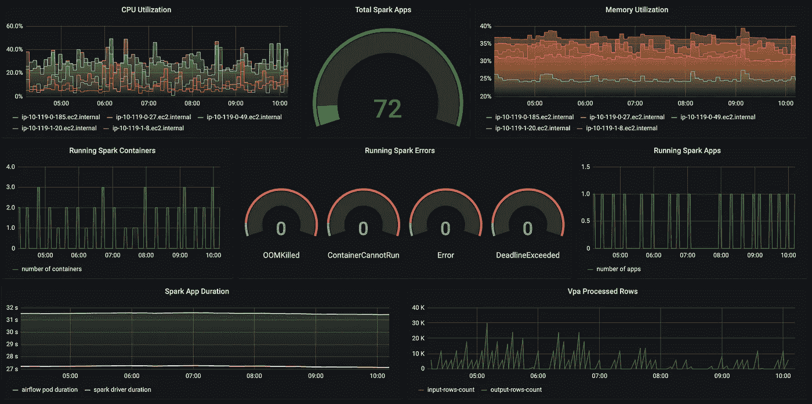

# 介绍

ESG research [发现，43%](https://aws.amazon.com/big-data/what-is-spark/) 的受访者认为云是 Apache Spark 的主要部署。这很有意义，因为云提供了可伸缩性、可靠性、可用性和巨大的规模经济。云部署的另一个强大卖点是托管服务形式的低准入门槛。“三大”云提供商中的每一家都有自己的产品来运行 Apache Spark 作为托管服务。你大概听说过 [AWS 弹性图还原](https://aws.amazon.com/emr/)、 [Azure Databricks](https://azure.microsoft.com/en-us/services/databricks/) 、 [Azure HDInsight](https://azure.microsoft.com/en-us/services/hdinsight/) 、 [Google Dataproc](https://cloud.google.com/dataproc) 。

我将重点介绍 AWS Elastic Map Reduce，因为我们在 AWS 上运行 Spark 工作负载。我们使用 Apache Airflow 进行工作流程编排。

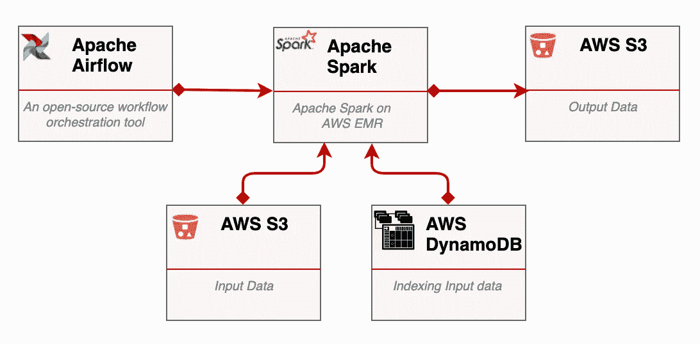

数据流

数据来自不同的来源，分布在不同的地理区域，不一定运行在 AWS 云上。例如，一些数据源是在浏览器中运行的 web 应用程序，另一些是移动应用程序，还有一些是外部数据管道等。[此处](https://medium.com/swlh/no-code-data-collect-api-on-aws-d79e3681d204)和[此处](https://medium.com/swlh/no-code-data-collect-api-f8e934ed8535)您可以看到我们是如何实施数据摄取步骤的。所有输入数据都收集在 S3 桶中，并根据 [AWS DynamoDB](https://aws.amazon.com/dynamodb/) 中的创建日期进行索引。这样做允许我们在任何给定的时间间隔内处理数据批次。我们每天处理 2TB 的数据，而在“特殊事件”日，数据量可能会大得多。

# 问题陈述

总的来说，AWS EMR 做得很好。它是管理 Apache Spark 集群的一个可靠、可伸缩和灵活的工具。AWS EMR 以 AWS Cloudwatch 的形式提供开箱即用的监控，它提供了丰富的工具箱，包括 [Zeppelin](https://zeppelin.apache.org/) 、 [Livy](https://livy.apache.org/) 、 [Hue](https://gethue.com/) 等，并且具有非常好的安全特性。但是 AWS EMR 也有自己的降级。

**可移植性**:如果您正在构建一个多云或混合(云/本地)解决方案，请注意从 AWS EMR 迁移 Spark 应用程序可能是一件大事。在 AWS EMR 上运行一段时间后，您会发现自己与 AWS 的特定功能紧密结合。它可以很简单，比如日志和监控，也可以很复杂，比如自动伸缩机制、定制的主/从 AMIs、AWS 安全特性等等。

**成本开销**:亚马逊 EMR 价格是亚马逊 EC2 价格的补充。看一下定价示例[这里](https://aws.amazon.com/emr/pricing/)

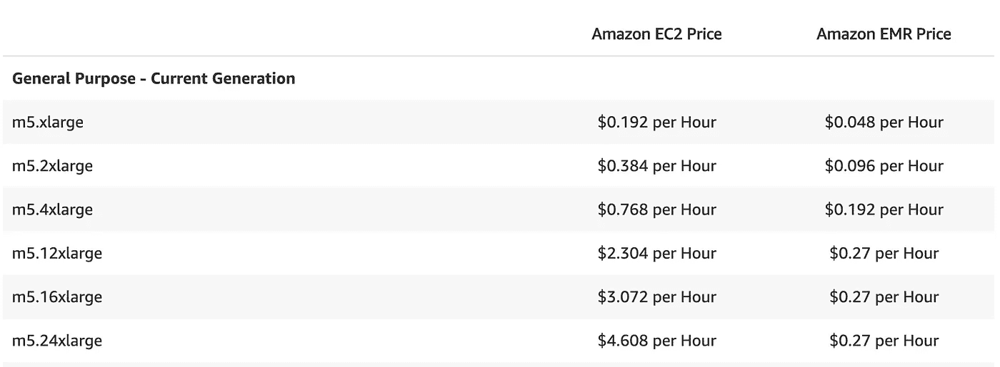

AWS EMR 定价

如您所见，在使用 m5.xlarge、m5.2xlarge 或 m5.4xlarge 机器时，您必须在基础 EC2 的按需价格上增加 25%。当你使用大型机器时，EMR 费用在 12%到 6%之间。当使用 spot 时，EMR 价格可以高达基础 EC2 spot 实例价格的 35%。例如，请参见附件中取自真实生产环境的 3 天账单。这里，AWS EMR 集群由 spot 实例组成，您可能会看到 EMR 服务有些昂贵。

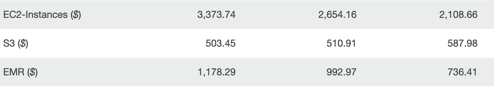

三天期票据(美元)

通过对给定的三天账单进行年度预测，您可以看到，在这种特定情况下，EMR 服务的成本可能高达每年 300，000 美元。

# 目标

综上所述，运行 Apache Spark 的理想框架通过以下目标实现了总体目标:

## 可扩展性。

随着计算需求的变化，新的解决方案应该提供扩展 Apache Spark 集群的能力。

## 可靠性:

新的解决方案应该监控计算节点，并在出现故障时自动终止和替换实例。

## 便携性:

新的解决方案应该消除对底层基础设施的依赖。

## 成本效益:

新的解决方案应该会降低托管服务的成本。

# 在 Kubernetes 上运行 Apache Spark

Apache Spark 目前支持 4 种不同的集群管理器:**独立、Apache Mesos** 、 **Hadoop YARN 和 Kubernetes** 。前三个是众所周知的，已经存在了一段时间。点击这里，你可以找到一篇涵盖所有这些问题的精彩文章[。Kubernetes 的支持是新的，它是在 Spark 2.3(2018 年 2 月)中引入的，从可移植性的角度来看，这是一大进步。Kubernetes 为管理容器化的应用程序提供了强大的抽象。Kubernetes 消除了基础架构锁定，允许在多个操作环境中运行应用程序，包括专用的本地服务器、虚拟化私有云以及公共云。](https://data-flair.training/blogs/apache-spark-cluster-managers-tutorial/)

> " [Kubernetes](https://kubernetes.io/) 允许您在任何地方[部署云原生应用程序](https://www.infoworld.com/article/3173266/4-reasons-you-should-use-kubernetes.html#:~:text=Kubernetes%20allows%20you%20to%20deploy,exactly%20as%20you%20like%20everywhere&text=With%20containers%2C%20it's%20easy%20to,lighter%20weight%20than%20virtual%20machines.)并完全按照您喜欢的方式在任何地方管理它们"

“Kubernetes”有两个运行 Apache Spark 应用程序的选项:通过 [spark-submit](https://spark.apache.org/docs/latest/running-on-kubernetes.html) 或使用 [Kubernetes 操作符运行 Spark](https://github.com/GoogleCloudPlatform/spark-on-k8s-operator#:~:text=The%20Kubernetes%20Operator%20for%20Apache%20Spark%20aims%20to%20make%20specifying,surfacing%20status%20of%20Spark%20applications.) 。后一种选择在管理和监控方面带来了很多。我将重点讨论第一个，因为它非常简单，由 Spark 提供本地支持，并且与 Apache Airflow 有很好的集成。

## 它是如何工作的

spark 的 bin 目录中的 [spark-submit](https://spark.apache.org/docs/latest/submitting-applications.html) 脚本用于在使用各种资源管理器(YARN、Apache Mesos、Kubernetes)的集群上启动应用程序:

```
./bin/spark-submit \
  --class <main-class> \
  --master <master-url> \
  --deploy-mode <deploy-mode> \
  --conf <key>=<value> \
  ... # other options
  <application-jar> \
  [application-arguments]
```

当 master 的 URL 以***k8s****://【Kubernetes _ DNS】*开头时，Spark 会在 *Kubernetes_DNS* 指定的集群上的 [Kubernetes pod](https://kubernetes.io/docs/concepts/workloads/pods/pod/) 内创建一个运行的 Spark 驱动程序。驱动程序将在 Kubernetes pods 中创建执行器，并执行应用程序代码。当应用程序完成时，executor pods 终止并被清理，但是 driver pod 保存日志并保持“完成”状态，直到它最终被垃圾收集或手动清理。

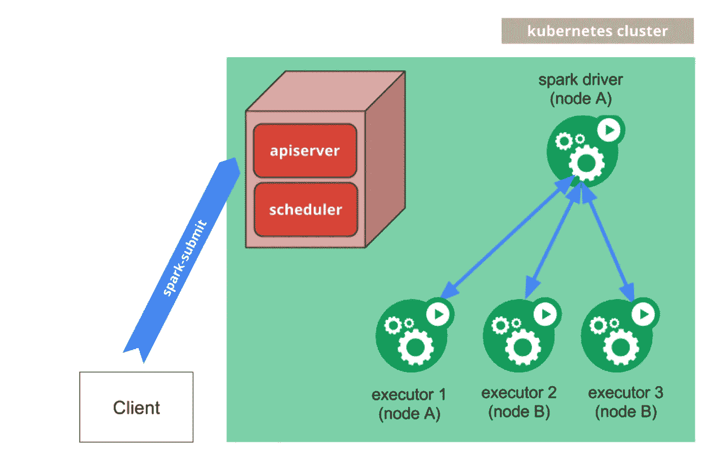

在 K8s 集群中执行 spark-submit

现在我们对在 K8s 上运行 Apache Spark 有了一个清晰的了解，我们有动力开始迁移过程。

## 运行 AWS EKS 集群

第一步是创建 Kubernetes 集群。这里我们将使用 EKS —一个完全管理的 Kubernetes 集群。AWS 有如何开始使用 EKS 的可靠文档，例如，你可以在这里和这里看到逐步指南[。我将总结整个过程。从克隆以下存储库开始:](https://aws.amazon.com/eks/?whats-new-cards.sort-by=item.additionalFields.postDateTime&whats-new-cards.sort-order=desc&eks-blogs.sort-by=item.additionalFields.createdDate&eks-blogs.sort-order=desc)

```
git clone https://github.com/aws-samples/amazon-eks-apache-spark-etl-sample.git
```

打开并编辑 example/eksctl.yaml 文件。它包含以下内容:

eksctl.yaml

如果您想在 us-east-1 (N.Virginia)以外的地区创建 EKS 集群，或者您更喜欢其他机器类型和容量，请编辑该文件。更改第 22 行并设置您的 IAM_POLICY_ARN。然后，通过运行以下命令创建 EKS 集群

```
eksctl create cluster -f example/eksctl.yaml
```

设置新的 EKS 集群大约需要 15 分钟。最后，您应该能够在 EKS 集群仪表板上看到以下信息:

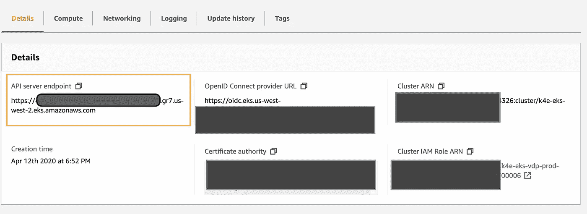

EKS 仪表板

API 服务器端点(在橙色矩形中)很重要，Apache Airflow 将使用它来提交 spark 作业。集群运行后，创建 Kubernetes 服务帐户和集群角色绑定，以授予 Kubernetes 对 Spark 作业的编辑权限:

```
kubectl apply -f example/kubernetes/spark-rbac.yaml
```

注意，这里我们假设 Spark 应用程序将在默认名称空间中运行。如果要在专用名称空间中运行 spark 应用程序，请更改 spark-rbac.yaml 文件。

spark-rbac.yaml

## 为 Spark 应用程序构建 Docker 映像

根据定义，Kubernetes 是一个容器编排系统，因此我们必须为 Spark 应用程序创建一个 docker 映像。在这里，我将描述如何为 Scala 应用程序实现这一点。这个想法是创建 docker 映像，其中包含 Apache Spark 和 Hadoop 的发行版，以及一个 Fat Jar，其中包含所有项目类文件和资源以及所有依赖项。第一步是向 project.sbt 文件添加一个程序集 SBT 插件(如果不存在的话)

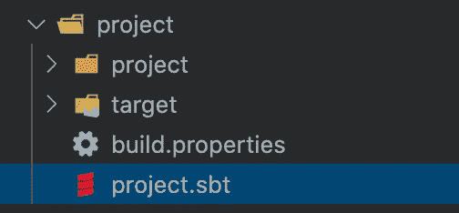

project.sbt

```
addSbtPlugin("com.eed3si9n" % "sbt-assembly" % "0.14.9")
```

使用这个插件的目标很简单:创建一个包含所有依赖项的 Scala 项目的胖罐子。下一步是查看 SBT 文件中缺少的依赖项。AWS EMR 附带了许多预装的库，在 Kubernetes 上运行时会缺少这些库。所以我们必须把它们都带到 docker 映像中。当然，库的数量和类型会因项目而异，但至少我们需要以下内容:

```
"com.amazonaws" % "aws-java-sdk" % "1.7.4"
"org.apache.hadoop" % "hadoop-aws" % "2.7.1"
```

这些库将用于消费 AWS 服务，如 S3、DynamoDB 等。最后一步是创建 docker 文件。添加新文件

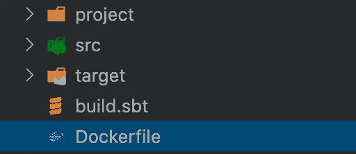

Dockerfile 文件

使用克隆存储库中 Dockerfile 的内容—[https://github . com/AWS-samples/Amazon-eks-Apache-spark-ETL-sample . git](https://github.com/aws-samples/amazon-eks-apache-spark-etl-sample.git)作为蓝本。这个 docker 文件安装了以下 Apache Spark 发行版:

```
[https://archive.apache.org/dist/spark/spark-2.4.4/spark-2.4.4-bin-hadoop2.7.tgz](https://archive.apache.org/dist/spark/spark-2.4.4/spark-2.4.4-bin-hadoop2.7.tgz)
```

在 SBT 文件中更改 Spark 或 Hadoop 版本时要小心。每个 Apache Spark 版本都与 Hadoop 的特定版本兼容。您应该知道的 Other 文件中的其他重要行:

```
# Define working directory
WORKDIR /opt/input

# Project Definition layers change less often than application code
COPY build.sbt ./

WORKDIR /opt/input/project
COPY project/build.properties ./
COPY project/*.sbt ./

WORKDIR /opt/input

# Copy rest of application
COPY . ./
RUN SBT_OPTS="-Xms4096M -Xmx4096M -Xss1024M -XX:MaxMetaspaceSize=4096M" sbt clean assembly
```

它将所有项目的源文件和资源复制到 docker 映像并构建 Fat Jar。构建 docker 映像:

```
docker build -t <REPO_NAME>/<IMAGE_NAME>:v1.0 .
```

确保您可以在 docker 映像中看到以下文件

```
//opt/spark/jars/*-assembly-v1.0.0.jar
```

这个文件包含您的 Spark 应用程序代码。最后，您可以将 docker 图像上传到 AWS ECR

```
docker push <REPO_NAME>/<IMAGE_NAME>:v1.0
```

## 气流库伯内特操作员

现在，我们准备从 Apache Airflow 中的代码执行 spark-submit。Apache Airflow 支持在底层 Kubernetes 集群或远程集群上启动新的 Kubernetes pods。例如，您可以按以下方式使用 KubernetesPodOperator:

我猜代码本身非常简单，我将只关注重要的参数。我们将在“spark”服务帐户下的默认名称空间中的底层 Kubernetes 集群上运行 Spark 应用程序。

```
eks_in_cluster = true
eks_namespace = "default"
eks_service_account_name="spark"
```

请注意，通常，隔离 Spark 应用程序并在专用名称空间中运行它们是有意义的。因此，如果其他应用程序正在使用默认名称空间，最好创建一个专用的 spark apps 名称空间。

```
eks_context = *CLUSTER_ARN*
```

集群 ARN 可以在 EKS 仪表板上找到


EKS 仪表板

eks_command 参数就是您的 spark-submit 命令，它应该具有以下形式:

```
/bin/sh,-c,/opt/spark/bin/spark-submit --master {} --deploy-mode cluster --name {} --conf spark.driver.memory={} --conf spark.executor.instances={} --conf spark.executor.memory={} --conf spark.executor.cores={}  --conf spark.kubernetes.container.image={}  --conf spark.kubernetes.authenticate.driver.serviceAccountName={} {} --class {} {} {}
```

用户 k8s://*API _ SERVER _ ENDPOINT*(从 EKS 仪表板)作为集群的主服务器。

现在，当 Apache Airflow 执行 KubernetesPodOperator 时，您会看到为驱动程序和执行器创建了新的 pods。所有日志都可以从 pods stdout 中获取。使用 Kubernetes 端口转发，通过 Spark 驱动程序上的 Spark UI 来监控作业。快跑吧

```
kubectl port-forward <SPARK_DRIVER_POD_NAME> 4040:4040
```

并从浏览器导航到 localhost:4040 以查看 Spark UI。

## 与普罗米修斯和格拉夫纳一起监控

EMR 的一个非常强大的功能是内置的监控和警报功能，其形式为 CloudWatch 指标和警报。对于每个 EMR 集群，指标每五分钟更新一次，并自动收集和推送到 CloudWatch。Amazon EMR 报告的指标提供了可用于跟踪 Apache Spark 工作负载进度、分析内存和 CPU 使用情况、检测不健康节点等的信息。显然，当迁移到 Kubernetes 时，我们正在失去所有这些能力。幸运的是，有很多监控和可观察性工具可以安装在 K8s 集群上。最受欢迎的解决方案之一是普罗米修斯和格拉夫纳。这些工具的设置超出了本文的范围，但是您可以在 K8s [这里](https://medium.com/better-programming/monitor-your-kubernetes-cluster-with-prometheus-and-grafana-1f7d0195e59)找到 Prometheus 和 Grafana 的介绍。一旦设置好这些工具，我们就可以通过对 Prometheus 数据源使用 Grafana 查询来轻松定义 Spark 应用程序的[黄金](https://landing.google.com/sre/sre-book/chapters/monitoring-distributed-systems/)指标:延迟、流量、错误、饱和度。

1.  饱和度——衡量已用资源的指标

```
node:node_cpu_saturation_load1:node:node_memory_utilisation:ratio*100
```


CPU 和内存利用率

2.延迟—处理一个请求(批处理)所需的时间

```
avg(kube_pod_completion_time{namespace="default", pod=~".*driver.*"} - kube_pod_start_time{namespace="default", pod=~".*driver.*"})
```

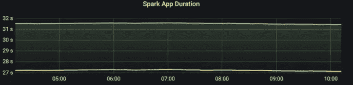

Spark 应用持续时间

3.流量被定义为自定义应用程序指标，并显示输入 Spark 数据帧中的行数

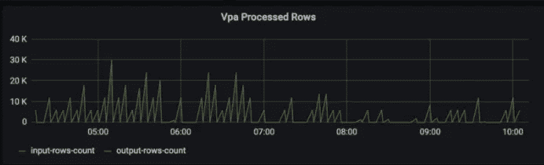

火花输入大小

4.错误-计算失败的 pod 的数量。可以按原因汇总。

```
count(kube_pod_container_status_terminated_reason{namespace="default", container=~".*driver.*"})
```

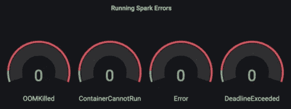

火花误差

# 摘要

迁移 Apache Spark 在可移植性、成本和资源共享效率方面带来了很多好处。

## 费用

与 EMR 相比，在 Kubernetes 上运行相同 Spark 工作负载的成本要低得多。AWS EKS 集群每小时成本仅为 0.10 美元(每月 72 美元)。另一方面，AWS EMR 价格始终是基础 EC2 机器成本的函数。正如本文开头所显示的，EMR 对总成本的贡献很大，尤其是当 Spark 工作负载很大时。如果您需要一个粗略的估计，与在按需 EC2 上运行的 EMR 相比，您将节省高达 20%的成本，与在现场运行的 EMR 相比，您将节省高达 30%的成本。

## 轻便

在 EMR 上运行时，Spark 应用程序和支持它们的工具与底层 AWS 基础设施紧密相关，如专有的扩展技术、对 ami 的依赖性、安全特性、日志和监控系统等。Kubernetes 通过为容器提供核心功能而不施加限制，消除了 AWS 的局限性。使用 Kubernetes 时，您可以跨多个操作环境运行 Apache Spark 工作负载，包括 GCP、AWS、Azure、本地服务器和私有云。

## **资源共享**

Kubernetes 高效地利用了底层基础设施，因为容器比虚拟机轻得多。在 Spark 应用程序和其他服务之间共享相同的 EC2 机器降低了对计算能力的需求。