# 使用 Azure 数据工厂将数据从 CosmosDB 迁移到 Azure 存储

> 原文：<https://itnext.io/migrating-data-from-cosmosdb-to-azure-storage-using-azure-data-factory-b7158d716281?source=collection_archive---------1----------------------->

迪米特里·阿尼金在 [Unsplash](https://unsplash.com?utm_source=medium&utm_medium=referral) 上拍摄的照片

最近，我有幸被指派将一个旧的 CosmosDB 核心(SQL)帐户迁移到 Azure Storage。该帐户在项目早期就已经存在，它包含两个集合中的近 100GB 数据，每个集合都包含出于合规目的而必须保留的 PID(个人身份数据)。不用说，我非常害怕接触这个。

这背后的背景故事是，几个月前我们改变了我们的应用程序，在一个单独的帐户中使用 MongoDB API for CosmosDB。我们已经使用 MongoDB 存储其他数据，所以我们决定将所有这些记录合并到一个帐户中，并通过一个客户端访问它。以前保存在 SQL 帐户中。当我们知道如何做时，技术领导决定整合 MongoDB 帐户中的所有内容，并绑定 SQL 帐户。

我开始四处寻找数据迁移工具是否符合我们的目的，但我用的是 Mac，而该工具只能在 Windows 上运行🤦‍♂.我考虑过将启动虚拟机作为一种临时措施并将其安装在那里，但我觉得如果虚拟机在迁移过程中的任何时候重启，这可能会给我们带来问题。

# **创建数据工厂**

坦白地说，我使用 GUI 进行所有这些操作，主要是因为这是一次性的导出，我不打算再这样做了。我通常会使用 Terraform，然而，为一个只会使用一次的东西找出所有的资源和参数似乎有点大材小用。

下面是建立数据工厂的过程:

1.  在门户中，导航到数据工厂

2.单击添加，然后完成创建向导。将版本设置为 *V2* ，如果您现在不想执行此步骤，请勾选*稍后配置 Git*框。完成后，单击 Review + Create 创建数据工厂。

3.等待它完成创建。

# 将数据从 CosmosDB 导出到 Azure 存储

首先打开您刚刚在 Azure 门户中创建的数据工厂。将它放在面前后，选择概览刀片上的作者和监视器，然后执行以下步骤:

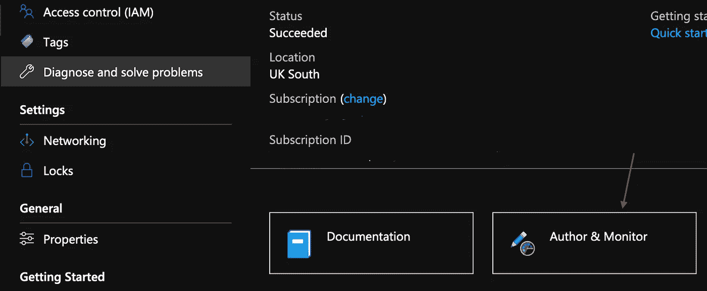

1.将打开一个新的选项卡，这是数据工厂 UI。在这里，选择*复制数据*。这将打开一个设置向导，我们将在其中添加 CosmosDB 帐户和存储帐户的连接详细信息。

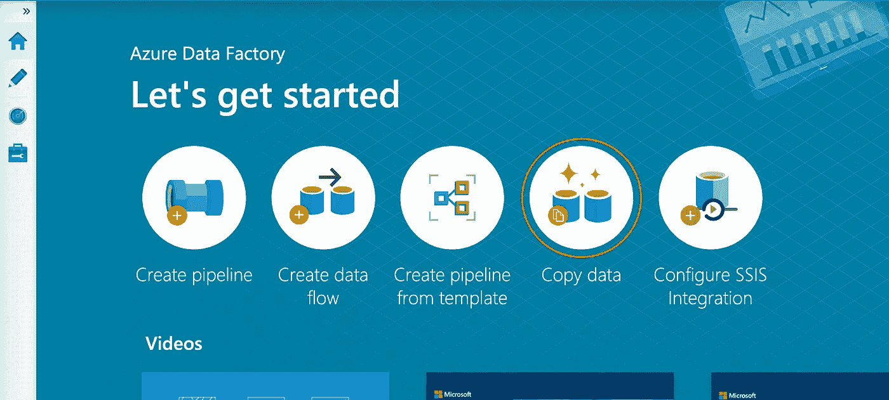

2.输入作业的名称，然后单击下一步。

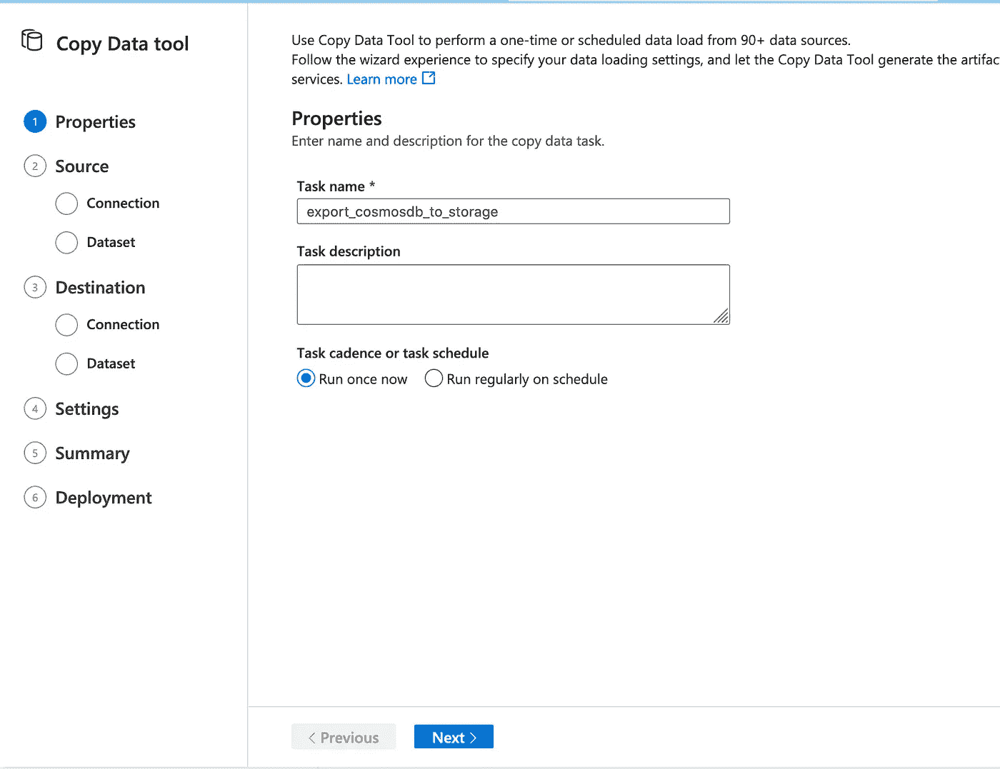

3.下一个屏幕应该是空白的。选择创建新连接以添加您的 CosmosDB 帐户。从“新链接服务”屏幕中选择要复制的帐户类型。

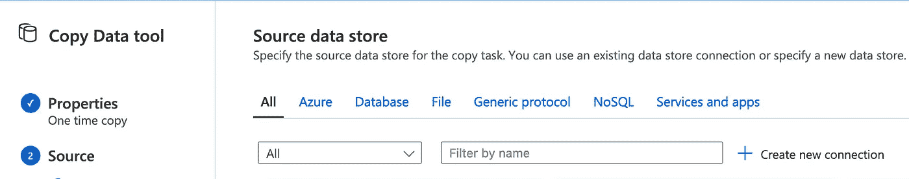

4.在“新链接服务”窗口中输入您的 CosmosDB 帐户的字段，然后选择“测试连接”以确保一切正常工作。如果一切正常，选择 Create。

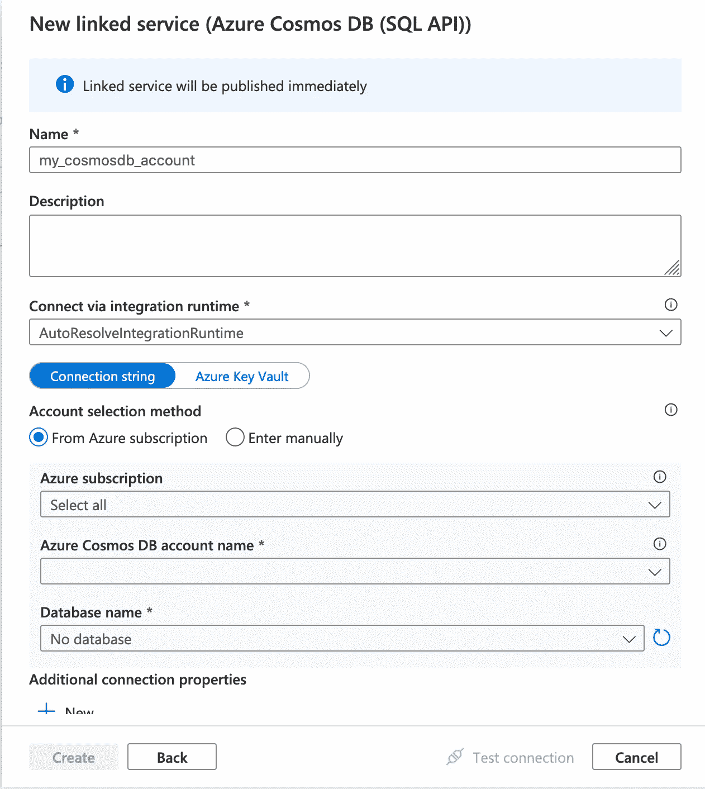

5.在 Dataset 部分，选择您想要复制的表，**,并确保勾选“按原样导出到 JSON 文件或 Azure CosmosDB 集合”框。**然后再点击一次或两次下一步，完成信号源的配置。

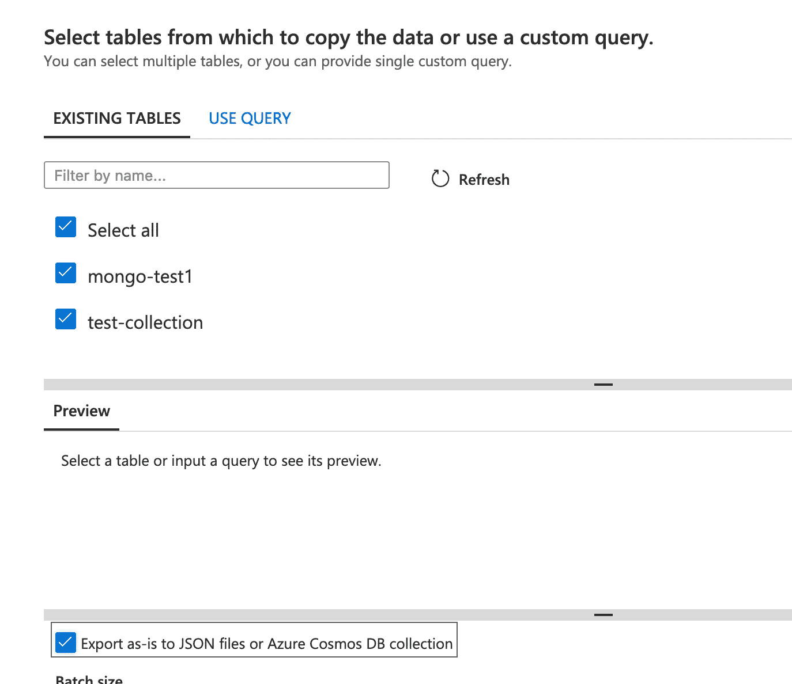

6.要配置此作业的目标，请再次选择“创建新连接”，然后从服务列表中选择“Blob 存储”。

7.添加目标存储帐户的详细信息，并再次选择测试连接，以确保这一切都正常工作。然后单击“下一步”完成存储帐户的连接。

8.通过指定保存导出的 JSON 文档的文件夹路径，在您的存储帐户中配置数据集。请注意，此处的文件夹表示 Azure 存储帐户中的容器。我简单地创建了一个名为 backup 的容器，并在这里输入它作为文件夹路径。

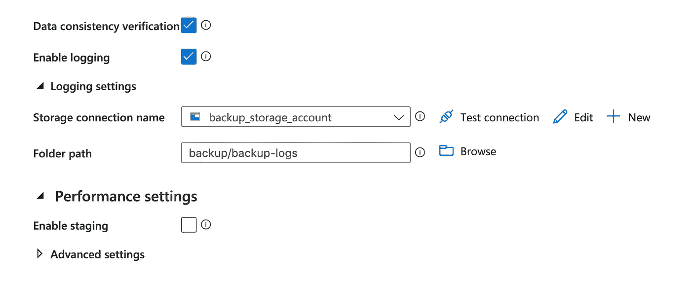

14.启用数据一致性验证，以确保您的所有数据都能安全通过。日志记录不是绝对必须的，但是考虑到这是生产数据，我希望记录所采取的每一个操作，尤其是如果有问题的话。

强烈建议进行数据一致性验证。我不确定为什么默认不开。

就是这样！查看摘要并单击 Next 后，它将在运行管道之前对您已配置的所有内容进行快速验证。您将看到的最后一页是对您所做的一切的确认。

我们开始有进展了！

正如我们所说的，您的拷贝作业已经在运行，您可以通过转到左侧的 Monitor 选项卡，选择该作业，然后选择*活动运行*部分下的详细信息(眼镜)图标来查看其进度。

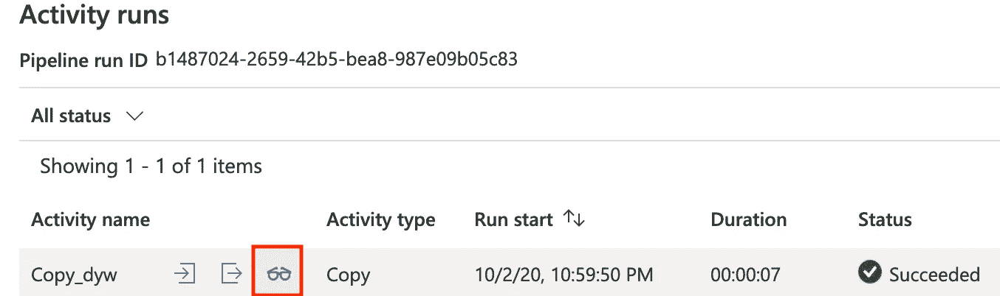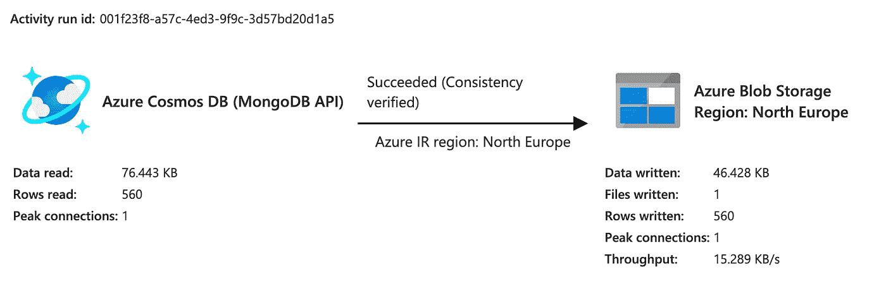

现在，您已经开始将所有收藏从 CosmosDB 导出到 Azure 存储帐户！此作业完成后，导出的数据将位于您的存储帐户的容器中。每个集合都将被导出到自己唯一的 JSON 文件中。

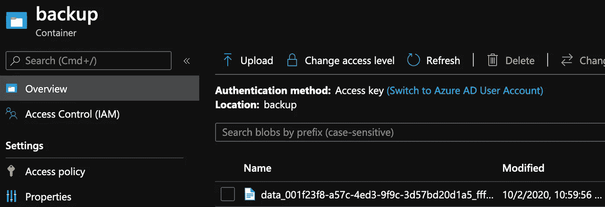

呼，终于来了！

# 使用 Azure 数据工厂将数据从 Azure 存储导入到 CosmosDB

这在很大程度上是相同的过程，但是我们需要创建一个新的管道走向另一个方向。我们将使用相同的复制数据向导进行设置:

1.  导航回主页，再次单击复制数据。
2.  对于源，选择我们已经为最后一个管道配置的 Azure 存储帐户。
3.  对于文件或文件夹路径，选择备份容器中的 JSON 文件，这是我们之前完成管道的结果。

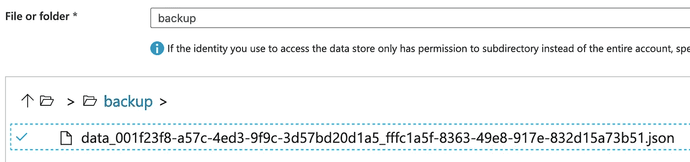

4.在文件格式部分，确保**勾选了导出到 JSON 文件或 Azure CosmosDB 集合的复选框。**

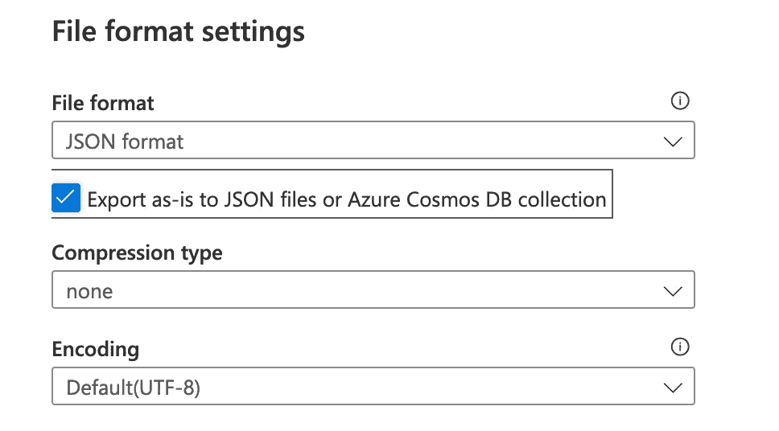

5.对于目的地，选择我们已经为最后一个管道配置的 CosmosDB 帐户。选择应该导入数据的正确表格(集合)。

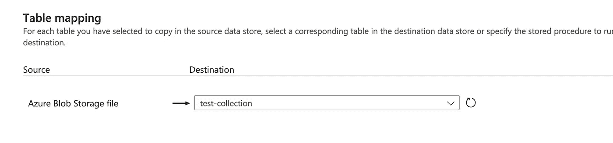

6.查看摘要后，该管道将被部署并立即开始运行。恭喜你。您现在已经将数据从 Azure 存储中的一个文件恢复到了 CosmosDB 帐户中的一个集合中。

注意:你必须为你希望从 Azure 存储中恢复的每个集合设置另一个管道。我还没有找到一种能够通过 GUI 将多个文件自动导入到多个收藏中的方法。目前看来是一对一的映射。

如果您有几十个收藏，那么这可能是一个缓慢而乏味的过程。好消息是，这个 UI 内置了原生 Git 和 AzureDevops 集成，因此您可以将您在门户中所做的一切导出到您可以访问的任何存储库的分支。然后，您可以编写其余设置的脚本，将其推送到您的分支，这些更改将反映在门户中。

一旦我们运行了这些管道，我们应该看到数据已经被复制到我们新的 CosmosDB 帐户中。如果我们检查集合，我们会看到数据在那里！

仅此而已。现在，我们可以从 CosmosDB 中取出数据，以更低的价格离线存储在 Azure Storage 中，并删除不再使用的旧 CosmosDB 帐户。如果我们需要访问数据，我们只需创建一个新的 CosmosDB 帐户，并运行数据工厂管道将其导入。一旦我们完成了数据查询，我们可以再次删除帐户。