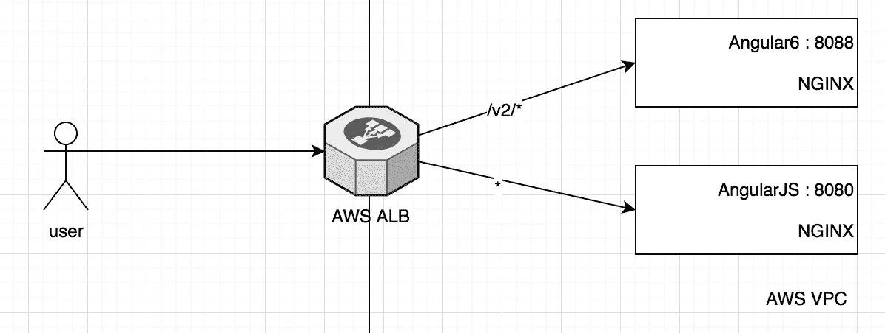

# 从角度迁移到角度

> 原文：<https://itnext.io/migrating-from-angularjs-to-angular6-1458ae6c1bae?source=collection_archive---------2----------------------->

## 运行 AngularJS 和 Angular 的混合系统架构


## 介绍

处理遗留代码/技术从来都不好玩，迁移之路也不总是像你希望的那样直截了当。如果你是一家小型创业公司，试图平衡业务需求、稀缺资源和紧迫的截止日期，事情会变得更加复杂。

这是我提供建议的一家初创公司面临的情况。

## 一点背景知识

这家初创公司在过去的两年里一直在开发 SaaS，并且(当时)在全球拥有大约 15 个客户。在这两年中，他们的代码库增长得相当快，并导致了相当多的快速/不计后果的编写代码。这无可厚非，在创业世界中，当业务需求的发展速度超过你的预期，你开始为了数量而牺牲代码质量的时候，这是很常见的。

系统架构非常简单。
用 AngularJS 编写的前端应用程序(根据客户端的配置，在构建时被分成多个选定的模块)
用 Python 2.7 和 Django 1.9 编写的后端应用程序，使用 Mysql 数据库
用于运行异步任务的 Celery

每个客户将在 AWS 上部署他们自己的隔离环境:
·Django 应用程序前面的 Apache(部署在 ELB 后面的多个 EC2 实例上)
·AngularJS 构建部署在前面有 CloudFront 的单个 S3 存储桶上

## 迁移之路

在开始迁移的几个月前，开发变得非常缓慢，功能没有快速推出，错过了最后期限，客户报告了我们推出的每个更新的更多问题。正是在这个时候，我们开始更认真地思考某种重构或重大改进。

我们不知道我们到底要“重构/改进”什么，所以我们从回答三个问题开始(我建议任何正在考虑迁移/重构的人认真思考如何回答这些问题):

## 第一个问题:为什么现在需要重构？

这是一个需要回答的非常重要的问题，因为它有助于您理解迁移的价值，也有助于让团队专注于期望的结果。例如*因为我不喜欢代码的编写方式*不是足够好的理由。原因是必须有一个明确的价值主张，以某种方式直接或间接有利于客户。

对我们来说，主要是三件事。功能开发变得极其缓慢；
2。代码不可预测。我们会在应用程序的一个部分工作，而在没有意识到的情况下破坏其他 3 个部分；
3。单点故障:只有一名工程师完全了解 FE 代码库，只有他可以在代码库上开发新功能(这是一个只有 5 名工程师的团队)

所以我们的目标很简单:

> 通过授权其他工程师开发有限元功能，提高有限元开发速度并消除简单故障点

## 第二个问题:谁来完成迁移？

你可以现在回答这个问题，也可以在第三个问题之后回答。根据公司的规模和可用的资源，可以是一个人、几个人、整个团队等等…

我们当时处境困难。唯一能做这件事的开发人员不能，因为他正忙于为我们的客户构建关键特性。幸运的是，我们有一个高级后端工程师想接触一些 FE，所以他自愿承担这项任务。我们还决定*在 2 周内完成概念验证。*我们这样做是因为我们不知道找到解决方案需要多长时间，也不知道工程师是否真的能完成这项任务，因为他以前没有做过有限元分析。

**第三个问题:我们实际上要做什么？** 这里的答案通常包括一些发现时间、一些技术提案和对整个团队选项的概述，同时权衡每个选项的利弊。

对我们来说，有一件事从一开始就很清楚:我们不想在 AngularJS 上投入任何资源来学习/招聘工程师。AngularJS 已经进入长期支持阶段，我们不想让我们的工程师在一些可能不会给他们带来长期利益的事情上投入时间。这意味着重构现有的 AngularJS 代码是不可行的。所以我们开始寻找角度 6 …

# 迁移

有多种方法可以让一个混合应用运行不同的框架。在回顾了一些选项后，我们决定——对我们来说——最好的前进方式是简单地部署两个独立的 FE 应用程序:传统 AngularJS 应用程序和新 Angular js 应用程序。这意味着一个应用程序上的任何状态都不能转移到另一个应用程序上，这对我们来说不是一件大事，因为只有**新的**模块将使用 Angular 开发，我们的模块不会彼此共享状态。

从客户端的角度来看，一切看起来就像一个应用程序，除了当它们在应用程序之间移动时需要重新加载页面。

**这种方法的优点**

*   ***速度*** :在不清理遗留代码的情况下启动并运行某些东西

*   ****停止遗留开发:**我们停止向已经无法管理的代码库添加更多代码**

****这种方法的缺点:****

*   *****维护遗留代码*** :没有解决现有模块上的特性改进；旧模块仍将处于不确定的时间段内**
*   *****复制部分代码:*** 由于新应用程序的外观和感觉必须与旧应用程序的任何主题相似，因此必须在两个地方都编写自定义组件。此外，布局的一些部分将不得不在新的应用程序复制(如标题，菜单等)..)对这些组件的任何更改都必须在两个应用程序中完成**

**我们已经知道了一个我们想要构建的新模块，所以我们从头开始了一个新的 Angular 6 项目，我们用这个新模块进行了为期两周的概念验证。**

****步骤 1—相同域****

**让两个应用程序在同一个域上运行，以便它们可以访问相同的 cookies 和本地数据。这非常重要，因为只有 AngularJS 应用程序会继续处理认证和授权。**

****第 2 步——观感****

**这两款应用的目标都是让新应用看起来和原来的应用一样。所以我们:
复制了所有的样式表
实现了应用程序的基本布局(标题&菜单抽屉)**

****步骤 3 —认证&授权****

**我们必须在 Angular6 应用程序中复制授权逻辑，并确保正确的会话令牌可用于访问模块**

****步骤 4——应用程序之间的路由****

**因为我们的主导航链接会把你带到任何一个应用，我们决定把所有的逻辑都转移到一个叫做`menu-service`的后端服务。这将消除在两个应用程序中编写任何导航更改的需要，也将允许对我们显示的导航按钮进行更大的运行时控制。**

**示例:**

```
HEADER: Authorization: Bearer xxxxx
GET menu-service/v1/menu/?type=0|1 (0: legacy, 1: new)
[{
  "slug": "refresh",
  "name" : "Refresh",
  "icon" : "fa-refresh",
  "type" : 1  
 }, {
  "slug": "module1",
  "name" : "Module1",
  "icon" : "fa-module1",
  "type" : 1
}, {
  "slug": "module2",
  "name" : "Module2",
  "icon" : "fa-module2",
  "type" : 0
}, {
  "slug": "logout",
  "name" : "Logout",
  "icon" : "fa-logout",
  "type" : 0
}]
```

**在上面的例子中，基于`type`值，我们识别出`module1`和`refresh`是指向新应用的链接，而`module2`和`logout`是旧应用中的链接。这个信息允许每个应用程序决定是使用内部路由机制还是进行重定向**

**Angular 应用程序中的路由示例(AngularJS 做了类似的事情):**

```
export class MenuService {
  constructor(private router: Router) {  } onMenuItemClicked(menuItem): void {
    if (menuItem.type === 1) {
      this.router.navigate([menuItem.slug])    
    } else {   
      const url = `${legacy_endpoint}/${menuItem.slug}`;
      window.location.href = url      
    } 
  }
}
```

****步骤 5——在真实环境中构建/部署****

**正如我在开始时提到的，AngularJS 应用程序被部署到 AWS S3 桶中，并通过 Cloudfront 公开，以利用 AWS 提供的大规模和全球分布式基础设施。**

**我们想要的结果如下:*任何具有 url* `[https://hostname/v2](https://hostname/v2)/` *的内容都被路由到 Angular 应用程序，其他内容都被路由到遗留的 AngularJS 应用程序。***

**我们使用了 [base-href](https://angular.io/guide/router#base-href) ，以确保我们的 Angular6 应用程序能够相应地构建**

```
ng build --base-href /v2/ --deploy-url /v2/
```

> **不幸的是，我们无法使用 AWS Cloudfront 实现理想的路由行为。这是一个很大的失望，因为我们不得不转向一个次优的解决方案。(如果有人对如何在 Cloudfront 中做到这一点有任何建议，我很乐意倾听)**

**我们以下面的结构结束:
每个应用部署在一个 NGINX Docker 容器中**

```
# AngularJS — Dockerfile:
FROM nginx:alpine
COPY dist /usr/share/nginx/html--------------------------------------------------------------------# Angular6 — Dockerfile:
FROM nginx:alpine
COPY dist /usr/share/nginx/html/v2
```

**带路径路由的 AWS ALB**

****

****第六步:本地发展****

**AngularJS 应用程序的本地开发不需要改变。然而，为了在 Angular6 应用程序上进行开发，您还必须运行 AngularJS 应用程序，以便能够进行身份验证并获得适当的会话令牌。**

**我们已经使用 Docker 将我们的应用程序部署为容器。所以我们添加了一个`Makefile`目标来运行 Docker 存储库中的最新内容**

```
# Angular6 — Makefile:AWS_REPOSITORY = xxx.dkr.ecr.eu-central-1.amazonaws.com
JS_APP_NAME = angular-js...run-local: 
  docker run -p 8080:80 $(AWS_REPOSITORY)/$(JS_APP_NAME):latest
```

# **结论**

**这可能不是最干净或最佳的解决方案，但这是实现我们目标的最快方法。这对我们来说是最重要的事情。**

**这篇文章的目的不是教你如何进行 AngularJS 到 Angular6 的迁移，而是展示我们处理这种任务的方法。**

**[【点击推文(发送前可编辑)](https://ctt.ac/T7eSf)**