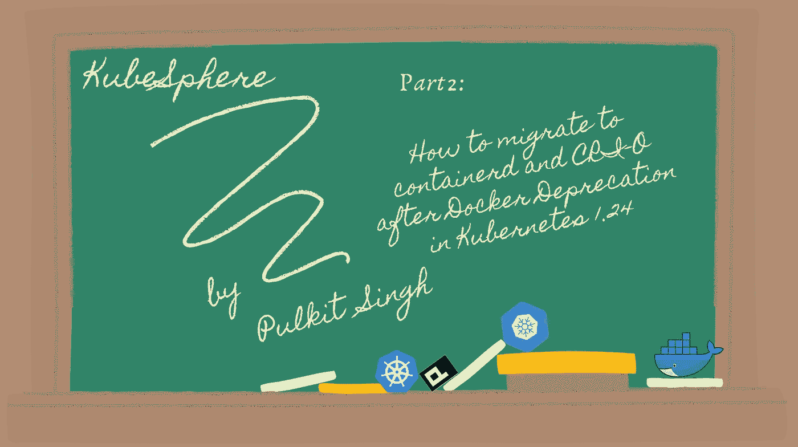

# 在 Kubernetes 1.24 中 Dockershim 被弃用后迁移到 containerd 和 CRI-O

> 原文：<https://itnext.io/migrating-to-containerd-and-cri-o-after-dockershim-deprecation-in-kubernetes-1-24-5df1c7ff434f?source=collection_archive---------4----------------------->



最近，我们已经知道 Docker 将被 Kubernetes 弃用！([查看来自 Kubernetes](https://kubernetes.io/blog/2021/11/12/are-you-ready-for-dockershim-removal/) 的这篇官方文章)所以让我们更深入地讨论一下为什么会这样？

# 为什么从 K8s 1.24 开始 dockershim 被弃用？

在 1.24 版本中，Kubernetes 将不再支持 Docker 作为容器运行时。Docker 正在被淘汰，取而代之的是使用为 Kubernetes 构建的容器运行时接口(CRI)的运行时。如果你是 Kubernetes 的最终用户，你不会注意到太大的区别。这并不意味着 Docker 已经死了，也不意味着你不能或者不应该把它作为一个开发工具。Docker 仍然是一个创建容器的有用工具，由`docker build`生成的图像可以在您的 Kubernetes 集群中使用。如果您希望创建集群，您必须进行某些调整以避免集群失败。由于 Docker 将从 K8s 1.24 中弃用，您必须转换到其他兼容的容器运行时，如 containerd 或 CRI-O。只需确保您选择的运行时支持 Docker 守护进程的当前设置(如日志记录)。

# 为什么听到这个消息的人都吓坏了？

考虑了两种环境，这造成了一些混乱。Kubernetes 集群中有一个称为容器运行时的组件，负责获取和运行容器映像。尽管 Docker 是该运行时的流行选择，但它并不打算集成到 Kubernetes 中，这就产生了问题。

# 未来会使用 Dockerfiles 吗？

这一修改是为在不同环境中使用 Docker 的开发人员设计的。Kubernetes 集群中的 Docker 运行时独立于开发 Docker 安装。Docker 在修改之前的所有方面对开发人员来说仍然是有价值的。Docker 生成了一个 OCI(开放容器倡议)映像，这并不是一个真正针对 Docker 的映像。Kubernetes 将以同样的方式对待任何符合 OCI 标准的图像，不管它是用什么工具创建的。containerd 和 CRI-O 都能够提取和运行这样的图像。

# 如何从 Docker 切换到 containerd & CRI-O？

**第一步:警戒线&漏节点**

```
$ kubectl cordon <Node name>
$ kubectl drain <Node Name> --ignore-daemonsets
```

**第二步:停止服务**

```
$ systemctl stop kubelet
$ systemctl stop docker
```

**第三步:移除 Docker(可选):**

```
apt purge docker-ce docker-ce-cli
```

运筹学

```
yum remove docker-ce docker-ce-cli
```

# 从 Docker 迁移到 containerd

**步骤 4:配置 containerd**

禁用/etc/containerd/config.toml 中的 disabled_plugins 行来启用 CRI 接口。

```
#disabled_plugins = ["cri"]
```

注意:如果还没有默认的 containerd 配置文件，您可以创建一个新的:

```
containerd config default > /etc/containerd/config.toml
```

然后重新启动 containerd:

```
systemctl restart containerd
```

**第五步:更改运行时**在/var/lib/kube let/kube ADM-flags . env 中添加这两个 containerd 运行时标志:

```
--container-runtime=remote 
--container-runtimeendpoint=unix:///run/containerd/containerd.sock"
```

**第六步:现在你可以启动 kubelet**

```
systemctl start kubelet
```

**步骤 7:测试你的容器运行时**

```
kubectl get nodes -o wide
```

现在，您可以打开节点:

```
kubectl uncordon <Node>
```

你完了！

# 从 Docker 迁移到 CRI-O

**第四步:CRI-O 库&安装**

```
$ add-apt-repository ppa:projectatomic/ppa
$ apt update
$ apt install -y cri-o-1.15
```

**第五步:配置 CRI-O &内核**创建文件`99-kubernetes-crio.conf`

```
vi /etc/sysctl.d/99-kubernetes-crio.conf
```

并添加以下几行:

```
net.bridge.bridge-nf-call-iptables  = 1
net.ipv4.ip_forward                 = 1
net.bridge.bridge-nf-call-ip6tables = 1
```

将更改应用到内核:

```
sysctl -a
```

验证`crio.conf`并编辑`cri-o`以使用 Docker 注册表

打开文件`crio.conf`:

```
vim /etc/crio/crio.conf
```

检查配置中到 conmon 的路径是否准确；如果没有，运行命令:

```
which conmon
```

将输出添加到`crio.conf`文件中

```
# Path to the conmon binary, used for monitoring the OCI runtime.
conmon = "/usr/bin/conmon"
```

还要确保“注册表”选项被注释掉

```
registries = [
        "quay.io",
        "docker.io",
]
```

**第六步:现在您可以启动 CRI-O**

```
$ systemctl enable crio
$ systemctl start crio
```

**第 7 步:配置并启动 kubelet** Edit `vi /etc/default/kubelet`，看起来应该是这样的:

```
KUBELET_EXTRA_ARGS=--feature-gates="AllAlpha=false" --container-runtime=remote --cgroup-driver=systemd --container-runtime-endpoint='unix:///var/run/crio/crio.sock' --runtime-request-timeout=5m
```

然后启动 kubelet:

```
systemctl start kubelet
```

第八步:现在你可以解锁你的节点:

```
kubectl uncordon <Node>
```

你完了！

# 摘要

最后，我想补充一点，Docker 被 Kubernetes 弃用并不意味着你不能使用 Docker。这只是意味着 Docker 不会被用作 Kubernetes 中的默认引擎，这完全取决于您在选择特定的容器运行时时的需求，因为它们都有自己的优势。

请务必查看 Kubernetes 的官方文章以了解更多信息([查看此处！](https://kubernetes.io/blog/2021/11/12/are-you-ready-for-dockershim-removal/))。敬请关注更多此类内容！

# 关于 KubeSphere

KubeSphere 是一个基于 Kubernetes 的开源容器平台，其核心是应用程序。它提供全栈 It 自动化操作和简化的开发运维工作流。

[KubeSphere](https://kubesphere.io) 提供向导界面和各种企业级的运维功能，包括 Kubernetes 资源管理、 [DevOps (CI/CD)](https://kubesphere.io/devops/) 、应用生命周期管理、服务网格、多租户管理、[监控](https://kubesphere.io/observability/)、日志记录、警报、通知、存储和网络管理以及 GPU 支持。有了 KubeSphere，企业能够快速建立一个强大且功能丰富的容器平台。

欲了解更多信息，请访问 [https://kubesphere.io](https://kubesphere.io/)