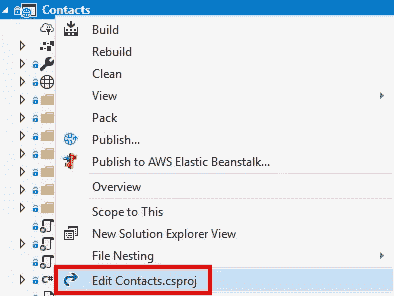

# 从 ASP.NET 核心 2.1 迁移到 2.2

> 原文：<https://itnext.io/migration-from-asp-net-core-2-1-to-2-2-9f16c6995064?source=collection_archive---------2----------------------->

12 月 4 日[。网络核心 2.2](https://blogs.msdn.microsoft.com/dotnet/2018/12/04/announcing-net-core-2-2/) 包括【ASP.NET】T2 核心 2.2 和[实体框架 2.2](https://blogs.msdn.microsoft.com/dotnet/2018/12/04/announcing-entity-framework-core-2-2/) 。在这篇文章中，我将采用 ASP.NET 基础系列中使用的一个项目，并将其从 ASP.NET 2.1 . x 转换到新的 2.2 版本的 ASP.NET 核心。这都将基于[官方 2.2 迁移指南](https://docs.microsoft.com/en-us/aspnet/core/migration/21-to-22?view=aspnetcore-2.2&tabs=visual-studio)。

之前的代码任何改动都可以在[这里](https://github.com/elanderson/ASP.NET-Core-Basics/tree/55f63d28df6e278efe3b714b4b5bdc3dc89b57b4)找到。在示例解决方案中，本指南将仅适用于联系人项目。

## 装置

前往[。NET 下载页面](https://dotnet.microsoft.com/download)并下载。NET Core SDK for 版，可用于 Window、Linux 和 Mac。

安装完成后，如果您想验证 SDK 是否已安装，请运行以下命令。

```
dotnet --list-sdks
```

您应该会看到列出的 **2.2.100** 。如果你像我一样，你也可能会看到一些预览版本，这将是很好的卸载。

如果您使用的是 Visual Studio，请确保您的版本至少为 15.9。如果没有，可以从[这里](https://docs.microsoft.com/en-us/visualstudio/releasenotes/vs2017-relnotes)下载更新。

## 项目文件更改

右键点击项目并选择**编辑项目名称. csproj** 。



将 **TargetFramework** 改为 **netcoreapp2.2** 。

```
Before:
<TargetFramework>netcoreapp2.1</TargetFramework>
After:
<TargetFramework>netcoreapp2.2</TargetFramework>
```

将任何微软软件包的版本更新到 **2.2.x** 以下是一个例子。

```
Before:
<PackageReference Include="Microsoft.VisualStudio.Web.CodeGeneration.Design" Version="2.1.1" PrivateAssets="All" />

After:
<PackageReference Include="Microsoft.VisualStudio.Web.CodeGeneration.Design" Version="2.2.0" PrivateAssets="All" />
```

如果您想使用新的 IIS 进程内宿主模型，您还需要将下面一行添加到属性组中。

```
<AspNetCoreHostingModel>InProcess</AspNetCoreHostingModel>
```

以下是我的 csproj 全文，供参考。

```
<Project Sdk="Microsoft.NET.Sdk.Web">

  <PropertyGroup>
    <TargetFramework>netcoreapp2.2</TargetFramework>
    <AspNetCoreHostingModel>InProcess</AspNetCoreHostingModel>
    <UserSecretsId>aspnet-Contacts-cd2c7b27-e79c-43c7-b3ef-1ecb04374b70</UserSecretsId>
  </PropertyGroup>

  <ItemGroup>
    <PackageReference Include="Microsoft.AspNetCore.App" />
    <PackageReference Include="Microsoft.VisualStudio.Web.CodeGeneration.Design" Version="2.2.0" PrivateAssets="All" />
    <PackageReference Include="Swashbuckle.AspNetCore" Version="4.0.1" />
  </ItemGroup>

</Project>
```

## 启动更改

在 **Startup.cs** 中，更新兼容版本以启用新的 2.2 功能。

```
Before:
services.AddMvc().SetCompatibilityVersion(CompatibilityVersion.Version_2_1);

After:
services.AddMvc().SetCompatibilityVersion(CompatibilityVersion.Version_2_2);
```

包扎

与迁移到 2.1 一样，迁移到 2.2 也非常容易。请务必查看官方迁移指南,了解本项目未涉及的更多细节。

最终状态的代码可以在[这里](https://github.com/elanderson/ASP.NET-Core-Basics/tree/f8cb4b7f24feed9120e68bcd7d60b0ca25734ed3)找到。

*原载于*[](https://elanderson.net/2018/12/migration-from-asp-net-core-2-1-to-2-2/)**。**