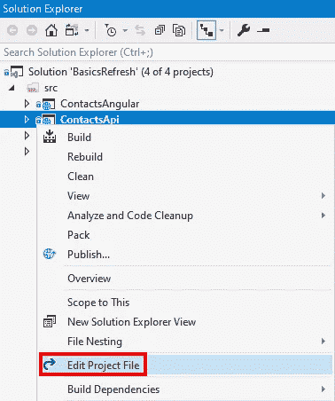

# 从 ASP.NET 核心 3.0 迁移到 3.1

> 原文：<https://itnext.io/migration-from-asp-net-core-3-0-to-3-1-8fe77bc72739?source=collection_archive---------4----------------------->

12 月 3 日[。NET Core 3.1](https://devblogs.microsoft.com/dotnet/announcing-net-core-3-1/) 发布，其中包括新发布的【ASP.NET】Core 3.1 和[实体框架 Core 3.1](https://devblogs.microsoft.com/dotnet/announcing-entity-framework-core-3-1-and-entity-framework-6-4/) 。这篇文章将从更新的[ASP.NET 基础系列](https://elanderson.net/category/asp-net-core/asp-net-core-basics/)开始，逐步更新联系人 API 项目。我做的所有改动都来自微软的[从 ASP.NET Core 3.0 迁移到 3.1](https://docs.microsoft.com/en-us/aspnet/core/migration/30-to-31?view=aspnetcore-3.1) doc。

之前的代码任何改动都可以在[这里](https://github.com/elanderson/ASP.NET-Core-Basics-Refresh/tree/c1b24de0d44dfc45d379b91d721842656c4ba3d8)找到。

## 装置

如果您是 Visual Studio 用户，您可以获得。NET Core 3.0 通过至少安装 [Visual Studio 16.4](https://visualstudio.microsoft.com/downloads/) 。对于不使用 Visual Studio 的用户，可以下载并安装。NET Core 3.1 SDK 从[这里](https://dotnet.microsoft.com/download/dotnet-core/3.1)。与以前的版本一样，SDK 适用于 Windows、Linux 和 Mac。

安装完成后，您可以从命令提示符下运行以下命令来查看。你已经安装的 NET Core SDK。

```
dotnet --list-sdks
```

您应该至少看到列出的 **3.1.100** 。

## 项目文件更改

右键单击项目并选择**编辑项目名称. csproj** 。



将 **TargetFramework** 改为 **netcoreapp3.1** 。

```
Before:
<TargetFramework>netcoreapp3.0</TargetFramework>

After
<TargetFramework>netcoreapp3.1</TargetFramework>
```

接下来，将所有包更新到新版本。根据你的项目，这将会有很大的不同。这可以在 csproj 文件中手动完成，如果使用 Visual Studio，也可以通过 NuGet UI 来完成。以下是对示例项目的更改。

```
Before:
<PackageReference Include="Microsoft.EntityFrameworkCore.Design" Version="3.0.0">
<PackageReference Include="Microsoft.EntityFrameworkCore.Sqlite" Version="3.0.0" />
<PackageReference Include="Microsoft.EntityFrameworkCore.SqlServer" Version="3.0.0" />
<PackageReference Include="Microsoft.EntityFrameworkCore.Tools" Version="3.0.0">
<PackageReference Include="Microsoft.Extensions.Logging.Debug" Version="3.0.0" />
<PackageReference Include="Microsoft.IO.RecyclableMemoryStream" Version="1.2.0" />
<PackageReference Include="Microsoft.VisualStudio.Web.CodeGeneration.Design" Version="3.0.0" />
<PackageReference Include="NSwag.AspNetCore" Version="13.1.3" />

After:
<PackageReference Include="Microsoft.EntityFrameworkCore.Design" Version="3.1.0">
<PackageReference Include="Microsoft.EntityFrameworkCore.Sqlite" Version="3.1.0" />
<PackageReference Include="Microsoft.EntityFrameworkCore.SqlServer" Version="3.1.0" />
<PackageReference Include="Microsoft.EntityFrameworkCore.Tools" Version="3.1.0">
<PackageReference Include="Microsoft.Extensions.Logging.Debug" Version="3.1.0" />
<PackageReference Include="Microsoft.IO.RecyclableMemoryStream" Version="1.3.2" />
<PackageReference Include="Microsoft.VisualStudio.Web.CodeGeneration.Design" Version="3.1.0" />
<PackageReference Include="NSwag.AspNetCore" Version="13.1.6" />
```

## 包扎

从 3.0 到 3.1 的迁移非常简单，这并不奇怪，因为 3.0 发布才几个月。尽快升级到 3.1 非常重要，因为它是长期服务版本，至少在未来 3 年内会得到支持，而 3.0 将在几个月内失去支持。

*原载于*[](https://elanderson.net/2020/01/migration-from-asp-net-core-3-0-to-3-1/)**。**