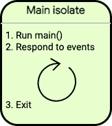
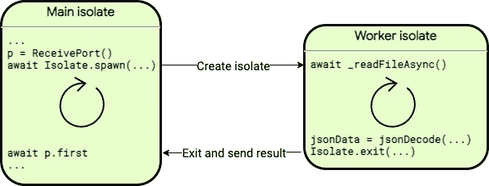
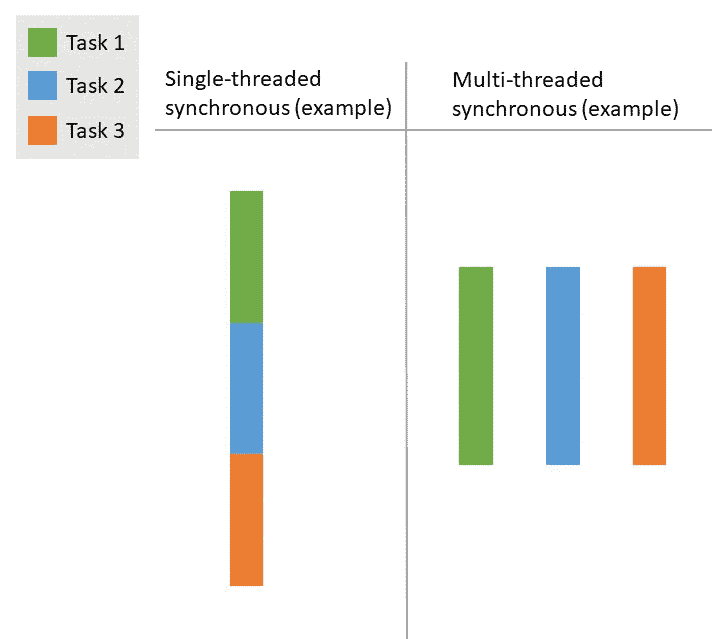
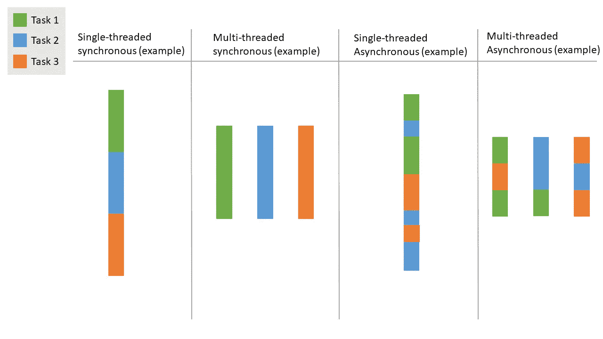
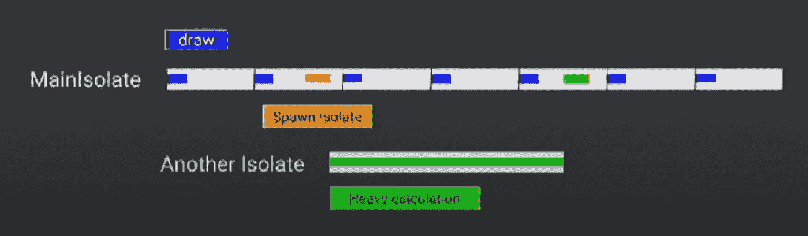
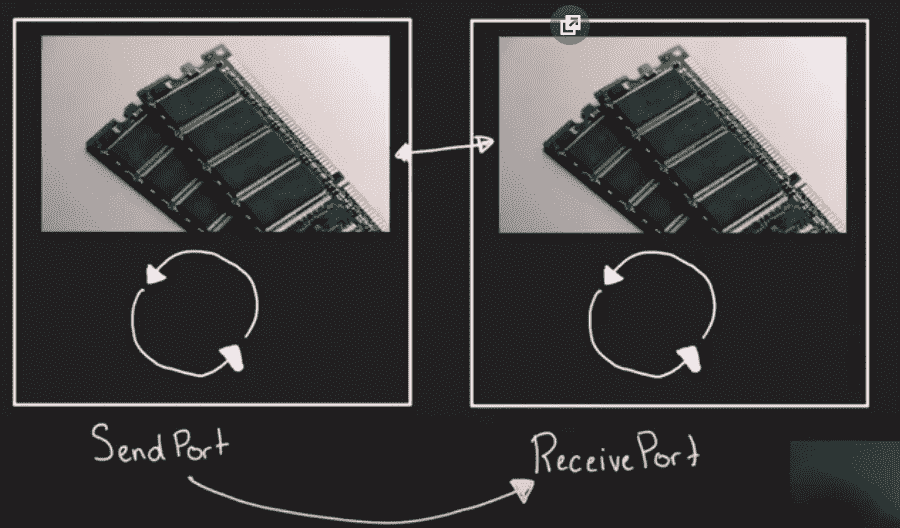
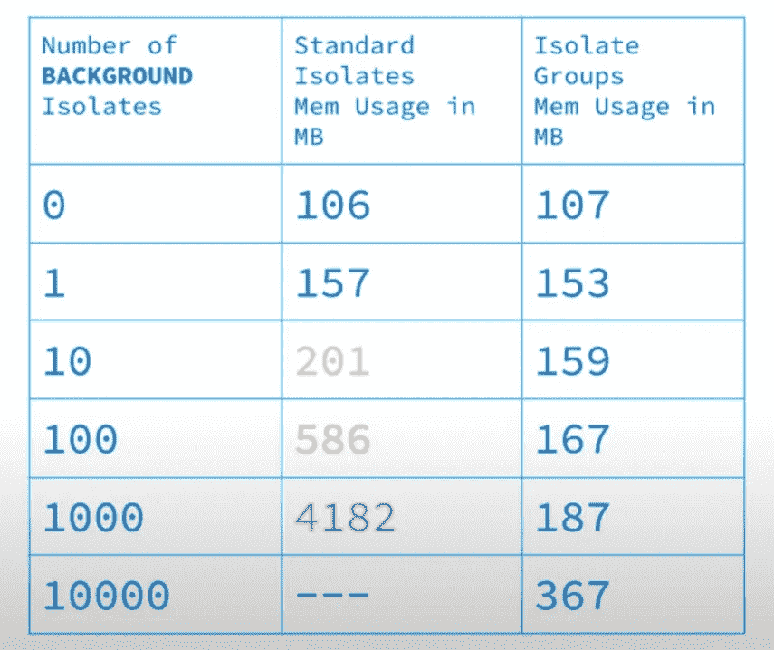

# Dart/Flutter 中隔离物的最简指南

> 原文：<https://itnext.io/minimalist-guide-to-isolates-in-dart-flutter-dd5bdee031e?source=collection_archive---------4----------------------->

抱歉，封面太丑了，但我就是控制不住自己去做

## 让我们深入探讨 Dart/Flutter 中的多线程！

## 众所周知

Dart/Flutter 是单线程的，这意味着所有 Dart 代码都在一个隔离中运行

## 但这到底意味着什么呢？

当我们运行`main()`功能时。实际上，我们负责主要隔离。

主隔离的责任是对事件作出反应。

所以每个任务都是分别运行的，而不是并行的

如果主隔离执行繁重的任务。主隔离区将被封锁。

它不应该被阻止，因为如果它被阻止，用户界面将会滞后和冻结，用户会抱怨它，你会受到不好的评论，每天晚上都会在床上哭泣，并问自己为什么所有这些都发生在你身上？！！

所以如果你不想要那种场景，请考虑使用隔离来完成繁重的任务。这样每个人都会开心。

如果我们到了孤立点，让我们开始问答

## 什么是孤立？

*   隔离使你的代码并行(同时)运行。没有分别

## 我们为什么需要它？

*   为了防止主隔离的瓶颈

## 何时使用隔离物？

*   执行繁重的任务，如图像处理等。

## 为什么我们称之为隔离而不是线程？

*   主要区别是隔离不像线程那样共享内存。

## 隔离和异步有什么区别？

[https://stack overflow . com/questions/59139242/STD async-do-not-see-to-really-implement-single-threaded-asynchronous-beha](https://stackoverflow.com/questions/59139242/stdasync-does-not-seem-to-really-implement-single-threaded-asynchronous-beha)

*   Async 只是将一个长的同步任务分割成较小的任务，这有助于保持 60 FPS，而不是像隔离那样并行运行

异步ˌ非同步(asynchronous)

孤立的

## 为什么 Dart 不在隔离区之间共享内存？

*   *大多数现代设备都有多核 CPU。为了利用所有这些内核，开发人员有时会使用并发运行的共享内存线程。然而，共享状态并发是* [*易错的*](https://en.wikipedia.org/wiki/Race_condition#In_software) *并且会导致复杂的代码。*
*   *所有 Dart 代码都在隔离区内运行，而不是线程。每个隔离都有自己的内存堆，确保任何其他隔离都无法访问某个隔离中的任何状态。因为没有共享内存，你不必担心* [*互斥或锁*](https://en.wikipedia.org/wiki/Lock_(computer_science)) *。*
*   *工人隔离可以执行 I/O(例如，读写文件)、设置定时器等等。它有自己的内存，不与主隔离共享任何状态。工作隔离可以阻止，而不会影响其他隔离。*

> 描述来自:[https://dart.dev/guides/language/concurrency](https://dart.dev/guides/language/concurrency)

# 说够了吗？那我们编码吧！

## 但是在我们开始之前，我们需要知道一些使用规则

*   该函数必须是顶级函数或静态方法
*   您只能将一个参数传递给一个隔离对象(但是不要担心，您可以使用 map 发送任意多的数据)

## 有两种方法可以使用隔离

他们做着几乎相同的事情。只是用法有点不同

*   `compute()`:简单的方法
*   `Isolate.spawn()`:高级方式

现在让我们开始吧！

## 计算

生成一个隔离并在该隔离上运行回调的函数。

## 隔离.产卵

-图片来自塔达斯佩特拉

`spawn`给了我们比`compute`更多的灵活性。

我们需要创造一个`ReceivePort()`来与其他隔离物交流。

与[发送端口](https://api.dart.dev/stable/2.16.1/dart-isolate/SendPort-class.html)一起，处理隔离之间的所有通信。

> 一个[接收端口](https://api.dart.dev/stable/2.16.1/dart-isolate/ReceivePort-class.html)可能有多个[发送端口](https://api.dart.dev/stable/2.16.1/dart-isolate/SendPort-class.html)。

1.  创建接收报告
2.  产生一个隔离发送数据和端口。
3.  计算一项繁重的任务
4.  使用发送端口发送计算的数据
5.  使用端口读取计算的数据，并继续您的工作

# 一些值得注意的信息

[https://www.youtube.com/watch?v=SXT7nir1B48](https://www.youtube.com/watch?v=SXT7nir1B48)

*   繁殖一种隔离物需要大约 50-150 毫秒
*   重复使用隔离以降低启动成本
*   每个隔离区占用大约 2MB
*   从隔离区传递的每个消息都需要消息大小* 2 的内存，因为隔离区不共享内存，所以在系统上将有两个副本，因此，如果您有 1 GB 的文件，并且想要从一个隔离区传递到第二个隔离区，则需要设备上 2Gb 的内存

# 参考

 [## 为什么要在颤振中使用隔离物？

### 在 Flutter 中有许多管理状态的方法，但是大多数都是以这样一种方式构建的，即所有的逻辑都被执行…

开发到](https://dev.to/alphamikle/why-should-you-use-isolates-in-flutter-1k5o)  [## Dart 中的并发性

### Dart 支持使用 async-await、isolates 和类(如 Future 和 Stream)进行并发编程。本页给出了…

dart.dev](https://dart.dev/guides/language/concurrency)  [## 隔离类-Dart:隔离库 Dart API

### 独立的 Dart 执行上下文。所有的 Dart 代码都在一个隔离中运行，代码只能从…

api.flutter.dev](https://api.flutter.dev/flutter/dart-isolate/Isolate-class.html) 

## 感谢您的阅读！

我试图尽可能简单地解释。希望你喜欢。

如果你喜欢这篇文章，请点击👏按钮(你知道你可以升到 50 吗？)