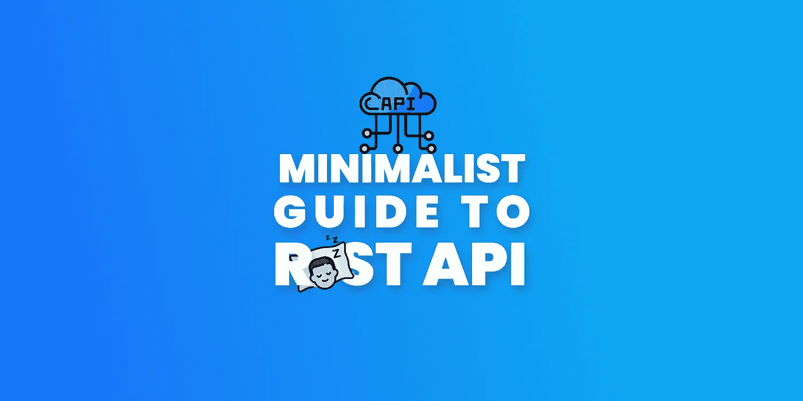
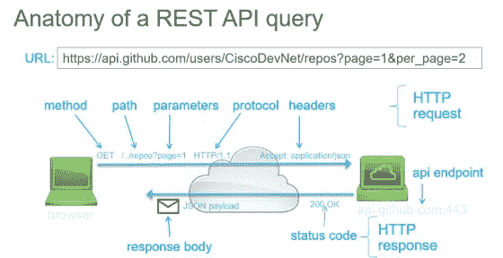
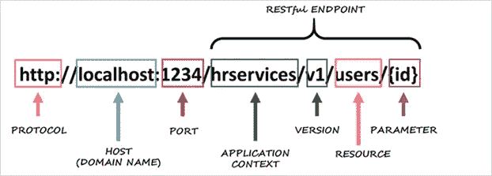
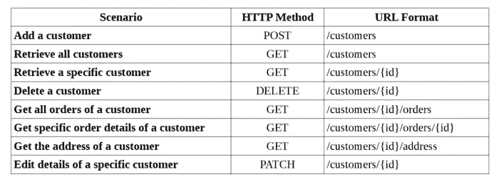
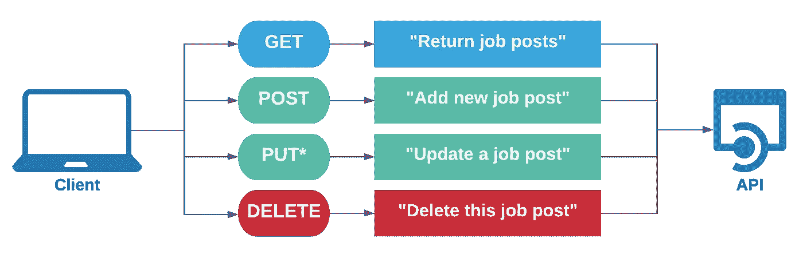
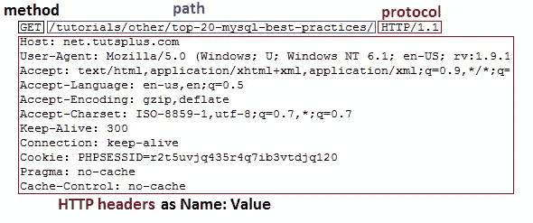

# REST API 的极简指南

> 原文：<https://itnext.io/minimalist-guide-to-rest-api-c04b73b6bfc2?source=collection_archive---------1----------------------->



## RESTful API 简介

# 什么是 RESTful API？

它是一组允许程序相互对话的规则。开发人员在服务器上创建 API，并允许客户端与之对话。

## 术语

*   **API** : **A** 应用 **P** 程序 **I** 接口
*   **其余** : **RE** 表象 **S** 状态 **T** 转移

# 为什么我们使用 RESTful API？

*   向外界公开独立的基础设施。授权或未授权。
*   在服务器上而不是在客户端上执行需要强大硬件的操作。
*   以便不同的应用程序使用公共数据结构相互通信。
*   确保客户的技术独立性。(比如桌面、移动、Web、控制台、嵌入式等。)
*   以便响应具有不同端点的不同客户的需求。(比如 XML，JSON，gRPC 等。)
*   数据安全

# 请求的剖析

*   端点(路线)
*   HTTP 方法
*   HTTP 标题
*   数据(正文/消息)



[https://medium . com/@ shivamdesai _ 65083/fetching-data-from-rest-APIs-with-react-25 a2 F6 db 5d 7 a](https://medium.com/@shivamdesai_65083/fetching-data-from-rest-apis-with-react-25a2f6db5d7a)



[http://apps.lansa.com/LearnLANSARESTAPI/index.html#!Documents/urlanatomy.htm](http://apps.lansa.com/LearnLANSARESTAPI/index.html#!Documents/urlanatomy.htm)

# 端点

*   这是一个代表我们请求的 URL

## 全称路径

```
[https://api.ehe.com](https://api.ehe.com)/users/5/products?name=ehe&price=200
```

## 基本 URL 或根端点

```
[https://api.ehe.com](https://api.ehe.com)/
```

## 小路

*   “:”表示它是一个动态值。它可以是任何东西

```
/users/:userId/products
```

## 请求查询

*   以“？”开头
*   这意味着:我想要一个有名字和价格的产品

```
?name=ehe&price=200
```



[https://medium . com/linkit-intecs/rest-resource-naming-best-practices-cbee 65 f 37 a 62](https://medium.com/linkit-intecs/rest-resource-naming-best-practices-cbee65f37a62)

# HTTP 方法

HTTP 定义了一组请求方法来指示对给定资源要执行的操作。

## 通用方法(CRUD 方法)

*   当我们想要检索数据时，我们应该使用 GET 方法。
*   当我们想要创建数据时，我们应该使用 POST 方法。
*   当我们想要更新数据时，我们应该使用 PUT 方法。
*   **补丁**，对资源进行部分修改。
*   **删除**，当我们要删除数据时我们应该使用 DELETE 方法。

## 其他方法

*   **头**，类似于 toGET 请求，但是没有响应体。
*   **连接**，建立到目标资源标识的服务器的隧道。
*   **选项**，描述了目标资源的通信选项。
*   **TRACE** ，沿着到目标资源的路径执行消息环回测试。



# HTTP 标题

*   它是一种元数据，提供了关于请求的信息

## 有效标题列表

*   [https://developer.mozilla.org/en-US/docs/Web/HTTP/Headers](https://developer.mozilla.org/en-US/docs/Web/HTTP/Headers)



[https://code . tuts plus . com/tutorials/http-headers-for-dummies-net-8039](https://code.tutsplus.com/tutorials/http-headers-for-dummies--net-8039)

# 数据(正文或消息)

*   它包含您要发送到服务器的数据
*   您只能通过 POST、PUT、PATCH 和 DELETE 请求发送数据。

# 响应类型

API 附带了响应类型，它简要地告诉我们那里发生了什么。

## 一些例子

*   完成了，还可以。通常，你的`GET`返回这个代码。
*   **201** :“完成，创建完毕。”一般来说，你的`POST` s 会返回这个代码。
*   **204** :“做了，还没体。”一般来说，你的`DELETE`会返回这个代码。
*   **400** :“客户给我发了垃圾，我不打算弄乱它。”
*   **401** :“未授权，客户端先认证。”
*   **403** :“不允许。你不能拥有它，因为你登录了，但没有权限访问或删除它。”
*   **404** :“找不到了。”
*   **410** :“标记为已删除。”

## 完整列表

[https://developer.mozilla.org/en-US/docs/Web/HTTP/Status](https://developer.mozilla.org/en-US/docs/Web/HTTP/Status)

# 参考

[](https://www.infoworld.com/article/3204125/the-rules-for-rest-how-to-be-restful-in-httpjson-apis.html) [## REST 的规则:如何在 HTTP/JSON API 中实现 RESTful

### 最近，我试图为 Apache Solr 编写一个小的客户端脚本。它只是应该添加一些数据，检索…

www.infoworld.com](https://www.infoworld.com/article/3204125/the-rules-for-rest-how-to-be-restful-in-httpjson-apis.html) [](https://www.smashingmagazine.com/2018/01/understanding-using-rest-api/) [## 理解和使用 REST API-Smashing Magazine

### 快速总结↬如果你想能够阅读 API 文档并有效地使用它们，你首先需要…

www.smashingmagazine.com](https://www.smashingmagazine.com/2018/01/understanding-using-rest-api/) 

# 感谢您的阅读！

那是一篇很长的文章，而你大老远跑来这里！你太棒了！请不要忘记鼓掌(也可能你不知道鼓掌可以达到 50 次，只是在你走的时候点击)