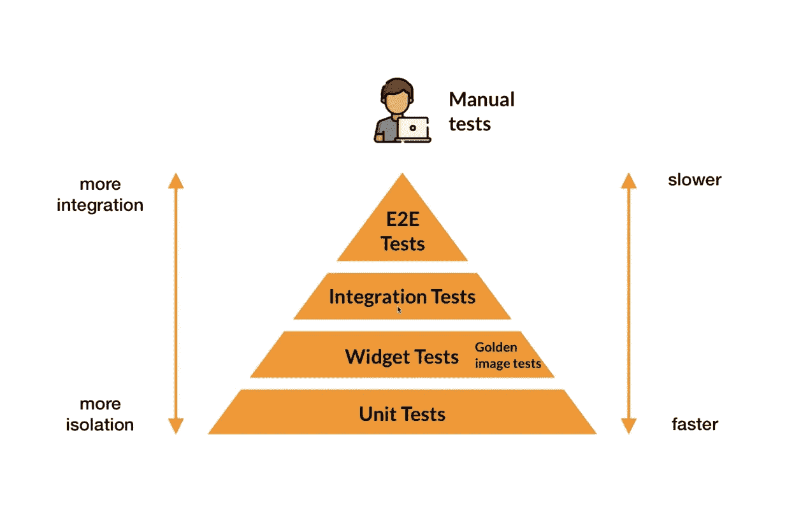
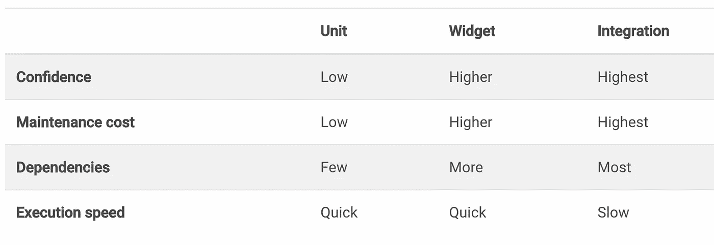
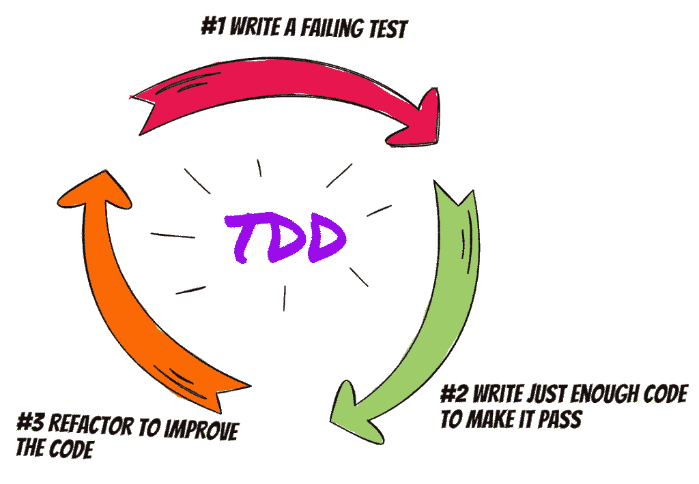
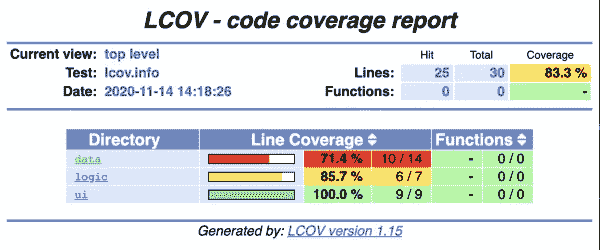

# 颤振试验的最低限度指南

> 原文：<https://itnext.io/minimalist-guide-to-testing-in-flutter-e9c885c7e35c?source=collection_archive---------2----------------------->


## 第 1 部分—简介—什么是测试？

## 这一次，我将开始深入介绍 Flutter 中的测试！

我想让你向关于颤振测试的新文章系列问好！我将尝试在这个系列中深入讨论所有的内容。我的主要目标是正确地学习测试，并在学习的同时，为我们所有人创建一个终极指南作为参考资料！希望你觉得它有益，并喜欢它！

我是这个主题的新手，所以如果有遗漏或错误的信息，请让我知道并帮我修复它！提前感谢！

## 那我们开始吧！

> 如果我们想要认真对待质量，现在是时候厌倦寻找错误，开始从一开始就防止它们发生了——罗伯特·布伦哈格(了不起的家伙)

# 什么是测试？

当我们编写一个应用程序时，我们首先要做什么？

我们测试它！看看这个，它是否正常工作！如果我们发现一个 bug，我们就修复它并继续编码，对吗？

这是测试，但这不是唯一的选择！
有两种测试！

## 手动测试(黑盒):

手工测试不需要任何编程知识什么的。测试人员只是在不知道里面运行什么算法的情况下，手动尝试破解 app！这就是为什么我们称之为黑盒测试！它不是那么可靠，因为我们在添加新功能时可能会遇到来自其他部分的意外行为，测试人员可能不够好(毕竟我们都是人)等。

## 自动化测试(白盒):

另一方面，自动化测试需要一种编程语言，因为我们告诉编译器如何在每种情况下测试应用程序，并让它测试并确保应用程序正常工作！这就是为什么它比手工测试更可靠！此外，它非常可靠，因为它是累积的，这意味着编译器在添加新功能时也会验证所有现有功能。整个应用程序的每一个变化都要从头到尾进行测试！这确保了当前的开发不会破坏任何现有的功能。

## 然后，我们来看看自动化测试的利弊！

## 赞成的意见

*   **显示开发者的素质！**
    *(有些人写测试，即使没人声称。这使得他们与众不同，值得尊敬！)*
*   **提高代码质量，帮助我们写出更好的代码** *(迫使我们写出更好的代码，比如单一责任、分层架构、依赖注入、抽象等。)*
*   **有助于思考清晰基本，不复杂！**
    *(拜托，敢写复杂代码，看看写单元测试的时候会发生什么)*
*   **节省大量时间和金钱** *(帮助我们在早期识别 bug)*
*   **帮助我们保持理智，远离挫折** *(防止来自老板和客户的不愉快反馈！)*
*   **防止奇怪的意外错误** *(当我们添加一个新功能或修复一个错误或重构旧代码时，我们可以破坏其他功能甚至整个应用程序！)*
*   **让我们远离落后！** *(省得我们一直说“之前还能用！”)*
*   **长期维护更容易。** *(只要看一下考试，我们就很容易明白考试是怎么回事了。)*
*   **放心重构** *(你不用担心在重构代码的时候弄坏一些东西。即使你断了，你也会瞬间知道问题出在什么地方)*
*   **让调试更简单！**
    *(我们可以准确的知道失败和导致 bug 的案例。)*

## 骗局

*   **看起来可能有点费时** *(但是，总的来说不是，因为即使看起来拖慢了开发时间，相反，总的来说加快了，因为减少了很多以后会出现的 bug)*

## 这里是我们在一个单元中测试的一些案例。

*   验证初始值为真
*   验证该值是否按预期更新
*   验证测试结果是否符合预期
*   验证设备是否按预期处理错误
*   验证单元测试是否有效，即使调用不止一次

## **亦作**

*   检查空案例
*   检查数据类型是否为真

*(感谢 Dart 的无效和类型安全系统，我们不需要它们！只要我们不使用动态和可空变量。)*

> 另外，软件工程师找到了几种测试方法，如[*TDD*](https://en.wikipedia.org/wiki/Test-driven_development)**和**[*BDD*](https://en.wikipedia.org/wiki/Behavior-driven_development)**中的****但是我不会在本文中讨论它们。我现在只介绍基本理论，稍后我会逐一深入讲解！**********

# ******颤振试验******

************

******[https://codewithandrea.com/](https://codewithandrea.com/)******

## ******单元测试—测试逻辑******

*   ******用于测试单个类或单个方法/函数，以在定义的条件下验证一个逻辑单元
    *(运行方法并期望它按预期工作)*******

## ******小部件测试—测试用户界面******

*   ******用于测试单个 UI 小部件及其行为
    *(点击按钮，并期望它按预期工作)*******

## ******黄金测试—测试用户界面的适应性和响应能力******

*   ******黄金测试基本上是小部件测试，但是要验证生成的“黄金”图像和小部件是相同的。******

## ******集成测试—测试体验******

*   ******从用户的角度测试应用程序的大部分
    *(例如，填写文本字段，点击登录按钮，并期待路由主页等。)*******

## ******端到端(E2E)测试—测试整个系统(前端+后端)******

*   ******来测试整个体验。******

************

******[https://docs.flutter.dev/testing](https://docs.flutter.dev/testing)******

## ******让我们看看一些代码！******

******我将向您展示您现在可以做的事情！
但我会在接下来的文章中深入探讨，敬请关注！******

******如需了解更多信息，[点击此处](https://pub.dev/packages/test)。******

## ******一些关于测试的随机信息！******

*   ******测试应该快速、简单、独立、确定、可重复，只关注一件事，并且容易理解！
    *(排列-行为-断言)*******
*   ******测试中的代码重复是可以的。(一个测试应该更关注简单性而不是良好的编码实践。)******
*   ******使用抽象类使我们的生活变得更容易！******
*   ******测试应该在编码时编写！不是当应用程序完全完成的时候！(浅见)******
*   ******服务测试是有问题的！
    *(通常你不需要为你使用的服务编写测试，但是如果你不信任后台的家伙，我认为你也应该在你的应用程序中编写服务测试！)*******
*   ********嘲讽**只是一种作伪的依赖。不多不少！******
*   ****在 dart 语言中，文件应该以后缀“_test.dart”命名****
*   ****先写你的测试，再写你的代码！*(失败-重构-成功)*****

********

****[https://method poet . com/测试驱动开发最佳实践/](https://methodpoet.com/test-driven-development-best-practices/)****

*   ****BDD :用人类可读的语言编写你的测试 *(Given-When-Then)*****

```
****BDD Example****Feature**: Counter
**Scenario**: Increase and decrease the value of the counter
 **Given** Counter's initial value is 0
 And increase and decrease buttons are available

 **When** User click on the increase button. **Then** the counter's value should be 1.**
```

*   ******覆盖率**意味着你的代码被测试的范围有多广。****

********

****[https://tech.andpad.co.jp/entry/2020/11/17/170000](https://tech.andpad.co.jp/entry/2020/11/17/170000)****

## ****最后****

> ****没有人告诉你写你的测试，但测试显示人们的素质！—一个聪明的家伙****

## ****第 1 部分—什么是测试？—当前！****

## ****第二部分——什么是嘲讽？****

****[](/minimalist-guide-to-testing-in-flutter-part-2-mocking-b0a35a0dc336) [## 颤振试验的最低限度指南——第二部分嘲弄

### 在我们开始写测试之前，我认为，我们需要学习如何模拟它们，这是一个重要的话题，我们需要…

itnext.io](/minimalist-guide-to-testing-in-flutter-part-2-mocking-b0a35a0dc336) 

## 第 3 部分—自动化测试

[](/minimalist-guide-to-testing-in-flutter-part-3-automated-testing-f47e857f4e88) [## 颤振试验的最低限度指南第三部分自动试验

### 单元测试、小部件测试、集成测试、测试覆盖等等，所有这些在这篇文章中都有一个可理解的…

itnext.io](/minimalist-guide-to-testing-in-flutter-part-3-automated-testing-f47e857f4e88) 

## 第 4 部分—一些有用的测试包

[](/minimalist-guide-to-testing-in-flutter-part-4-useful-packages-92e1b4eecdd8) [## 颤振试验的最低限度指南——第 4 部分有用的包

### 帮助你建立更快更好的测试的有用的包！

itnext.io](/minimalist-guide-to-testing-in-flutter-part-4-useful-packages-92e1b4eecdd8) 

# 感谢您的阅读！

我试图创造尽可能简单的例子。希望你喜欢。

如果你喜欢这篇文章，请点击👏按钮(你知道你可以升到 50 吗？)****