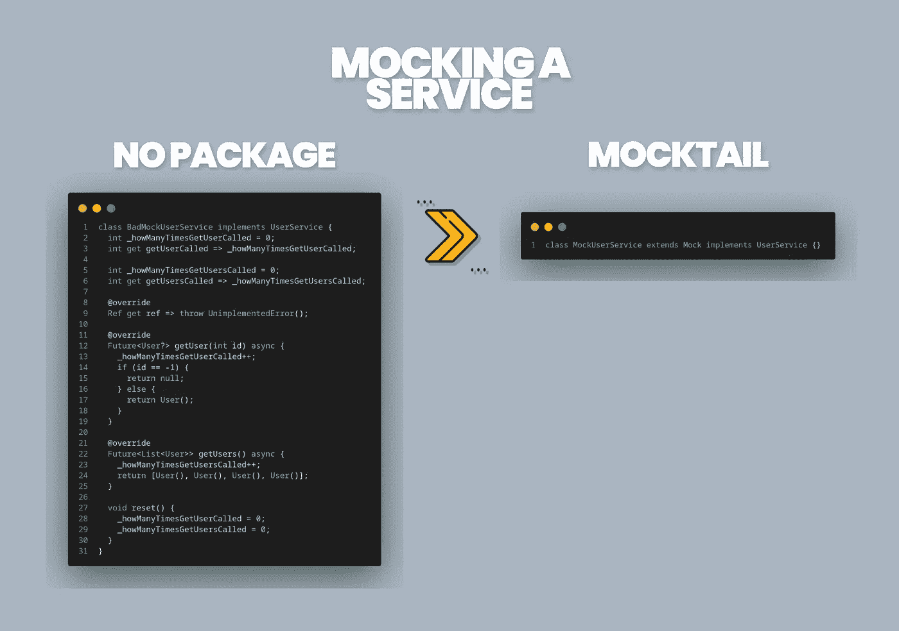
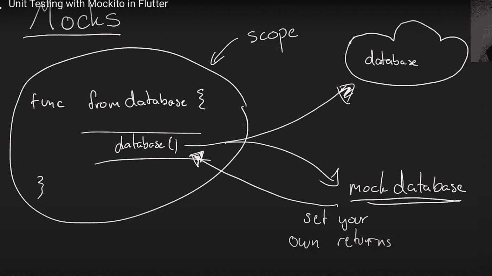

# 颤振试验的最低限度指南——第二部分嘲弄

> 原文：<https://itnext.io/minimalist-guide-to-testing-in-flutter-part-2-mocking-b0a35a0dc336?source=collection_archive---------0----------------------->


## 第 2 部分——mock tail——测试中的嘲讽是什么？

## 在我们开始写测试之前，我认为，我们需要学习如何模拟它们，这是一个我们需要经常使用的重要话题！

[](/minimalist-guide-to-testing-in-flutter-e9c885c7e35c) [## 颤振试验的简明指南-第一部分什么是试验？

### 这一次，我将开始深入介绍 Flutter 中的测试！

itnext.io](/minimalist-guide-to-testing-in-flutter-e9c885c7e35c) 

## 基本上，我们在 Flutter 中有两种主要的封装选择

1.  莫奇托
2.  莫克泰尔

这两个包都很棒，但我会选择 [mocktail](https://pub.dev/packages/mocktail)

## 为什么我选择了 Mocktail？

别误会，[莫克托](https://pub.dev/packages/mockito)也很棒，是 dart 团队自己研发的！但是我就是喜欢莫克泰尔的方法！因为；

*   更简单的 API
*   不生成代码
*   类型安全

就那样！

## 为什么我们需要包，没有包就不能写吗？

事实上，我们可以，但我认为这张图片会很好地向你解释这种情况。

## 动机

即使在这个基本的例子中你清楚地看到了区别！



无包 vs mocktail

除此之外，我们还需要为所有场景编写所有这些代码！想想那个样板文件！

无论如何

## 什么是嘲讽，我们为什么需要它？

*“单元测试背后的主要思想是隔离并关注我们正在测试的当前单元，而不是外部依赖的行为。但在大多数情况下，我们需要依赖外部依赖，如数据库、web 服务器、平台 API、外部设备等。*

让我们假设我们当前的单元依赖于一个 web API。当服务器运行时，测试运行缓慢但很好。但是当服务器离线时，单元测试就会失败。这使得单元测试不可预测。因为网络服务器不在我们的控制之下。当网络服务器关闭时，这不是我们的错。这就是嘲讽的由来。”

(我直接从[这篇牛逼的文章](https://betterprogramming.pub/flutter-unit-testing-the-beginners-guide-35105164722e)里抄了这 2 段。因为我无法更好地解释它！请检查这篇文章，并给他一些掌声！)

因此，我们只是创建假的服务来将我们的测试与其他依赖项隔离开来，并且我们假设所有的外部依赖项都能正常工作！

> 你可能认为基本上。用原始文件替换/伪造依赖关系



-塔达斯·佩特拉

## 为什么我们不称他们为假装而不是嘲笑呢？

事实上，我不知道主要原因，但我想，假服务是指不同的事情。(比如在假环境下工作)但是如果我们用作伪代替嘲讽。术语会混淆！IMHO。反正那就算了也无所谓！

此外，在测试应用程序时，你会看到很多“存根”术语！

## 什么是存根？

> Stub 是一段代码，用来代替其他一些编程功能。存根可以模拟现有代码的行为

基本上，我们得到这个类，然后创建一个看起来一样但功能不同的假类！


```
class **Horse** {}class **Trojan** extends **Mock** implements **Horse** {}
```

## 够了吗？

然后，让我们来看看我们隐藏的力量！！

## 逻辑很简单！

“告诉你的特洛伊人在任何情况下该怎么做！让它发生！并控制它是否恰当地完成了你的工作！”

```
*// Stub the `sound` method.*
**when(() => trojan.sound()).thenReturn('horse sound');***// Verify no interactions have occurred.*
**verifyNever(() => trojan.sound());***// Interact with the mock trojan instance.*
**trojan.sound();***// Verify the interaction occurred.*
**verify(() => trojan.sound()).called(1);***// Interact with the mock instance again.*
**trojan.sound();***// Verify the interaction occurred twice.*
**verify(() => trojan.sound()).called(2);**
```

实际上，我们在测试时有 3 个主要步骤！

(暂时忘记`init`和`dispose`步骤！)

## 1.安排—决定行为！

我们的咒语是`when`

"当那个方法运行时，就这样做！"

```
// Sync Methods
**when**(() => service.**syncMethod**()).**thenReturn**('ehe');// Async Methods **when**(() => service.**asyncMethod**()).**thenAnswer**((e) **async** => 'ehe');// Error Handling
**when**(() => service.**brokenMethod**()).**thenThrow**(**Exception**('ehe'));
```

## 2.行动——试试看！

这里没有特例，我们只是运行方法！如果我们需要的话！

```
final res = service.**syncMethod**();final res2 = await service.**asyncMethod**();final res3 = service.**brokenMethod**();
```

## 3.断言—确认它！

最后，我们确保工作正常！所以我们定义我们的期望，并与结果进行比较！

```
// We make ensure that method never runned before! **verifyNever**(() => service.**syncMethod**());// we call it once and ask the app is it called only once? **verify**(() => service.**syncMethod**()).**called**(1);// we expect we run it but is it return this value? **expect**(service.**syncMethod**(), 'ehe');// I know it'll throw an expection but it's really throw it? **expect**(() => service.**brokenMethod**(), **throwsA**(**isA**<**Exception**>()));
```

## 您还可以随时轻松重置您的服务！

轻松开始下一次测试！

```
**reset**(service);
```

## 小心！

如果你想在参数匹配器中使用你的自定义类型，你需要在开始的时候注册你的类型！因为 Mocktail 只支持开箱即用的原语类型！但是不用担心，这很容易做到！

```
**class** **Food** {...}**class** **Cat** {
  bool likes(**Food** food) {...}
}...**class** **MockCat** **extends** **Mock** **implements** **Cat** {}**class** **FakeFood** **extends** **Fake** **implements** **Food** {}test('...', () {
  **registerFallbackValue**(**FakeFood**()); **final** cat = **MockCat**();
  when(() => cat.**likes**(**any<FakeFood>**()).thenReturn(**true**);
  ...
});
```

## 为什么我不能正确地存根/验证扩展方法？

我还直接从[复制了文档](https://pub.dev/packages/mocktail#faqs)，因为它很好地解释了情况！

*"扩展方法不能被存根化/验证，因为它们被视为静态方法。这意味着调用直接指向扩展方法，而不关心实例。因此，对扩展的 stubs 和 verify 调用总是会导致调用真正的扩展方法。*

*与其直接存根/验证扩展方法，不如存根/验证扩展方法与之交互的实例上的公共成员*。"

```
class **MyClass** {}**extension** on **MyClass** {
  void **foo**() {}
}class **MockMyClass** extends **Mock** implements **MyClass** {}
```

*”在上面的场景中，在* `*MockMyClass*` *上调用* `*foo*` *将总是调用真正的* `*foo()*` *(不是存根)。因此，不可能存根/验证作为扩展的方法，因为它们总是会导致真正的扩展被调用。”*

这就是我想说的关于模拟测试的一切！

下周，我将开始谈论单元测试，并亲自动手！

## 第 1 部分—什么是测试？

[](/minimalist-guide-to-testing-in-flutter-e9c885c7e35c) [## 颤振试验的最低限度指南

### 这一次，我将开始深入介绍 Flutter 中的测试！

itnext.io](/minimalist-guide-to-testing-in-flutter-e9c885c7e35c) 

## 第二部分——什么是嘲讽？—当前！

## 第 3 部分—自动化测试

[](/minimalist-guide-to-testing-in-flutter-part-3-automated-testing-f47e857f4e88) [## 颤振试验的最低限度指南第三部分自动试验

### 单元测试、小部件测试、集成测试、测试覆盖等等，所有这些在这篇文章中都有一个可理解的…

itnext.io](/minimalist-guide-to-testing-in-flutter-part-3-automated-testing-f47e857f4e88) 

## 第 4 部分—一些有用的测试包

[](/minimalist-guide-to-testing-in-flutter-part-4-useful-packages-92e1b4eecdd8) [## 颤振试验的最低限度指南——第 4 部分有用的包

### 帮助你建立更快更好的测试的有用的包！

itnext.io](/minimalist-guide-to-testing-in-flutter-part-4-useful-packages-92e1b4eecdd8) 

## 参考

[](https://betterprogramming.pub/flutter-unit-testing-the-beginners-guide-35105164722e) [## 颤振单元试验——初学者指南

### 单元测试是自动化测试过程的一部分，在这个过程中测试小的代码单元

better 编程. pub](https://betterprogramming.pub/flutter-unit-testing-the-beginners-guide-35105164722e) 

# 感谢您的阅读！

我试图创造尽可能简单的例子。希望你喜欢。

如果你喜欢这篇文章，请点击👏按钮(你知道你可以升到 50 吗？)