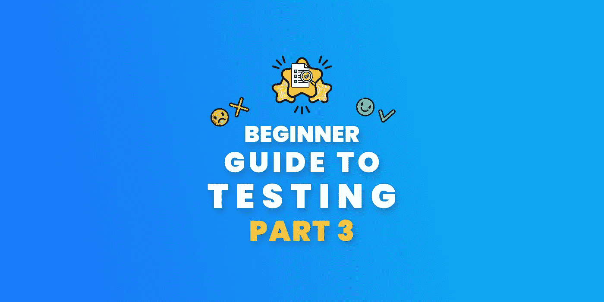
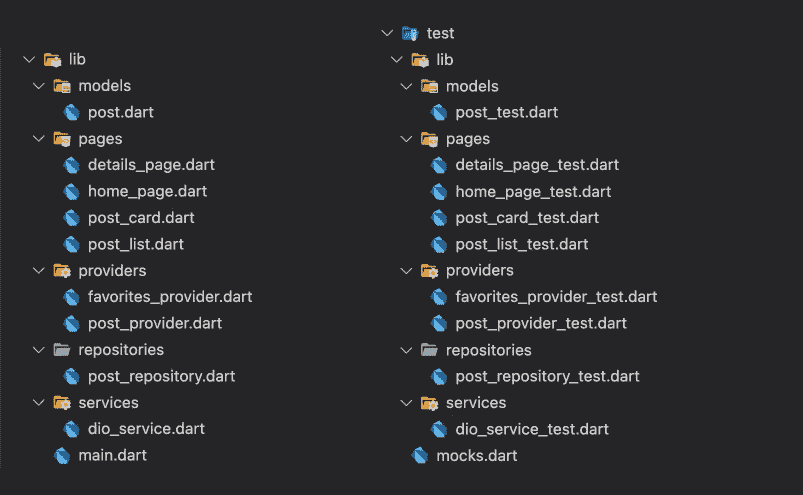
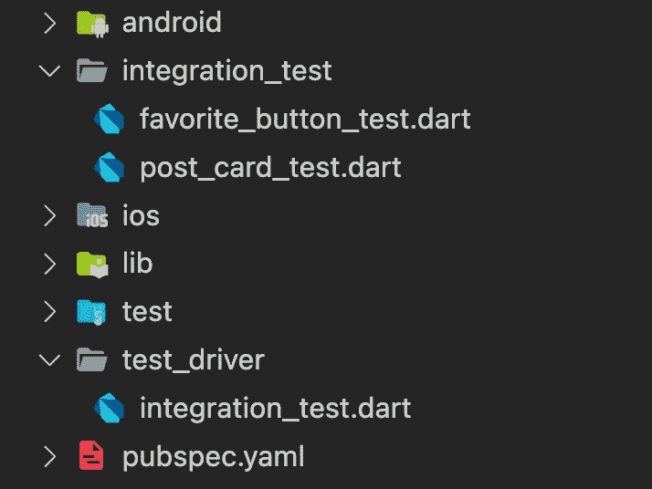
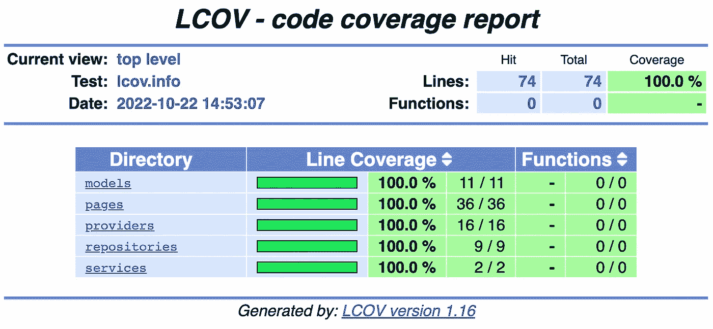

# 颤振试验的最低限度指南第三部分自动试验

> 原文：<https://itnext.io/minimalist-guide-to-testing-in-flutter-part-3-automated-testing-f47e857f4e88?source=collection_archive---------1----------------------->



## 第 3 部分——带有可理解示例的自动化测试

## 单元测试、小部件测试、集成测试、测试覆盖等等，所有这些都在本文中有一个易于理解的例子！

# 第一步——安排！

在开始编写测试之前，我强烈建议您阅读前面的部分！

[](/minimalist-guide-to-testing-in-flutter-e9c885c7e35c) [## 颤振试验的最低限度指南

### 这一次，我将开始深入介绍 Flutter 中的测试！

itnext.io](/minimalist-guide-to-testing-in-flutter-e9c885c7e35c) [](/minimalist-guide-to-testing-in-flutter-part-2-mocking-b0a35a0dc336) [## 颤振试验的最低限度指南——第二部分嘲弄

### 在我们开始写测试之前，我认为，我们需要学习如何模拟它们，这是一个重要的话题，我们需要…

itnext.io](/minimalist-guide-to-testing-in-flutter-part-2-mocking-b0a35a0dc336) 

## 包装

在这个项目中，我将使用`[riverpod](https://pub.dev/packages/riverpod)`和`[mocktail](https://pub.dev/packages/mocktail)`包来简化测试

当然还有测试用的`flutter_test`和`integration_test`

而且对 HTTP 请求使用`[dio](https://pub.dev/packages/dio)`。

## 文件夹结构



如你所见，我们在测试文件夹
中有和 lib 相同的文件夹结构，这样，我们的测试更容易跟踪！

在这个例子中，我们有 4 个步骤在 UI 上显示数据


此外，我们知道，测试基本上由三个步骤组成；

*   **安排→行动→断言**

基本上；

*   **布置**:准备测试的环境
    *(比如创建一个喜欢的按钮)*
*   **动作**:测试项目
    *(例如点击按钮)*
*   **断言:**测试测试结果是否符合预期
    *(例如，预期按钮变成红色)*

我们将使用这些步骤进行各种测试！

# 第二步——行动！

## DioService —(单元测试)

这个提供者负责存储预配置的`dio`实例。

我们将在存储库上使用这个`dio`实例。

> 小注意:服务测试是有问题的！大多数情况下，你不需要为你使用的服务编写测试，但是如果你不信任后台的家伙，我认为你也应该在你的应用程序中编写服务测试！

## 后存储库—(单元测试)

`PostRepository`负责使用`dio`与服务器通信，这是我们之前在`dioService` Provider 中定义的一个实例，并将传入的数据转换为`Post`对象。

你可能会想，为什么要重新创建实例呢？你可以使用`setUp`和`tearDown`方法，或者你可以只在顶层使用一个实例，然后再使用它们。

我的回答是，是的，我们可以，但是代码重复在测试中是可以的，主要思想是隔离测试，编写易读和可跟踪的代码。

这是个有点争议的话题。我只是更喜欢这样，仅此而已！

## Post—(单元测试)

如果我们想 100%覆盖我们的项目，我们也应该为数据类编写测试！

## PostsProvider —(单元测试)

`PostsProvider`负责从存储库中获取数据，并将其提供给 UI。在这个场景中，我们使用`FutureProvider`。因为它减少了所有无聊的过程，如错误处理和加载状态，为我们引擎盖下。

## PostList — (Widget 测试)— Plus，BDD 示例！

`PostList`只是一个显示我们`postsProvider`状态的小工具。

现在让我们用`BDD`方法来看看这个场景吧！

```
**Feature:** Get data from 'postRepository' and display them on the UI according to the process**Scenario:** User opens [HomePage]**Given** List of posts**When** data is fetching
**Then** [PostList] should display a loading widget**When** the data is ready
**Then** [PostList] should display a list of posts **Given** an error to throw**When** data is fetching
**Then** [PostList] should display a loading widget**When** get an error while fetching the data
**Then** [PostList] should display an error message
```

## 明信片—(小部件测试)

如你所见，我们还需要模仿`NavigatorObserver`和`Route`来处理导航操作，为了使用`didPush`方法，我们还需要先注册`Route`。因为如果一个方法有自定义类型的参数，应该使用`registerFallbackValue`方法注册，[详见](https://pub.dev/packages/mocktail#how-it-works)。

```
class **NavigatorObserver** {
  void **didPush**(**Route** route, **Route?** previousRoute) { }
  ...
}
```

## FavoriteButton —(集成测试+自动截图)


**文件夹结构**



您可以看到，集成测试和测试驱动程序不在测试文件夹中。

原因主要是性能，但也有一些其他原因，如他们的范围不同，等等。

你可以在这里了解更多关于这个[的信息。](https://softwareengineering.stackexchange.com/a/340375)

此外，官方文档也做同样的事情！

这就是为什么，我们也应该把他们分开！

## 新闻报道

获得测试的覆盖报告太容易了！只需运行三个命令就大功告成了！

```
# **Step 1**, Run test using --coverage flag
# This step will be created the test results
**flutter test --coverage**# **Step 2**, convert HTML file the generated coverage report
# This step will give us an HTML file to see the report
**genhtml coverage/lcov.info -o coverage/**# **Step 3**, Open the HTML file to see the results
# Actually, you can just basically open the HTML file with a browser instead of using this command
**open coverage/index.html**
```

这是测试的结果！



## github——✨完整项目

我知道你一直在找这个链接！在这里！😊

[](https://github.com/rei-codes/riverpod-test) [## GitHub - rei-codes/riverpod-test

### 一个新的颤振项目。这个项目是颤振应用的起点。一些帮助您入门的资源…

github.com](https://github.com/rei-codes/riverpod-test) 

## 第 1 部分—什么是测试？

[](/minimalist-guide-to-testing-in-flutter-e9c885c7e35c) [## 颤振试验的最低限度指南

### 这一次，我将开始深入介绍 Flutter 中的测试！

itnext.io](/minimalist-guide-to-testing-in-flutter-e9c885c7e35c) 

## 第二部分——什么是嘲讽？

[](/minimalist-guide-to-testing-in-flutter-part-2-mocking-b0a35a0dc336) [## 颤振试验的最低限度指南——第二部分嘲弄

### 在我们开始写测试之前，我认为，我们需要学习如何模拟它们，这是一个重要的话题，我们需要…

itnext.io](/minimalist-guide-to-testing-in-flutter-part-2-mocking-b0a35a0dc336) 

## 第 3 部分——自动化测试——当前！

## 第 4 部分—一些有用的测试包

[](/minimalist-guide-to-testing-in-flutter-part-4-useful-packages-92e1b4eecdd8) [## 颤振试验的最低限度指南——第 4 部分有用的包

### 帮助你建立更快更好的测试的有用的包！

itnext.io](/minimalist-guide-to-testing-in-flutter-part-4-useful-packages-92e1b4eecdd8) 

## 参考

[](https://blog.codemagic.io/flutter-automated-screenshot-testing/) [## 使用 integration_test 包| Codemagic 博客进行 Flutter 自动截图测试

### 在本文中，我们将研究集成测试的一种高级测试风格，称为自动化屏幕截图测试。

blog.codemagic.io](https://blog.codemagic.io/flutter-automated-screenshot-testing/) 

# 第三步——断言！

## 感谢您的阅读！

我试图创造尽可能简单例子。希望你喜欢。

如果你喜欢这篇文章，请点击👏按钮(你知道你可以升到 50 吗？)