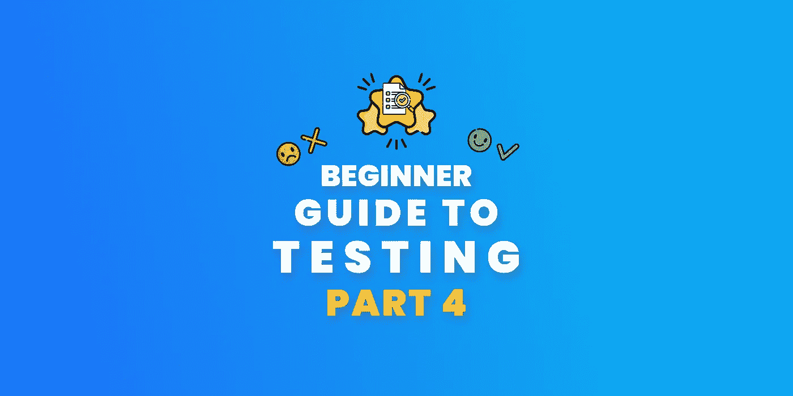
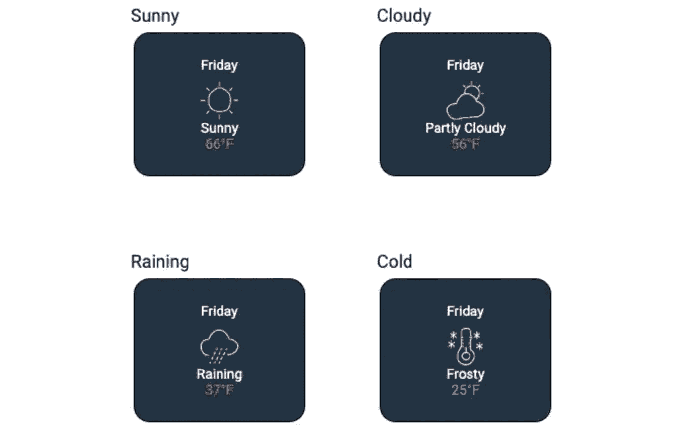
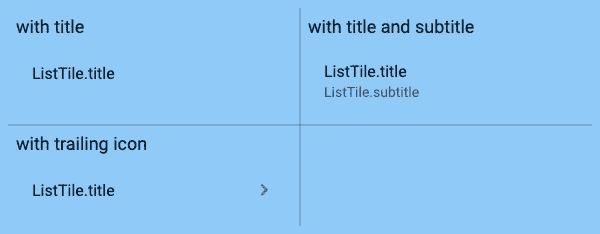
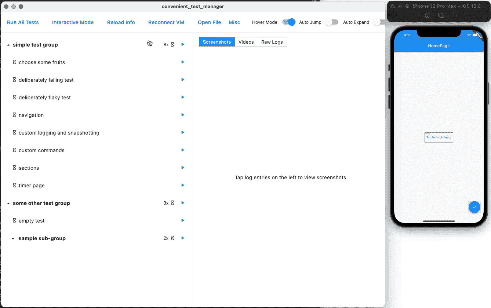
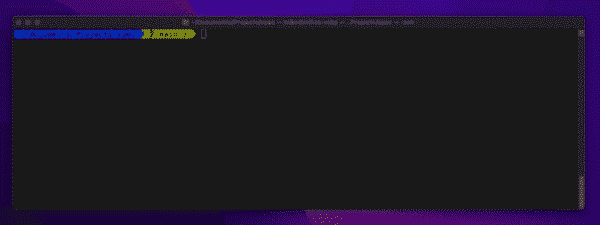
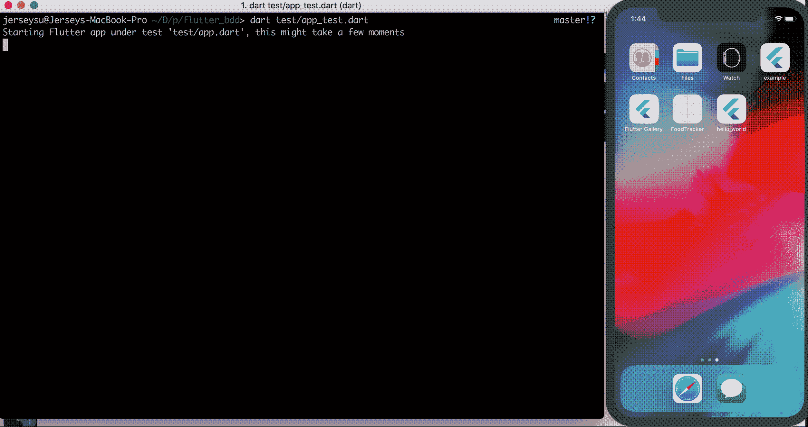

# 颤振试验的最低限度指南——第 4 部分有用的包

> 原文：<https://itnext.io/minimalist-guide-to-testing-in-flutter-part-4-useful-packages-92e1b4eecdd8?source=collection_archive---------3----------------------->



## 第 3 部分——颤振中的顶尖试验包！

## 帮助你建立更快更好的测试的有用的包！

这是颤振测试系列的最后一部分，我只是想向你展示一些有用的测试包，你会喜欢的！

## 以前的零件

[](/minimalist-guide-to-testing-in-flutter-e9c885c7e35c) [## 颤振试验的最低限度指南

### 这一次，我将开始深入介绍 Flutter 中的测试！

itnext.io](/minimalist-guide-to-testing-in-flutter-e9c885c7e35c) [](/minimalist-guide-to-testing-in-flutter-part-2-mocking-b0a35a0dc336) [## 颤振试验的最低限度指南——第二部分嘲弄

### 在我们开始写测试之前，我认为，我们需要学习如何模拟它们，这是一个重要的话题，我们需要…

itnext.io](/minimalist-guide-to-testing-in-flutter-part-2-mocking-b0a35a0dc336) [](/minimalist-guide-to-testing-in-flutter-part-3-automated-testing-f47e857f4e88) [## 颤振试验的最低限度指南第三部分自动试验

### 单元测试、小部件测试、集成测试、测试覆盖等等，所有这些在这篇文章中都有一个可理解的…

itnext.io](/minimalist-guide-to-testing-in-flutter-part-3-automated-testing-f47e857f4e88) 

## 黄金工具包

`golden_toolkit`是一个黄金测试工具包，使你的测试更容易和更可读，而且它是由`eBay`制作的！

**示例**



金色的

```
testGoldens('Weather types should look correct', (tester) **async {
  final** builder = GoldenBuilder.grid(
      columns:2,
      widthToHeightRatio: 1,
    )..addScenario('Sunny', WeatherCard(Weather.sunny))
     ..addScenario('Cloudy', WeatherCard(Weather.cloudy))
     ..addScenario('Raining', WeatherCard(Weather.rain))
     ..addScenario('Cold', WeatherCard(Weather.cold)); **await** tester.pumpWidgetBuilder(builder.build());
  **await** screenMatchesGolden(tester, 'weather_types_grid');
});
```

[](https://pub.dev/packages/golden_toolkit) [## golden_toolkit |颤振包

### 这个项目包含的 API 和实用程序建立在 Flutter 的黄金测试功能之上，提供强大的 UI…

公共开发](https://pub.dev/packages/golden_toolkit) 

## 炼金术士

`alchemist`也是受`golden_toolkit`启发的黄金测试包，但是由`betterment`和`Very Good Ventures 🦄`团队制作！

**示例**



金色的

```
goldenTest(
  'renders correctly',
  fileName: 'list_tile',
  builder: () => GoldenTestGroup(
    scenarioConstraints: **const** BoxConstraints(maxWidth: 600),
    children: [
      GoldenTestScenario(
        name: 'with title',
        child: ListTile(
          title: Text('ListTile.title'),
        ),
      ),
      GoldenTestScenario(
        name: 'with title and subtitle',
        child: ListTile(
          title: Text('ListTile.title'),
          subtitle: Text('ListTile.subtitle'),
        ),
      ),
      GoldenTestScenario(
        name: 'with trailing icon',
        child: ListTile(
          title: Text('ListTile.title'),
          trailing: Icon(Icons.chevron_right_rounded),
        ),
      ),
    ],
  ),
);
```

[](https://pub.dev/packages/alchemist) [## 炼金术士|颤振包

### 与...一起开发💙通过非常好的冒险🦄和改善☀️.炼金术士是一个颤振包，提供功能…

公共开发](https://pub.dev/packages/alchemist) 

## 巡逻

`patrol`是一个 UI 测试框架，消除了`flutter_test`、`integration_test`和`flutter_driver`的限制。
它让我们编写更可读、更简单、更高级的测试。

**示例**

```
patrolTest(
    nativeAutomation: **true**,
    'counter state is the same after going to Home and going back',
    ($) **async** {
      **await** $.pumpWidgetAndSettle(**const** MyApp());

      **await** $(FloatingActionButton).tap();
      expect($(#counterText).text, '1');

      **await** $.native.pressHome();
      **await** $.native.pressDoubleRecentApps();

      expect($(#counterText).text, '1');
      **await** $(FloatingActionButton).tap();
      expect($(#counterText).text, '2');

      **await** $.native.openNotifications();
      **await** $.native.pressBack();
    },
  );
```

[](https://pub.dev/packages/patrol) [## 巡逻|颤振包

### patrol 包建立在 flutter_test 和 integration_test 之上，使得从 Dart 控制原生 UI 变得容易…

公共开发](https://pub.dev/packages/patrol) 

## Fluttium

`fluttium`是一个用户流测试框架，允许我们使用魔法编写测试！由`flame`和`umbra`包的作者！

[](https://pub.dev/packages/fluttium) [## fluttium | Flutter 包装

### 颤振的用户流测试工具。

公共开发](https://pub.dev/packages/fluttium) 

## 蜂蜜

`honey`是一个帮助我们轻松编写端到端测试的包，由`ClickUp`和 Simon(`Hive`和`Isar`的作者)制作。

[](https://pub.dev/packages/honey) [## 蜂蜜|飘动套餐

### 测试的甜蜜一面...

公共开发](https://pub.dev/packages/honey) 

## 便捷测试

`convenient_test`，帮助我们使用漂亮的 GUI 管理我们的测试，作者是`flutter_portal`

[](https://pub.dev/packages/convenient_test) [## 便捷测试|颤振包

### 使用完整的动作历史、时间旅行、截图、快速重新执行、视频记录，轻松编写和调试测试

公共开发](https://pub.dev/packages/convenient_test) 

## 投机

`spec`是一个简化的测试框架，让测试更加简单和安全，由`invertase`开发！



```
import 'package:spec/spec.dart';

void main() {
  test('future example', () async {
    final future = Future.value(42);
    expect(future).toEqual(future);
    await expect(future).completion.toEqual(42);
    await expect(future).throws.isArgumentError();
  });

  test('stream example', () async {
    final stream = Stream.value(42);
    await expect(stream).emits.toEqual(42);
    await expect(stream).emits.isNull();
    await expect(stream).emits.not.isNull();
    await expect(stream).emitsError.isArgumentError();
  });

  test('function example', () {
    void throwsFn() => throw Error();
    expect(throwsFn).returnsNormally();
    expect(throwsFn).throws.isArgumentError();
  });
}
```

[](https://pub.dev/packages/spec) [## 规格|镖包

### Spec 建立在现有 Dart 和 Flutter 测试工具的基础上，以提供一个精简而优雅的测试环境…

公共开发](https://pub.dev/packages/spec) 

## 学舌鸟

`mockingjay`让导航测试更加简单！到`Very Good Ventures 🦄`

[](https://pub.dev/packages/mockingjay) [## 学舌鸟|颤振包

### 与...一起开发💙通过非常好的冒险🦄一个使模拟、测试和验证导航调用变得容易的包…

公共开发](https://pub.dev/packages/mockingjay) 

## 莫克泰尔

一个没有代码生成的嘲讽库，作者`bloc`！

```
class MockCat extends Mock implements Cat {}class Cat {...}final cat = MockCat();
```

[](https://pub.dev/packages/mocktail) [## 仿制品|省道包

### 受 mockito 启发的 Dart 模拟库。Mocktail 专注于提供一个熟悉的、简单的 API，用于在…

公共开发](https://pub.dev/packages/mocktail) 

## 莫奇托

`mockito`是一个带代码生成的嘲讽库，dart 团队做的！

```
@GenerateMocks([Cat])class Cat {...}final cat = MockCat();
```

[](https://pub.dev/packages/mockito) [## 莫奇托|镖包

### 受 Mockito 启发的 Dart 模拟库。Mockito 5.0.0 支持 Dart 2.12 中 Dart 新的空安全语言特性…

公共开发](https://pub.dev/packages/mockito) 

## 骗子

`faker`给我们假值添加到我们的测试对象中。

**示例**

```
final faker = Faker();faker.internet.email(); *// francisco_lebsack@buckridge.com*
faker.internet.userName(); *// fiona-ward*
faker.person.name(); *// Fiona Ward*
```

[](https://pub.dev/packages/faker) [## 伪造者|飞镖包装

### Dart 的一个库，它生成假数据。faker 的灵感主要来自 Python 包 faker，而 Ruby……

公共开发](https://pub.dev/packages/faker) 

## 颤动的小黄瓜

`flutter_gherkin`允许我们使用 BDD/Gherkin 给出值并定制测试。

```
Feature: Hello World
  Hello World feature test

  Scenario: Check App Title And Content
    Given I expect the "firstTabTitle" to be "Jeresy Cool!"
    Then I expect the "textField" to be "Hello, Jersey!"

  Scenario: Check App Title When Switch Page
    Given I go to second page
    Then I expect second page title to be "Jersey Second Tab"
    When I go to landing page
    Then I expect landing page title to be "Jeresy Cool!"Feature: Counter
  Check counter is correct after tap add button

  Scenario: Check Counter Number
    Given I expect the "counterTextField" to be "0"
    When I tap the "addBtn" button 20 times
    Then I expect the "counterTextField" to be "20"
```



[https://github.com/jerseysu/flutter_bdd](https://github.com/jerseysu/flutter_bdd)

[](https://pub.dev/packages/flutter_gherkin) [## 颤振 _ 小黄瓜|颤振包

### 一个全功能的小黄瓜解析器和测试运行器。适用于 Flutter 和 Dart 2。

公共开发](https://pub.dev/packages/flutter_gherkin) 

## BDD 小部件测试(BDD 到 Dart)

`bdd_widget_test`帮助我们使用 BDD 生成测试！

**示例**

```
Feature: CounterBackground:
    Given the app is runningAfter:
    And I do not see {'surprise'} textScenario: Initial counter value is 0
    Then I see {'0'} textScenario: Add button increments the counter
    When I tap {Icons.add} icon
    Then I see {'1'} textScenario Outline: Plus button increases the counter
    Given the app is running
    When I tap {Icons.add} icon <times> times
    Then I see <result> textExamples:
      | times | result |
      |    0  |   '0'  |
      |    1  |   '1'  |
      |   42  |  '42'  |
```

到

```
Future<void> bddSetUp(WidgetTester tester) async {
  await theAppIsRunning(tester);
}
Future<void> bddTearDown(WidgetTester tester) async {
  await iDoNotSeeText(tester, 'surprise');
}
group('''Counter''', () {
  testWidgets('''Initial counter value is 0''', (tester) async {
    try {
      await bddSetUp(tester);
      await iSeeText(tester, '0');
    } finally {
      await bddTearDown(tester);
    }
  });
  testWidgets('''Add button increments the counter''', (tester) async {
    try {
      await bddSetUp(tester);
      await iTapIcon(tester, Icons.add);
      await iSeeText(tester, '1');
    } finally {
      await bddTearDown(tester);
    }
  });
  testWidgets('''Outline: Plus button increases the counter (0, '0')''', (tester) async {
    try {
      await bddSetUp(tester);
      await theAppIsRunning(tester);
      await iTapIconTimes(tester, Icons.add, 0);
      await iSeeText(tester, '0');
    } finally {
      await bddTearDown(tester);
    }
  });
  testWidgets('''Outline: Plus button increases the counter (1, '1')''', (tester) async {
    try {
      await bddSetUp(tester);
      await theAppIsRunning(tester);
      await iTapIconTimes(tester, Icons.add, 1);
      await iSeeText(tester, '1');
    } finally {
      await bddTearDown(tester);
    }
  });
  testWidgets('''Outline: Plus button increases the counter (42, '42')''', (tester) async {
    try {
      await bddSetUp(tester);
      await theAppIsRunning(tester);
      await iTapIconTimes(tester, Icons.add, 42);
      await iSeeText(tester, '42');
    } finally {
      await bddTearDown(tester);
    }
  });
});
```

[](https://pub.dev/packages/bdd_widget_test) [## bdd_widget_test | Flutter 包

### 一个 BDD 风格的小部件测试库用自然语言开发移动应用是不是很酷？你的每一种语言…

公共开发](https://pub.dev/packages/bdd_widget_test) 

## BDD 框架(Dart 到 BDD)

`bdd_framework`基本上，将您的 Dart 代码转换为 BDD 特征

**示例**

```
final feature = BddFeature('Buying amount');

Bdd(feature)
  .scenario('Buying amount for stock orders, with zero fees.')
  //
  .given('The user has 120 dollars.')
  .and('IBM bid-price is 3 dollars, ask-price is 10.')
  .and('Fees are zero.')
  //
  .when('The user opens the order.')
  //
  .then('The buying amount is 12 shares.')
  .and('It costs 120 dollars.')
  //      
  .run((ctx) async {
    // Given:
    setCashBalance(120);         
    setQuote(IBM, bid: 3, ask: 10);
    setFees(0);         
    // When:
    var buyingAmount = openOrder(IBM);
    // Then:
    expect(buyingAmount.shares, 12);         
    expect(buyingAmount.dollars, 120);
  });
```

**输出**

```
Feature: Buying amount

  Scenario: Buying amount **for** stock orders, **with** zero fees.
    Given the user has 120 dollars.
    And IBM bid-price **is** 3 dollars, ask-price **is** 10.
    And fees are zero.
    When the user opens the order.
    Then the buying amount **is** 12 shares.
    And it costs 120 dollars.
```

[](https://pub.dev/packages/bdd_framework) [## bdd_framework | Flutter 包

### 这个包裹是由查希尔·哈穆德和我本人马塞洛·格莱斯伯格带给你的。这是一个 BDD 框架，用于…

公共开发](https://pub.dev/packages/bdd_framework) 

# 感谢您的阅读！

请不要忘记点击👏当然是文章和包装的按钮！